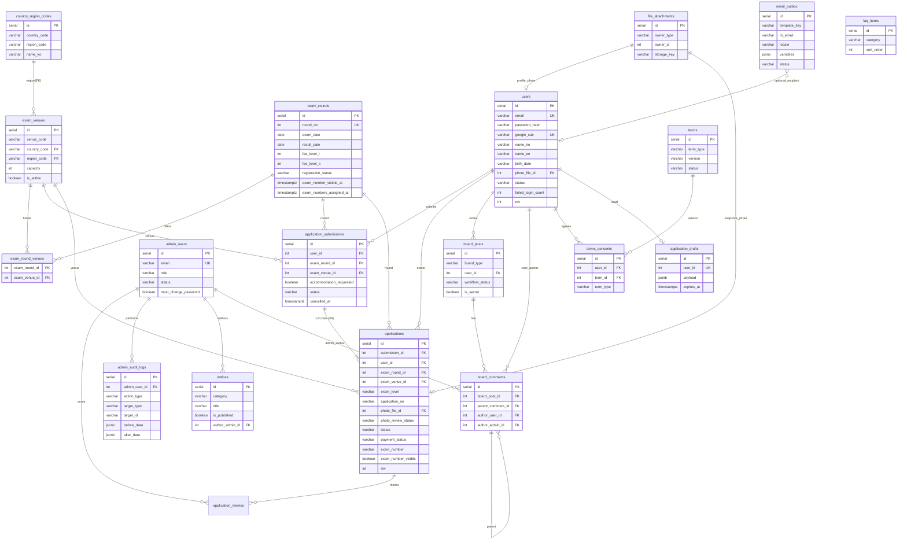
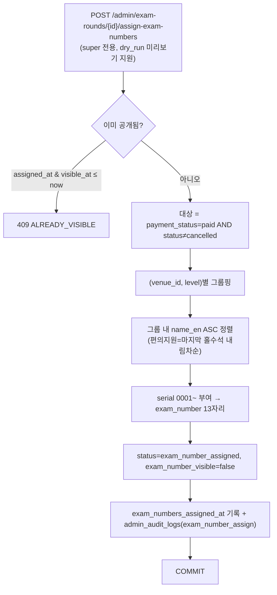

# TOPIK Myanmar — DB 논리 명세 (Database Logical Spec)

> **문서 위치:** `docs/system_design/database.md`
> **기준일:** 2026-06-08 · **DB 엔진:** PostgreSQL 15+ (+ pgvector)
> **1차 근거:** [`docs/기능정의서/DB스키마_초안.md`](../기능정의서/DB스키마_초안.md)
> **정합 기준(실제 우선):** `db/migrations/V001~V007`, `apps/api/app/models/*.py`
> **상호 문서:** [개요](overview.md) · [개발 스펙](tech-spec.md)

본 문서는 DB스키마 초안을 1차 근거로 하되, **실제 마이그레이션(V001~V007)과 ORM 모델을 정본으로 대조·최신화**한 논리 명세입니다. 초안과 실제 구현이 다를 경우 **실제 구현을 우선**하고, 초안에만 있는 항목은 `(초안/합의 필요)`로 구분 표기합니다. 차이 요약은 [§7](#7-마이그레이션-현황-및-초안-대비-차이)에 정리합니다.

> **표기 규칙:** PostgreSQL 실제 타입은 `SERIAL`(=int) PK, `INTEGER` FK, `TIMESTAMPTZ`를 사용합니다. 초안의 `BIGSERIAL/BIGINT`는 실제로는 `SERIAL/INTEGER`로 구현되어 있습니다(아래 명세는 실제 기준).

---

## 1. 설계 원칙

| 항목 | 결정(실제 구현) |
| --- | --- |
| **동시 접수(Ⅰ+Ⅱ)** | `application_submissions`(회차당 1그룹) + `applications`(급수별 1~2행). `UNIQUE(user_id, exam_round_id)`로 1회차 1그룹 강제. 동일 `exam_venue_id` 사용. |
| **수험번호 단위** | **급수(`applications`) 단위** 13자리 `VARCHAR(13)`. Ⅰ/Ⅱ 동시 접수 시 ④ 시험장 코드 동일, ③ 수준코드만 7/8 상이. |
| **상태 분리** | `applications.status`(7종) + `photo_review_status` + `payment_status` 3축 분리. FO 배지·BO 그리드는 API에서 매핑. |
| **낙관적 잠금** | `rev` 컬럼은 **`users`·`applications`** 에만 존재. BO 동시 처리·FO 프로필 수정 시 `If-Match`/body `rev` 불일치 → 409. (초안의 `exam_rounds.rev`·`exam_venues.rev`·`admin_users.rev`는 **미구현**) |
| **채번 원자성** | 별도 `exam_number_sequences` 테이블 **미사용**. 일괄 채번은 단일 트랜잭션 내에서 `(venue, level)` 그룹별 `name_en` ASC 정렬 후 in-memory serial 배정·일괄 UPDATE. ([§5](#5-수험번호-13자리-채번-규칙)) |
| **개인정보** | 비밀번호는 `password_hash`만 저장. **여권번호 미수집**(`passport_no` 컬럼 자체 없음). 사진은 Private 스토리지 + 인증 프록시. 생년월일 등 추가 암호화는 운영 합의. |
| **약관 동의 이력** | `terms_consents`(V006)로 가입 시 동의 약관 종류·버전·IP를 영속화(이력 보존, UNIQUE 없음). |
| **세션** | `user_sessions` 테이블 **미사용** — JWT 무상태(stateless). |

---

## 2. 전체 ER 다이어그램

실제 마이그레이션·ORM 기준. 보조 테이블(인증코드·임시저장·감사·임베딩)은 관계 단순화를 위해 일부 생략 표기.



> 보조/독립 테이블: `application_memos`, `email_verification_codes`, `password_reset_tokens`, `application_drafts`, `terms_consents`, `semantic_chunks`(pgvector). 상세는 [§4](#4-테이블별-상세-명세).

---

## 3. 공통 열거형 (enum)

DB는 `CHECK` enum 대신 **`VARCHAR` + 애플리케이션 검증** 방식입니다(`semantic_chunks.source_type`만 `CHECK` 제약). 아래는 실제 코드에서 사용/허용하는 값입니다.

### 3.1 `applications.status` (FO 배지 7종)

| DB 값 | FO 표시 | 진입 계기 |
| --- | --- | --- |
| `submitted` | 접수완료 | 제출 직후(사진 pending) |
| `photo_review` | 사진심사중/반려 | 사진 반려 시(재제출 대기) |
| `payment_pending` | 수납대기 | 사진 승인 후 |
| `approved` | 승인완료 | 오프라인 수납 완료(`paid`) |
| `exam_number_assigned` | 수험번호부여 | 일괄 채번 완료 |
| `rejected` | 반려 | 접수 반려(`reject`) |
| `cancelled` | 취소됨 | FO 취소/탈퇴 연쇄 |

### 3.2 기타 열거형

| 대상 | 값 | 비고 |
| --- | --- | --- |
| `applications.photo_review_status` | `pending` / `approved` / `rejected` | + `photo_reject_code`, `photo_reject_note` |
| 사진 반려 코드 `photo_reject_code` | `not_frontal` / `hat_glasses` / `bw_photo` / `blurry` / `not_self` / `other` | BO UI 표준(문자열 저장, DB CHECK 없음) |
| `applications.payment_status` | `unpaid` / `paid` / `refunded` | 환불자(BO) = refunded, 수험번호 유지 |
| `applications.exam_level` | `I` / `II` | 수준코드 Ⅰ→`7`, Ⅱ→`8` |
| `application_submissions.status` | `submitted` / `cancelled` | 그룹 단위 상태 |
| `exam_rounds.registration_status` | `scheduled` / `open` / `closed` / `revoked` | FO STEP1 예정/접수중/마감 + 폐지(`revoked`, 실제 추가) |
| `users.status` | `active` / `suspended` / `withdrawn` | |
| `admin_users.role` | `super` / `admin` / `readonly` | 초안 `standard`→실제 `admin`로 정규화 |
| `admin_users.status` | `active` / `inactive` | 초안 `is_active`(boolean)와 다름 — 실제 문자열 |
| `board_posts.board_type` | `refund_correction` / `inquiry` | 공지는 `notices` 분리 |
| `board_posts.post_type` | `refund` / `correction` | 환불·정정 세부(nullable) |
| `board_posts.workflow_status` (환불·정정) | `received` / `in_review` / `completed` / `rejected` | |
| `board_posts.workflow_status` (문의) | `awaiting_reply` / `answered` | |
| `terms.term_type` | `service` / `privacy` / `marketing` | |
| `terms.status` | `draft` / `published` / `retired` | |
| `notices.category` | `important`/`registration`/`exam`/`result` 또는 한글 라벨(`접수` 등) | API 필터 별칭 `imp↔important`, `apply↔registration` 흡수 (값 유연) |
| `file_attachments.owner_type` | `user_photo` / `application_photo` / `board_post` / `board_attachment`(pending) / `notice` / `notice_attachment_pending` | |
| `email_outbox.status` | `queued` / `sent` / `failed` | + `retry_count`, `next_retry_at` |
| `email_outbox.template_key` | 14종 ([tech-spec §5.2](tech-spec.md#52-이메일)) | |
| `semantic_chunks.source_type` | `notice`/`faq`/`board_post`/`application`/`terms`/`rag_corpus` | **DB `CHECK` 제약 적용** |

---

## 4. 테이블별 상세 명세

> 컬럼·제약·인덱스는 `db/migrations/V001~V007` + ORM 기준. `(V00n)`은 추가 마이그레이션을 표기.

### 4.1 `users` — FO 회원

| 컬럼 | 타입 | 제약 | 설명 |
| --- | --- | --- | --- |
| `id` | SERIAL | PK | |
| `email` | VARCHAR(255) | NOT NULL, UNIQUE | 로그인 ID |
| `password_hash` | VARCHAR(255) | NULL | bcrypt. 구글 가입 시 NULL |
| `signup_provider` | VARCHAR(20) | NOT NULL, DEFAULT `email` | `email` \| `google` |
| `google_sub` | VARCHAR(255) | UNIQUE, NULL | Google `sub` (초안 `provider_uid` → 실제 `google_sub`) |
| `name_ko` | VARCHAR(100) | NOT NULL | 한글 성명 |
| `name_en` | VARCHAR(200) | NOT NULL | 영문 성명 — **수험번호 정렬 기준** |
| `birth_date` | VARCHAR(8) | NOT NULL | YYYYMMDD |
| `gender` | VARCHAR(1) | NOT NULL | `1`/`2` (연명부) |
| `nationality` | VARCHAR(100) | NOT NULL | |
| `first_language` | VARCHAR(100) | NOT NULL | |
| `phone` | VARCHAR(50) | NOT NULL | |
| `job_code` | INTEGER | NOT NULL | 1–12 (`html/shared/roster-codes.js`) |
| `motive_code` | INTEGER | NOT NULL | 1–11 |
| `purpose_code` | INTEGER | NOT NULL | 1–15 |
| `photo_file_id` | INTEGER | FK→`file_attachments`(SET NULL) | 증명사진 |
| `preferred_lang` | VARCHAR(5) | NOT NULL, DEFAULT `ko` | ko/my/en |
| `marketing_opt_in` | BOOLEAN | NOT NULL, DEFAULT false | 공지 메일 동의 |
| `status` | VARCHAR(20) | NOT NULL, DEFAULT `active` | §3.2 |
| `password_changed_at` | TIMESTAMPTZ | NULL | 6개월 변경 권고 기준 |
| `last_login_at` | TIMESTAMPTZ | NULL | (V001/V004) |
| `withdrawn_at` | TIMESTAMPTZ | NULL | |
| `failed_login_count` | INTEGER | NOT NULL, DEFAULT 0 | (V006) 로그인 5회 잠금 |
| `login_locked_until` | TIMESTAMPTZ | NULL | (V006) |
| `rev` | INTEGER | NOT NULL, DEFAULT 0 | 낙관적 잠금 |
| `created_at` / `updated_at` | TIMESTAMPTZ | NOT NULL, DEFAULT NOW() | |

**제약/인덱스**: `UNIQUE(email)`, `UNIQUE(google_sub)`. (초안의 `INDEX(status, created_at)`·`INDEX(name_en)`는 실제 V001에 **미정의** — 채번 정렬은 회차별 부분집합이라 현재 인덱스 없이 처리. 대량 데이터 시 추가 검토 `(합의/후속)`)
**차이**: `passport_no` 컬럼 **없음**(초안은 레거시 nullable로 기술). `rev` 기본값 0(초안 1).

---

### 4.2 `exam_rounds` — 회차 마스터

| 컬럼 | 타입 | 제약 | 설명 |
| --- | --- | --- | --- |
| `id` | SERIAL | PK | |
| `round_no` | INTEGER | NOT NULL, UNIQUE | 예: 107 |
| `title` | VARCHAR(200) | NOT NULL | "제107회" |
| `exam_date` | DATE | NOT NULL | 시험일 |
| `result_date` | DATE | NULL | 합격 발표(초안 `result_announcement_date` → 실제 `result_date`. API는 두 키 모두 응답) |
| `registration_start_at` | TIMESTAMPTZ | NOT NULL | 접수 시작 |
| `registration_end_at` | TIMESTAMPTZ | NOT NULL | 접수 마감 |
| `fee_level_i` | INTEGER | NOT NULL | 응시료 Ⅰ (초안 DECIMAL→실제 INTEGER) |
| `fee_level_ii` | INTEGER | NOT NULL | 응시료 Ⅱ |
| `capacity` | INTEGER | NOT NULL | 회차 정원(0=무제한) |
| `registration_status` | VARCHAR(20) | NOT NULL, DEFAULT `scheduled` | §3.2 |
| `exam_number_visible_at` | TIMESTAMPTZ | NULL | FO 수험번호 노출일 |
| `exam_numbers_assigned_at` | TIMESTAMPTZ | NULL | 일괄 채번 완료 시각(실제 추가) |
| `created_at` / `updated_at` | TIMESTAMPTZ | NOT NULL | |

**차이**: `is_active`·`rev` 컬럼 **없음**(상태는 `registration_status`로 관리, 폐지=`revoked`). 응시료 수납 기간(`payment_start_at/end_at`)은 컬럼이 아니라 API에서 `registration_end_at + 3~5일`로 **계산**.

---

### 4.3 `country_region_codes` — 국가·지역 코드 마스터

| 컬럼 | 타입 | 제약 | 설명 |
| --- | --- | --- | --- |
| `id` | SERIAL | PK | (초안은 복합 PK, 실제는 surrogate PK) |
| `country_code` | VARCHAR(3) | NOT NULL | 예: `025`(미얀마) |
| `region_code` | VARCHAR(3) | NOT NULL | 예: `001`(양곤) |
| `name_ko` | VARCHAR(100) | NOT NULL | |
| `name_en` | VARCHAR(100) | NULL | |

**제약**: `UNIQUE(country_code, region_code)`. (V006 시드: 양곤 001·만달레이 002·미치나 003 / seed_dev: 네피도 004·몽유와 등 추가)

---

### 4.4 `exam_venues` — 시험장 마스터

| 컬럼 | 타입 | 제약 | 설명 |
| --- | --- | --- | --- |
| `id` | SERIAL | PK | |
| `venue_code` | VARCHAR(2) | NOT NULL | 수험번호 ④ (지역 내 01부터) |
| `name_ko` | VARCHAR(200) | NOT NULL | |
| `name_en` | VARCHAR(200) | NULL | |
| `address` | TEXT | NULL | |
| `country_code` | VARCHAR(3) | NOT NULL, DEFAULT `025` | FK 일부 |
| `region_code` | VARCHAR(3) | NOT NULL | FK 일부 |
| `capacity` | INTEGER | NOT NULL, DEFAULT 0 | |
| `is_active` | BOOLEAN | NOT NULL, DEFAULT true | |
| `memo` | TEXT | NULL | (초안 `note` → 실제 `memo`) |
| `created_at` / `updated_at` | TIMESTAMPTZ | NOT NULL | |

**제약**: `FK(country_code, region_code)→country_region_codes`. **`UNIQUE(country_code, region_code, venue_code)`** (V006에서 전역 `UNIQUE(venue_code)` 제거 → 지역별 유니크로 변경, 동일 `01`이 지역별로 존재 가능).
**차이**: `rev` 컬럼 **없음**.

---

### 4.5 `exam_round_venues` — 회차 ↔ 시험장 (N:M)

| 컬럼 | 타입 | 제약 |
| --- | --- | --- |
| `exam_round_id` | INTEGER | PK, FK→exam_rounds(CASCADE) |
| `exam_venue_id` | INTEGER | PK, FK→exam_venues(RESTRICT) |

---

### 4.6 `application_submissions` — 동시 접수 그룹

| 컬럼 | 타입 | 제약 | 설명 |
| --- | --- | --- | --- |
| `id` | SERIAL | PK | |
| `user_id` | INTEGER | NOT NULL, FK→users(CASCADE) | |
| `exam_round_id` | INTEGER | NOT NULL, FK→exam_rounds(RESTRICT) | |
| `exam_venue_id` | INTEGER | NOT NULL, FK→exam_venues(RESTRICT) | 그룹 단위 시험장(실제 추가) |
| `photo_checklist_confirmed` | BOOLEAN | NOT NULL, DEFAULT false | STEP3 사진 규격 확인 |
| `accommodation_requested` | BOOLEAN | NOT NULL, DEFAULT false | 장애인 편의(채번 시 마지막 홀수석) |
| `status` | VARCHAR(30) | NOT NULL, DEFAULT `submitted` | submitted/cancelled |
| `submitted_at` | TIMESTAMPTZ | NOT NULL, DEFAULT NOW() | |
| `cancelled_at` | TIMESTAMPTZ | NULL | |
| `cancel_reason` | TEXT | NULL | |
| `created_at` / `updated_at` | TIMESTAMPTZ | NOT NULL | |

**제약**: `UNIQUE(user_id, exam_round_id)` — 1회차 1그룹(취소 행 유지 후 재활성화).
**차이**: 초안의 `terms_snapshot JSONB` **없음**(약관 동의는 `terms_consents`로 분리).

---

### 4.7 `applications` — 급수별 접수 행

| 컬럼 | 타입 | 제약 | 설명 |
| --- | --- | --- | --- |
| `id` | SERIAL | PK | |
| `submission_id` | INTEGER | NOT NULL, FK→application_submissions(CASCADE) | |
| `user_id` | INTEGER | NOT NULL, FK→users(CASCADE) | 비정규화(조회) |
| `exam_round_id` | INTEGER | NOT NULL, FK→exam_rounds(RESTRICT) | |
| `exam_venue_id` | INTEGER | NOT NULL, FK→exam_venues(RESTRICT) | Ⅰ/Ⅱ 동일 |
| `exam_level` | VARCHAR(2) | NOT NULL | `I` \| `II` |
| `application_no` | VARCHAR(30) | NULL | FO 접수번호. 형식 `APP-{submission_id}-{level}` (**UNIQUE 아님**) |
| `photo_file_id` | INTEGER | FK→file_attachments(SET NULL) | 접수 시점 사진(가입 사진 복사) |
| `photo_review_status` | VARCHAR(20) | NOT NULL, DEFAULT `pending` | §3.2 |
| `photo_reject_code` | VARCHAR(30) | NULL | |
| `photo_reject_note` | TEXT | NULL | |
| `status` | VARCHAR(30) | NOT NULL, DEFAULT `submitted` | §3.1 |
| `payment_status` | VARCHAR(20) | NOT NULL, DEFAULT `unpaid` | §3.2 |
| `payment_receipt_no` | VARCHAR(50) | NULL | 영수증 번호(초안 `receipt_no`) |
| `payment_memo` | TEXT | NULL | 수납 메모 |
| `paid_at` | TIMESTAMPTZ | NULL | |
| `payment_cancel_reason` | TEXT | NULL | 환불 사유(실제 추가) |
| `exam_number` | VARCHAR(13) | NULL | 13자리(**UNIQUE 아님**) |
| `exam_number_visible` | BOOLEAN | NOT NULL, DEFAULT false | 행 단위 노출 플래그(실제 추가) |
| `reject_reason` | TEXT | NULL | 접수 반려 사유(초안 `reject_code`+`reject_note` → 실제 단일 TEXT) |
| `cancel_reason` | TEXT | NULL | |
| `cancelled_at` | TIMESTAMPTZ | NULL | |
| `approved_at` | TIMESTAMPTZ | NULL | 승인 시각(실제 추가) |
| `rev` | INTEGER | NOT NULL, DEFAULT 0 | 낙관적 잠금 |
| `created_at` / `updated_at` | TIMESTAMPTZ | NOT NULL | |

**인덱스**: `idx_applications_round_status(exam_round_id, status)`, `idx_applications_user_round(user_id, exam_round_id)`.
**차이**:
- `profile_snapshot JSONB` **없음** — 연명부/BO 표시는 `applications`↔`users`↔`exam_venues` **조인**으로 생성(`_app_row_dict`).
- 부분 유니크 `UNIQUE(user_id, exam_round_id, exam_level) WHERE status<>cancelled` **미적용** — 중복 급수 방지는 **애플리케이션 레이어** 검증(`ALREADY_SUBMITTED` 409).
- `exam_number`·`application_no` **UNIQUE 제약 없음** `(합의 필요 — 운영상 유일성 보장은 채번 로직·앱 검증에 의존)`.

---

### 4.8 `application_memos` — 접수 처리 메모 (V001/V003)

| 컬럼 | 타입 | 제약 |
| --- | --- | --- |
| `id` | SERIAL | PK |
| `application_id` | INTEGER | NOT NULL, FK→applications(CASCADE) |
| `admin_user_id` | INTEGER | NOT NULL, FK→admin_users(RESTRICT) |
| `body` | TEXT | NOT NULL |
| `created_at` | TIMESTAMPTZ | NOT NULL |

> 초안 미언급 테이블(실제 존재). BO 접수 상세의 내부 메모용.

---

### 4.9 `admin_users` — BO 계정

| 컬럼 | 타입 | 제약 | 설명 |
| --- | --- | --- | --- |
| `id` | SERIAL | PK | |
| `email` | VARCHAR(255) | NOT NULL, UNIQUE | 로그인 ID |
| `password_hash` | VARCHAR(255) | NOT NULL | bcrypt |
| `name` | VARCHAR(100) | NOT NULL | |
| `role` | VARCHAR(20) | NOT NULL, DEFAULT `admin` | `super`/`admin`/`readonly` |
| `status` | VARCHAR(20) | NOT NULL, DEFAULT `active` | active/inactive (초안 `is_active`와 다름) |
| `password_changed_at` | TIMESTAMPTZ | NULL | |
| `must_change_password` | BOOLEAN | NOT NULL, DEFAULT false | 최초 로그인 변경 강제 |
| `last_login_at` | TIMESTAMPTZ | NULL | (V001/V004) |
| `failed_login_count` | INTEGER | NOT NULL, DEFAULT 0 | (V006) |
| `login_locked_until` | TIMESTAMPTZ | NULL | (V006) |
| `created_at` / `updated_at` | TIMESTAMPTZ | NOT NULL | |

**차이**: `rev` 컬럼 **없음**(관리자 계정은 super 단독 변경 전제).

---

### 4.10 `admin_audit_logs` — 처리 이력(감사 로그)

| 컬럼 | 타입 | 제약 | 설명 |
| --- | --- | --- | --- |
| `id` | SERIAL | PK | |
| `admin_user_id` | INTEGER | FK→admin_users(SET NULL) | 수행자 |
| `action_type` | VARCHAR(50) | NOT NULL | 초안 `action` → 실제 `action_type`. 예: `login`/`logout`/`payment_complete`/`approve`/`reject`/`photo_review_approve`/`exam_number_assign`/`roster_export`/`board_secret_view`/`user_update` 등 |
| `target_type` | VARCHAR(50) | NOT NULL | 초안 `target_table` → 실제 `target_type` |
| `target_id` | VARCHAR(50) | NOT NULL | (실제 문자열형) |
| `before_data` | JSONB | NULL | (초안 `status_before`/`payload`) (V003) |
| `after_data` | JSONB | NULL | (V003) |
| `memo` | TEXT | NULL | |
| `ip_address` | VARCHAR(45) | NULL | (V003) |
| `created_at` | TIMESTAMPTZ | NOT NULL | |

**인덱스**: `idx_audit_target(target_type, target_id)`, `idx_audit_created(created_at DESC)`.

---

### 4.11 `notices` — 공지사항

| 컬럼 | 타입 | 제약 | 설명 |
| --- | --- | --- | --- |
| `id` | SERIAL | PK | |
| `category` | VARCHAR(30) | NOT NULL | §3.2 |
| `title` | VARCHAR(300) | NOT NULL | |
| `body_html` | TEXT | NOT NULL, DEFAULT '' | sanitize 저장(KO 단일) |
| `is_pinned` | BOOLEAN | NOT NULL, DEFAULT false | 상단 고정 |
| `is_published` | BOOLEAN | NOT NULL, DEFAULT false | FO 노출 |
| `view_count` | INTEGER | NOT NULL, DEFAULT 0 | 상세 조회 시 증가 |
| `author_admin_id` | INTEGER | FK→admin_users(SET NULL) | |
| `published_at` | TIMESTAMPTZ | NULL | |
| `created_at` / `updated_at` | TIMESTAMPTZ | NOT NULL | |

> 공지 첨부는 `file_attachments`(`owner_type='notice'`)로 연결. 조회수는 별도 `notice_view_logs` 없이 `view_count` 직접 증가.

---

### 4.12 `faq_items` — FAQ

| 컬럼 | 타입 | 제약 | 설명 |
| --- | --- | --- | --- |
| `id` | SERIAL | PK | |
| `category` | VARCHAR(30) | NOT NULL | |
| `sort_order` | INTEGER | NOT NULL, DEFAULT 0 | |
| `question_ko` / `answer_ko` | TEXT | NOT NULL | |
| `question_my` / `answer_my` | TEXT | NULL | |
| `question_en` / `answer_en` | TEXT | NULL | |
| `is_active` | BOOLEAN | NOT NULL, DEFAULT true | |
| `created_at` / `updated_at` | TIMESTAMPTZ | NOT NULL | |

---

### 4.13 `terms` — 약관 버전

| 컬럼 | 타입 | 제약 | 설명 |
| --- | --- | --- | --- |
| `id` | SERIAL | PK | |
| `term_type` | VARCHAR(20) | NOT NULL | service/privacy/marketing |
| `version` | VARCHAR(20) | NOT NULL | "1.0" |
| `title` | VARCHAR(200) | NOT NULL | |
| `body_ko` | TEXT | NOT NULL, DEFAULT '' | |
| `body_my` / `body_en` | TEXT | NULL | |
| `status` | VARCHAR(20) | NOT NULL, DEFAULT `draft` | draft/published/retired |
| `effective_at` | DATE | NULL | (초안 TIMESTAMPTZ → 실제 DATE) |
| `published_at` | TIMESTAMPTZ | NULL | |
| `created_at` / `updated_at` | TIMESTAMPTZ | NOT NULL | |

**제약**: `UNIQUE(term_type, version)`. 게시 시 동일 `term_type`의 기존 published는 자동 `retired`.

---

### 4.14 `terms_consents` — 약관 동의 이력 (V006) · *초안 `term_agreements`의 실제 구현*

| 컬럼 | 타입 | 제약 | 설명 |
| --- | --- | --- | --- |
| `id` | SERIAL | PK | |
| `user_id` | INTEGER | FK→users(CASCADE), NULL | |
| `term_id` | INTEGER | FK→terms(SET NULL), NULL | |
| `term_type` | VARCHAR(20) | NOT NULL | service/privacy/marketing |
| `version` | VARCHAR(20) | NOT NULL, DEFAULT '' | |
| `agreed` | BOOLEAN | NOT NULL, DEFAULT true | |
| `ip_address` | VARCHAR(45) | NULL | |
| `created_at` | TIMESTAMPTZ | NOT NULL | |

**인덱스**: `idx_terms_consents_user(user_id)`, `idx_terms_consents_type(term_type, created_at DESC)`.
**차이**: 테이블명이 초안 `term_agreements` → 실제 **`terms_consents`**. `agreed_at`/`user_agent` 없음, 이력 보존(UNIQUE 없음).

---

### 4.15 `board_posts` — 환불·정정/문의 게시판

| 컬럼 | 타입 | 제약 | 설명 |
| --- | --- | --- | --- |
| `id` | SERIAL | PK | |
| `board_type` | VARCHAR(24) | NOT NULL | refund_correction/inquiry |
| `user_id` | INTEGER | NOT NULL, FK→users(CASCADE) | |
| `category` | VARCHAR(16) | NULL | 문의 분류 등 |
| `post_type` | VARCHAR(16) | NULL | refund/correction |
| `title` | VARCHAR(100) | NOT NULL | |
| `body` | TEXT | NOT NULL, DEFAULT '' | |
| `is_secret` | BOOLEAN | NOT NULL, DEFAULT false | 비밀글 |
| `secret_password_hash` | VARCHAR(255) | NULL | 미설정 시 작성자·관리자만 열람 |
| `secret_fail_count` | INTEGER | NOT NULL, DEFAULT 0 | (V006) 5회 잠금 |
| `secret_locked_until` | TIMESTAMPTZ | NULL | (V006) |
| `workflow_status` | VARCHAR(16) | NOT NULL, DEFAULT `received` | §3.2 |
| `admin_reply` | TEXT | NULL | 공식 답변 |
| `admin_replied_at` | TIMESTAMPTZ | NULL | |
| `admin_replier_id` | INTEGER | FK→admin_users(SET NULL) | |
| `created_at` / `updated_at` | TIMESTAMPTZ | NOT NULL | |

---

### 4.16 `board_comments` — 댓글·대댓글

| 컬럼 | 타입 | 제약 | 설명 |
| --- | --- | --- | --- |
| `id` | SERIAL | PK | |
| `board_post_id` | INTEGER | NOT NULL, FK→board_posts(CASCADE) | |
| `parent_comment_id` | INTEGER | FK→board_comments(CASCADE), NULL | NULL=댓글, 값=대댓글 |
| `author_user_id` | INTEGER | FK→users(SET NULL), NULL | 회원 작성 |
| `author_admin_id` | INTEGER | FK→admin_users(SET NULL), NULL | 관리자 작성 |
| `body` | TEXT | NOT NULL | |
| `is_secret` | BOOLEAN | NOT NULL, DEFAULT false | 비밀글 연동 |
| `is_deleted` | BOOLEAN | NOT NULL, DEFAULT false | soft delete |
| `created_at` | TIMESTAMPTZ | NOT NULL | |

---

### 4.17 `file_attachments` — 파일 메타

| 컬럼 | 타입 | 제약 | 설명 |
| --- | --- | --- | --- |
| `id` | SERIAL | PK | |
| `owner_type` | VARCHAR(50) | NOT NULL | §3.2 (user_photo/board_post/notice 등) |
| `owner_id` | INTEGER | NOT NULL, DEFAULT 0 | 소유 리소스 id(pending 시 업로더 id) |
| `storage_key` | VARCHAR(500) | NOT NULL | `local:{uuid}` 또는 `s3:{bucket}/{key}` |
| `original_filename` | VARCHAR(255) | NULL | |
| `mime_type` | VARCHAR(100) | NOT NULL | `image/jpeg` 등 |
| `size_bytes` | INTEGER | NOT NULL | |
| `checksum_sha256` | VARCHAR(64) | NULL | 무결성 |
| `created_at` | TIMESTAMPTZ | NOT NULL | |

> 사진 접근은 공개 URL 금지 — 인증 프록시(`/files/{id}`, `/admin/files/{id}`). 사진 zip은 부여된 `exam_number` 기준 `{지역}/{시험장}/{수준}/{수험번호}.jpg` 구조로 생성.

---

### 4.18 `email_outbox` — 메일 발송 큐

| 컬럼 | 타입 | 제약 | 설명 |
| --- | --- | --- | --- |
| `id` | SERIAL | PK | |
| `template_key` | VARCHAR(50) | NOT NULL | 14종 |
| `to_email` | VARCHAR(255) | NOT NULL | |
| `user_id` | INTEGER | NULL | 수신 회원(선택) |
| `locale` | VARCHAR(5) | NOT NULL, DEFAULT `ko` | ko/my/en |
| `variables` | JSONB | NOT NULL, DEFAULT '{}' | 렌더 변수(초안 `subject`/`body_html` 대신 **발송 시 렌더**) |
| `status` | VARCHAR(20) | NOT NULL, DEFAULT `queued` | queued/sent/failed |
| `retry_count` | INTEGER | NOT NULL, DEFAULT 0 | (V002) |
| `next_retry_at` | TIMESTAMPTZ | NULL | (V002) |
| `last_error` | TEXT | NULL | (V002) |
| `sent_at` | TIMESTAMPTZ | NULL | |
| `created_at` / `updated_at` | TIMESTAMPTZ | NOT NULL | (V002 `updated_at`) |

**차이**: `subject`/`body_html`/`related_table`/`related_id` **없음** — 본문은 `template_key`+`variables`+`locale`로 워커가 발송 시 렌더.

---

### 4.19 보조 테이블 (인증·임시저장)

| 테이블 | 주요 컬럼 | 용도 |
| --- | --- | --- |
| `email_verification_codes` | `email`, `code_hash`, `expires_at` | 가입 6자리 인증, TTL **5분**. `idx_email_verify_email` |
| `password_reset_tokens` | `email`, `code_hash`, `expires_at`, `used_at` | 비번 재설정 6자리 코드(30분) → 검증 후 재설정 토큰으로 `code_hash` 교체. `idx_password_reset_email` |
| `application_drafts` (V005) | `user_id`(UNIQUE), `payload JSONB`, `expires_at`(기본 NOW()+30d) | FO 접수 임시저장(회원당 1건, 30일 TTL). `idx_application_drafts_expires_at` |

> 초안의 `user_sessions`·`notice_view_logs`·`exam_number_sequences`는 **미구현**([§7](#7-마이그레이션-현황-및-초안-대비-차이)).

---

### 4.20 `semantic_chunks` — 의미 검색·RAG 임베딩 (V007, pgvector)

| 컬럼 | 타입 | 제약 | 설명 |
| --- | --- | --- | --- |
| `id` | BIGSERIAL | PK | |
| `source_type` | VARCHAR(32) | NOT NULL, **CHECK** | notice/faq/board_post/application/terms/rag_corpus |
| `source_id` | INTEGER | NOT NULL | 원본 PK |
| `locale` | VARCHAR(5) | NOT NULL, DEFAULT `ko` | |
| `chunk_index` | INTEGER | NOT NULL, DEFAULT 0 | 청크 순번 |
| `title` | TEXT | NULL | |
| `content` | TEXT | NOT NULL | 청크 본문 |
| `content_hash` | VARCHAR(64) | NOT NULL | 변경 감지 |
| `embedding` | `vector(1536)` | NULL | OpenAI `text-embedding-3-small` 호환 |
| `embedding_model` | VARCHAR(64) | NULL | |
| `embedded_at` | TIMESTAMPTZ | NULL | |
| `created_at` / `updated_at` | TIMESTAMPTZ | NOT NULL | |

**제약/인덱스**: `UNIQUE(source_type, source_id, locale, chunk_index)`; `idx_semantic_chunks_source`, `idx_semantic_chunks_locale`, 부분 인덱스 `idx_semantic_chunks_pending(embedding IS NULL)`, **HNSW** `idx_semantic_chunks_embedding_hnsw(vector_cosine_ops, m=16, ef_construction=64) WHERE embedding IS NOT NULL`.
**현황**: 스키마만 준비. 임베딩 생성·검색 API는 **후속**(`SEMANTIC_SEARCH_ENABLED=false` 기본). 용도: FAQ/공지 의미 검색, RAG 챗봇, 유사 문의·중복 접수 탐지.

---

## 5. 수험번호 13자리 채번 규칙

### 5.1 형식

```
[① 국가코드 3][② 지역코드 3][③ 수준코드 1][④ 시험장코드 2][⑤ 응시자일련 4]   = 13자리
예) 025 001 7 03 0001 → "0250017030001"
```

| 자리 | 길이 | 출처 |
| --- | --- | --- |
| ① country_code | 3 | `exam_venues.country_code` (예 `025` 미얀마) |
| ② region_code | 3 | `exam_venues.region_code` (예 `001` 양곤) |
| ③ level_code | 1 | Ⅰ→`7`, Ⅱ→`8` |
| ④ venue_code | 2 | `exam_venues.venue_code` |
| ⑤ serial | 4 | `(회차×시험장×수준)`별 `0001~`, `name_en` ASC |

- Ⅰ·Ⅱ 동시 접수 시 ④ 시험장 코드 동일, ③ 수준코드만 7/8 상이.
- 채번 코드: `apps/api/app/routers/admin_api.py`의 `assign_exam_numbers` / `_assign_group_serials`.

### 5.2 채번 트랜잭션 (실제 구현)



- **원자성**: 단일 트랜잭션 내 일괄 UPDATE. 별도 `exam_number_sequences`/`FOR UPDATE` **미사용**(초안과 차이) — 채번은 운영상 1회/super 단독 실행 전제.
- **재배정 방지**: 이미 부여·공개(`exam_numbers_assigned_at` + `exam_number_visible_at ≤ now`)면 409.
- **FO 노출**: `exam_rounds.exam_number_visible_at` 이후 + `exam_number` 존재 시에만 마이페이지 노출.
- **편의지원**(`application_submissions.accommodation_requested`): 해당 그룹 "마지막 홀수석"부터 내림차순 배정(좌석 간격).

---

## 6. 서비스/액션 ↔ 주요 테이블 매핑

| 서비스 · 액션 | Read | Write |
| --- | --- | --- |
| FO 회원가입 | `terms`, `email_verification_codes` | `users`, `file_attachments`, `terms_consents`, `email_verification_codes`, `email_outbox` |
| FO 로그인/토큰 | `users`, `admin_users` | `users`(실패횟수·last_login), `admin_audit_logs`(admin) |
| FO 아이디/비번 찾기 | `users` | `password_reset_tokens`, `email_outbox` |
| FO 내 정보 수정 | `users` | `users`(rev), `file_attachments`, `applications`(사진 변경 시 재심사) |
| FO 접수 임시저장 | `application_drafts` | `application_drafts` |
| FO 시험 접수(제출) | `exam_rounds`, `exam_venues`, `users` | `application_submissions`, `applications`, `application_drafts`(삭제) |
| FO 접수 확인/취소 | `application_submissions`, `applications`, `exam_rounds`, `exam_venues` | `applications`, `application_submissions`(취소) |
| FO 게시판(환불·정정/문의) | `board_posts`, `board_comments`, `users` | `board_posts`, `board_comments`, `file_attachments`, `email_outbox` |
| FO 공지/FAQ/약관 | `notices`, `faq_items`, `terms` | `notices.view_count` |
| FO 파일 조회 | `file_attachments`, `applications`, `users` | — |
| BO 대시보드 | `applications`, `board_posts` 집계 | — |
| BO 사진심사 | `applications`, `users` | `applications`(rev), `email_outbox`(반려), `admin_audit_logs` |
| BO 수납/환불 | `applications` | `applications`(rev), `admin_audit_logs` |
| BO 승인/반려 | `applications`, `users`, `exam_rounds`, `exam_venues` | `applications`(rev), `email_outbox`, `admin_audit_logs` |
| BO 수험번호 일괄부여 | `applications`, `users`, `exam_venues`, `application_submissions` | `applications`, `exam_rounds`, `admin_audit_logs` |
| BO 연명부/사진 내보내기 | `applications`, `users`, `exam_venues`, `country_region_codes`, `file_attachments` | `admin_audit_logs` |
| BO 회차 관리 | `exam_rounds`, `exam_round_venues` | `exam_rounds`, `exam_round_venues`, `admin_audit_logs` |
| BO 시험장 관리 | `exam_venues`, `country_region_codes` | `exam_venues`, `admin_audit_logs` |
| BO 공지 관리 | `notices`, `file_attachments` | `notices`, `file_attachments`, `email_outbox`(마케팅), `admin_audit_logs` |
| BO FAQ 관리 | `faq_items` | `faq_items`, `admin_audit_logs` |
| BO 게시판 관리 | `board_posts`, `board_comments`, `users` | `board_posts`, `board_comments`, `email_outbox`, `admin_audit_logs`(비밀글 열람 포함) |
| BO 회원 관리 | `users`, `application_submissions`, `applications` | `users`(rev·탈퇴 연쇄), `email_outbox`, `admin_audit_logs` |
| BO 약관 관리 | `terms`, `terms_consents` | `terms`, `admin_audit_logs` |
| BO 관리자 계정 | `admin_users` | `admin_users`, `admin_audit_logs` |
| BO 처리 이력 | `admin_audit_logs`, `admin_users` | — |

---

## 7. 마이그레이션 현황 및 초안 대비 차이

### 7.1 마이그레이션 현황 (V001~V007)

| 파일 | 내용 |
| --- | --- |
| `V001__initial_schema.sql` | 핵심 스키마 전체: `file_attachments`, `users`, `country_region_codes`, `exam_venues`, `exam_rounds`, `exam_round_venues`, `admin_users`, `application_submissions`, `applications`, `application_memos`, `notices`, `faq_items`, `terms`, `board_posts`, `board_comments`, `admin_audit_logs`, `email_outbox`, `email_verification_codes`, `password_reset_tokens` |
| `V002__email_outbox_retry.sql` | `email_outbox` 재시도 컬럼(`retry_count`, `next_retry_at`, `last_error`, `updated_at`) |
| `V003__bo_integration.sql` | `application_memos`(idempotent) + `admin_audit_logs` JSON 컬럼(`before_data`, `after_data`, `ip_address`) |
| `V004__user_last_login.sql` | `users.last_login_at`, `admin_users.last_login_at` |
| `V005__application_drafts.sql` | `application_drafts`(회원당 1건, JSONB, 30일 TTL) |
| `V006__fo_contract_and_security.sql` | 지역코드 시드, `exam_venues` 지역별 UNIQUE, 로그인 5회 잠금(`users`/`admin_users`), 비밀글 5회 잠금(`board_posts`), `terms_consents` |
| `V007__pgvector_semantic_search.sql` | `CREATE EXTENSION vector` + `semantic_chunks`(HNSW cosine) — **superuser 필요, stdin 적용** |

> 적용 순서: V001 → V007 순차 `psql`. V007의 `CREATE EXTENSION vector`는 **postgres superuser** + **stdin**(`< 경로`)로 적용([tech-spec §7](tech-spec.md#7-환경--로컬-개발--배포)). Alembic revision(`20260606_0001`)은 신규 빈 DB bootstrap·ORM 스냅샷 전용이며, 운영/로컬 적용 기준은 SQL 마이그레이션입니다.

### 7.2 초안 ↔ 실제 차이 (실제 구현 우선)

| 영역 | 초안(DB스키마_초안) | 실제(V001~V007/ORM) | 처리 |
| --- | --- | --- | --- |
| `users.passport_no` | 레거시 nullable 컬럼 | **컬럼 없음** | 실제 우선(미수집) |
| `users.provider_uid` | 컬럼 | `google_sub` | 실제 우선 |
| `users.rev` 기본값 | 1 | 0 | 실제 우선 |
| `exam_rounds.result_announcement_date` | 컬럼 | `result_date`(API는 alias 동시 응답) | 실제 우선 |
| `exam_rounds.fee_*` | DECIMAL | INTEGER | 실제 우선 |
| `exam_rounds.is_active`/`rev` | 있음 | **없음**(상태=registration_status, `revoked` 추가) | 실제 우선 |
| `exam_venues.note`/`rev` | 있음 | `memo`만(`rev` 없음) | 실제 우선 |
| `exam_venues` UNIQUE | 전역 `venue_code` | **지역별** `(country,region,venue_code)` | 실제 우선(V006) |
| `application_submissions.terms_snapshot` | JSONB | 없음(→`terms_consents`) | 실제 우선 |
| `application_submissions` | (그룹만) | `exam_venue_id`/`photo_checklist_confirmed`/`accommodation_requested`/`status`/`cancel*` 추가 | 실제 우선 |
| `applications.profile_snapshot` | JSONB NOT NULL | **없음**(조인으로 생성) | 실제 우선 |
| `applications` 부분 유니크 | `UNIQUE(...) WHERE status<>cancelled` | **없음**(앱 검증) | 실제 우선 |
| `applications.exam_number`/`application_no` UNIQUE | UNIQUE | **UNIQUE 없음** | **합의 필요** |
| `applications.receipt_no`/`reject_code+note` | 컬럼 | `payment_receipt_no` / `reject_reason`(단일) | 실제 우선 |
| `admin_users.role` | super/standard/readonly | super/**admin**/readonly | 실제 우선(정규화) |
| `admin_users.is_active`/`rev` | 있음 | `status`(문자열) / `rev` 없음 | 실제 우선 |
| `admin_audit_logs` 컬럼명 | `action`/`target_table`/`status_before`/`payload` | `action_type`/`target_type`/`before_data`/`after_data`/`ip_address` | 실제 우선 |
| `email_outbox` | `subject`/`body_html`/`related_*` | `variables`(렌더)/`retry_*`/`last_error` | 실제 우선 |
| `terms.effective_at` | TIMESTAMPTZ | DATE | 실제 우선 |
| `term_agreements` | 테이블 | **`terms_consents`**(V006) | 실제 우선 |
| `exam_number_sequences` | 채번 시퀀스 테이블 | **없음**(트랜잭션 내 in-memory) | 실제 우선 |
| `user_sessions` | 세션 테이블 | **없음**(JWT 무상태) | 실제 우선 |
| `notice_view_logs` | 조회 로그 | **없음**(`view_count` 증가) | 실제 우선 |
| `application_memos` | (미언급) | 존재(V001/V003) | 실제 보완 |
| 응시료 통화 | MMK(50,000/75,000) | **seed/코드 USD 25**(`${fee} USD`) | **합의 필요** |

### 7.3 고객사/운영 합의 필요 항목 (DB 관점)

1. **응시료 통화·금액** — 초안/정책워크시트 MMK(50,000/75,000) vs 실제 seed/코드 USD 25. 통화 단위와 최종 금액 확정 필요.
2. **`exam_number`·`application_no` 유일성** — 현재 DB UNIQUE 미적용. 운영 안정성을 위해 부분 유니크 인덱스 추가 여부 결정 필요.
3. **수험번호 공개 일시(`exam_number_visible_at`)** — 고객사 확정 대기(현재 BO 입력).
4. **개인정보 추가 암호화/보존 기간** — 생년월일 등 컬럼 암호화·감사 로그 보존 기간 미확정.
5. **시험장 마스터 데이터** — 제107회 시험장은 seed 미포함(BO 등록 예정).
6. **백업·복구 RTO/RPO** — DB VPS 일 1회 `pg_dump` cron 외 정책 미확정.
