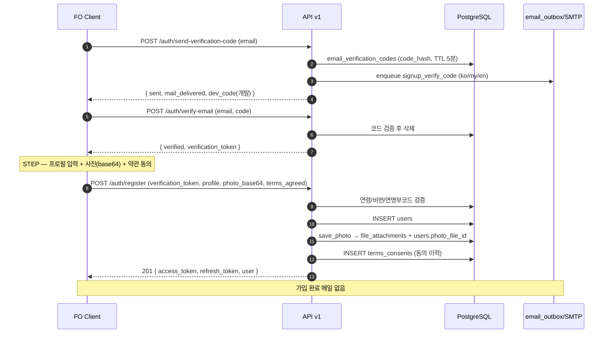
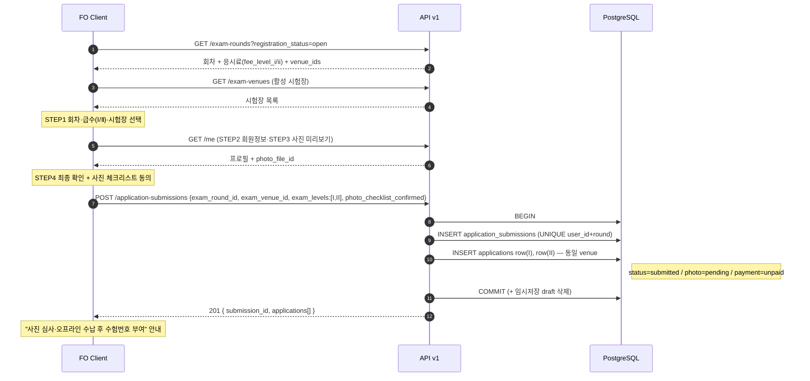
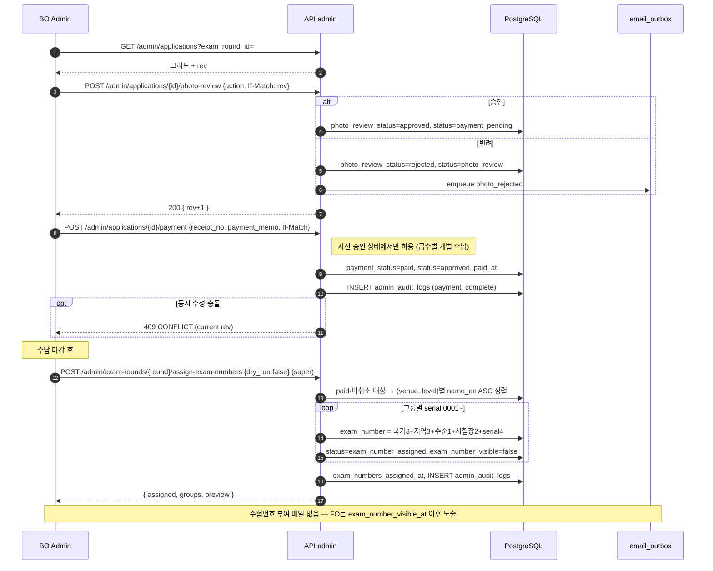
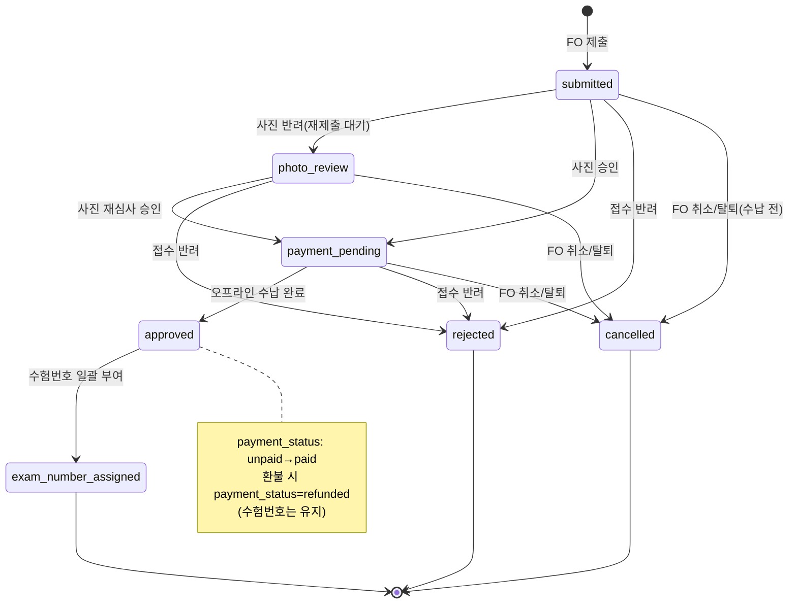
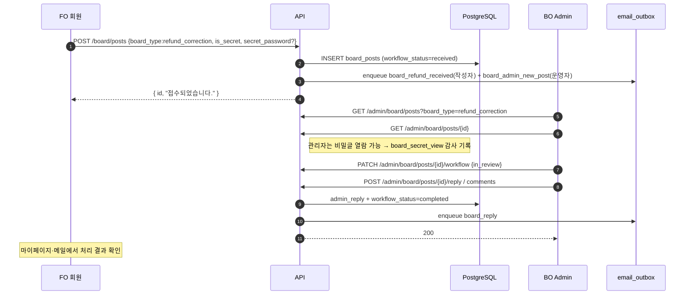
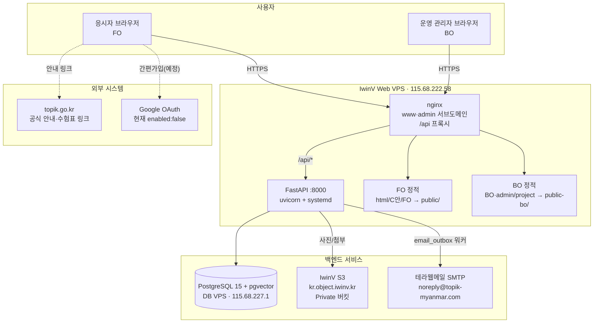

# TOPIK Myanmar — 시스템 개요 (System Design Overview)

> **문서 위치:** `docs/system_design/overview.md` · **최상위 인덱스**
> **기준일:** 2026-06-08
> **근거(SSOT):** `docs/기능정의서/`(README·DB스키마_초안·ERD_및_플로우·REST_API_명세_초안), 실제 구현 `apps/api/`(라우터·ORM), 실제 마이그레이션 `db/migrations/V001~V007`, 운영 문서 `docs/DEV_SPEC.md`·`docs/IWINV_SETUP.md`
> **상호 문서:** [DB 논리 명세](database.md) · [개발 스펙](tech-spec.md) · [서비스 상세](#8-문서-구성-안내)

본 문서는 **TOPIK Myanmar** 시스템의 최상위 설계 개요이자 산출물 인덱스입니다. 데이터 모델 상세는 [`database.md`](database.md), 기술 스택·아키텍처는 [`tech-spec.md`](tech-spec.md), FO/BO 화면·기능 상세는 [`services/`](#8-문서-구성-안내) 폴더를 참고하세요.

---

## 1. 프로젝트 개요 / 목적

**TOPIK Myanmar**는 미얀마 현지 TOPIK(한국어능력시험) 응시자의 **온라인 접수**와 운영 기관의 **접수·시험 운영 관리**를 제공하는 웹 서비스입니다.

| 구분 | 내용 |
| --- | --- |
| 서비스명 | TOPIK Myanmar |
| 목적 | 미얀마 TOPIK 시험의 온라인 회원가입·접수·사진심사·오프라인 수납·수험번호 부여·연명부/사진 산출을 단일 시스템으로 운영 |
| 대상 시험 | TOPIK Ⅰ(`level_code 7`), TOPIK Ⅱ(`level_code 8`) — 동시 접수 가능 |
| 운영 주체 | 주미얀마 대사관(TOPIK Myanmar 운영 담당) |
| 1차 회차 | **제107회** (접수 2026-07-17~21, 오프라인 수납 7-24~26, 시험 2026-10-18) |
| 영역 구분 | **FO**(Front Office, 응시자용) / **BO**(Back Office, 관리자용) |
| 다국어 | 한국어(ko) · 미얀마어(my) · 영어(en) |

**핵심 도메인 규칙**

- **동시 접수 모델**: 1인 1회차당 1개 `application_submissions`(그룹) + 급수(Ⅰ/Ⅱ)별 `applications` 1~2행. 동시 접수 시 **동일 시험장**으로 강제.
- **오프라인 수납**: 응시료는 온라인 결제가 아닌 **오프라인 현장 수납**(관리자 기록). 사진 심사 승인 후 수납 가능.
- **수험번호 13자리**: 수납 마감 후 영문명(name_en) 오름차순으로 **일괄 채번**.
- **이메일 비발송 정책**: 접수 완료·수험번호 부여 시 메일을 보내지 않음(공지·마이페이지 안내).

---

## 2. 액터 · 역할 정의

| 액터 | 인증 | 설명 | 주요 접근 |
| --- | --- | --- | --- |
| **비로그인 방문자** | 없음 | 공개 콘텐츠 열람 | 홈, TOPIK 안내/규정, 공지·FAQ, 회차 목록, 약관 본문 |
| **로그인 회원(user)** | FO JWT (`role=user`) | 가입한 응시자 | 시험 접수·접수 확인·수험표 안내, 마이페이지, 게시판 작성(환불·정정/문의), 내 정보 수정 |
| **관리자 — super** | BO JWT (`role=super`) | 최고관리자 | BO 전체. **회차/시험장 CRUD, 약관 게시/폐지, 수험번호 일괄 부여, 관리자 계정 관리, 회원 정지/탈퇴** 등 민감 작업 단독 권한 |
| **관리자 — standard** | BO JWT (`role=admin`) | 일반 관리자 | 접수 처리(사진심사·수납·승인·반려), 콘텐츠/게시판, 회원 정보 수정 등. `super` 전용 작업은 403 |
| **관리자 — readonly** | BO JWT (`role=readonly`) | 조회 전용 | 모든 `GET`(목록·상세) 가능, 모든 변경 작업은 403 |

> **구현 메모(실제 ↔ 초안 차이):** ORM/DB의 `admin_users.role` 저장값은 **`super` / `admin` / `readonly`** 입니다. 기능정의서 초안의 `standard`는 실제 저장 시 `admin`으로 정규화됩니다(`general`→`admin`, `viewer`/`standard`→정규화). 권한 게이팅은 `apps/api/app/lib/deps.py`의 `require_user` / `require_admin`(readonly 차단) / `require_any_admin`(readonly 허용) / `_require_super`로 구현됩니다.

---

## 3. 서비스 맵 (FO 7 + BO 7)

화면·기능 상세는 각 `services/*.md`(다른 작업자 작성)를 참고하세요. 본 표는 인덱스입니다.

### 3.1 FO (응시자) 서비스 7종

| # | 서비스 | 핵심 기능 | 접근 권한 | 상세 문서 |
| --- | --- | --- | --- | --- |
| 00 | 공통(레이아웃) | GNB 4대 메뉴, 푸터, 언어 전환(ko/my/en), 모바일 메뉴, 로그인 가드(`?next=`) | 전체 | [`services/fo-00-common.md`](services/fo-00-common.md) |
| 01 | 메인/홈 | 히어로, 공지·일정 미리보기, 퀵링크 | 전체 | [`services/fo-01-home.md`](services/fo-01-home.md) |
| 02 | TOPIK 안내 | 시험 개요·소개·문항 구성·평가 기준(정적 콘텐츠) | 전체 | [`services/fo-02-topik-guide.md`](services/fo-02-topik-guide.md) |
| 03 | TOPIK 규정 | 유의 사항·답안 작성·응시료 규정·신분증 규정(정적 콘텐츠) | 전체 | [`services/fo-03-topik-rules.md`](services/fo-03-topik-rules.md) |
| 04 | TOPIK 접수 | 접수 방법, **시험 접수 4단계**, 접수 확인(마이페이지), 수험표 안내 | 접수·확인·수험표 = **로그인 필수** | [`services/fo-04-topik-apply.md`](services/fo-04-topik-apply.md) |
| 05 | 게시판 | 공지사항, **환불·정보정정신청**, **문의게시판**, FAQ (비밀글·댓글/대댓글) | 공지·FAQ = 전체 / 환불·정정·문의 = **로그인 필수** | [`services/fo-05-board.md`](services/fo-05-board.md) |
| 06 | 계정 | 회원가입(이메일 인증·사진 등록), 로그인, 아이디/비밀번호 찾기, 내 정보 수정, 탈퇴 | 가입·로그인 = 전체 / 내 정보 = 로그인 필수 | [`services/fo-06-account.md`](services/fo-06-account.md) |

### 3.2 BO (관리자) 서비스 7종

| # | 서비스 | 핵심 기능 | 접근 권한 | 상세 문서 |
| --- | --- | --- | --- | --- |
| 00 | 공통(레이아웃·인증) | 관리자 로그인/로그아웃, 사이드바·탑바, 최초 비밀번호 변경 강제 | 관리자 | [`services/bo-00-common.md`](services/bo-00-common.md) |
| 01 | 대시보드 | KPI 카드, 최근 접수·최근 게시판 요약 | 전체 관리자(readonly 포함) | [`services/bo-01-dashboard.md`](services/bo-01-dashboard.md) |
| 02 | 접수관리 | 접수자 그리드, **사진 심사**, **오프라인 수납**, **수험번호 일괄 부여**, 연명부 xlsx·사진 zip 내보내기 | 조회=전체 / 처리=standard↑ / 채번=super | [`services/bo-02-applications.md`](services/bo-02-applications.md) |
| 03 | 시험관리 | 회차 CRUD·상태(open/closed/revoked), **시험장 마스터(국가·지역·시험장 코드)** | 조회=전체 / 변경=**super** | [`services/bo-03-exam.md`](services/bo-03-exam.md) |
| 04 | 콘텐츠관리 | 공지(첨부·마케팅 메일), FAQ(다국어), 환불·정정/문의 게시판 답변·상태·댓글 | 조회=전체 / 변경=standard↑ | [`services/bo-04-content.md`](services/bo-04-content.md) |
| 05 | 회원·약관 | 회원 목록·정지·탈퇴·임시비번·CSV, 약관 버전·게시/폐지·동의 이력 | 조회=전체 / 정지·탈퇴·약관게시=**super** | [`services/bo-05-members-terms.md`](services/bo-05-members-terms.md) |
| 06 | 시스템 | 관리자 계정 관리(다중 계정), **처리 이력(감사 로그)**, 사이트 보기, 로그아웃 | 계정관리=**super** / 이력 조회=전체 | [`services/bo-06-system.md`](services/bo-06-system.md) |

### 3.3 공통/상위 설계 문서

| 문서 | 역할 |
| --- | --- |
| [`database.md`](database.md) | DB 논리 명세 — 테이블·열거형·ERD·채번·서비스↔테이블 매핑·마이그레이션 현황 |
| [`tech-spec.md`](tech-spec.md) | 개발 스펙 — 기술 스택, 아키텍처, API 표면, 인증/권한, 파일/이메일/동시성, 비기능·환경·배포 |

---

## 4. 화면 ID 체계 · 상태/배지 체계

### 4.1 화면 ID 체계

기능정의서 화면 ID는 IA(메뉴구조도)의 PAGE NO. 를 따릅니다.

```
TPKM_{FO|BO}_{1Depth}_{2Depth}_{3Depth}_{4Depth}_{5Depth}_{타입약어}
```

| 타입약어 | 의미 |
| --- | --- |
| `P` | Page |
| `S` | Section / Tab |
| `C` | Component |
| `LP` | Layer Popup |
| `MP` | Modal Popup |
| `L` | External Link |

**예시**

| 화면 ID | 의미 |
| --- | --- |
| `TPKM_FO_4_2_2_0_0_S` | FO > TOPIK접수 > 시험접수 > STEP2(회원정보 확인, readonly) |
| `TPKM_FO_2_1_0_0_0_P` | FO > TOPIK안내 > 시험 개요 페이지 |
| `TPKM_FO_0_1_3_0_0_C` | FO > 공통 > 로그인 가드 컴포넌트(`?next=` 보존) |
| `TPKM_BO_2_1_0_0_0_P` | BO > 접수관리 > 접수자 그리드(사진심사·수납·수험번호) |
| `TPKM_BO_6_2_0_0_0_P` | BO > 시스템 > 처리 이력 |

### 4.2 상태/배지 체계 (요약)

접수 상태는 **3개 축**으로 분리 저장하고, FO 배지는 API에서 매핑합니다. 상세 enum 표·전이는 [`database.md` §3](database.md#3-공통-열거형)·[본 문서 §5.4](#54-접수-상태-라이프사이클-statediagram) 참고.

| 축 | DB 컬럼 | 값 | 용도 |
| --- | --- | --- | --- |
| 접수 상태 | `applications.status` | `submitted` / `photo_review` / `payment_pending` / `approved` / `exam_number_assigned` / `rejected` / `cancelled` (7종) | FO 카드 배지·BO 그리드 |
| 사진 심사 | `applications.photo_review_status` | `pending` / `approved` / `rejected` (+ `photo_reject_code`) | 사진심사중·반려 |
| 수납 | `applications.payment_status` | `unpaid` / `paid` / `refunded` | 수납대기·완료·환불자(BO) |
| 게시판(환불·정정) | `board_posts.workflow_status` | `received` / `in_review` / `completed` / `rejected` | 처리 상태 |
| 게시판(문의) | `board_posts.workflow_status` | `awaiting_reply` / `answered` | 답변 상태 |

---

## 5. 핵심 End-to-End 플로우

### 5.1 회원가입 (이메일 인증 · 사진 등록)

이메일 6자리 인증코드(5분) → 인증 토큰 발급 → 프로필·사진·약관 동의와 함께 가입 완료(즉시 JWT 발급). **가입 완료 메일은 없음**(인증코드 메일만).



### 5.2 시험 접수 4단계

STEP1 회차+급수 동시 선택 → STEP2 회원정보 확인(수정 불가) → STEP3 회원사진 규격 확인(업로드 불가, 가입 사진 재사용) → STEP4 최종 확인·제출. 제출은 1건의 `application_submissions` + 급수별 `applications`(1~2행) 원자 처리.



### 5.3 BO 사진심사 → 수납 → 수험번호 일괄 부여

사진 승인 후에만 수납 가능. 수납 마감 후 영문명 오름차순으로 13자리 일괄 채번(super 전용). 동시 작업 충돌은 `rev`/`If-Match`로 409.



### 5.4 접수 상태 라이프사이클 (stateDiagram)



> 환불(`payment/cancel`)은 `payment_status=refunded`로 처리되는 **별도 축**이며, 0526 정책상 **수험번호는 유지**됩니다.

### 5.5 게시판 환불·정정 워크플로우

로그인 회원이 환불·정정 신청(비밀글 옵션) → 운영자 알림 메일 → 관리자 답변·상태 변경(댓글/대댓글) → 신청자 알림.



---

## 6. 시스템 컨텍스트 다이어그램



| 외부 의존 | 용도 | 현재 상태 |
| --- | --- | --- |
| IwinV Web/DB VPS | 애플리케이션·DB 호스팅 | 운영 확정 (도메인 미구매) |
| IwinV S3 (`kr.object.iwinv.kr`) | 증명사진·게시판/공지 첨부 저장(Private) | 운영 시 `STORAGE_PROVIDER=s3` |
| 테라웹메일 SMTP | 트랜잭션·마케팅 메일 발송 | DNS(MX/SPF/DKIM) 확정 후 활성화 |
| topik.go.kr / niied.go.kr | 공식 안내·수험표 출력 링크(외부 이동) | 정적 링크 |
| Google OAuth | 간편가입(구글 계정) | **미구현** (`/auth/google/config` → `enabled:false`) |

---

## 7. 다국어 · 동시성 · 보안 정책 개요

### 7.1 다국어 (KO / MY / EN)

| 영역 | 방식 | 현황 |
| --- | --- | --- |
| FO UI 텍스트 | `data-i18n` + `shared/topik-i18n-content.js` (MY→EN→KO 폴백) | 25페이지 공통 적용 |
| FAQ 본문 | `faq_items.question_*/answer_*` 3개국어 컬럼, API `?lang=` | 지원 |
| 약관 본문 | `terms.body_ko/my/en`, API `/terms/{type}?lang=` | 지원 |
| 공지 본문 | `notices.body_html`(KO 단일) | **언어별 본문 미구현** (합의/후속) |
| 이메일 | `preferred_lang` 또는 요청 `lang` 기준 ko/my/en 14종 렌더 | 구현 |
| 회원 선호 언어 | `users.preferred_lang` (기본 `ko`) | 발송·표시 기준 |

### 7.2 동시성 (rev / If-Match / 409)

- 낙관적 잠금 컬럼 `rev`는 **`users`, `applications`** 에만 존재(실제 구현 기준).
- 변경 요청 시 `If-Match: <rev>` 헤더 또는 본문 `"rev": <n>` 전달 → 불일치 시 **409 CONFLICT**.
- BO 동시 수납/승인/반려, FO 프로필 수정에 적용. 처리 성공 시 `rev` 증가.
- 채번은 단일 트랜잭션 내 그룹 정렬·일괄 UPDATE로 원자 처리(별도 시퀀스 테이블 없음).
- 자세한 내용은 [`tech-spec.md` §5](tech-spec.md#5-파일스토리지--이메일--동시성).

### 7.3 보안 정책

| 항목 | 정책 |
| --- | --- |
| 인증 | JWT(access 60분 / refresh 14일), FO `role=user` · BO `role=admin/super/readonly` |
| 경로 격리 | BO 전용 `/api/v1/admin/*` — FO 토큰 접근 시 401/403 |
| 비밀번호 | 8자 이상 영문·숫자·특수문자, 6개월 변경 권고(180일 메일) |
| 계정 잠금 | 로그인 5회 실패 시 30분 잠금(FO/BO 공통) |
| 비밀글 | 비밀번호 5회 오류 시 30분 잠금, 관리자 열람 시 감사 로그 |
| 감사 로그 | BO 모든 상태 변경·로그인/로그아웃·비밀글 열람 → `admin_audit_logs` |
| 파일 접근 | 공개 URL 금지, 인증 프록시 `GET /files/{id}`(본인) · `GET /admin/files/{id}`(관리자) |
| 민감 필드 | 응답에서 `password_hash`·`secret_password_hash` 제외. 여권번호 미수집 |
| IDOR | `/applications/{id}`·`/board/posts/{id}`·`/files/{id}` 소유자 서버 검증 |
| CORS | 운영 origin 화이트리스트, 개발만 localhost 허용 |

---

## 8. 문서 구성 안내 (system_design 폴더)

```text
docs/system_design/
├── overview.md            ← 본 문서 (시스템 개요·인덱스)
├── database.md            ← DB 논리 명세 (테이블·enum·ERD·채번·마이그레이션 현황)
├── tech-spec.md           ← 개발 스펙 (스택·아키텍처·API·인증·비기능·배포)
└── services/              ← FO/BO 서비스별 상세 설계 (별도 작업자)
    ├── fo-00-common.md       공통 GNB·푸터·언어·모바일
    ├── fo-01-home.md         메인/홈
    ├── fo-02-topik-guide.md  TOPIK 안내
    ├── fo-03-topik-rules.md  TOPIK 규정
    ├── fo-04-topik-apply.md  TOPIK 접수(4단계·확인·수험표)
    ├── fo-05-board.md        게시판(공지·환불정정·문의·FAQ)
    ├── fo-06-account.md      계정(가입·로그인·내정보)
    ├── bo-00-common.md       공통 레이아웃·인증
    ├── bo-01-dashboard.md    대시보드
    ├── bo-02-applications.md 접수관리(사진·수납·채번·내보내기)
    ├── bo-03-exam.md         시험관리(회차·시험장 마스터)
    ├── bo-04-content.md      콘텐츠관리(공지·FAQ·환불정정·문의)
    ├── bo-05-members-terms.md 회원·약관
    └── bo-06-system.md       시스템(관리자 계정·처리 이력)
```

| 문서 | 역할 | 1차 근거 |
| --- | --- | --- |
| `overview.md` | 시스템 전반·액터·서비스맵·플로우·컨텍스트 (인덱스) | 기능정의서 README, 실제 라우터/모델 |
| `database.md` | 테이블/컬럼/제약/인덱스·열거형·채번·서비스↔테이블 매핑 | `DB스키마_초안.md` + `db/migrations/V001~V007` + ORM |
| `tech-spec.md` | 기술 스택·아키텍처·API·인증·파일/메일/동시성·비기능·배포 | `DEV_SPEC.md` + `IWINV_SETUP.md` + 실제 코드 |
| `services/*.md` | FO/BO 화면·컴포넌트·시나리오·검증·연동 상세 | 기능정의서 FO/BO `*.md` + HTML 화면 |

---

## 9. 참고 원본 문서

| 분류 | 문서 |
| --- | --- |
| 기능정의 인덱스 | [`docs/기능정의서/README.md`](../기능정의서/README.md) |
| 데이터 모델 초안 | [`docs/기능정의서/DB스키마_초안.md`](../기능정의서/DB스키마_초안.md) |
| ERD·시퀀스 | [`docs/기능정의서/ERD_및_플로우.md`](../기능정의서/ERD_및_플로우.md) |
| REST API 초안 | [`docs/기능정의서/REST_API_명세_초안.md`](../기능정의서/REST_API_명세_초안.md) |
| 현행 개발 스펙 | [`docs/DEV_SPEC.md`](../DEV_SPEC.md) |
| 인프라 운영 | [`docs/IWINV_SETUP.md`](../IWINV_SETUP.md) · [`docs/DEPLOY.md`](../DEPLOY.md) |
| 정책 합의 | [`docs/기능정의서/정책_합의_워크시트.md`](../기능정의서/정책_합의_워크시트.md) |
| 배포 아키텍처 | [`docs/기능정의서/배포_아키텍처.md`](../기능정의서/배포_아키텍처.md) |
| 마이그레이션·시드 | [`docs/기능정의서/마이그레이션_및_시드.md`](../기능정의서/마이그레이션_및_시드.md) |
