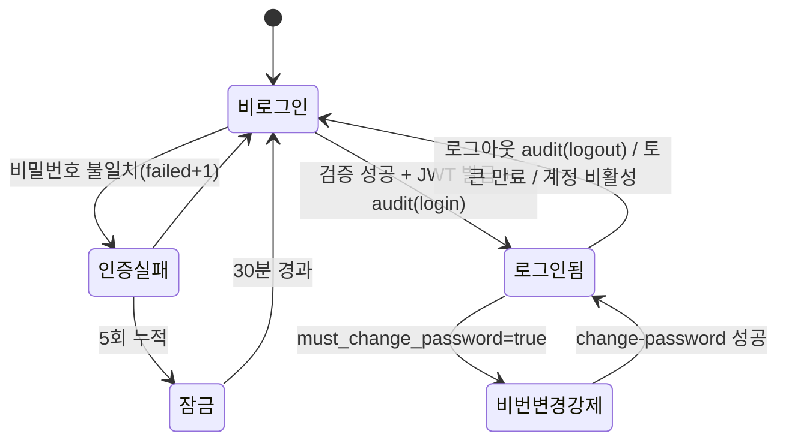

# 관리자 공통(레이아웃·인증) 상세 설계 (BO)

> 근거 기능정의서: `docs/기능정의서/BO/00_공통_관리자레이아웃·인증_기능정의서.md` · 화면 ID 접두: `TPKM_BO_0_*`
> 데이터 모델 정본: `docs/기능정의서/DB스키마_초안.md` · API: `docs/기능정의서/REST_API_명세_초안.md` · 실제 구현: `apps/api/app/routers/auth.py`, `apps/api/app/lib/deps.py`, `apps/api/app/routers/admin_api.py`

---

## 1. 서비스 개요

| 항목 | 내용 |
| --- | --- |
| 목적 | 모든 BO 패널의 공통 진입·인증·권한·레이아웃 골격 정의. 관리자 로그인/로그아웃, 세션 유지, 권한 등급(RBAC) 게이팅, 사이드바·탑바·알림 배지. |
| 범위 | 인증(로그인·로그아웃·토큰 갱신·최초 비밀번호 변경), 권한 등급 판정, 공통 레이아웃 컴포넌트, 미처리 건수 알림 배지. **개별 도메인 액션은 각 서비스 문서(bo-01~06)에서 다룸.** |
| 주요 액터 | `super`(최고관리자) · `admin`(일반관리자, 기능정의서 표기 "일반/standard") · `readonly`(조회관리자). DB enum: `admin_users.role ∈ {super, admin, readonly}` |
| 관련 요구사항ID | TPKM_BO_REQ_007, TPKM_BO_REQ_014 |

> **권한 등급 명칭 주의(정합)**: 기능정의서·DB스키마 초안은 `super/standard/readonly`로 표기하나 **실제 구현 enum은 `super/admin/readonly`** 이다. 입력 호환을 위해 라우터의 `_normalize_admin_role()`이 `standard→admin`, `general→admin`, `viewer→readonly`로 매핑한다. 본 설계서는 이후 `admin(=일반/standard)`로 병기한다.

### 페이지(컴포넌트) 목록

| 화면명 | 화면 ID | 타입 | 비고 | 접근 권한 |
| --- | --- | --- | --- | --- |
| 관리자 로그인 | `TPKM_BO_0_1_0_0_0_P` | 페이지 | `admin-login.html` | 비로그인(공개) |
| 관리자 로그아웃 | `TPKM_BO_0_2_0_0_0_L` | 외부 링크 | 사이드바 푸터 | 전 등급 |
| 어드민 사이드바 | `TPKM_BO_0_3_0_0_0_C` | 컴포넌트 | 섹션·메뉴·로그인사용자·로그아웃 | 전 등급(메뉴는 등급별 노출) |
| 사이드바 카운트 배지 | `TPKM_BO_0_3_1_0_0_C` | 컴포넌트 | 미처리 건수 | 전 등급 |
| 어드민 탑바 | `TPKM_BO_0_4_0_0_0_C` | 컴포넌트 | 패널 타이틀 + 로그인 아이디(역할) | 전 등급 |

---

## 2. 페이지별 상세 설계

### 2.1 관리자 로그인 — `TPKM_BO_0_1_0_0_0_P`

- **개요**: 관리자 ID(이메일)/비밀번호 인증. 성공 시 `?next=` 화이트리스트 경로 또는 `admin.html`로 이동. 접근 권한: 비로그인.
- **정합 주의**: REST 초안은 `POST /admin/auth/login`을 제시하나, **실제 구현은 FO/BO 통합 엔드포인트 `POST /api/v1/auth/login`** 하나로 처리한다(요청 이메일을 `admin_users`에서 먼저 조회 → 없으면 `users` 조회). 토큰 `sub`는 `admin:{id}` / `user:{id}`로 구분되어 발급된다.

#### 액션 상세

| 항목 | 내용 |
| --- | --- |
| 액션/트리거 | 이메일·비밀번호 입력 후 제출 |
| 입력 & 검증 | `email`(정규화: trim+lower, 형식 검증), `password`(평문, TLS 전송). 빈 값/형식 오류 → `400 VALIDATION_ERROR` |
| 처리 | ① `admin_users`에서 `email` + `status='active'` 조회 → 존재 시 관리자 분기. ② 잠금 검사: `login_locked_until > now` → `423 ACCOUNT_LOCKED`. ③ `verify_password()`(bcrypt) 성공 → 로그인 상태 리셋(`failed_login_count=0`, `login_locked_until=NULL`, `last_login_at=now`) + **audit `login` 기록** + access/refresh JWT 발급. ④ 실패 → `failed_login_count+1`, **5회 도달 시 30분 잠금**(`login_locked_until=now+30m`, 카운트 리셋) 후 `401 INVALID_CREDENTIALS` |
| 권한 체크 | 없음(인증 자체). 단 토큰에 `role` claim 포함 |
| 이력 기록 | ✅ 로그인 성공 시 `admin_audit_logs(action_type='login', target_type='admin_users', target_id, ip_address)` |
| 연동 API | `POST /api/v1/auth/login` |
| 연동 DB | `admin_users`(email, password_hash, status, role, failed_login_count, login_locked_until, last_login_at, must_change_password), `admin_audit_logs` |
| 결과/후속 | `{access_token, refresh_token, user:{id,email,name,role,must_change_password}}`. `must_change_password=true`면 비밀번호 변경 화면으로 강제 유도(2.1.1) |
| 예외 | 비활성(`status<>'active'`) 계정은 조회 제외 → `401`. 무차별 대입 방지는 계정+IP 단위 잠금(현재 계정 단위 구현, IP 단위는 합의 필요) |

#### 2.1.1 최초/만료 비밀번호 강제 변경

- **규칙**: `admin_users.must_change_password=true`(신규 생성·비밀번호 초기화 직후)인 관리자는 **로그인은 되지만 기능 API가 차단**된다. `require_admin`/`require_any_admin` 의존성의 `_guard_must_change()`가 `403 PASSWORD_CHANGE_REQUIRED`를 던진다.
- **해제**: `POST /api/v1/admin/me/change-password` (`current_password`, `new_password`, `new_password_confirm`). 현재 비밀번호 검증 실패 → `400 INVALID_CREDENTIALS`, 규칙 위반/확인 불일치 → `400 VALIDATION_ERROR`. 성공 시 `password_hash` 갱신·`password_changed_at=now`·`must_change_password=false` + audit `admin_change_password`.
- 비밀번호 정책: 8자 이상, 영문·숫자·특수문자 포함(`is_valid_password`).

### 2.2 관리자 로그아웃 — `TPKM_BO_0_2_0_0_0_L`

| 항목 | 내용 |
| --- | --- |
| 액션/트리거 | 사이드바 푸터 "로그아웃" 클릭 |
| 처리 | 클라이언트에서 access/refresh 토큰 폐기(스토리지 삭제) 후 `admin-login.html` 이동. 서버는 관리자일 때 **audit `logout` 기록**. (현재 토큰은 **무상태 JWT** — 서버측 세션 무효화 테이블 없음) |
| 이력 기록 | ✅ `admin_audit_logs(action_type='logout', target_type='admin_users', target_id, ip_address)` |
| 연동 API | `POST /api/v1/auth/logout` |
| 결과/후속 | `{logged_out: true}`. 이후 모든 `/admin/*` 요청은 `401` |
| 비고/합의 | 무상태 JWT 특성상 **즉시 강제 로그아웃(서버 폐기)** 은 미지원 → access 토큰 만료시간(짧게)·refresh 회전·블랙리스트 도입 여부 **합의 필요**. 계정 비활성/정지 시 다음 요청에서 `status<>'active'` 조회로 차단됨 |

### 2.3 토큰 갱신 (세션 유지)

| 항목 | 내용 |
| --- | --- |
| 액션/트리거 | access 토큰 만료 임박/만료 시 |
| 처리 | refresh 토큰 `sub`(`admin:{id}`) 디코드 → `admin_users` `status='active'` 재확인 → 신규 access/refresh 재발급 |
| 연동 API | `POST /api/v1/auth/refresh` (body `{refresh_token}`) |
| 결과/예외 | 유효하지 않은/만료 토큰 → `401 INVALID_TOKEN`. 비활성 계정 → `401` |
| 비고/합의 | 기능정의서 권장: **유휴 30분·절대 만료 8시간**. 현재는 JWT exp 기반(설정값) — 유휴 타임아웃은 클라이언트 활동 감지로 보완. 최종 만료 정책 **합의 필요** |

### 2.4 어드민 사이드바 — `TPKM_BO_0_3_0_0_0_C`

- **개요**: 모든 BO 패널의 좌측 네비게이션. 섹션·메뉴·알림 배지·로그인 사용자명·로그아웃. 모바일은 햄버거 토글. 접근 권한: 전 등급(메뉴 항목은 **등급별 노출 제어**).
- **섹션 구성(0519 반영)**: ① 대시보드(`bo-01`) ② 접수 관리(`bo-02`) ③ 시험 관리(`bo-03`) ④ 콘텐츠(`bo-04`) ⑤ 회원·약관(`bo-05`) ⑥ 시스템(`bo-06`: 관리자 계정 관리·권한 관리·처리 이력·사이트 보기·로그아웃).
- **권한별 메뉴 노출(요약)**: 시스템>관리자 계정 관리·권한 관리는 **super 전용**. 그 외 메뉴는 전 등급 표시하되 액션은 서버에서 등급 검증. **클라이언트 메뉴 숨김만으로 보호 금지 — 서버측 권한 검증 필수**.

#### 액션 상세 — 모든 페이지 진입 가드

| 항목 | 내용 |
| --- | --- |
| 트리거 | 임의 BO 패널 진입/패널 전환 |
| 처리 | 토큰 유효성·`is_admin` 확인. 만료/무효 → `admin-login.html` 강제 이동(현재 경로 `?next=` 보존). `must_change_password=true` → 비밀번호 변경 유도 |
| 권한 체크 | 의존성 3종으로 구현: `require_any_admin`(전 등급, GET·조회) / `require_admin`(super·admin, 변경 액션 — readonly는 `403`) / `require_super`(super 전용) |
| 연동 API | 각 패널의 `GET /api/v1/admin/*` (예: `GET /admin/me`는 **미구현** — 로그인 응답의 프로필을 클라이언트가 보관, 합의/구현 필요) |

### 2.5 사이드바 카운트 배지 — `TPKM_BO_0_3_1_0_0_C`

| 항목 | 내용 |
| --- | --- |
| 개요 | 메뉴 옆 미처리 건수 배지. 1분 주기 자동 갱신 또는 작업 후 즉시 갱신. 0건 시 숨김 |
| 집계 항목 | 접수자 미심사(`photo_review_status='pending'`) · 사진 검토 대기 · 환불·정정 신규(`workflow_status='received'`) · 문의 답변 대기(`workflow_status='awaiting_reply'`) |
| 연동 DB | `applications`(photo_review_status/status), `board_posts`(board_type, workflow_status) |
| 연동 API | **전용 집계 엔드포인트 미구현**(예: `GET /admin/dashboard/summary` 또는 `GET /admin/badges`) → 현재 클라이언트가 목록 API 결과로 산출하거나 신규 집계 API **구현 필요(합의)** |
| 비고 | 색상만으로 정보 전달 금지(숫자 텍스트 병행). 게시판 통계 포함 |

### 2.6 어드민 탑바 — `TPKM_BO_0_4_0_0_0_C`

- 현재 패널 타이틀 + 모바일 햄버거 + 우측 "로그인 아이디(역할)" 태그. 역할 라벨은 `admin_users.role`(super/admin/readonly) 표시. 순수 표시 컴포넌트(상태 변경 액션 없음).

---

## 3. 핵심 비즈니스 규칙 / 권한 모델

### 3.1 인증·세션 상태 흐름

### 3.2 RBAC 매트릭스 (실제 구현 기준, super=최고 / admin=일반 / readonly=조회)

| 영역(대표 액션) | super | admin | readonly | 강제 위치 |
| --- | :---: | :---: | :---: | --- |
| 전 패널 조회(GET) | ✅ | ✅ | ✅ | `require_any_admin` |
| 접수 사진심사·수납·승인·반려 | ✅ | ✅ | — | `require_admin` |
| 수험번호 일괄 부여 | ✅ | — | — | `require_admin` + `_require_super` |
| 회차/시험장 생성·수정·상태·폐지 | ✅ | — | — | `_require_super` |
| 회원 정지/탈퇴 | ✅ | — | — | `update_user` 내 `_require_super` |
| 회원 정보 수정·비밀번호 초기화 | ✅ | ✅ | — | `require_admin` (※ 기능정의서는 super 전용 권고 — 합의 필요) |
| 약관 게시/폐지 | ✅ | — | — | `_require_super` |
| 약관 생성/수정 | ✅ | ✅ | — | `require_admin` (※ 기능정의서는 super 권고 — 합의 필요) |
| 공지/FAQ 작성·수정 | ✅ | ✅ | — | `require_admin` |
| 게시판 답변·상태·댓글 | ✅ | ✅ | — | `require_admin` |
| 관리자 계정 CRUD·비번 초기화 | ✅ | — | — | `_require_super` |
| 처리 이력 조회 | ✅(전체) | ✅(현재 전체) | ✅(현재 전체) | `require_any_admin` (※ 기능정의서: admin/readonly는 본인 이력만 — 미구현, 합의 필요) |

> 권한 미충족: 변경 액션에 readonly → `403 FORBIDDEN("읽기 전용 계정입니다.")`, super 전용에 admin → `403 FORBIDDEN("최고관리자만 수행할 수 있습니다.")`.

### 3.3 동시성·낙관적 잠금(공통 규약)

- 변경 가능한 핵심 리소스는 `rev`(INTEGER) 보유: `applications.rev`, `users.rev`. 요청 시 `If-Match: <rev>` 헤더 또는 body `rev` 전달.
- 불일치 → `409 CONFLICT("...다른 관리자에 의해 수정되었습니다. 새로고침 후 다시 시도해 주세요.")`. 클라이언트는 최신 `rev` 재조회 후 재시도.
- **주의**: `exam_rounds`·`exam_venues`에는 현재 `rev` 컬럼이 없어 낙관적 잠금이 미적용(REST 초안은 `*.rev` 명시) — 마스터 동시 편집 충돌 대비 컬럼 추가 **합의 필요**.

### 3.4 감사 로그(공통)

모든 상태 변경 액션은 `admin_audit_logs`에 자동 기록(상세는 [`bo-06-system.md`](bo-06-system.md)). 공통 컬럼: `admin_user_id`, `action_type`, `target_type`, `target_id`(문자열), `before_data`(JSONB), `after_data`(JSONB), `memo`, `ip_address`, `created_at`. 로그인/로그아웃도 기록.

---

## 4. 타 서비스·FO 연동

| 연동 대상 | 연동 내용 | 비고 |
| --- | --- | --- |
| 전 BO 패널(bo-01~06) | 인증 가드·권한 게이팅·공통 레이아웃 | 본 문서가 골격 제공 |
| `bo-06-system` | 사이트 보기(`TPKM_BO_6_3` FO 새 창), 로그아웃(`TPKM_BO_6_4`), 처리 이력 | 사이드바 시스템 섹션 |
| FO | 동일 `POST /auth/login`/`refresh`/`logout` 사용(토큰 `sub` prefix로 분리) | FO 토큰으로 `/admin/*` 접근 시 `401`(미관리자) |
| 이메일(`email_outbox`) | 관리자 임시 비밀번호(`temp_password_admin`) | bo-06 계정 관리에서 발송 |

---

## 5. 운영 정책 합의 필요 항목

1. **권한 등급 명칭 통일**: 문서(`standard`) ↔ 구현(`admin`) — 표기 일원화.
2. **로그인 잠금 IP 단위 병행 여부**(현재 계정 단위 30분 잠금만 구현) 및 잠금 알림.
3. **세션 만료 정책 최종값**(유휴 30분/절대 8시간) 및 무상태 JWT의 **강제 로그아웃·토큰 블랙리스트** 도입 여부.
4. **`GET /admin/me` / 배지 집계 / 대시보드 요약 전용 API** 신설 여부(현재 미구현).
5. **처리 이력 가시성 RBAC**(admin/readonly 본인 이력만) 구현 합의.
6. **회원 정보 수정·약관 생성/수정 권한 등급**(기능정의서 super 권고 vs 구현 admin 허용) 확정.
7. `exam_rounds`/`exam_venues` **낙관적 잠금(rev) 컬럼** 추가 여부.
8. 2FA·IP 화이트리스트 도입 시점, CSP/CSRF 운영 헤더 최종안.
