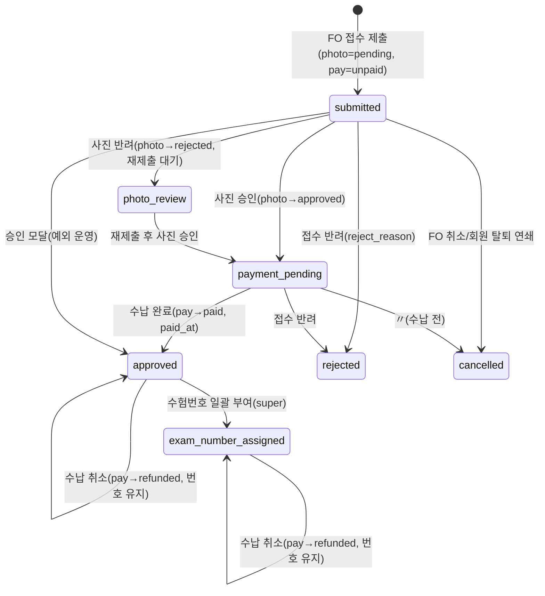

# 접수 관리 상세 설계 (BO)

> 근거 기능정의서: `docs/기능정의서/BO/02_접수관리_기능정의서.md` · 화면 ID 접두: `TPKM_BO_2_*`
> 데이터 모델 정본: `docs/기능정의서/DB스키마_초안.md` · API: `docs/기능정의서/REST_API_명세_초안.md`
> 실제 구현: `apps/api/app/routers/admin_api.py`, `apps/api/app/lib/roster_export.py`, `apps/api/app/models/application.py` · 참고 패널: `html/C안/BO(admin)/project/panels/applicants.jsx`

---

## 1. 서비스 개요

| 항목 | 내용 |
| --- | --- |
| 목적 | 회차 컨텍스트 하 접수자 전체 라이프사이클 운영: 사진 심사·오프라인 수납·승인/반려·수험번호 13자리 일괄 부여·연명부 엑셀·사진 zip·인쇄. **BO의 핵심 업무 화면.** |
| 범위 | `application_submissions`(동시 접수 그룹)·`applications`(급수별 행) 단위 상태 전이 전부. **사진 심사 전용 메뉴는 0526 폐지** → 접수자 목록 단일 메뉴에서 사진 심사+수납 동시 진행. |
| 주요 액터 | 조회(readonly): 목록·상세 조회 / 일반(admin): 사진심사·수납·승인·반려·엑셀·사진zip / 최고(super): + **수험번호 일괄 부여** |
| 관련 요구사항ID | TPKM_BO_REQ_001~005, TPKM_BO_REQ_009, TPKM_BO_REQ_015, TPKM_BO_REQ_016 |

### 페이지(패널) 목록

| 화면명 | 화면 ID | 타입 | BO 패널 | 접근 권한 |
| --- | --- | --- | --- | --- |
| 접수자 목록(회차 컨텍스트) | `TPKM_BO_2_1_0_0_0_P` | 페이지 | `applicants.jsx` | 전 등급(조회) |
| 필터+검색 | `TPKM_BO_2_1_1_0_0_C` | 컴포넌트 | 〃 | 전 등급 |
| 데이터 그리드(연명부 정합) | `TPKM_BO_2_1_2_0_0_C` | 컴포넌트 | 〃 | 전 등급 |
| 사진 심사 인라인 패널 | `TPKM_BO_2_1_3_0_0_SP` | 슬라이드 패널 | 〃 | admin↑ |
| 오프라인 수납 처리(사진·기본정보 동시) | `TPKM_BO_2_1_4_0_0_MP` | 모달 | 〃 | admin↑ |
| 승인 처리 | `TPKM_BO_2_1_5_0_0_MP` | 모달 | 〃 | admin↑ |
| 반려 처리(사유 필수) | `TPKM_BO_2_1_6_0_0_MP` | 모달 | 〃 | admin↑ |
| 행 상세 보기 | `TPKM_BO_2_1_7_0_0_LP` | 레이어 팝업 | 〃 | 전 등급(조회) |
| 수험번호 13자리 일괄 부여 | `TPKM_BO_2_1_8_0_0_MP` | 모달 | 〃 | **super 전용** |
| 연명부 양식 엑셀 내보내기 | `TPKM_BO_2_1_9_0_0_C` | 컴포넌트 | 〃 | admin↑ |
| 사진 zip 다운로드(폴더 구조) | `TPKM_BO_2_1_10_0_0_C` | 컴포넌트 | 〃 | admin↑ |
| 인쇄 | `TPKM_BO_2_1_11_0_0_C` | 컴포넌트 | 〃 | 전 등급 |

---

## 2. 페이지별 상세 설계

### 2.1 접수자 목록 / 필터 / 그리드 — `TPKM_BO_2_1_0~2`

- **개요**: 헤더 회차 `select`로 회차 컨텍스트 결정 → 해당 회차 접수자 그리드 표시. 다중 선택 후 일괄 액션(사진심사·수납·수험번호 부여·엑셀·사진zip).
- **필터/검색(`2_1_1`)**: 상태 칩 8종(전체/접수완료/사진심사중/수납대기/승인완료/반려/취소/**환불자**), 시험장 select(시험장 마스터 기반), 급수 select(전체/Ⅰ/Ⅱ/동시), 검색(한글·영문성명/생년월일/수험번호).
- **그리드(`2_1_2`)**: 연명부 양식 컬럼 정합 — 체크박스/번호/사진썸네일/한글성명/영문성명/생년월일(YYYYMMDD)/성별(1·2)/국적/제1언어/직업/응시동기/응시목적/급수/시험장/접수일/**사진심사상태(미심사·승인·반려)**/수납/수험번호(13자리)/상태/관리(사진심사·수납·승인·반려·보기).

#### 액션 상세 — 목록 조회

| 항목 | 내용 |
| --- | --- |
| 액션/트리거 | 패널 진입 / 회차·시험장·급수·상태 필터 / 검색 / 페이지 이동 |
| 입력 & 검증 | `exam_round_id`, `exam_venue_id`, `exam_level∈{I,II}`, `status`(7종 enum), `page≥1`, `page_size 1~500`(기본 50) |
| 처리 | `applications` 필터 쿼리 + `users`/`exam_venues`/`exam_rounds` 참조 조인. `id DESC` 정렬 |
| 권한 체크 | `require_any_admin`(전 등급) |
| 연동 API | `GET /api/v1/admin/applications` |
| 연동 DB | `applications`, `users`, `exam_venues`, `exam_rounds` |
| 결과/후속 | 행 dict(연명부 필드 + 상태 3종 + `rev`). 결과 카운트·페이지네이션 표시 |
| 비고 | 상태 칩 카운트는 대시보드 KPI·사이드바 배지와 동일 집계 기준 사용(정합). 환불자 칩은 `payment_status='refunded'` 기준(별도 필터 — 현재 `status` 파라미터로는 미표현, 클라이언트 분류) |

> **상태 3분리 모델**: FO 배지 `applications.status`(7종)와 `photo_review_status`(pending/approved/rejected)·`payment_status`(unpaid/paid/refunded)를 분리 저장한다. BO 그리드는 세 값을 조합해 칩을 표기한다.

### 2.2 사진 심사 인라인 패널 — `TPKM_BO_2_1_3_0_0_SP`

- **개요(0526)**: 그리드 행 ‘사진심사’ 버튼 → 우측 슬라이드 패널. 사진 큰 미리보기(클릭 시 원본 LP) + 응시자 기본정보(한글·영문성명/생년월일/성별/국적) + 승인/반려.
- **반려 정형 사유 코드**: `not_frontal`(정면 아님)·`hat_glasses`(모자·선글라스)·`bw_photo`(흑백)·`blurry`(흐림)·`not_self`(본인 아님)·`other`(기타).

#### 액션 상세

| 항목 | 승인 | 반려 |
| --- | --- | --- |
| 트리거 | "승인" 클릭 | "반려" 클릭(사유 필수) |
| 입력 & 검증 | `action='approve'`, `rev`/`If-Match` | `action='reject'`, `photo_reject_code`(필수), `photo_reject_note`(선택), `rev` |
| 처리(상태 전이) | `photo_review_status: pending→approved`, `status→payment_pending` | `photo_review_status: *→rejected`, `photo_reject_code/note` 저장, **`status→photo_review`**(재제출 대기 루프) |
| 권한 | `require_admin` | `require_admin` |
| 이력 기록 | ✅ `audit(action_type='photo_review_approve', target_type='applications')` | ✅ `audit(action_type='photo_review_reject')` |
| 알림(이메일) | ❌ | ✅ `photo_rejected`(마이페이지 사진 재등록 안내), 문자 제외(0526) |
| 연동 API | `POST /api/v1/admin/applications/{id}/photo-review` | 동일 |
| 연동 DB | `applications.photo_review_status/status/rev` | `+ photo_reject_code/photo_reject_note` |
| 동시성/예외 | `rev` 불일치 → `409 CONFLICT`(처리자 표시 + 새로고침). `action` 그 외 값 → `400 VALIDATION_ERROR` | 동일 |

> **구현 주의**: 반려 시 `status`가 `rejected`가 아니라 **`photo_review`** 로 설정된다(사진 재등록 후 재심사 루프). DB스키마 초안의 "photo_review=사진심사중(제출 직후)" 정의와 의미가 다소 다름 — §5 참고.

### 2.3 오프라인 수납 처리 — `TPKM_BO_2_1_4_0_0_MP`

- **개요(0519·0526)**: 다중 작업자 동시 수납 + **수납 시 사진·기본정보 동시 확인**. 모달 상단에 사진 썸네일/한글·영문성명/생년월일/사진심사상태. 사진 미심사 건은 모달 내 ‘사진 승인’으로 수납과 동시 처리 가능.

#### 2.3.1 수납 완료

| 항목 | 내용 |
| --- | --- |
| 액션/트리거 | 단일/다중 행 ‘수납완료’ |
| 입력 & 검증 | `receipt_no`(선택), `payment_memo`(선택), `ignore_capacity`(정원초과 허용), `rev` |
| 처리(가드·전이) | **선행 가드: `photo_review_status='approved'` 아니면 `400 PHOTO_NOT_APPROVED`("사진 심사 승인 후 수납").** 통과 시 `payment_status→paid`, `status→approved`, `paid_at=now`, `payment_receipt_no/payment_memo` 저장 |
| 권한 | `require_admin` |
| 이력 기록 | ✅ `audit(action_type='payment_complete')` — 처리자/시각/대상/메모 |
| 알림 | ❌(수납 자체 메일 없음) |
| 연동 API | `POST /api/v1/admin/applications/{id}/payment` |
| 연동 DB | `applications.payment_status/status/paid_at/payment_receipt_no/payment_memo/rev` |
| 동시성/예외 | 행 단위 낙관적 잠금(`rev`) → 충돌 `409 CONFLICT`(처리자 표시 + 새로고침). 다중 선택은 트랜잭션 내 행 단위 검증·부분성공 결과 표기 |
| 비고 | 응시료 금액은 `exam_rounds.fee_level_i/ii` 기준 자동 계산. 정원 검증은 `ignore_capacity`로 우회 가능(운영 재량) |

#### 2.3.2 수납 취소(환불) — `payment/cancel`

| 항목 | 내용 |
| --- | --- |
| 액션/트리거 | 납부 후 환불 시 ‘수납 취소’ |
| 처리(전이) | `payment_status→refunded`. **수험번호 유지(회수·삭제 안 함, 0526)**, `status`는 변경하지 않음(승인/수험번호부여 유지). 그리드는 `payment_status='refunded'`로 ‘환불자’ 분류 |
| 권한 | `require_admin` |
| 이력 기록 | ✅ `audit(action_type='payment_cancel')` |
| 연동 API | `POST /api/v1/admin/applications/{id}/payment/cancel` |
| 연동 DB | `applications.payment_status`(=refunded), (`payment_cancel_reason` 컬럼 존재) |
| 예외/합의 | **현재 구현은 취소 사유 필수·`rev` 검증 미적용**. 기능정의서는 "취소 사유 입력 필수" 명시 → `payment_cancel_reason` 입력·`rev` 가드 추가 **필요(합의)** |

### 2.4 승인 처리 — `TPKM_BO_2_1_5_0_0_MP`

| 항목 | 내용 |
| --- | --- |
| 액션/트리거 | ‘승인’ 클릭 |
| 입력 & 검증 | `rev`/`If-Match` |
| 처리(전이) | `status→approved`, `approved_at=now`. (사진 미심사 행은 사진 심사 후 승인 — 운영 가드) |
| 권한 | `require_admin` |
| 이력 기록 | ✅ `audit(action_type='approve', before={status})` |
| 알림 | ✅ `application_approved`(회차·급수·시험일·시험장·마이페이지 링크), 문자 제외(0526) |
| 연동 API | `POST /api/v1/admin/applications/{id}/approve` |
| 연동 DB | `applications.status/approved_at/rev` |
| 동시성/예외 | `rev` 불일치 → `409 CONFLICT` |
| 비고 | 정상 플로우에서는 수납 완료(`2.3.1`)가 이미 `status='approved'`로 전이시키므로, 본 승인 모달은 **수납 없이 별도 승인이 필요한 예외 운영** 또는 명시적 승인 확정용. 사진 미심사 가드는 서버 강제 추가 권장(합의) |

### 2.5 반려 처리 — `TPKM_BO_2_1_6_0_0_MP`

| 항목 | 내용 |
| --- | --- |
| 액션/트리거 | ‘반려’(사유 필수) |
| 입력 & 검증 | `reject_reason`(필수, select+자유텍스트), `rev`. 정형 코드(권고): `photo_invalid`/`info_mismatch`/`duplicate`/`other` |
| 처리(전이) | `status→rejected`, `reject_reason` 저장 |
| 권한 | `require_admin` |
| 이력 기록 | ✅ `audit(action_type='reject', memo=reject_reason)` |
| 알림 | ✅ `application_rejected`(사유·마이페이지·환불정정 안내), 문자 제외(0526) |
| 연동 API | `POST /api/v1/admin/applications/{id}/reject` |
| 연동 DB | `applications.status(=rejected)/reject_reason/rev` |
| 동시성/예외 | `rev` 불일치 → `409`. (현재 구현은 사유 빈값 허용 → 서버측 필수 검증 추가 권장) |

### 2.6 행 상세 보기 — `TPKM_BO_2_1_7_0_0_LP`

| 항목 | 내용 |
| --- | --- |
| 개요 | 전체 프로필 + 사진 원본 + 직업/응시동기/응시목적 코드명 + 관리자 메모 + 처리 이력 타임라인 |
| 처리 | `applications` + `users` 조인 + `application_memos`(메모) 로드. 처리 이력은 `admin_audit_logs(target_type='applications', target_id)` |
| 권한 | `require_any_admin`(조회) |
| 연동 API | `GET /api/v1/admin/applications/{id}` (memos·user 포함) |
| 연동 DB | `applications`, `users`, `application_memos`, `admin_audit_logs` |
| 합의 | **관리자 메모 추가 API 미구현**(상세는 메모를 읽기만). 메모 작성(`POST /admin/applications/{id}/memos`) 신설 필요. 처리 이력 타임라인 전용 조회는 `audit-logs` 필터로 대체 |

### 2.7 수험번호 13자리 일괄 부여 — `TPKM_BO_2_1_8_0_0_MP` ★핵심

- **발급 시점(0526)**: 개별 수납 시 즉시 부여하지 않고, **응시료 전체 수납 마감(예: 7.26) 후 관리자가 일괄 부여**.
- **부여 순서**: 그룹(시험장×수준) 내 **영문 성명 알파벳 오름차순**으로 응시자 일련번호(⑤) 배정.
- **대상**: `payment_status='paid'` AND `status<>'cancelled'`. (환불자=`refunded`는 신규 부여 대상 아님 — 단, 부여 후 환불된 건은 번호 유지.)
- **권한**: `require_admin` + `_require_super` → **super 전용**.

#### 액션 상세

| 항목 | 미리보기(dry_run) | 확정 |
| --- | --- | --- |
| 트리거 | "미리보기" | "확정 부여" |
| 입력 | `{dry_run:true}` | `{dry_run:false, visible_at?}`(FO 노출 일시) |
| 처리 | 채번 결과·그룹 요약·예상 번호 계산(미저장) | 트랜잭션 내 `exam_number` 저장, `status→exam_number_assigned`, `exam_number_visible=false`, 회차 `exam_numbers_assigned_at=now`, `visible_at` 지정 시 `exam_number_visible_at` 설정 |
| 권한 | super | super |
| 이력 기록 | ❌ | ✅ `audit(action_type='exam_number_assign', after={count, groups})` |
| 알림 | ❌ | ❌ **수험번호 발급 이메일 미발송(0527)** |
| 연동 API | `POST /api/v1/admin/exam-rounds/{round_id}/assign-exam-numbers` | 동일 |
| 연동 DB | (조회) | `applications.exam_number/status/exam_number_visible`, `exam_rounds.exam_numbers_assigned_at/exam_number_visible_at` |
| 결과 | `{dry_run, assigned, preview[], groups[]}` | `{assigned, groups[]}` |
| 동시성/예외 | — | **재배정 가드**: 이미 부여+공개(`exam_numbers_assigned_at` 있고 `exam_number_visible_at<=now`) → `409 ALREADY_VISIBLE`("공개된 수험번호 재배정 불가") |

> **노출 시점 분리(0527)**: 부여 즉시 FO 마이페이지에 노출하지 않음. **정해진 날짜(`exam_rounds.exam_number_visible_at`)에 FO 접수확인 페이지(`TPKM_FO_4_3_0`)에서만** 수험번호·수험표 노출. 노출 일시 설정은 회차 수정(`bo-03`) 또는 본 확정 시 `visible_at`로 지정. 각 `applications.exam_number_visible`는 FO 노출 게이팅 보조 플래그.

#### 13자리 구성 및 채번 알고리즘

```
수험번호(13) = ①국가(3) + ②지역(3) + ③수준(1) + ④시험장(2) + ⑤응시자일련(4)
 ① country_code  : exam_venues.country_code (미얀마 025)
 ② region_code   : exam_venues.region_code  (예: 양곤 001)
 ③ level_code    : 'I'→'7', 'II'→'8'
 ④ venue_code    : exam_venues.venue_code (2자리)
 ⑤ serial        : 그룹(④시험장 × ③수준)별 0001~, 영문명 ASC
예) 025 001 7 03 0007  → "0250017030007"
```

```text
# 의사코드 (실제: admin_api.assign_exam_numbers / _assign_group_serials)
대상 = SELECT a JOIN users u
       WHERE a.exam_round_id=R AND a.payment_status='paid' AND a.status<>'cancelled'
편의지원_submission = {sub.id | sub.exam_round_id=R AND sub.accommodation_requested}

그룹 = group_by(대상, key=(a.exam_venue_id, a.exam_level))
FOR (venue_id, level), 행들 IN 그룹:
    venue = load(venue_id)
    행들.sort(key=(u.name_en.upper(), a.id))          # 영문명 ASC, 동명 시 id 안정정렬
    편의지원_ids = {a.id | a.submission_id ∈ 편의지원_submission}
    serials = assign_group_serials(행들, 편의지원_ids)  # 아래
    level_code = '7' if level=='I' else '8'
    FOR a IN 행들:
        a.exam_number = f"{country:03}{region:03}{level_code}{venue_code:02}{serials[a.id]:04}"
        a.status='exam_number_assigned'; a.exam_number_visible=false   # 확정 시에만
round.exam_numbers_assigned_at = now; (visible_at 지정 시) round.exam_number_visible_at = visible_at

# assign_group_serials: 편의지원자 = 그룹 내 '마지막 홀수' 좌석부터 내림차순(9,7,5,…),
#                       일반 신청자 = 남은 좌석을 1부터 오름차순 채움.
```

- **Ⅰ+Ⅱ 동시 접수**: 동일 `submission`의 두 급수는 접수 시점에 **동일 `exam_venue_id`** 로 강제되므로(=④ 동일), 부여 시 ③ 수준코드(7/8)만 달라 같은 시험장에서 응시 가능.
- **원자성/동시성(중요)**: DB스키마 초안 §4.8/체크163은 `exam_number_sequences(round,venue,level,last_serial)` + `SELECT … FOR UPDATE`를 규정하나, **실제 구현은 단일 트랜잭션 in-memory 배치**(시퀀스 테이블 미사용)다. super 전용·재배정 가드로 1차 보호되지만, 동시 1회차 최초 부여 경합 방지를 위해 **advisory lock 또는 `exam_number_sequences` 도입 합의 필요**(§5).

### 2.8 연명부 양식 엑셀 내보내기 — `TPKM_BO_2_1_9_0_0_C`

| 항목 | 내용 |
| --- | --- |
| 액션/트리거 | ‘연명부 엑셀’ 다운로드(회차 단위) |
| 처리 | 회차 비취소 접수자 로드 → **(수준×지역×시험장)별 그룹** → 그룹마다 xlsx 1개 생성 → zip 묶음. 정렬: 수험번호 → 영문명 |
| 컬럼(실제 10열, B~K) | 한글성명/영문성명/생년월일(YYYYMMDD)/성별(1·2)/국적/제1언어/**직업코드/응시동기코드/응시목적코드**/수험번호 — **연락처·이메일 제외** |
| 파일명(실제) | 묶음 zip: `TOPIK_미얀마_연명부_제{round_no}회.zip`, 내부: `{TOPIK Ⅰ\|Ⅱ}_미얀마_{지역}_{시험장}.xlsx` |
| 권한 | `require_admin` |
| 이력 기록 | ✅ `audit(action_type='roster_export', after={files, rows})` |
| 연동 API | `GET /api/v1/admin/exam-rounds/{round_id}/roster.xlsx` (동기 스트리밍 zip) |
| 연동 DB | `applications`, `users`, `exam_venues`, `country_region_codes`(지역명) |
| 합의/정합 | 기능정의서는 "11컬럼" 및 파일명 `제{회차}회 TOPIK 지원자 연명부({국가}_{시험장}).xlsx`, 직업/동기/목적을 **코드명**으로 명시. 실제는 **10열·코드값·다른 파일명·동기 다운로드**(Job 비동기 아님). 컬럼 수/명칭/코드↔코드명/파일명 규칙 **확정 필요** |

### 2.9 사진 zip 다운로드(폴더 구조) — `TPKM_BO_2_1_10_0_0_C`

| 항목 | 내용 |
| --- | --- |
| 액션/트리거 | ‘사진 zip’ 다운로드(회차/시험장/수준 필터) |
| 처리 | 비취소 접수자 사진(`file_attachments`)을 폴더 구조로 zip 스트리밍. 수험번호 미부여·사진 없음은 누락 리포트 동봉 |
| 폴더/파일 구조 | `{지역}/{시험장}/{TOPIK Ⅰ\|TOPIK Ⅱ}/{수험번호13}.jpg` — 파일명은 13자리 수험번호 + `.jpg`만 |
| 누락 리포트(실제) | `_누락리포트.txt`(수험번호 미부여/사진 없음 목록) |
| 권한 | `require_admin` |
| 이력 기록 | ✅ `audit(action_type='photos_export', after={included, missing})` |
| 연동 API | `GET /api/v1/admin/applications/photos.zip?round_id=&venue_id=&level=` 및 alias `GET /api/v1/admin/exam-rounds/{round_id}/photos.zip` |
| 연동 DB | `applications`, `users`, `exam_venues`, `country_region_codes`, `file_attachments` |
| 합의/정합 | 기능정의서는 누락 리포트를 `누락_리포트.xlsx`(성명/수험번호/사유)로 명시 → 실제는 `_누락리포트.txt`. 대용량은 비동기 Job 권장(현재 동기). 사진 원본 jpg 저장 전제 |

### 2.10 인쇄 — `TPKM_BO_2_1_11_0_0_C`

- 현재 그리드 브라우저 인쇄. 인쇄 CSS로 액션 컬럼 등 비핵심 요소 숨김. 서버 액션 없음(클라이언트). 권한: 전 등급(기능정의서는 인쇄/엑셀을 super 권고 — 합의).

---

## 3. 상태 전이 / 핵심 비즈니스 규칙

### 3.1 접수 상태머신 (`applications.status`, 실제 전이 기준)



- **부가 상태(직교)**: `photo_review_status ∈ {pending, approved, rejected}`, `payment_status ∈ {unpaid, paid, refunded}`. ‘환불자’는 별도 status가 아니라 `payment_status='refunded'` 분류.
- **불변식**: 수납(`paid`)은 `photo_review_status='approved'` 선행 필수. 수험번호 부여는 `payment_status='paid'` 선행 필수. 환불 시 `exam_number` 불변.

### 3.2 자동화 워크플로 (수납 → 부여)

```
FO 4단계 접수 → applications(status=submitted)
   └ [접수자 목록 단일 메뉴, 0526]
       ├ 사진 심사 인라인(2_1_3): 승인→payment_pending / 반려→photo_review(+메일)
       └ 오프라인 수납(2_1_4): photo=approved 가드 → paid/approved (사진 미심사 시 모달서 승인 후 수납)
   → 수납 마감(7.26) 후 [수험번호 일괄 부여, super] : paid AND not cancelled, 영문명 ASC
   → exam_number_assigned (FO는 visible_at 도달 후 접수확인 페이지서 노출, 0527)
```

### 3.3 동시성·감사

- 사진심사·수납·승인·반려: `applications.rev` 낙관적 잠금 → `409 CONFLICT`(처리자 표시).
- 수험번호 부여: super 단독 + 공개 후 재배정 `409 ALREADY_VISIBLE`.
- **모든 상태 변경/수납/부여/다운로드는 `admin_audit_logs` 자동 기록**(action_type별: `photo_review_approve/reject`, `payment_complete`, `payment_cancel`, `approve`, `reject`, `exam_number_assign`, `roster_export`, `photos_export`). 보존 1년 이상(기능정의서) / 3년 권고(bo-06).

---

## 4. 타 서비스·FO 연동

| 연동 대상 | 연동 내용 | 비고 |
| --- | --- | --- |
| FO 마이페이지 | 상태/수납/수험번호 동기화(양방향) | `applications` 폴링 |
| FO 접수확인(`TPKM_FO_4_3_0`) | 수험번호·수험표 노출(visible_at 도달 후, 0527) | `exam_number_visible_at` |
| `bo-03-exam` 회차/시험장 | 회차 컨텍스트·시험장 select·**채번 시 시험장 코드(④) 사용** | `exam_rounds`, `exam_venues` |
| `bo-01-dashboard` | KPI/최근 접수 집계·드릴다운 | 동일 집계 기준 |
| `bo-05-members-terms` | 회원 탈퇴 시 진행 접수 자동 취소(연쇄) | `update_user` cascade |
| `bo-06-system` 처리 이력 | 전 액션 audit 기록 | `admin_audit_logs` |
| 이메일(`email_outbox`) | `photo_rejected`·`application_approved`·`application_rejected` | 접수완료·수험번호부여는 **미발송**(0527) |

---

## 5. 운영 정책 합의 필요 항목

1. **수험번호 채번 원자성**: `exam_number_sequences` + `SELECT … FOR UPDATE`(DB초안) vs 현행 in-memory 배치 — 동시 부여 경합 방지 방식 확정(advisory lock 권장).
2. **수험번호 FO 노출 일시(`exam_number_visible_at`)** 설정 UI/운영 절차 확정(0527) — 회차 수정 또는 부여 확정 시 입력.
3. **수납 취소(환불)**: 취소 사유 필수·`rev` 가드·`payment_cancel_reason` 저장(현재 미적용). 환불 전용 endpoint 명칭(`payment/cancel` vs `payment/refund`) 통일.
4. **연명부 엑셀**: 컬럼 수(10 vs 11)·코드 vs 코드명·파일명 규칙·동기 vs 비동기(Job) 확정. 영문성명 마스킹 정책.
5. **사진 zip**: 누락 리포트 형식(.txt vs .xlsx)·대용량 비동기 Job·서명 URL 다운로드.
6. **사진 반려 시 `status` 값**: 현행 `photo_review`(재심사 루프) 의미 정의 합의(DB초안 정의와 차이).
7. **승인 모달 가드**: 사진 미심사 행 승인 차단을 서버 강제할지, 반려 사유 서버 필수화.
8. **관리자 메모 작성 API**(상세 화면) 신설.
9. 권한 매트릭스: 엑셀/사진zip/인쇄를 super 전용으로 둘지(기능정의서 권고) vs admin 허용(현행).
10. 정원 초과(`ignore_capacity`) 운영 기준, 환불 후 수험번호 처리(시험실 좌석 공석 운영).
