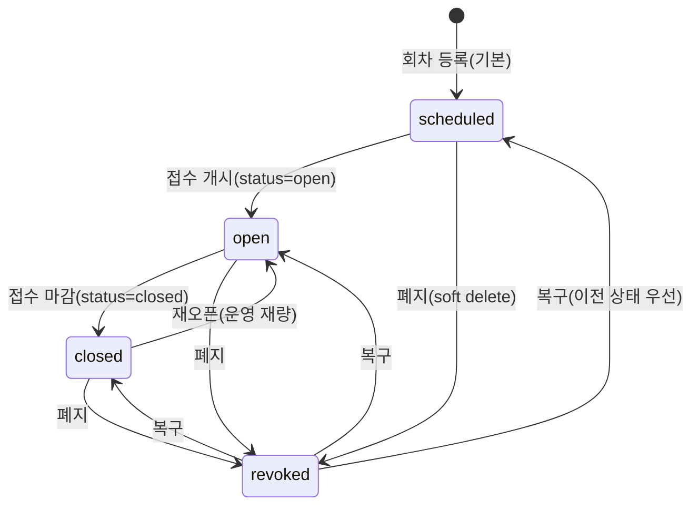

# 시험 관리(회차·시험장) 상세 설계 (BO)

> 근거 기능정의서: `docs/기능정의서/BO/03_시험관리_기능정의서.md` · 화면 ID 접두: `TPKM_BO_3_*`
> 데이터 모델 정본: `docs/기능정의서/DB스키마_초안.md` · API: `docs/기능정의서/REST_API_명세_초안.md`
> 실제 구현: `apps/api/app/routers/admin_api.py`, `apps/api/app/models/exam.py` · 참고 패널: `html/C안/BO(admin)/project/panels/sessions.jsx`, `venues.jsx`

---

## 1. 서비스 개요

| 항목 | 내용 |
| --- | --- |
| 목적 | 시험 **회차**(접수기간·시험일·응시료·정원·시험장 매핑·접수상태) 및 **시험장 마스터**(국가·지역·시험장 코드) 관리. 시험장 코드(2자리)는 **수험번호 13자리 채번의 ④ 시험장코드** 마스터 데이터(0519). |
| 범위 | 회차 CRUD·접수상태 전이·폐지/복구, 시험장 CRUD·활성/비활성. 좌석배치도·시험장 책임자/연락처는 **0526 제외**(비고 텍스트로 운영). |
| 주요 액터 | 조회(readonly): 회차/시험장 목록 조회 / **생성·수정·상태·폐지·복구·시험장 등록/수정: super 전용** |
| 관련 요구사항ID | TPKM_BO_REQ_010, TPKM_BO_REQ_015, TPKM_BO_REQ_016 |

### 페이지(패널) 목록

| 화면명 | 화면 ID | 타입 | BO 패널 | 접근 권한 |
| --- | --- | --- | --- | --- |
| 시험 회차 관리 | `TPKM_BO_3_1_0_0_0_P` | 페이지 | `sessions.jsx` | 조회: 전 등급 |
| 회차 목록 표 | `TPKM_BO_3_1_1_0_0_C` | 컴포넌트 | 〃 | 전 등급 |
| 회차 등록 폼 | `TPKM_BO_3_1_2_0_0_LP` | 레이어 팝업 | 〃 | **super** |
| 회차 수정 | `TPKM_BO_3_1_3_0_0_LP` | 레이어 팝업 | 〃 | **super** |
| 시험장 관리 | `TPKM_BO_3_2_0_0_0_P` | 페이지 | `venues.jsx` | 조회: 전 등급 |
| 시험장 목록 | `TPKM_BO_3_2_1_0_0_C` | 컴포넌트 | 〃 | 전 등급 |
| 시험장 등록·수정 | `TPKM_BO_3_2_2_0_0_LP` | 레이어 팝업 | 〃 | **super** |

---

## 2. 페이지별 상세 설계

### 2.1 시험 회차 관리 — `TPKM_BO_3_1_0~3`

- **개요**: 회차 목록 + 등록/수정 LP. 모든 변경은 `admin_audit_logs` 자동 기록.
- **목록 컬럼(`3_1_1`)**: 회차/접수기간/시험일/발표일/접수자수/상태(예정·접수중·마감)/관리(수정·복제). 정렬: 시험일(또는 round_no) DESC.

#### 2.1.1 회차 등록 — `TPKM_BO_3_1_2`

| 항목 | 내용 |
| --- | --- |
| 액션/트리거 | ‘회차 등록’ 제출 |
| 입력 & 검증 | `round_no`(정수·UNIQUE), `title`, `exam_date`, `registration_start_at`, `registration_end_at`, `fee_level_i`, `fee_level_ii`, `capacity`, `venue_ids[]`(활성 시험장만). **날짜 정합: 접수시작 < 접수마감 < 시험일 < 합격발표일**, `capacity≥1`, `fee>0` |
| 처리 | `exam_rounds` INSERT(`registration_status` 기본 `scheduled`) → `exam_round_venues`에 `venue_ids` 매핑(N:M) |
| 권한 | `require_admin` + `_require_super` → **super** |
| 이력 기록 | ✅ `audit(action_type='exam_round_create', after={round_no})` |
| 연동 API | `POST /api/v1/admin/exam-rounds` |
| 연동 DB | `exam_rounds`, `exam_round_venues` |
| 결과/예외 | `{id}`. `round_no` 중복 → UNIQUE 위반(`409`/`400`). 비활성 시험장 선택 차단(운영 검증 권장) |
| 정합 | 응시료는 `Integer`(MMK), DB초안의 `DECIMAL(12,2)`와 타입 차이(소수점 미사용) |

#### 2.1.2 회차 수정 — `TPKM_BO_3_1_3`

| 항목 | 내용 |
| --- | --- |
| 액션/트리거 | 기존 데이터 로딩 → 수정 → 저장 |
| 입력 & 검증 | 부분 수정(`exclude_unset`): `round_no/title/exam_date/registration_start_at/registration_end_at/fee_level_i/fee_level_ii/capacity/registration_status/exam_number_visible_at/venue_ids`. **폐지(`revoked`) 회차는 수정 불가 → `400`** |
| 처리 | 변경 필드 setattr. `venue_ids` 전달 시 기존 매핑 전체 삭제 후 재삽입 |
| 권한 | super |
| 이력 기록 | ✅ `audit(action_type='exam_round_update', before={title,registration_status}, after=patch diff)` |
| 연동 API | `PATCH /api/v1/admin/exam-rounds/{id}` |
| 연동 DB | `exam_rounds`, `exam_round_venues` |
| 동시성/예외 | **`rev` 컬럼 없음 → 낙관적 잠금 미적용**(기능정의서는 updated_at 비교 권고). 접수자 존재 회차의 시험일/시험장/응시료 변경은 confirm + 이력(서버 가드 추가 권장) |
| 비고 | **`exam_number_visible_at`(0527 수험번호 FO 노출 일시)** 를 본 수정에서 설정 가능 — bo-02 §2.7 노출 시점 연동 |

#### 2.1.3 회차 접수 상태 전이 / 폐지 / 복구

| 액션 | API | 처리 | 권한 | 이력 |
| --- | --- | --- | --- | --- |
| 접수 상태 변경 | `POST /admin/exam-rounds/{id}/status` | `registration_status ∈ {scheduled, open, closed}` 설정(그 외 `400`) | super | `exam_round_status`(before/after) |
| 폐지(soft delete) | `POST /admin/exam-rounds/{id}/revoke` | `registration_status→revoked`(이미 revoked면 `400`) | super | `exam_round_revoke`(이전 상태 보존) |
| 복구 | `POST /admin/exam-rounds/{id}/restore` | revoked→이전 상태(audit의 before 참조, 없으면 `scheduled`) | super | `exam_round_restore` |

> **정합 주의**: DB초안 §3.5 `registration_status`는 `scheduled/open/closed` 3종이나, **실제는 `revoked`(폐지) 포함 4종**(soft-delete를 `is_active` 대신 status로 구현). 회차 모델에 `is_active`·`rev` 컬럼 없음, `result_date`(초안 `result_announcement_date`).

### 2.2 시험장 관리 — `TPKM_BO_3_2_0~2`

- **개요(0519 신규)**: 수험번호 ④ 시험장코드 마스터. 목록 + 등록/수정 LP. 좌석배치도·책임자/연락처 입력 항목 없음(0526) — `memo`에 자유 기재.
- **목록 컬럼(`3_2_1`)**: 시험장 코드(2자리)/명칭(한글·영문)/지역(코드+이름)/정원/활성·비활성/관리. 정렬: `venue_code` ASC(기능정의서: 지역→코드 ASC).

#### 2.2.1 시험장 등록 — `TPKM_BO_3_2_2`(등록)

| 항목 | 내용 |
| --- | --- |
| 액션/트리거 | ‘시험장 등록’ 제출 |
| 입력 & 검증 | `venue_code`(2자리, 01~99, **00 불가**), `name_ko`, `name_en`, `address`, `country_code`(기본 `025`), `region_code`, `capacity`, `memo`. **지역 코드 유효성: `country_region_codes`에 존재해야 함 → 없으면 `400 INVALID_REGION`** |
| 처리 | `exam_venues` INSERT(`is_active` 기본 true) |
| 권한 | super |
| 이력 기록 | ✅ `audit(action_type='exam_venue_create', after={venue_code, region_code})` |
| 연동 API | `POST /api/v1/admin/exam-venues` |
| 연동 DB | `exam_venues`, `country_region_codes`(FK·검증) |
| 결과/예외 | `{id}`. **코드 유니크 범위: (country_code, region_code, venue_code) 복합 UNIQUE — 지역 내 유일**(DB초안의 전역 `UNIQUE(venue_code)`와 차이) |

#### 2.2.2 시험장 수정 — `TPKM_BO_3_2_2`(수정)

| 항목 | 내용 |
| --- | --- |
| 입력 & 검증 | `venue_code/name_ko/name_en/address/region_code/capacity/memo/is_active` 부분 수정. `capacity≥1`, 명칭 길이 검증 |
| 처리 | 변경 필드 setattr. 비활성화 시 진행 중 회차에 사용 중이면 차단(친화 메시지) — 서버 가드 추가 권장 |
| 권한 | super |
| 이력 기록 | ✅ `audit(action_type='exam_venue_update', after=body)` |
| 연동 API | `PATCH /api/v1/admin/exam-venues/{id}` |
| 동시성/예외 | `rev` 없음 → 낙관적 잠금 미적용. **시험장 코드 변경은 원칙적 차단** — 이미 채번된 수험번호와 충돌하므로 신규 코드 대체+마이그레이션 권장(정책 합의) |
| 비고 | DELETE 미제공 — soft delete는 `is_active=false`로 운영 |

### 2.3 지역 코드 마스터 (보조)

| 항목 | 내용 |
| --- | --- |
| 개요 | 국가·지역 코드 마스터 조회(시험장 등록 시 region select·검증). 미얀마=`025`, 양곤=`001` 등 |
| 연동 API | `GET /api/v1/admin/region-codes` |
| 연동 DB | `country_region_codes`(country_code, region_code, name_ko, name_en) |
| 비고 | 국가/지역 코드는 시스템 상수·마스터로 관리(현재 별도 CRUD UI 없음, seed/마이그레이션 관리) |

---

## 3. 핵심 비즈니스 규칙

### 3.1 회차 접수 상태머신

- FO 매핑: `scheduled`=접수예정, `open`=접수중, `closed`=마감(FO STEP1). `revoked`는 FO 비노출.
- soft-delete 원칙: 회차/시험장 hard-delete 금지(접수·채번 이력 보존).

### 3.2 시험장 코드 ↔ 수험번호 채번 정합 (핵심 의존성)

- 시험장 마스터의 `country_code`(①)·`region_code`(②)·`venue_code`(④)가 **수험번호 13자리에 직접 결합**된다(상세: [`bo-02-applications.md`](bo-02-applications.md) §2.7).
- **불변 원칙**: 채번이 1회라도 발생한 회차의 시험장 코드/지역은 변경 금지. 변경 시 기존 수험번호와 불일치 → 시험실 배치·연명부 오류.
- Ⅰ+Ⅱ 동시 접수자는 접수 시점에 동일 `exam_venue_id`(=④ 동일)로 강제되어, 같은 시험장에서 응시.
- 응시자 일련번호(⑤) 채번 단위 = **회차 × 시험장 × 수준**(시험장 단위). 정원·코드 정의가 채번 그룹 경계를 결정.

### 3.3 응시료 스냅샷

- 응시료(`fee_level_i/ii`)는 회차 단위 보관. 접수 시점 금액으로 수납 계산(접수 후 변경 시 기존 접수 금액 영향 정책 합의).

---

## 4. 타 서비스·FO 연동

| 연동 대상 | 연동 내용 | 비고 |
| --- | --- | --- |
| FO 메인/홈 | 활성 회차 노출(히어로/D-Day) | `registration_status=open` |
| FO 시험 접수 STEP1 | 활성 회차·급수·시험장 선택 | `open` 회차만 |
| `bo-02-applications` | 회차 컨텍스트·시험장 select·**채번 ④코드** | 핵심 의존 |
| `bo-02` 수험번호 노출 | 회차 `exam_number_visible_at`(0527) | 회차 수정에서 설정 |
| `bo-04-content` 공지 | 회차 등록·변경 시 자동/수동 공지 | `TPKM_BO_4_1` |
| `bo-06-system` 처리 이력 | 회차/시험장 변경 자동 기록 | `admin_audit_logs` |

---

## 5. 운영 정책 합의 필요 항목

1. **`registration_status` enum 통일**: 초안 3종 vs 구현 4종(`revoked` 포함) 문서화.
2. **회차/시험장 낙관적 잠금**: `rev`(또는 updated_at 비교) 컬럼 추가 — 다중 관리자 동시 편집 충돌 방지(현재 미적용).
3. **시험장 코드 유니크 범위**: 전역 vs 지역 내(현행) 확정 — 채번 ④코드 중복 영향 분석.
4. **시험장 코드 변경/비활성 정책**: 채번 이력 충돌 차단 규칙, 진행 중 회차 사용 시 비활성 차단 가드 구현.
5. **응시료 타입·변경 정책**: Integer(현행) vs Decimal, 접수 후 변경 시 스냅샷 적용 범위.
6. **접수자 존재 회차 변경 가드**(시험일/시험장/응시료) confirm·이력 강제.
7. 정원 초과 정책(대기열/자동 마감), 동일 시험장 Ⅰ·Ⅱ 시간대(오전/오후), 채번 단위(시험장 vs 회차) 최종 확정.
8. 국가/지역 코드 마스터 관리 UI 필요 여부(현재 seed 관리).
