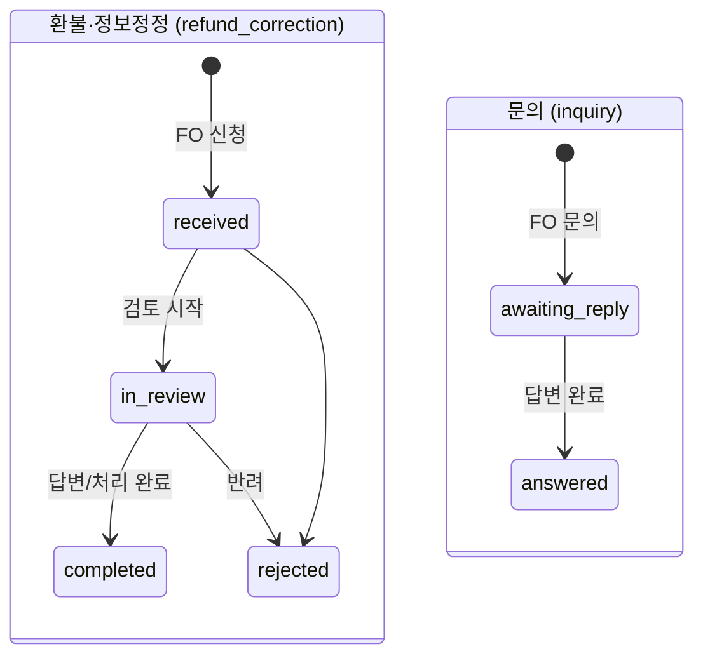

# 콘텐츠 관리(공지·FAQ·환불정정·문의) 상세 설계 (BO)

> 근거 기능정의서: `docs/기능정의서/BO/04_콘텐츠관리_기능정의서.md` · 화면 ID 접두: `TPKM_BO_4_*`
> 데이터 모델 정본: `docs/기능정의서/DB스키마_초안.md` · API: `docs/기능정의서/REST_API_명세_초안.md`
> 실제 구현: `apps/api/app/routers/admin_api.py`, `apps/api/app/models/content.py`, `apps/api/app/models/board.py` · 참고 패널: `notices.jsx`, `faq.jsx`, `refunds.jsx`, `inquiries.jsx`

---

## 1. 서비스 개요

| 항목 | 내용 |
| --- | --- |
| 목적 | FO 노출 콘텐츠 4종 운영: ① 공지사항 ② FAQ ③ 환불·정보정정신청(게시판) ④ 문의게시판. 작성/수정/삭제/답변/상태변경 + 공지 신규 게시 시 마케팅 메일. |
| 범위 | 공지·FAQ는 BO 작성 콘텐츠, 환불·정정/문의는 FO 사용자 작성 글의 답변·상태 관리. **전 게시글(환불·정정) 비밀글** + 문의 비밀글은 관리자 즉시 열람(이력 기록). |
| 주요 액터 | 조회(readonly): 목록·상세 / 작성·수정·삭제·답변·상태변경: admin↑(super·admin). 비밀글 본문 열람: admin↑ |
| 관련 요구사항ID | TPKM_BO_REQ_011~013, TPKM_FO_REQ_002/011/015/017, TPKM_BO_REQ_015 |

### 페이지(패널) 목록

| 화면명 | 화면 ID | 타입 | BO 패널 | 접근 권한 |
| --- | --- | --- | --- | --- |
| 공지사항 관리 | `TPKM_BO_4_1_0_0_0_P` | 페이지 | `notices.jsx` | 조회 전 등급 |
| 공지 작성/수정/삭제/목록 | `4_1_1 LP`/`4_1_2 LP`/`4_1_3 MP`/`4_1_4 C` | — | 〃 | admin↑ |
| FAQ 관리 | `TPKM_BO_4_2_0_0_0_P` | 페이지 | `faq.jsx` | 조회 전 등급 |
| FAQ 등록/수정/삭제/목록 | `4_2_1 LP`/`4_2_2 LP`/`4_2_3 MP`/`4_2_4 C` | — | 〃 | admin↑ |
| 환불·정보정정신청 관리 | `TPKM_BO_4_3_0_0_0_P` | 페이지 | `refunds.jsx` | 조회 전 등급 |
| 환불·정정 목록/상세답변/삭제 | `4_3_1 C`/`4_3_2 LP`/`4_3_3 MP` | — | 〃 | admin↑ |
| 문의게시판 관리 | `TPKM_BO_4_4_0_0_0_P` | 페이지 | `inquiries.jsx` | 조회 전 등급 |
| 문의 목록/상세답변/삭제 | `4_4_1 C`/`4_4_2 LP`/`4_4_3 MP` | — | 〃 | admin↑ |

---

## 2. 페이지별 상세 설계

### 2.1 공지사항 관리 — `TPKM_BO_4_1_*`

- **개요**: 목록 + 작성/수정/삭제. FO 공지(`TPKM_FO_5_1`) 직접 연동. 모든 변경 audit 기록.
- **목록 컬럼(`4_1_4`)**: 번호/제목/카테고리/작성자/작성일/노출/관리. 카테고리: 중요/접수/시험/결과(`important/registration/exam/result`).

#### 2.1.1 공지 작성 — `TPKM_BO_4_1_1`

| 항목 | 내용 |
| --- | --- |
| 액션/트리거 | ‘공지 작성’ 저장 |
| 입력 & 검증 | `category`(필수), `title`(1~80자), `body_html`(sanitize, ~10000자), `is_pinned`, `is_published`, `attachment_file_ids[]`. 다국어 KO 필수(MY/EN 선택) |
| 처리 | `notices` INSERT(`author_admin_id`=현재 관리자, `is_published`면 `published_at=now`) → 보류 첨부(`notice_attachment_pending`)를 `notice` 소유로 확정 |
| 권한 | `require_admin` |
| 이력 기록 | ✅ `audit(action_type='notice_create', after={title, is_published})` |
| 알림 | ❌ 작성 자체로는 자동 발송 안 함 → **마케팅 발송은 별도 액션(2.1.4)** |
| 연동 API | `POST /api/v1/admin/notices` (+ 첨부 업로드 `POST /admin/notices/attachments`) |
| 연동 DB | `notices`, `file_attachments`(owner_type `notice`/`notice_attachment_pending`) |
| 검증(첨부) | 허용 확장자/마임(jpg·png·pdf·doc·xls·ppt·hwp·txt·zip 등), **≤10MB, ≤5개** 초과 → `400` |

#### 2.1.2 공지 수정 — `TPKM_BO_4_1_2`

| 항목 | 내용 |
| --- | --- |
| 입력 & 검증 | `category/title/body_html/is_pinned/is_published`, 첨부 add/remove. `is_published` 최초 true 전환 시 `published_at` 채움 |
| 처리 | 변경 필드 setattr + 첨부 적용 |
| 권한 | `require_admin` |
| 이력 기록 | ✅ `audit('notice_update', after=body)` |
| 알림 | ❌ **수정 시 마케팅 메일 미발송(0527)** |
| 연동 API | `PATCH /api/v1/admin/notices/{id}` |
| 연동 DB | `notices`, `file_attachments` |

#### 2.1.3 공지 삭제 — `TPKM_BO_4_1_3`

| 항목 | 내용 |
| --- | --- |
| 액션/트리거 | 삭제 confirm |
| 처리/합의 | **삭제 API 미구현**. 기능정의서는 soft-delete(보존) 권고 → `is_published=false`(비노출) 또는 `DELETE /admin/notices/{id}`(soft) **신설 필요(합의)** |
| 알림 | ❌ 삭제 시 메일 미발송 |

#### 2.1.4 마케팅수신동의자 이메일 일괄 발송 (0527) ★

| 항목 | 내용 |
| --- | --- |
| 액션/트리거 | 게시된 공지에 대해 ‘마케팅 발송’ |
| 입력 & 검증 | 대상 `notice_id`. **게시(`is_published=true`)된 공지만 발송 → 아니면 `400`** |
| 처리 | `users WHERE status='active' AND marketing_opt_in=true` (id ASC, **배치 상한 500**) 대상 `notice_marketing` 이메일 enqueue(제목·카테고리·게시일·공지 링크) |
| 권한 | `require_admin` |
| 이력 기록 | ✅ `audit('notice_marketing_send', after={queued, notice_title})` |
| 연동 API | `POST /api/v1/admin/notices/{id}/send-marketing` |
| 연동 DB | `users`(marketing_opt_in), `email_outbox`(template_key=`notice_marketing`) |
| 정합 주의 | 기능정의서(0527)는 "신규 게시 시 **자동** 일괄 발송"이나, **실제는 관리자 수동 트리거 별도 엔드포인트**(게시 후 명시적 발송). 자동화 여부·예약 발송·발신자(From)·500건 초과 분할 발송 **합의 필요** |

### 2.2 FAQ 관리 — `TPKM_BO_4_2_*`

- **개요**: 목록 + 등록/수정/삭제. FO FAQ(`TPKM_FO_5_4`) 연동. 분류: 접수/시험/결과/기타. 노출 순서(`sort_order`).
- **다국어**: KO 필수, MY/EN(기능정의서는 동시 필수, 구현은 nullable — 합의).

| 액션 | API | 입력/처리 | 권한 | 이력 |
| --- | --- | --- | --- | --- |
| 등록(`4_2_1`) | `POST /admin/faq` | `category, question_ko, answer_ko, question_my/en, answer_my/en, is_active, sort_order` | admin | `faq_create` |
| 수정(`4_2_2`) | `PATCH /admin/faq/{id}` | 부분 수정(동일 필드) | admin | `faq_update` |
| 삭제(`4_2_3`) | — | **삭제 API 미구현** → `is_active=false`(비노출) 또는 DELETE 신설 필요(합의) | admin | — |
| 목록(`4_2_4`) | `GET /admin/faq` | `sort_order, id` 정렬 | 전 등급 | — |

- 연동 DB: `faq_items`(category, sort_order, question_*, answer_*, is_active).

### 2.3 환불·정보정정신청 관리 — `TPKM_BO_4_3_*`

- **개요(0519 신규)**: FO 사용자 작성 글(`board_type='refund_correction'`)의 답변·처리 상태 관리. **전 게시글 비밀글** — 관리자 즉시 열람(비밀번호 없음, 열람 시 이력 기록).
- **목록/필터(`4_3_1`)**: 유형(환불/정보정정=`post_type` refund/correction), 처리상태(접수/검토중/처리완료/반려), 답변 유무(전체/답변없음/답변있음), 검색. **비밀글 필터 없음**(전부 비밀글). ‘답변없음’ = `admin_reply` 미등록 → 사이드바 배지(`received`) 연동.

#### 2.3.1 목록 조회

| 항목 | 내용 |
| --- | --- |
| 액션/트리거 | 패널 진입/필터/검색/페이지 |
| 처리 | `board_posts WHERE board_type='refund_correction'` + `users` 조인, `created_at DESC` |
| 권한 | `require_any_admin` |
| 연동 API | `GET /api/v1/admin/board/posts?board_type=refund_correction&page=&page_size=` |
| 연동 DB | `board_posts`, `users` |
| 비고 | 응답 `locked=false`(관리자는 비밀글도 목록·열람 가능). `has_admin_reply` 플래그로 답변 유무 표시 |

#### 2.3.2 상세 + 답변 — `TPKM_BO_4_3_2`

| 항목 | 내용 |
| --- | --- |
| 액션/트리거 | 행 클릭(상세 열람) → 처리 상태 변경 / 답변 작성 / 댓글 |
| 처리(열람) | 본문·첨부·댓글 로드. **비밀글 열람 시 `audit('board_secret_view')` 자동 기록**(계약서 6.2) |
| 처리(상태 변경) | `workflow_status ∈ {received, in_review, completed, rejected}` (그 외 `400`) |
| 처리(답변) | `admin_reply` 저장, `admin_replied_at=now`, `admin_replier_id`=관리자. `mark_complete=true`면 `workflow_status→completed`. **작성자 이메일 통지(`board_reply`)** |
| 처리(댓글, 0526) | 관리자/작성자 댓글·대댓글(`parent_comment_id`). 비밀글 게시물의 댓글은 자동 비밀 처리 |
| 권한 | admin↑ |
| 이력 기록 | ✅ 열람 `board_secret_view` / 상태 `board_workflow`(before·after) / 답변 `board_reply` / 댓글 `board_comment` |
| 연동 API | 상세 `GET /admin/board/posts/{id}` · 상태 `PATCH /admin/board/posts/{id}/workflow` · 답변 `POST /admin/board/posts/{id}/reply` · 댓글 `GET·POST /admin/board/posts/{id}/comments` |
| 연동 DB | `board_posts`, `board_comments`, `file_attachments`, `users`, `email_outbox`, `admin_audit_logs` |
| 정합/합의 | **댓글 작성 시 상대방 이메일 알림은 현재 미구현**(답변 reply만 발송). 0526 "댓글·대댓글 작성 시 상대방 이메일 알림" 적용 필요. 정보정정 → **회원 데이터 직접 반영**은 `bo-05` 회원 정보 수정 연동(전용 ‘직접 반영’ 버튼 미구현) |

#### 2.3.3 삭제 — `TPKM_BO_4_3_3`

| 항목 | 내용 |
| --- | --- |
| 처리 | 게시글 삭제(현재 **hard delete**). audit `board_delete` |
| 권한 | admin↑ |
| 연동 API | `DELETE /api/v1/admin/board/posts/{id}` |
| 합의 | 기능정의서 권고: soft-delete(휴지통) → 30일 후 hard-delete. 현행 즉시 삭제 → soft-delete 도입 합의 |

### 2.4 문의게시판 관리 — `TPKM_BO_4_4_*`

- **개요(0519 신규)**: FO 문의(`board_type='inquiry'`) 답변·완료 처리. 비밀글도 관리자 열람(이력 기록).
- **목록/필터(`4_4_1`)**: 탭(전체/일반/비밀), 카테고리(접수/시험/기타), 상태(답변대기/답변완료=`awaiting_reply/answered`), 검색.

| 액션 | API | 처리 | 권한 | 이력 |
| --- | --- | --- | --- | --- |
| 목록(`4_4_1`) | `GET /admin/board/posts?board_type=inquiry` | user 조인·최신순 | 전 등급 | — |
| 상세 열람(`4_4_2`) | `GET /admin/board/posts/{id}` | 비밀글 열람 시 audit | admin↑ | `board_secret_view` |
| 답변/완료(`4_4_2`) | `POST /admin/board/posts/{id}/reply` | `admin_reply` 저장, `mark_complete`→`workflow_status=answered`, 작성자 이메일(`board_reply`) | admin↑ | `board_reply` |
| 상태 변경 | `PATCH /admin/board/posts/{id}/workflow` | `{awaiting_reply, answered}`(그 외 `400`) | admin↑ | `board_workflow` |
| 댓글(0526) | `POST /admin/board/posts/{id}/comments` | 대댓글, 비밀글은 비밀 처리 | admin↑ | `board_comment` |
| 삭제(`4_4_3`) | `DELETE /admin/board/posts/{id}` | hard delete | admin↑ | `board_delete` |

- 답변 완료 시 작성자 이메일 통지(문자 제외, 0526). 댓글 알림 미구현(2.3.2 동일 합의).

---

## 3. 핵심 비즈니스 규칙 / 상태머신

### 3.1 게시판 워크플로 상태머신

- `reply(mark_complete=true)`: 환불·정정 → `completed`, 문의 → `answered`. 사이드바/대시보드 ‘대기’ 배지는 `received`(환불·정정)·`awaiting_reply`(문의) 기준.

### 3.2 비밀글·열람 감사

- **환불·정정은 전건 비밀글**, 문의는 선택 비밀글. 관리자(admin↑)는 비밀번호 없이 즉시 열람하되, **비밀글 상세 열람마다 `admin_audit_logs(action_type='board_secret_view')` 자동 기록**(개인정보 접근 추적).
- 비밀글 게시물의 댓글·대댓글은 자동 비밀 처리(작성자·관리자만 열람).

### 3.3 콘텐츠 무결성·다국어

- `body_html`/답변 본문 서버 sanitize(script/iframe 차단). 첨부 mime sniffing + 확장자 이중 검증.
- 다국어: KO 필수, MY/EN 미입력 시 KO 폴백. 답변은 FO 사용자 언어로 노출.

---

## 4. 타 서비스·FO 연동

| 연동 대상 | 연동 내용 | 비고 |
| --- | --- | --- |
| FO 공지/FAQ/환불·정정/문의(`TPKM_FO_5_1~5_4`) | 작성·답변·상태 → FO 노출 | 직접 연동 |
| FO 메인 | 최신 공지 5건 미리보기 | `notices` |
| `bo-05-members-terms` | 정보정정 신청 → 회원 정보 수정 | `TPKM_BO_5_1_4` |
| `bo-03-exam` | 회차 변경 시 공지 자동/수동 게시 | `TPKM_BO_3_1` |
| `bo-01-dashboard`/배지 | 환불·정정/문의 대기 집계 | `received`/`awaiting_reply` |
| 이메일(`email_outbox`) | `notice_marketing`·`board_reply`·`board_admin_new_post` | 댓글 알림 미구현 |
| `bo-06-system` | 전 액션 audit | `admin_audit_logs` |

---

## 5. 운영 정책 합의 필요 항목

1. **공지/FAQ 삭제 API**(soft-delete 휴지통) 신설 — 현재 미구현.
2. **마케팅 메일 트리거**: 게시 시 자동 발송(0527 문구) vs 현행 수동 트리거 / 예약 발송 / 발신자(From) / 500건 초과 분할.
3. **게시판 댓글·대댓글 이메일 알림**(상대방 통지, 0526) 구현.
4. **게시글 삭제 정책**: hard delete(현행) → soft-delete + 30일 보존.
5. **정보정정 직접 반영** 버튼(회원 데이터 즉시 갱신) 구현 범위·권한.
6. FAQ 다국어 필수/선택, 답변 공개/비공개 기본값, 답변 SLA·표준 템플릿.
7. 비밀글 본문 열람 권한 등급(super vs admin) 및 열람 이력 보존기간.
