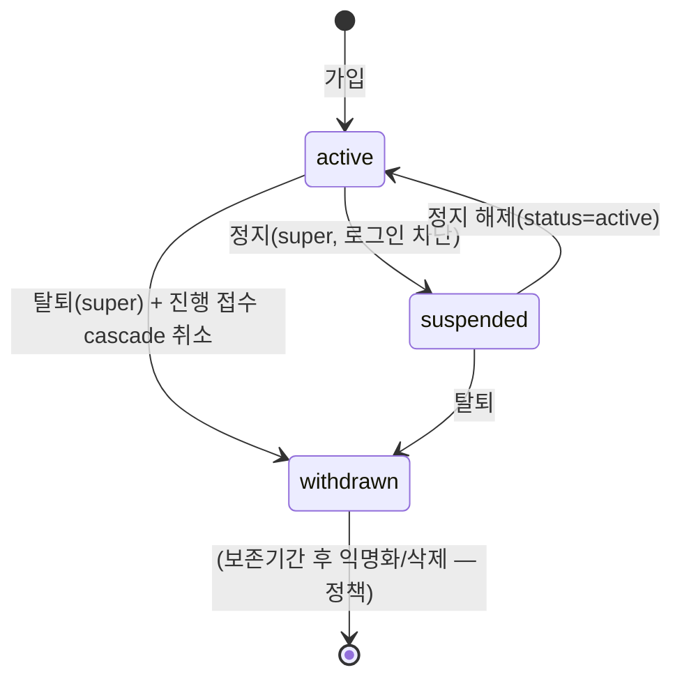
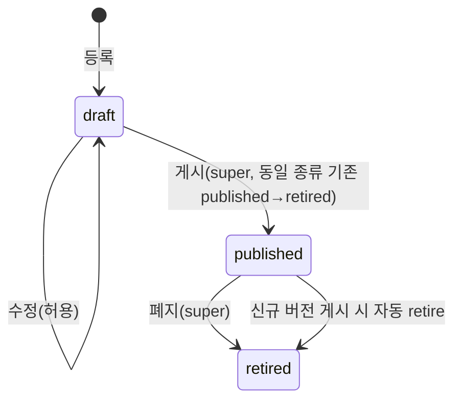

# 회원·약관 관리 상세 설계 (BO)

> 근거 기능정의서: `docs/기능정의서/BO/05_회원약관관리_기능정의서.md` · 화면 ID 접두: `TPKM_BO_5_*`
> 데이터 모델 정본: `docs/기능정의서/DB스키마_초안.md` · API: `docs/기능정의서/REST_API_명세_초안.md`
> 실제 구현: `apps/api/app/routers/admin_api.py`, `apps/api/app/models/user.py`, `apps/api/app/models/content.py` · 참고 패널: `members.jsx`, `terms.jsx`

---

## 1. 서비스 개요

| 항목 | 내용 |
| --- | --- |
| 목적 | 회원 계정 운영(조회·정보수정·정지·탈퇴·비밀번호 초기화·내보내기) 및 약관 버전 관리(등록·수정·게시·폐지·동의 이력). |
| 범위 | `users` 라이프사이클 + `terms`/`terms_consents` 버전·동의 관리. 정보정정신청(`bo-04`) 처리 시 본 화면으로 회원 정보 수정. |
| 주요 액터 | 조회(readonly): 회원/약관 목록·동의 이력 / 정보수정·비밀번호초기화: admin↑ / **정지·탈퇴·약관 게시·폐지: super 전용** |
| 관련 요구사항ID | TPKM_FO_REQ_003~006, TPKM_FO_REQ_004, TPKM_BO_REQ_015 |

### 페이지(패널) 목록

| 화면명 | 화면 ID | 타입 | BO 패널 | 접근 권한 |
| --- | --- | --- | --- | --- |
| 회원 관리 | `TPKM_BO_5_1_0_0_0_P` | 페이지 | `members.jsx` | 조회 전 등급 |
| 회원 필터/검색·그리드 | `5_1_1 C`/`5_1_2 C` | 컴포넌트 | 〃 | 전 등급 |
| 회원 상세 보기 | `5_1_3 LP` | 레이어 팝업 | 〃 | 전 등급 |
| 회원 정보 수정 | `5_1_4 LP` | 레이어 팝업 | 〃 | admin↑ |
| 회원 정지 / 탈퇴 | `5_1_5 MP`/`5_1_6 MP` | 모달 | 〃 | **super** |
| 회원 엑셀/CSV | `5_1_7 C` | 컴포넌트 | 〃 | admin↑ |
| 회원 비밀번호 초기화 | `5_1_8 LP` | 레이어 팝업 | 〃 | admin↑ |
| 약관 관리 | `TPKM_BO_5_2_0_0_0_P` | 페이지 | `terms.jsx` | 조회 전 등급 |
| 약관 버전 목록 | `5_2_1 C` | 컴포넌트 | 〃 | 전 등급 |
| 약관 등록/수정/미리보기 | `5_2_2 LP`/`5_2_3 LP`/`5_2_4 LP` | 레이어 팝업 | 〃 | admin↑(등록·수정) |
| 약관 게시 / 폐지 | `5_2_5 MP`/`5_2_6 MP` | 모달 | 〃 | **super** |
| 약관 동의 이력 | `5_2_7 LP` | 레이어 팝업 | 〃 | 전 등급 |

---

## 2. 페이지별 상세 설계

### 2.1 회원 관리 — 목록/필터/그리드 `TPKM_BO_5_1_0~2`

| 항목 | 내용 |
| --- | --- |
| 개요 | 회원 그리드. 컬럼: 번호/한글성명/영문성명/이메일/연락처/국적/가입일/마지막 로그인/상태/관리 |
| 처리 | `users` 최신순 조회 |
| 권한 | `require_any_admin` |
| 연동 API | `GET /api/v1/admin/users` (현재 **최근 200건, 필터/검색 파라미터 없음**) |
| 연동 DB | `users`(id, email, name_ko/en, phone, nationality, status, marketing_opt_in, created_at, last_login_at) |
| 정합/합의 | 기능정의서 필터(상태/가입일/국적/검색)·페이지네이션 **미구현** → 서버 필터·검색·페이징 추가 필요 |

### 2.2 회원 상세 보기 — `TPKM_BO_5_1_3`

| 항목 | 내용 |
| --- | --- |
| 개요 | 전체 프로필 + 접수 이력 표 + 처리 이력 타임라인 |
| 처리/합의 | **전용 상세 엔드포인트(`GET /admin/users/{id}`) 미구현**. 접수 이력은 `GET /admin/applications?...`(user 기준 필터 필요), 처리 이력은 `GET /admin/audit-logs`(target_type='users') 조합. 통합 상세 API 신설 권장 |
| 연동 DB | `users`, `applications`, `admin_audit_logs` |

### 2.3 회원 정보 수정 — `TPKM_BO_5_1_4`

| 항목 | 내용 |
| --- | --- |
| 액션/트리거 | 정보 수정 저장(정보정정신청 처리 포함) |
| 입력 & 검증 | `name_ko/name_en/email/phone/nationality/marketing_opt_in`, `rev`(필수). `status`는 본 화면 외 정지/탈퇴와 동일 엔드포인트 |
| 처리 | `rev` 검증 → 변경 필드 setattr + `rev+1`. 변경 필드 diff 산출 |
| 권한 | `require_admin`(※ 기능정의서는 super 권고 — 합의) |
| 이력 기록 | ✅ `audit('user_update', before={status,email}, after=diff)` |
| 알림 | ✅ 비(非)상태 변경 시 `member_info_changed`(변경 필드·diff·처리자) 통지 |
| 연동 API | `PATCH /api/v1/admin/users/{id}` |
| 연동 DB | `users` |
| 동시성/예외 | `rev` 불일치 → `409 CONFLICT`. 신원정보(이름/생년월일/사진) 수정 시 사유·diff 기록(사유 입력 강제는 합의) |

### 2.4 회원 정지 / 탈퇴 — `TPKM_BO_5_1_5 / 5_1_6`

| 항목 | 정지(suspended) | 탈퇴(withdrawn) |
| --- | --- | --- |
| 액션/트리거 | 정지 confirm(사유) | 탈퇴 confirm(사유) |
| 입력 & 검증 | `status='suspended'`, `rev` | `status='withdrawn'`, `rev` |
| 처리 | 상태 전이 + 로그인 차단(다음 요청 `status<>'active'` 거부) | 상태 전이 + `withdrawn_at=now` + **진행 중(미취소) `application_submissions`·`applications` 자동 취소 cascade**(`status=cancelled`, `cancel_reason='관리자 회원 탈퇴'`) |
| 권한 | **`_require_super`** | **`_require_super`** |
| 이력 기록 | ✅ `audit('user_update', before/after)` | ✅ `audit('user_update')` + 접수 취소 cascade |
| 알림 | ✅ `account_status`(정지) | ✅ `account_status`(탈퇴) |
| 연동 API | `PATCH /api/v1/admin/users/{id}` (status) | `PATCH /api/v1/admin/users/{id}` (status) |
| 연동 DB | `users.status` | `users.status/withdrawn_at`, `applications`, `application_submissions` |
| 정합/합의 | **별도 정지/탈퇴 엔드포인트 없음**(status PATCH로 통합). 정지/탈퇴 **사유 텍스트 저장 컬럼 미사용**(cascade reason만 고정) → 사유 저장·세션 즉시 무효화 보강 합의. 탈퇴 시 개인정보 익명화/보존(30일 등) 정책 합의 |

> **탈퇴 안내(0526)**: 모달에서 "탈퇴 처리 시 진행 중인 접수 내역이 모두 취소됩니다." + 진행 중 접수 목록(회차·급수·상태) 표시 후 확정.

### 2.5 회원 엑셀/CSV — `TPKM_BO_5_1_7`

| 항목 | 내용 |
| --- | --- |
| 처리/합의 | **회원 CSV/엑셀 내보내기 API 미구현**(약관 동의 이력 CSV는 별도 존재). 신설 시 개인정보 마스킹(이메일/연락처 일부) 적용, **여권번호 미수집(N/A)** |
| 연동 DB | `users` |

### 2.6 회원 비밀번호 초기화 — `TPKM_BO_5_1_8`

| 항목 | 내용 |
| --- | --- |
| 액션/트리거 | 비밀번호 초기화 |
| 처리 | 임시 비밀번호(`tpkm`+8자 난수) 발급·해시 저장, `password_changed_at=NULL` |
| 권한 | `require_admin` |
| 이력 기록 | ✅ `audit('user_reset_password', memo=이메일)` |
| 알림 | ✅ `temp_password`(임시 비밀번호·로그인 링크) |
| 연동 API | `POST /api/v1/admin/users/{id}/reset-password` |
| 연동 DB | `users.password_hash/password_changed_at`, `email_outbox` |
| 정합/합의 | 기능정의서 "첫 로그인 시 변경 강제" — 회원(`users`)에는 `must_change_password` 플래그가 없어 **다음 로그인 강제 변경 미구현**(관리자 계정만 강제 플래그 보유). 토큰 1회용/24h 만료 정책 합의 |

### 2.7 약관 관리 — 버전 목록/등록/수정/미리보기 `TPKM_BO_5_2_0~4`

- **개요**: 약관 종류 `service`(이용)/`privacy`(개인정보)/`marketing`(마케팅) 버전 관리. 상태 `draft/published/retired`. `UNIQUE(term_type, version)`.
- **버전 목록(`5_2_1`)**: 약관 종류/버전/게시일/폐지일/상태/관리. `GET /admin/terms`.

| 액션 | API | 입력/처리 | 권한 | 이력 |
| --- | --- | --- | --- | --- |
| 등록(`5_2_2`) | `POST /admin/terms` | `term_type/version/title/body_ko/my/en/effective_at` → `status=draft` | admin↑ | `term_create` |
| 수정(`5_2_3`) | `PATCH /admin/terms/{id}` | **`status='draft'`일 때만 수정 가능, 아니면 `400`** | admin↑ | `term_update` |
| 미리보기(`5_2_4`) | `GET /admin/terms/{id}` | 본문 로드 후 FO 형태 렌더(전용 endpoint 없음) | 전 등급 | — |

- 정합/합의: 기능정의서는 등록·수정·게시·폐지를 super 권고. 구현은 **등록/수정 admin 허용**, 게시/폐지만 super. 다국어 KO 필수.

### 2.8 약관 게시 / 폐지 — `TPKM_BO_5_2_5 / 5_2_6`

| 항목 | 게시(publish) | 폐지(retire) |
| --- | --- | --- |
| 액션/트리거 | 게시 confirm(즉시/예약) | 폐지 confirm |
| 처리 | **동일 `term_type`의 기존 `published`를 `retired`로 자동 전환** 후 대상 `status=published`, `published_at=now` | `status='published'`만 가능(아니면 `400`) → `status=retired` |
| 권한 | **`_require_super`** | **`_require_super`** |
| 이력 기록 | ✅ `term_publish` | ✅ `term_retire` |
| 연동 API | `POST /admin/terms/{id}/publish` | `POST /admin/terms/{id}/retire` |
| 연동 DB | `terms.status/published_at` | `terms.status` |
| 정합/합의 | **예약 게시(effective_at 기준 자동 게시) 미구현**(즉시 게시만). 게시 후 본문 수정 차단(=신규 버전). **회원 강제 재동의 흐름 미구현** → 게시 시 옵션(즉시/다음 로그인 재동의) 합의 |

### 2.9 약관 동의 이력 — `TPKM_BO_5_2_7`

| 항목 | 내용 |
| --- | --- |
| 개요 | 회원·버전별 동의 시점·IP·동의 여부 조회 + CSV 내보내기(감사 자료) |
| 입력 & 검증 | 필터: `term_type`, `user_id`, `date_from`, `date_to`, `format=csv`, `page/page_size` |
| 처리 | `terms_consents` 조회(`created_at DESC`) + `users` 조인(이메일/성명). `format=csv` 시 UTF-8-SIG CSV 스트리밍 |
| 권한 | `require_any_admin`(조회) |
| 이력 기록 | ❌(조회). CSV 내보내기 audit는 합의(현재 미기록) |
| 연동 API | `GET /api/v1/admin/terms/consents` |
| 연동 DB | `terms_consents`(user_id, term_id, term_type, version, agreed, ip_address, created_at), `users` |
| 정합 | DB초안 명칭은 `term_agreements`(컬럼 `agreed_at`, `user_agent`)이나 **실제 테이블은 `terms_consents`**(`created_at`, `user_agent` 없음, `term_type/version` 비정규화 포함). 동의 방식(체크박스/전체동의) 미저장 |

---

## 3. 핵심 비즈니스 규칙 / 상태머신

### 3.1 회원 상태머신

- 비활성(suspended/withdrawn) 계정은 로그인·토큰 갱신 시 `status='active'` 조건에서 제외되어 차단.

### 3.2 약관 버전 상태머신

- **불변식**: 동일 `term_type`에 `published`는 최대 1건. 게시 후 본문 변경 금지(신규 버전으로). 폐지 후 동의 이력은 영구 보존(감사).

### 3.3 개인정보·감사

- 그리드/CSV 연락처·이메일 마스킹(합의). **여권번호 미수집**(`passport_no` 레거시·미사용). 사진 원본은 비공개 스토리지 + 서명 URL(만료 10분).
- 회원 정보 수정/정지/탈퇴/비밀번호 초기화, 약관 등록/수정/게시/폐지 전부 `admin_audit_logs` 기록(diff 포함).

---

## 4. 타 서비스·FO 연동

| 연동 대상 | 연동 내용 | 비고 |
| --- | --- | --- |
| FO 회원가입(`TPKM_FO_6_2_*`) | 가입 데이터·약관 동의 원천 | `terms_consents` |
| FO 로그인/내정보(`TPKM_FO_6_1/6_3`) | 정보·사진 변경 동기 | `users` |
| `bo-04-content` 환불·정정 | 정보정정 신청 → 회원 정보 수정 | `TPKM_BO_5_1_4` |
| `bo-02-applications` | 회원 탈퇴 시 접수 자동 취소 cascade·회원 정보 동기 | `applications` |
| 이메일(`email_outbox`) | `member_info_changed`·`account_status`·`temp_password` | 정지/탈퇴/수정 통지 |
| `bo-06-system` | 전 액션 audit | `admin_audit_logs` |

---

## 5. 운영 정책 합의 필요 항목

1. **회원 목록 필터·검색·페이지네이션** 서버 구현(현재 200건 무필터).
2. **회원 상세 통합 API**(`GET /admin/users/{id}` + 접수/처리 이력) 신설.
3. **회원 CSV/엑셀 내보내기** 신설 + 마스킹 기본값.
4. **정지/탈퇴 사유 저장**·활성 세션 즉시 무효화·탈퇴 데이터 보존(익명화 30일/법정 보존) 정책.
5. **회원 비밀번호 초기화 후 강제 변경**(users `must_change_password` 도입)·토큰 만료 정책.
6. **약관 예약 게시(effective_at 자동)·강제 재동의** 흐름 구현.
7. **`terms_consents` ↔ `term_agreements`** 명칭/컬럼(동의 방식·user_agent) 정합.
8. 회원 정보 수정·약관 등록/수정 권한 등급(super vs admin) 확정.
