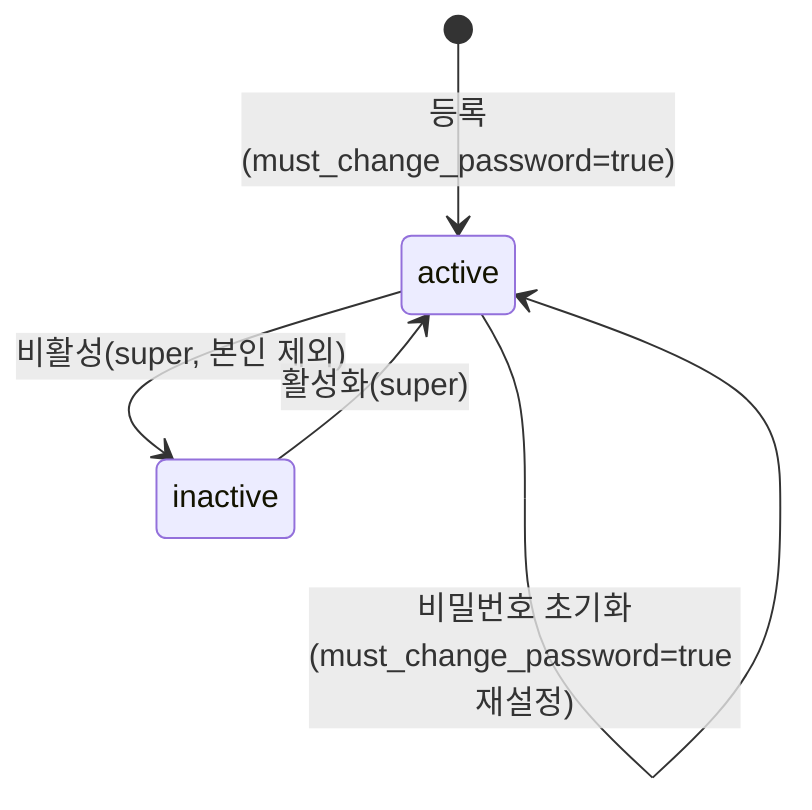

# 시스템(관리자 계정·권한·처리 이력) 상세 설계 (BO)

> 근거 기능정의서: `docs/기능정의서/BO/06_시스템_관리자계정·처리이력_기능정의서.md` · 화면 ID 접두: `TPKM_BO_6_*`
> 데이터 모델 정본: `docs/기능정의서/DB스키마_초안.md` · API: `docs/기능정의서/REST_API_명세_초안.md`
> 실제 구현: `apps/api/app/routers/admin_api.py`, `apps/api/app/lib/deps.py`, `apps/api/app/lib/audit.py`, `apps/api/app/models/admin.py` · 참고 패널: `admins.jsx`, `permissions.jsx`, `audit.jsx`

---

## 1. 서비스 개요

| 항목 | 내용 |
| --- | --- |
| 목적 | 다중 관리자 계정 운영(등록·수정·비밀번호 초기화·비활성), 권한 등급 매트릭스 조회, 전 BO 액션의 처리 이력(감사 로그) 조회, 사이트 보기·로그아웃. |
| 범위 | `admin_users` CRUD·RBAC, `admin_audit_logs` 조회. **여러 명이 별도 아이디로 동시 접속**(0519) 전제. |
| 주요 액터 | **관리자 계정 관리·권한 관리: super 전용** / 처리 이력: 전 등급(현행) — 기능정의서는 admin/readonly 본인 이력만 |
| 관련 요구사항ID | TPKM_BO_REQ_007, TPKM_BO_REQ_014, TPKM_BO_REQ_015 |

### 페이지(패널) 목록

| 화면명 | 화면 ID | 타입 | BO 패널 | 접근 권한 |
| --- | --- | --- | --- | --- |
| 관리자 계정 관리 | `TPKM_BO_6_1_0_0_0_P` | 페이지 | `admins.jsx` | **super** |
| 계정 목록/등록/수정/비번초기화/비활성 | `6_1_1 C`/`6_1_2 LP`/`6_1_3 LP`/`6_1_4 MP`/`6_1_5 MP` | — | 〃 | **super** |
| 관리자 권한 관리 | `TPKM_BO_6_5_0_0_0_P` | 페이지 | `permissions.jsx` | **super** |
| 권한 매트릭스 | `6_5_1 C` | 컴포넌트 | 〃 | **super** |
| 관리자 처리 이력 | `TPKM_BO_6_2_0_0_0_P` | 페이지 | `audit.jsx` | 전 등급(현행) |
| 처리 이력 필터/그리드/상세/CSV | `6_2_1 C`/`6_2_2 C`/`6_2_3 LP`/`6_2_4 C` | — | 〃 | 전 등급 |
| 사이트 보기(FO 새 창) | `TPKM_BO_6_3_0_0_0_L` | 외부 링크 | 사이드바 | 전 등급 |
| 관리자 로그아웃 | `TPKM_BO_6_4_0_0_0_L` | 외부 링크 | 사이드바 | 전 등급 |

---

## 2. 페이지별 상세 설계

### 2.1 관리자 계정 관리 — `TPKM_BO_6_1_*`

- **개요(0519)**: 다중·동시 접속 관리자 계정 관리. **super 전용**. 목록 컬럼: 아이디(이메일)/이름/이메일/권한등급/마지막 로그인/마지막 IP/상태(활성·비활성)/관리.

#### 2.1.1 계정 목록 / 등록 / 수정

| 액션 | API | 입력 & 검증 | 처리 | 이력 |
| --- | --- | --- | --- | --- |
| 목록(`6_1_1`) | `GET /admin/admin-users` | — | `admin_users` 전체(id ASC) | — |
| 등록(`6_1_2`) | `POST /admin/admin-users` | `email`(UNIQUE, 중복 시 `409 DUPLICATE`), `password`, `name`, `role`, `status='active'` | 해시 저장, `role` 정규화, **`must_change_password=true`**(첫 로그인 변경 강제) | `admin_create` |
| 수정(`6_1_3`) | `PATCH /admin/admin-users/{id}` | `name/email/role/status` 부분 수정. **본인 계정 `status='inactive'` 차단 → `400`** | setattr, `role` 정규화, email lower | `admin_update` |

- 권한: 전부 `_require_super`. 검증: 아이디(이메일) 형식·UNIQUE, 초기 비밀번호 정책(8자+영숫자), 권한 등급 3종.
- 권한 등급(정규화): 입력 `super`/`admin`(=일반/standard/general)/`readonly`(=조회/viewer). `_normalize_admin_role()`이 별칭을 표준값으로 매핑.

#### 2.1.2 비밀번호 초기화 — `TPKM_BO_6_1_4`

| 항목 | 내용 |
| --- | --- |
| 처리 | 임시 비밀번호(`tpkm`+8자) 발급·해시 저장, **`must_change_password=true`** → 첫 로그인 시 변경 강제(`bo-00` §2.1.1) |
| 권한 | 본인 외 대상은 `_require_super`(본인 초기화는 허용) |
| 이력 기록 | ✅ `admin_reset_password(memo=이메일)` |
| 알림 | ✅ `temp_password_admin`(BO 로그인 링크·임시 비밀번호) |
| 연동 API | `POST /api/v1/admin/admin-users/{id}/reset-password` |
| 연동 DB | `admin_users.password_hash/must_change_password`, `email_outbox` |

#### 2.1.3 계정 비활성 — `TPKM_BO_6_1_5`

| 항목 | 내용 |
| --- | --- |
| 처리 | `status='inactive'`(비활성)/`'active'`(해제) 토글. **본인 비활성 차단**(`400`). 비활성 계정은 로그인·토큰 갱신에서 `status='active'` 조건으로 제외 → 즉시 접근 차단 |
| 권한 | `_require_super` |
| 이력 기록 | ✅ `admin_update` |
| 연동 API | `PATCH /api/v1/admin/admin-users/{id}` (`status=inactive`) |
| 정합/합의 | 사유 입력·활성 세션 즉시 무효화는 무상태 JWT 한계로 부분 적용(다음 요청 차단). 사유 저장·계정 hard-delete 미제공(비활성으로 운영) |

### 2.2 관리자 권한 관리 / 매트릭스 — `TPKM_BO_6_5_*`

- **개요**: 권한 등급 정의 및 메뉴·기능별 접근 매트릭스 조회. **super 전용**. 1차 3등급 고정(최고/일반/조회).
- **권한 등급(1차 고정)**:
  - **최고(super)**: 전 메뉴 + 모든 액션 + 계정/권한 관리.
  - **일반(admin)**: 접수·콘텐츠 액션 + 회원 조회/정보수정(정지·탈퇴·약관 게시·수험번호 부여·회차/시험장·계정관리 제외).
  - **조회(readonly)**: 전 메뉴 read-only(GET).

| 항목 | 내용 |
| --- | --- |
| 처리/합의 | **권한 매트릭스 CRUD/조회 전용 API 없음**. RBAC는 **코드 하드코딩**(`require_any_admin`/`require_admin`/`require_super` + 라우터 내 `_require_super`)으로 강제. `permissions.jsx`는 고정 매트릭스 표시 프로토타입 |
| 권한 | super(패널 접근) |
| 비고 | 세밀한 DB 기반 RBAC(역할·메뉴별 커스터마이징)는 향후 확장. 매트릭스 변경 이력 기록 대상(현재 변경 기능 없음) |

> **RBAC 매트릭스 정본**: [`bo-00-common.md`](bo-00-common.md) §3.2 참조(super/admin/readonly별 액션 강제 위치).

### 2.3 관리자 처리 이력 — `TPKM_BO_6_2_*`

- **개요(0519)**: 전 BO 액션의 감사 로그. 정렬 시각 DESC. **append-only**(수정·삭제 불가).
- **이력 데이터 스키마(실제 `admin_audit_logs`)**:

| 컬럼 | 타입 | 설명 |
| --- | --- | --- |
| `id` | BIGSERIAL | PK |
| `admin_user_id` | BIGINT FK | 처리자(`admin_users`, SET NULL) |
| `action_type` | VARCHAR(50) | 액션(아래 카탈로그) |
| `target_type` | VARCHAR(50) | 대상 테이블(`applications`/`exam_rounds`/`notices`/`users`/`terms`/`board_posts`/`admin_users`/`faq`…) |
| `target_id` | VARCHAR(50) | 대상 ID(문자열) |
| `before_data` | JSONB | 이전 값 |
| `after_data` | JSONB | 이후 값 |
| `memo` | TEXT | 메모/사유 |
| `ip_address` | VARCHAR(45) | 처리 IP |
| `created_at` | TIMESTAMPTZ | 처리 시각 |

> **정합 주의**: DB초안 §4.10은 `action`·`status_before`·`status_after`·`payload`·`target_table`로 명명. **실제는 `action_type`·`before_data`·`after_data`·`target_type`**. 인덱스(`target_type,target_id`/`created_at DESC`/`admin_user_id`) 권고.

#### 2.3.1 조회 / 필터 / 상세 / CSV

| 항목 | 내용 |
| --- | --- |
| 액션/트리거 | 패널 진입(`6_2_1` 필터, `6_2_2` 그리드, `6_2_3` 상세 diff, `6_2_4` CSV) |
| 처리 | `admin_audit_logs` 최신순 + 처리자(`admin_users`) 이메일 조인 |
| 권한 | `require_any_admin`(현행 전 등급, 전체 열람) |
| 이력 기록 | ❌(조회 전용) |
| 연동 API | `GET /api/v1/admin/audit-logs` (현재 **최근 200건, 필터 없음**) |
| 연동 DB | `admin_audit_logs`, `admin_users` |
| 상세(`6_2_3`) | 응답에 `before_data`/`after_data` JSON 포함 → 클라이언트 diff 렌더(전용 상세 endpoint 불필요) |
| 정합/합의 | 기능정의서 요구 **미구현 항목**: ① 필터(처리자/기간/유형/액션/대상ID), ② **CSV 내보내기(`6_2_4`, super 전용)**, ③ **가시성 RBAC**(admin/readonly는 본인 이력만), ④ 페이징/커서. → 신설 필요 |

#### 2.3.2 자동 기록 대상 — `action_type` 카탈로그(전 서비스)

| 영역 | action_type |
| --- | --- |
| 인증 | `login`, `logout`, `admin_change_password` |
| 접수(bo-02) | `photo_review_approve`, `photo_review_reject`, `payment_complete`, `payment_cancel`, `approve`, `reject`, `exam_number_assign`, `roster_export`, `photos_export` |
| 시험(bo-03) | `exam_round_create/update/status/revoke/restore`, `exam_venue_create/update` |
| 콘텐츠(bo-04) | `notice_create/update`, `notice_marketing_send`, `faq_create/update`, `board_secret_view`, `board_workflow`, `board_reply`, `board_comment`, `board_delete` |
| 회원·약관(bo-05) | `user_update`, `user_reset_password`, `term_create/update/publish/retire` |
| 시스템(bo-06) | `admin_create`, `admin_update`, `admin_reset_password` |

### 2.4 사이트 보기 — `TPKM_BO_6_3_0_0_0_L`

- FO 메인을 새 창(`target=_blank` + `rel=noopener`). 콘텐츠 검수용. 서버 액션 없음(클라이언트 링크). 로그인 세션 분리 권장.

### 2.5 로그아웃 — `TPKM_BO_6_4_0_0_0_L`

- `POST /api/v1/auth/logout` → 관리자 audit `logout` 기록 후 클라이언트 토큰 폐기·`admin-login.html` 이동. 상세는 [`bo-00-common.md`](bo-00-common.md) §2.2.

---

## 3. 핵심 비즈니스 규칙

### 3.1 관리자 계정 상태머신

### 3.2 보안·동시성·감사 원칙

- **비밀번호**: bcrypt 해시. 로그인 5회 실패 → 30분 잠금(계정 단위, `bo-00` §2.1). 첫 로그인/초기화 후 변경 강제(`must_change_password`).
- **자기 보호**: 본인 계정 비활성 차단. (본인 삭제 차단 — hard-delete 미제공.)
- **동시 작업**: 다중 관리자 동시 접속 전제. 접수 수납/심사 등은 행 단위 낙관적 잠금(`applications.rev`) → `409`(`bo-00` §3.3, `bo-02` §3.3).
- **감사 무결성**: `admin_audit_logs`는 append-only(수정·삭제 금지). 보존 기간 최소 3년 권고. 큰 본문(공지/FAQ)은 diff 요약 또는 별도 archive 권장.
- **권한 검증**: 모든 변경 API 서버측 강제(클라이언트 메뉴 숨김만으로 보호 금지).

---

## 4. 타 서비스·FO 연동

| 연동 대상 | 연동 내용 | 비고 |
| --- | --- | --- |
| `bo-00-common` 인증/사이드바 | 계정 검증·등급별 메뉴 노출·로그인/로그아웃 audit | RBAC 정본 §3.2 |
| `bo-02~05` 전 액션 | 상태 변경 시 `admin_audit_logs` 자동 기록 | action_type 카탈로그 §2.3.2 |
| 이메일(`email_outbox`) | 관리자 임시 비밀번호 `temp_password_admin` | 계정 등록·초기화 |
| FO | 사이트 보기(새 창) | 콘텐츠 검수 |

---

## 5. 운영 정책 합의 필요 항목

1. **처리 이력 필터·CSV 내보내기·가시성 RBAC**(본인 이력만) 구현 — 현재 무필터 200건 전체 열람.
2. **처리 이력 보존 기간**(3년/5년) 및 append-only 보장(트리거/권한).
3. **권한 매트릭스 DB화** 여부(현재 코드 하드코딩 3등급 고정) — 세밀 RBAC 확장 시점.
4. **관리자 계정 상태값**(active/inactive) ↔ 기능정의서(활성/비활성) 표기 통일, 비활성 사유 저장.
5. **무상태 JWT 강제 로그아웃/세션 즉시 무효화**(비활성·권한 변경 즉시 반영) 방식.
6. 관리자 비밀번호 정책(주기 변경 강제), 2FA·IP 화이트리스트 도입 시점.
7. 마지막 로그인 IP 표기(목록 컬럼) 데이터 소스(현재 `last_login_at`만, IP 별도 저장 필요).
