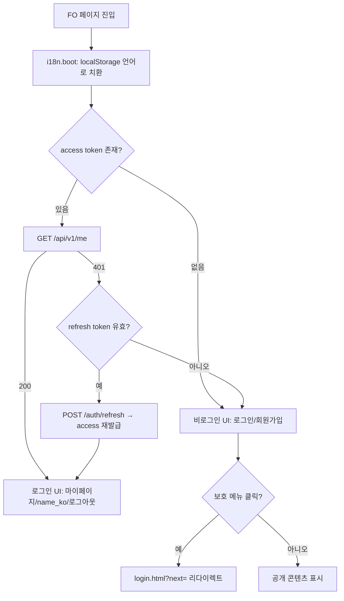

# 공통(GNB·푸터·언어전환·모바일메뉴·로그인 가드) 상세 설계 (FO)

> 근거 기능정의서: `docs/기능정의서/FO/00_공통_GNB·푸터·언어전환·모바일메뉴_기능정의서.md` · 화면 ID 접두: `TPKM_FO_0_*`
> 데이터 모델 정본: `docs/기능정의서/DB스키마_초안.md` · API 정합: `apps/api/app/routers/*.py` (mount prefix `/api/v1`)

---

## 0. 표기 규약 (7개 FO 설계 문서 공통)

| 표기 | 의미 |
| --- | --- |
| API 경로 | **실제 구현 라우터 기준**(`/api/v1/...`). REST 초안과 다른 경우 실제 경로를 우선하고 차이는 §5에 기록. |
| DB 명칭 | **`DB스키마_초안.md`(정본)** 기준. 실제 모델(`apps/api/app/models/*`)과 컬럼명이 다른 경우 `정본 ↔ 구현` 병기. |
| 폐기(0527) / 변경(0526) | 고객사 0519·0526·0527 수정으로 폐기·변경된 흐름 명시. |
| (합의 필요) | 정본/구현에 확정값이 없어 운영 합의가 필요한 항목. |

화면 ID 체계: `TPKM_{FO|BO}_{Depth…}_{타입}` — 타입 약어 `P`=Page, `S`=Section/Tab, `C`=Component, `LP`=Layer Popup, `MP`=Modal Popup, `L`=External Link.

---

## 1. 서비스 개요

- **목적**: FO 전 페이지에 공통으로 렌더링되는 글로벌 내비게이션(GNB)·푸터·언어 전환·모바일 메뉴·로그인 가드를 정의한다. 개별 페이지가 아닌 **레이아웃·접근제어 인프라**이며, 다른 6개 FO 서비스가 모두 본 컴포넌트 위에서 동작한다.
- **범위**: 헤더(GNB), 4대 메인 메뉴 + 2Depth, 인증 상태별 우측 액션, 언어 전환 토글(KO/MY/EN), 모바일 햄버거/드로어, 로그인 필수 가드(`auth-guard.js`), 푸터.
- **주요 액터**:
  - 비로그인 방문자 — 공개 메뉴 열람, 보호 메뉴 접근 시 로그인 페이지로 유도.
  - 로그인 회원(`users.status='active'`) — 전체 메뉴 + 마이페이지/로그아웃.
- **관련 요구사항ID**: `TPKM_FO_REQ_001`, `TPKM_FO_REQ_002`, `TPKM_FO_REQ_006`, `TPKM_FO_REQ_017`, `TPKM_FO_REQ_019`, `TPKM_FO_REQ_020`
- **4대 메인 메뉴(0519 재정의)**: ① TOPIK 안내 ② TOPIK 규정 ③ TOPIK 접수 ④ 게시판
- **로그인 필수 메뉴(0527 반영)**: 시험 접수 · 접수 확인 · 환불·정보정정신청 · 문의게시판
  - **수험표 출력은 0527 변경으로 로그인 가드 대상에서 제외**(폐기(0527)). 비로그인 접근 허용.

### 1.1 페이지/컴포넌트 목록

| 화면명 | 화면 ID | 타입 | 적용 위치 | 접근 권한 |
| --- | --- | --- | --- | --- |
| 공통 · GNB(헤더) | `TPKM_FO_0_1_0_0_0_C` | Component | 전 FO 페이지 `<header>` | 비로그인+로그인 |
| 공통 · 언어 전환(KO/MY/EN) | `TPKM_FO_0_1_1_0_0_C` | Component | GNB 우측 상단 | 비로그인+로그인 |
| 공통 · 모바일 햄버거 메뉴 | `TPKM_FO_0_1_2_0_0_C` | Component | ≤768px | 비로그인+로그인 |
| 공통 · 로그인 필수 가드 | `TPKM_FO_0_1_3_0_0_C` | Component | 보호 메뉴 라우팅 | 비로그인 |
| 공통 · 푸터 | `TPKM_FO_0_2_0_0_0_C` | Component | 전 FO 페이지 `<footer>` | 비로그인+로그인 |

> HTML 파일: 별도 페이지 없이 각 FO HTML(`html/C안/FO/*.html`)의 `<header>`/`<footer>` 및 공통 JS(`i18n.js`, `auth-guard.js`, 모바일 메뉴 스크립트)로 주입.

---

## 2. 페이지별 상세 설계

### 2.1 공통 GNB(헤더) — `TPKM_FO_0_1_0_0_0_C`

- **개요/진입**: 모든 FO 페이지 상단 고정. 좌측 로고(→ `index.html`), 중앙 4대 메뉴(+2Depth 드롭다운/메가메뉴), 우측 인증 액션 + 언어 토글.
- **접근 권한**: 전 사용자. 우측 액션 영역만 인증 상태로 분기.
- **2Depth 구성(라우팅 맵)**:

| 1Depth | 2Depth | 진입 화면 ID | HTML |
| --- | --- | --- | --- |
| TOPIK 안내 | 시험 개요 / 시험 소개 / 문항 구성 / 평가 기준 | `TPKM_FO_2_1`~`2_4` | guide-overview/intro/questions/evaluation.html |
| TOPIK 규정 | 유의 사항 / 답안 작성 요령 / 응시료 규정 / 신분증 규정 | `TPKM_FO_3_1`~`3_4` | rules-notice/answer/fee/id.html |
| TOPIK 접수 | 접수 방법 / 시험 접수🔒 / 접수 확인🔒 / 수험표 출력 | `TPKM_FO_4_1`~`4_4` | apply-howto/register/mypage/ticket.html |
| 게시판 | 공지사항 / 환불·정보정정신청🔒 / 문의게시판🔒 / FAQ | `TPKM_FO_5_1`~`5_4` | notice/refund-correction/qna/faq.html |

> 🔒 = 로그인 필수 메뉴(가드 적용). 수험표 출력(ticket.html)은 0527부터 🔒 제거.

**액션 상세**

| 액션/트리거 | 입력 & 검증 | 처리(비즈니스 규칙) | 연동 API | 연동 DB | 결과/예외 |
| --- | --- | --- | --- | --- | --- |
| 메뉴 호버/클릭 | — | 2Depth 펼침 → 항목 클릭 시 라우팅. 현재 경로 메뉴 `aria-current="page"` active 강조. | — (정적 라우팅) | — | 페이지 이동 |
| 인증 상태 판정(페이지 로드) | localStorage access token 존재 여부 | 토큰 있으면 `GET /me`로 유효성·이름 확인. 만료/무효 시 비로그인 UI로 폴백 + (선택) refresh 시도. | `GET /api/v1/me`, `POST /api/v1/auth/refresh` | `users` | 우측 액션 분기(아래) |
| 우측 액션 렌더 | 인증 상태 | 비로그인 → [로그인][회원가입]. 로그인 → [마이페이지] + `name_ko` + [로그아웃]. | `GET /api/v1/me` | `users.name_ko` | — |
| 보호 메뉴 클릭(비로그인) | 대상 경로 | 로그인 가드(`TPKM_FO_0_1_3`)로 위임 → `login.html?next=<원래 URL>`. | — | — | §2.4 |
| 로그아웃 | confirm | 확인 시 클라이언트 토큰 폐기(access/refresh 삭제) → 서버 로그아웃 호출 → `index.html` 이동. **FO 토큰 폐기는 클라이언트 수행**(서버는 멱등 응답). | `POST /api/v1/auth/logout` | (관리자만 audit 기록, 회원은 무처리) | 세션 종료·홈 이동 |

> 구현 참고: `POST /api/v1/auth/logout`은 회원의 경우 토큰 무효화를 서버에서 강제하지 않고 `{logged_out:true}`만 반환(스테이트리스 JWT). refresh rotation·서버측 블랙리스트는 (합의 필요).

### 2.2 공통 언어 전환(KO/MY/EN) — `TPKM_FO_0_1_1_0_0_C`

- **개요/진입**: GNB 우측 상단 항상 노출(PC/모바일 공통). KO/MY/EN 3개 버튼 그룹, 활성 언어 강조.
- **접근 권한**: 전 사용자.

**액션 상세**

| 액션/트리거 | 입력 & 검증 | 처리(비즈니스 규칙) | 연동 API | 연동 DB | 결과/예외 |
| --- | --- | --- | --- | --- | --- |
| 언어 버튼 클릭 | code ∈ {KO, MY, EN} | `setLang()` → `[data-i18n-content]`·`MENU_I18N` 갱신 + `localStorage.tpkm_lang` 저장. 동적 UI는 `TPKMBt.bt()`/`btf()` 재호출. | — (클라이언트 i18n) | — | DOM 즉시 갱신 |
| 다국어 폴백 | 선택 언어 사전 키 부재 | **폴백 체인 MY→EN→KO** 적용(최종 KO). `topik-i18n-content.js` + `err.*` 오류 키 동일. | — | — | 깨진 키 노출 방지 |
| API 요청 로케일 | FO API 호출 시 | `api-client.js`가 `X-TPKM-Locale: ko|my|en` 자동 전송 → `resolve_request_locale()` → `fo_api_error()` 메시지. | FO 보호 API 전반 | — | 오류 `message` KO/MY/EN |
| 가입/프로필 언어 연동 | 회원 선택 언어 | 회원가입·프로필 저장 시 `preferred_lang`(ko/my/en)에 반영 → 트랜잭션 메일 기본 언어로 사용. | `POST /api/v1/auth/register`, `PATCH /api/v1/me` | `users.preferred_lang` | 메일 `email_outbox.locale` 기본값 |
| 콘텐츠 API 언어 | `lang` 쿼리 + `X-TPKM-Locale` | FAQ·약관·공지 카테고리 등 — 서버 언어별 컬럼 선택, 없으면 `_ko` 폴백. | `GET /api/v1/faq?lang=`, `GET /api/v1/terms/{type}?lang=`, `GET /api/v1/notices` | `faq_items.*`, `terms.body_*`, `notices` | 서버측 KO 폴백 |

> 폴백 정책 정합: 기능정의서 00은 "누락 시 KO 대체", 핵심 도메인 컨텍스트는 "MY→EN→KO". 본 설계는 **MY→EN→KO(최종 KO)** 로 통일. 서버 콘텐츠 API 구현은 현재 "선택 언어 없으면 KO 직접 폴백"이므로 MY→EN 중간 단계는 클라이언트 i18n 사전에서 처리한다. (합의 필요: 서버측도 EN 중간 폴백 적용 여부)

### 2.3 공통 모바일 햄버거 메뉴 — `TPKM_FO_0_1_2_0_0_C`

- **개요/진입**: ≤768px에서 4대 메뉴를 햄버거(☰)로 통합, 우측 슬라이드 드로어(width 80%).
- **접근 권한**: 전 사용자.

**액션 상세**

| 액션/트리거 | 처리 | 비고 |
| --- | --- | --- |
| 햄버거 탭 | 드로어 토글 + 스크롤 잠금. 내부: 4대 메뉴(아코디언 2Depth) + 회원 액션 + 언어 전환(복제) + 닫기. | `aria-expanded`/`aria-controls` 갱신 |
| 메뉴 항목 탭 | 자동 닫힘 + 라우팅. 보호 메뉴는 §2.4 가드 동일 적용. | — |
| ESC / 외부 클릭 / 닫기 | 드로어 닫힘 + 스크롤 잠금 해제 + focus trap 해제. | 접근성 |
| 하단 탭바 | `#mainNav` 존재 시 자동 생성(모바일). | — |

> 순수 클라이언트 동작, 서버 API 없음. 드로어 내 복제 언어 버튼도 `TPKM_FO_0_1_1`과 동일 핸들러 사용.

### 2.4 공통 로그인 필수 가드 — `TPKM_FO_0_1_3_0_0_C`

- **개요**: 보호 메뉴 진입을 가로채는 클라이언트 가드(`auth-guard.js`) + **서버측 `require_user` 의존성**의 2중 방어.
- **적용 메뉴(0527 기준)**: 시험 접수(`register.html`) · 접수 확인(`mypage.html`) · 환불·정보정정신청(`refund-correction.html`) · 문의게시판(`qna.html`). 내정보수정(`mypage-profile.html`)도 로그인 필수.
- **가드 제외(폐기(0527))**: 수험표 출력(`ticket.html`) — 비로그인 접근 허용.

**액션 상세**

| 단계 | 처리(비즈니스 규칙) | 연동 API | 예외 |
| --- | --- | --- | --- |
| 1. 토큰 확인 | 보호 페이지 진입 시 access token 유효성 확인. 유효 → 통과. | `GET /api/v1/me` | — |
| 2. 미인증 리다이렉트 | 토큰 없음/만료 → `login.html?next=<encodeURIComponent(원래 URL)>` 이동. | — | — |
| 3. 로그인 후 복귀 | 로그인 성공 시 `?next=` 경로로 자동 복귀(없으면 홈). | `POST /api/v1/auth/login` | open-redirect 방지: `next`는 동일 출처 상대경로만 허용(검증) |
| 4. 서버 강제 | 보호 리소스 API는 `require_user`로 토큰 검증. 미인증 호출 시 **401 `UNAUTHORIZED`**. | 보호 엔드포인트 전체 | 클라이언트 우회 차단 |

> 보안: 클라이언트 가드는 UX용이며 **권한의 source of truth는 서버**(`require_user`/`require_admin`). FO 토큰으로 `/admin/*` 호출 시 403.

### 2.5 공통 푸터 — `TPKM_FO_0_2_0_0_0_C`

- **개요**: 전 페이지 하단 고정. 운영기관(주미얀마 대한민국 대사관, KO/MY/EN), 카피라이트, 외부 링크(topik.go.kr·niied.go.kr 새 창), 운영시간·문의 이메일, 약관/개인정보처리방침 링크(`terms.html`·`privacy.html`·`marketing.html`).
- **정적 컴포넌트** — 다국어 키만 갱신, 서버 API 없음.

**액션 상세**

| 액션/트리거 | 처리 | 비고 |
| --- | --- | --- |
| 외부 링크 클릭 | `target=_blank` + `rel=noopener noreferrer` 새 창. | TOPIK 본부/NIIED/대사관 |
| 약관·방침 링크 | `terms.html`/`privacy.html`/`marketing.html` 이동(공개). 콘텐츠는 `GET /api/v1/terms/{term_type}`로 게시중 약관 노출 가능. | `terms` 테이블 |

---

## 3. 핵심 비즈니스 규칙 / 인증 상태 흐름

### 3.1 페이지 로드 시 인증 분기 (flowchart)

### 3.2 보호/공개 리소스 매핑(서버 가드 기준)

| 구분 | 메뉴/엔드포인트 | 가드 |
| --- | --- | --- |
| 공개(비로그인) | 홈, TOPIK 안내·규정 전체, 접수 방법, 수험표 출력, 공지사항, FAQ, 약관, 로그인/회원가입/비번찾기 | 없음 |
| 보호(로그인) | 시험 접수, 접수 확인(마이페이지), 환불·정정, 문의, 내정보수정 | `require_user`(401) |
| 관리자 전용 | `/api/v1/admin/*` | `require_admin`(403, FO 토큰 거부) |

### 3.3 다국어·세션 규칙 요약

| 규칙 | 내용 |
| --- | --- |
| 언어 우선순위 | 사용자가 토글한 언어(localStorage) > 회원 `preferred_lang` > 기본 `ko`. |
| 폴백 체인 | MY→EN→KO (최종 KO). |
| 세션 만료 안내 | 보호 페이지에서 401 발생 시 통일된 안내(토스트/모달) 후 로그인 페이지 유도. |
| 로그인 상태 유지 | "로그인 상태 유지" 체크 시 refresh token 장기 보관(기간 (합의 필요), 계정 06 §5에서 30일 제안). |

---

## 4. 타 서비스·BO 연동

| 연동 대상 | 연동 내용 | 비고 |
| --- | --- | --- |
| 전 FO 서비스(01~06) | 헤더/푸터/언어/가드를 공통 레이아웃으로 주입 | 본 문서가 인프라 |
| 계정(06) | 로그인/로그아웃/회원이름/`preferred_lang`/`?next=` 복귀 | `GET /me`, `/auth/login`, `/auth/logout`, `/auth/refresh` |
| 접수(04)·게시판(05) | 보호 메뉴 가드 적용(401 핸들) | `require_user` |
| 콘텐츠(공지/FAQ/약관) | 푸터·언어 기반 다국어 콘텐츠 | `/notices`, `/faq`, `/terms` |
| BO 공지/콘텐츠 | 메인·공지 미리보기 등에서 BO 등록 데이터 노출(노출 ON만) | `notices.is_published` |

---

## 5. 운영 정책 합의 필요 항목 (기능정의서 '비고'·실제 구현 차이)

| 구분 | 항목 | 상태 |
| --- | --- | --- |
| 정책 | 로그인 필수 메뉴 최종 범위(0527 후 4종) 확정 | 비고 — 본 설계는 시험접수·접수확인·환불정정·문의로 확정, 수험표 제외 |
| 정책 | 다국어 폴백 체인(MY→EN→KO) 서버측 EN 중간 폴백 적용 여부 | (합의 필요) — 현재 서버 콘텐츠 API는 선택언어→KO 직접 폴백 |
| 정책 | 미얀마어 번역·폰트(Padauk/Pyidaungsu) 검수 주체·SLA | 비고 |
| 정책 | "로그인 상태 유지" 토큰 유효기간·refresh rotation | (합의 필요) |
| 정책 | 개인정보처리방침/약관 URL·푸터 노출 링크 확정 | 비고 |
| 구현 차이 | FO 로그아웃 시 서버측 토큰 무효화(블랙리스트) 미적용(스테이트리스 JWT) | 구현 상이 — 서버 무효화 필요 시 세션 테이블(`user_sessions`) 도입 (합의 필요) |
| 구현 차이 | Google OAuth 구현 완료 — `GOOGLE_CLIENT_ID` 설정 시 가동, 미설정 시 `enabled:false` | 계정 06 참고 |
