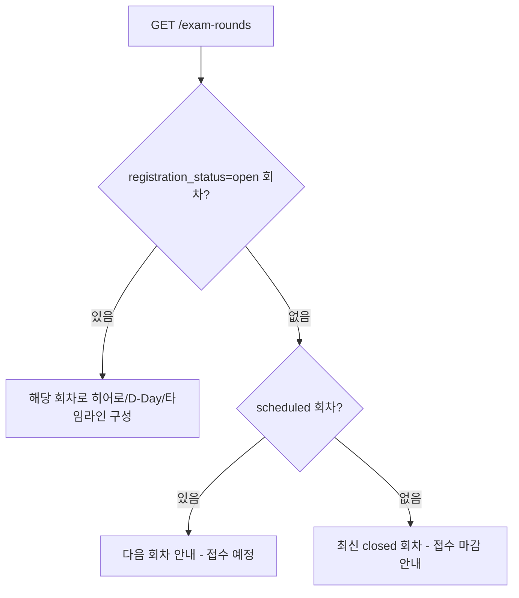

# 메인(홈) 상세 설계 (FO)

> 근거 기능정의서: `docs/기능정의서/FO/01_메인_홈_기능정의서.md` · 화면 ID 접두: `TPKM_FO_1_*`
> 표기 규약: `fo-00-common.md §0` 참조(API=실제 라우터 `/api/v1`, DB=`DB스키마_초안.md` 정본).

---

## 1. 서비스 개요

- **목적**: TOPIK Myanmar 사이트의 랜딩 페이지(`index.html`). 현재 회차/접수 마감 D-Day, 최신 공지, 시험 일정 타임라인, 퀵링크·FAQ 요약을 통해 핵심 동선(시험 접수·안내·공지)으로 빠르게 분기시킨다.
- **범위**: 단일 페이지(홈) + 4개 섹션(히어로/공지 미리보기/일정 타임라인/퀵링크·FAQ). 콘텐츠는 **읽기 전용 집계**이며 별도 쓰기 액션 없음.
- **주요 액터**: 비로그인 방문자(회원가입/로그인 CTA 강조), 로그인 회원(시험 접수 CTA 강조).
- **관련 요구사항ID**: `TPKM_FO_REQ_001`, `TPKM_FO_REQ_007`, `TPKM_FO_REQ_015`, `TPKM_FO_REQ_017`, `TPKM_FO_REQ_018`, `TPKM_FO_REQ_019`

### 1.1 페이지/섹션 목록

| 화면명 | 화면 ID | 타입 | HTML 파일 | 접근 권한 |
| --- | --- | --- | --- | --- |
| 메인 · 홈 | `TPKM_FO_1_1_0_0_0_P` | Page | `index.html` | 비로그인+로그인 |
| 메인 · 히어로 + D-Day | `TPKM_FO_1_1_1_0_0_S` | Section | (홈 내) | 비로그인+로그인 |
| 메인 · 공지 N건 미리보기 | `TPKM_FO_1_1_2_0_0_S` | Section | (홈 내) | 비로그인+로그인 |
| 메인 · 시험 일정 타임라인 | `TPKM_FO_1_1_3_0_0_S` | Section | (홈 내) | 비로그인+로그인 |
| 메인 · 퀵링크 + 홈 FAQ | `TPKM_FO_1_1_4_0_0_S` | Section | (홈 내) | 비로그인+로그인 |

---

## 2. 페이지별 상세 설계

### 2.1 메인 · 홈 — `TPKM_FO_1_1_0_0_0_P`

- **개요/진입**: 로고 클릭·도메인 루트 진입. 비로그인 시 회원가입/로그인 CTA, 로그인 시 "시험 접수" CTA를 강조.
- **접근 권한**: 공개. 단, 히어로의 "시험 접수" CTA는 로그인 가드(`TPKM_FO_0_1_3`) 경유.
- **화면 구성**: 히어로(2.2) → 공지 미리보기(2.3) → 일정 타임라인(2.4) → 퀵링크·FAQ(2.5) → 푸터.

**액션 상세**

| 액션/트리거 | 입력 & 검증 | 처리(비즈니스 규칙) | 연동 API | 연동 DB | 결과/예외 |
| --- | --- | --- | --- | --- | --- |
| 페이지 로드: 현재 회차 조회 | — | 접수중(`open`) 회차를 우선 표시, 없으면 최신 회차로 "다음 회차 안내". `round_no DESC` 정렬. | `GET /api/v1/exam-rounds?registration_status=open` | `exam_rounds` | 회차 0건 시 히어로 D-Day 숨김 + 안내 |
| 페이지 로드: 공지 5건 | — | 노출 ON·고정 우선 정렬 최신 5건. | `GET /api/v1/notices?home_preview=1` | `notices`(`is_published`,`is_pinned`,`published_at`) | 0건 시 빈 상태 |
| 페이지 로드: FAQ 요약 | — | 활성 FAQ 상위 3건. | `GET /api/v1/faq?lang={lang}` | `faq_items`(`is_active`,`sort_order`) | — |
| 히어로 "시험 접수" CTA | 인증 상태 | 비로그인 → `login.html?next=/register.html`. 로그인 → `register.html`. | (가드) | — | §fo-00 §2.4 |
| 공지 행 클릭 | `notice_id` | 공지 상세로 이동. | `GET /api/v1/notices/{id}` | `notices`,(`notice_view_logs`) | §3.2 조회수 |
| 퀵링크/더보기 클릭 | — | 4대 메뉴·세부 페이지로 라우팅(외부는 새 창). | — | — | — |

> 구현 참고: 홈 공지 미리보기는 `home_preview=1` 쿼리로 5건 고정 반환(페이지네이션 무시). REST 초안의 회차/시험장 분리(`/exam-rounds/{id}/venues`)와 달리 실제는 `GET /exam-rounds`(목록, `venue_ids` 포함) + `GET /exam-venues`(전체 활성)로 제공.

### 2.2 메인 · 히어로 + D-Day — `TPKM_FO_1_1_1_0_0_S`

- **개요**: 회차 배지(예: 제98회) + 메인 카피 + [시험 접수][안내 보기] CTA + 접수 마감 카운트다운(일/시/분/초).

**액션 상세**

| 액션/트리거 | 입력 & 검증 | 처리(비즈니스 규칙) | 연동 API | 연동 DB | 결과/예외 |
| --- | --- | --- | --- | --- | --- |
| D-Day 카운트다운 | 회차 `registration_end_at` | 마감 시각까지 `setInterval(1s)` 갱신. **마감 기준 = 접수 마감일시**(정본 컬럼 `registration_end_at`). | `GET /api/v1/exam-rounds` | `exam_rounds.registration_end_at` | 마감 경과 시 "접수 마감/다음 회차 안내"로 전환 |
| "안내 보기" CTA | — | TOPIK 안내(`guide-overview.html`) 이동. | — | — | — |
| "시험 접수" CTA | 인증 | 로그인 가드 경유 `register.html`. | (가드) | — | — |

> 기술 고려: 카운트다운은 클라이언트 시각 의존 → 사용자 시계 변경 시 오차. 향후 서버 시각 sync 권장. SPA 이탈 시 `clearInterval`. D-Day 기준(접수 마감 23:59:59 vs 시험일)은 (합의 필요) — 본 설계는 `registration_end_at` 채택.

### 2.3 메인 · 공지 N건 미리보기 — `TPKM_FO_1_1_2_0_0_S`

- **개요**: 최신 공지 5건(제목·카테고리 배지·작성일). 더보기 → 공지사항(`TPKM_FO_5_1`).

**액션 상세**

| 액션/트리거 | 처리(비즈니스 규칙) | 연동 API | 연동 DB | 결과/예외 |
| --- | --- | --- | --- | --- |
| 미리보기 로드 | `is_published=true`만, `is_pinned DESC, published_at DESC, id DESC` 정렬 후 5건. NEW 배지는 최근성 기준(클라이언트). | `GET /api/v1/notices?home_preview=1` | `notices` | 0건 시 빈 상태 |
| 행 클릭 | 공지 상세 이동(조회수 §3.2). | `GET /api/v1/notices/{id}` | `notices` | 비공개/삭제 시 404 |
| 카테고리 배지 | `category` → 라벨(중요/접수/시험/결과 등) 매핑(서버 `category_label`). | — | `notices.category` | 별칭(important/imp, apply/registration) 흡수 |

### 2.4 메인 · 시험 일정 타임라인 — `TPKM_FO_1_1_3_0_0_S`

- **개요**: 접수 → 시행 → 합격 발표 → 성적표 발급 4단계 카드, 현재 단계 active.

**액션 상세**

| 액션/트리거 | 처리(비즈니스 규칙) | 연동 API | 연동 DB | 결과/예외 |
| --- | --- | --- | --- | --- |
| 타임라인 로드 | 현재 회차의 접수 시작/마감, 시험일, 합격발표일, 수납기간 표시. 오늘 날짜로 현재 단계 active 계산. | `GET /api/v1/exam-rounds` | `exam_rounds.registration_start_at/registration_end_at/exam_date/result_announcement_date` | 회차 0건 시 안내 |

> 구현 참고: 회차 응답에 `payment_start_at`/`payment_end_at`(접수 마감 +3~5일, 제107회 정책)와 `result_date`(=`result_announcement_date` 별칭) 포함. 정본 컬럼명은 `result_announcement_date`, 구현 모델은 `result_date`(직렬화 시 양쪽 키 제공). 타임라인 노출 회차 범위는 (합의 필요).

### 2.5 메인 · 퀵링크 + 홈 FAQ — `TPKM_FO_1_1_4_0_0_S`

- **개요**: 퀵링크 카드(TOPIK 접수·수험표 출력·FAQ·환불·정정신청 등) + FAQ 3건 아코디언(더보기 → `TPKM_FO_5_4`).

**액션 상세**

| 액션/트리거 | 처리(비즈니스 규칙) | 연동 API | 연동 DB | 결과/예외 |
| --- | --- | --- | --- | --- |
| FAQ 3건 로드 | 활성 FAQ `sort_order, id` 상위 3건, 선택 언어 본문(없으면 KO 폴백). | `GET /api/v1/faq?lang={lang}` | `faq_items` | — |
| FAQ 아코디언 토글 | 질문 클릭 → 답변 토글(클라이언트). | — | — | — |
| 퀵링크 클릭 | 내부 페이지 라우팅 또는 외부 새 창(`rel=noopener`). 보호 링크(환불·정정 등)는 가드 적용. | — | — | — |

> 퀵링크 "수험표 출력"은 0527부터 비로그인 접근 가능(ticket.html). 퀵링크 구성·우선순위는 (합의 필요).

---

## 3. 핵심 비즈니스 규칙

### 3.1 회차 표시 우선순위

### 3.2 공지 조회수 정책 (정본 vs 구현 차이)

| 항목 | 정본(DB/FO 정의서) | 실제 구현 | 차이 |
| --- | --- | --- | --- |
| 조회수 증가 | `notice_view_logs`로 **1회/세션** dedup | `GET /notices/{id}` 호출 시 `view_count += 1`(매 호출) | 구현 상이 — 세션 dedup 미적용. (합의 필요) |

---

## 4. 타 서비스·BO 연동

| 연동 대상 | 연동 내용 | API/DB |
| --- | --- | --- |
| 공통(00) | 헤더/푸터/언어/가드 | `fo-00-common.md` |
| 접수(04) | 히어로·퀵링크 → 시험 접수 진입 | `register.html` + 가드 |
| 게시판·공지(05) | 공지 미리보기·FAQ 요약 | `GET /notices`, `GET /faq` |
| 회차 마스터(BO 시험관리) | D-Day·타임라인·회차 배지 | `exam_rounds`(BO `TPKM_BO_3_1` 등록) |
| 공지 관리(BO) | 미리보기 노출 ON 항목만 | `notices.is_published`(BO `TPKM_BO_4_1`) |

---

## 5. 운영 정책 합의 필요 항목

| 구분 | 항목 | 상태 |
| --- | --- | --- |
| 정책 | 비로그인/로그인별 히어로 CTA 노출 정책 | 비고 |
| 정책 | D-Day 기준(접수 마감일시 vs 시험일) | (합의 필요) — 본 설계 `registration_end_at` |
| 정책 | 메인 공지 미리보기 건수·카테고리 | 비고(현재 5건 고정) |
| 정책 | 시험 일정 타임라인 노출 회차 범위 | (합의 필요) |
| 정책 | 퀵링크 구성·우선순위 | (합의 필요) |
| 구현 차이 | 공지 조회수 1회/세션 dedup 미적용(매 호출 증가) | 구현 상이 |
| 구현 차이 | 회차 `result_announcement_date`(정본) ↔ `result_date`(구현 모델) | 명칭 차이(직렬화 시 양쪽 제공) |
| 기술 | 카운트다운 서버 시각 sync, OG/`og:image` 대표 이미지 | 향후/미정 |
