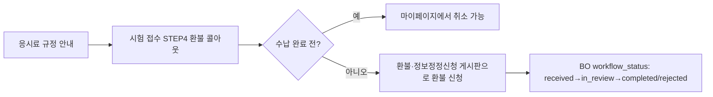

# TOPIK 규정(유의 사항·답안 작성 요령·응시료 규정·신분증 규정) 상세 설계 (FO)

> 근거 기능정의서: `docs/기능정의서/FO/03_TOPIK규정_기능정의서.md` · 화면 ID 접두: `TPKM_FO_3_*`
> 표기 규약: `fo-00-common.md §0` 참조.

---

## 1. 서비스 개요

- **목적**: 시험 응시 규정을 4개 하위 페이지로 안내한다(0519 재구성). 특히 **응시료/환불 정책**은 접수(04)·환불 게시판(05)과 직접 연결되는 핵심 정책 페이지다.
- **범위**: 정적 콘텐츠 4페이지(읽기 전용). 응시료 금액·환불률 등 일부 값은 BO 회차 마스터(`exam_rounds`)와 정합 유지가 필요한 "정책성 콘텐츠".
- **주요 액터**: 비로그인+로그인 전 사용자.
- **관련 요구사항ID**: `TPKM_FO_REQ_017`

### 1.1 페이지 목록

| 화면명 | 화면 ID | 타입 | HTML 파일 | 접근 권한 |
| --- | --- | --- | --- | --- |
| TOPIK 규정 · 유의 사항 | `TPKM_FO_3_1_0_0_0_P` | Page | `rules-notice.html` | 비로그인+로그인 |
| TOPIK 규정 · 답안 작성 요령 | `TPKM_FO_3_2_0_0_0_P` | Page | `rules-answer.html` | 비로그인+로그인 |
| TOPIK 규정 · 응시료 규정 | `TPKM_FO_3_3_0_0_0_P` | Page | `rules-fee.html` | 비로그인+로그인 |
| TOPIK 규정 · 신분증 규정 | `TPKM_FO_3_4_0_0_0_P` | Page | `rules-id.html` | 비로그인+로그인 |

---

## 2. 페이지별 상세 설계

### 2.1 TOPIK 규정 · 유의 사항 — `TPKM_FO_3_1_0_0_0_P`

- **개요**: 입실 시간(시험 시작 30분 전), 신분 확인, 휴대 금지 물품, 부정행위 제재, 시험 중 준수사항(통신기기 OFF 등).

**액션 상세**

| 액션/트리거 | 처리(비즈니스 규칙) | 연동 API | 결과/예외 |
| --- | --- | --- | --- |
| 본문 렌더 | `data-i18n=rules.notice.*` 다국어. 콜아웃(입실/부정행위) 강조. | — | KO 폴백 |
| 부정행위 정의/제재 | NIIED 시행 안내문과 일치. 재응시 제한 기간은 (합의 필요). | — | — |

### 2.2 TOPIK 규정 · 답안 작성 요령 — `TPKM_FO_3_2_0_0_0_P`

- **개요**: OMR 마킹법(컴퓨터용 사인펜, 진하게), 쓰기 답안지(원고지) 규칙, 수정테이프/수정액 금지, 응시자 코드/수험번호 기재법 + 예시 이미지.

**액션 상세**

| 액션/트리거 | 처리(비즈니스 규칙) | 연동 API | 결과/예외 |
| --- | --- | --- | --- |
| 본문 렌더 | `data-i18n=rules.answer.*`. OMR 마킹 예시 이미지 + 대체 텍스트(접근성). | — | KO 폴백 |
| 인쇄 대응 | `@media print` 친화 CSS(종이 출력 대비). | — | — |

### 2.3 TOPIK 규정 · 응시료 규정 — `TPKM_FO_3_3_0_0_0_P`

- **개요**: 응시료 금액(TOPIK Ⅰ·Ⅱ별, MMK·USD), 결제 방법(오프라인 수납), 환불 정책(시점별 환불률 표), 영수증 안내.
- **0526 핵심**: ① Ⅰ·Ⅱ 동시 접수 시 **각 수준별 개별 오프라인 수납**(합산 일괄 납부 아님). ② **취소 가능 시점 = 오프라인 수납 전까지**.
- **연동**: 환불 신청은 게시판 '환불·정보정정신청'(`TPKM_FO_5_2`).

**액션 상세**

| 액션/트리거 | 입력 & 검증 | 처리(비즈니스 규칙) | 연동 API | 연동 DB | 결과/예외 |
| --- | --- | --- | --- | --- | --- |
| 응시료 표 렌더 | — | 금액은 회차 마스터와 정합. 표시는 정적/콘텐츠 + (옵션) 회차값. | `GET /api/v1/exam-rounds`(옵션) | `exam_rounds.fee_level_i`, `fee_level_ii` | 표 `caption`+`th scope` |
| 수납 방식 안내 | — | Ⅰ·Ⅱ **각 급수별 개별 수납**(0526). 수납처/계좌는 공지사항 참고. | — | — | 합산 납부 아님 명시 |
| 환불 정책 안내 | — | 시점별 환불률 표. **취소는 수납 전까지만**(0526) → 수납 후에는 환불·정정 게시판 이용. | — | — | 환불률 (합의 필요) |
| "환불 신청" 링크 | 로그인 | 환불·정보정정신청 게시판(`refund-correction.html`) 진입(가드). | (가드) | — | 비로그인 시 로그인 |
| 영수증 안내 | — | 오프라인 수납 영수증 발급 안내(번호는 BO `payment_receipt_no` 관리). | — | `applications.payment_receipt_no`(구현) / 정본 `receipt_no` | 명칭 차이 §5 |

### 2.4 TOPIK 규정 · 신분증 규정 — `TPKM_FO_3_4_0_0_0_P`

- **개요**: 인정 신분증(여권·거주증·국가발급 사진 신분증), 미얀마 기준(NRC·여권), 사진/응시자 일치, 미소지·만료 시 시험 불가 안내.

**액션 상세**

| 액션/트리거 | 처리(비즈니스 규칙) | 연동 API | 결과/예외 |
| --- | --- | --- | --- |
| 본문 렌더 | `data-i18n=rules.id.*`. 인정 신분증 목록·예시. | — | KO 폴백 |
| 미소지/만료 대응 | 시험 불가 안내 + 문의 게시판 링크. 대체 확인 절차는 (합의 필요). | — | `qna.html` 링크 |

---

## 3. 핵심 비즈니스 규칙 (응시료·취소·환불 정합)

> 본 페이지는 정적이지만, **접수(04)·게시판(05)의 상태 전이와 정합**해야 하는 정책 기준점이다.

| 규칙 | 내용 | 연계 |
| --- | --- | --- |
| 개별 수납(0526) | Ⅰ·Ⅱ 동시 접수도 응시료는 급수별 개별 오프라인 수납. `applications.payment_status`는 **급수 단위**. | 접수 04 §3, BO 수납 |
| 취소 가능 시점(0526) | `payment_status='paid'` 이전(수납 전)까지만 FO 취소 가능. 수납 후 취소 불가 → 환불 신청. | 접수 04 `POST /applications/{id}/cancel`(422/400) |
| 환불 경로 | 수납 후 환불은 게시판 '환불·정보정정신청' 글 작성 → BO `workflow_status` 처리. | 게시판 05 `board_posts(board_type='refund_correction')` |
| 환불자 표시(0526) | BO에서 `payment_status='refunded'` 처리 시 **수험번호 유지**(그리드 '환불자' 분류). | BO 접수관리 |
| 정합성 3중 갱신 | 응시료 변경 시 BO 회차 마스터 → 본 규정 페이지 → 공지사항 동시 갱신. | 운영 절차 |

---

## 4. 타 서비스·BO 연동

| 영역 | 연계 화면/기능 | 비고 |
| --- | --- | --- |
| 접수 흐름 | 응시료 규정 → 접수 STEP4 환불 콜아웃 | 일관 환불 안내(`TPKM_FO_4_2_4`) |
| 게시판 | 환불·정보정정신청 / 문의 | 환불·정정/신분증 문의 진입(`TPKM_FO_5_2`/`5_3`) |
| BO 시험 관리 | 회차별 응시료 마스터 | `exam_rounds.fee_level_i/ii`(`TPKM_BO_3_1`) |
| BO 콘텐츠 | 신분증·부정행위 변경 시 공지 게시 | `TPKM_BO_4_1` |

---

## 5. 운영 정책 합의 필요 항목

| 구분 | 항목 | 상태 |
| --- | --- | --- |
| 정책 | 환불 정책 시점별 비율(접수 중/시험일 임박/시험일 이후) | (합의 필요) |
| 정책 | 부정행위 후 재응시 제한 기간 | (합의 필요) |
| 정책 | 인정 신분증 미소지 시 대체 확인 절차 | (합의 필요) |
| 정책 | 수험번호 부여 후 취소 시 응시자 코드 재사용 | (합의 필요) |
| 정합 | 응시료 금액 BO 회차 마스터와 일치(3중 갱신 절차) | 비고 |
| 명칭 차이 | 영수증 번호 `receipt_no`(정본) ↔ `payment_receipt_no`(구현 모델) | §fo-04 §6 동일 |
