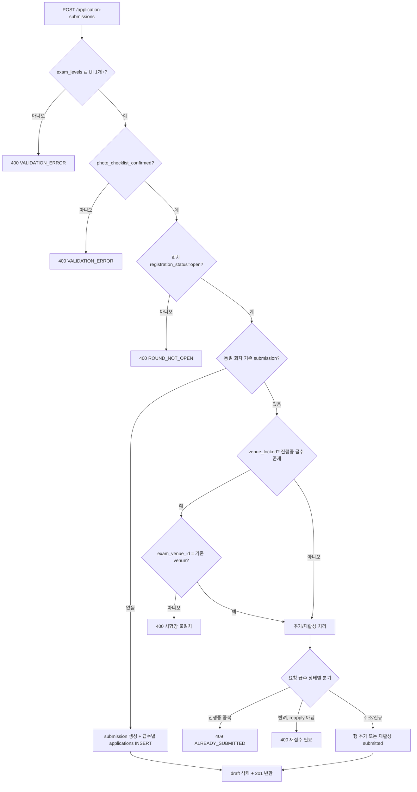
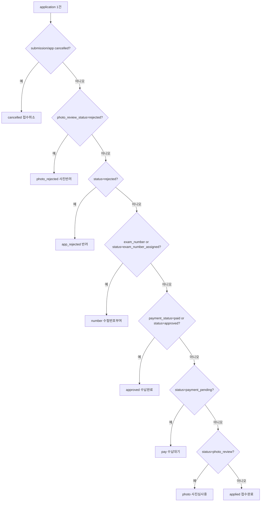
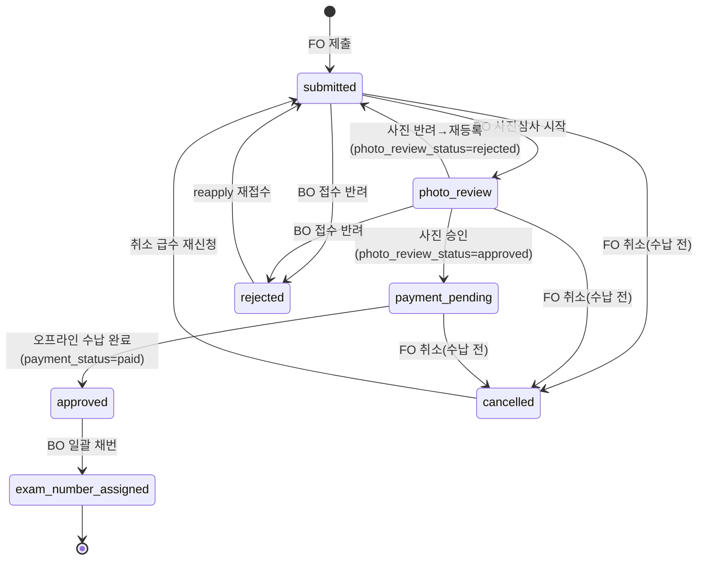

# TOPIK 접수(접수 방법·시험 접수 4단계·접수 확인·수험표 출력) 상세 설계 (FO)

> 근거 기능정의서: `docs/기능정의서/FO/04_TOPIK접수_기능정의서.md` · 화면 ID 접두: `TPKM_FO_4_*`
> 표기 규약: `fo-00-common.md §0` 참조(API=실제 라우터 `/api/v1`, DB=`DB스키마_초안.md` 정본, 구현 모델은 `apps/api/app/models/application.py`).

---

## 1. 서비스 개요

- **목적**: 회원이 회차·급수를 선택해 시험 접수를 제출하고, 마이페이지에서 상태를 확인·취소하며, 수험표 출력(외부 안내)을 받는다. FO의 **핵심 트랜잭션 서비스**.
- **범위**: 접수 방법 안내(공개) / 시험 접수 4단계(로그인) / 접수 확인=마이페이지(로그인) / 수험표 출력(0527 비로그인).
- **주요 액터**: 비로그인(접수 방법·수험표 출력 안내), 로그인 회원(접수·확인·취소).
- **핵심 정책**:
  - TOPIK Ⅰ·Ⅱ **동시 접수 가능**(같은 회차). 동시 접수 시 **동일 시험장 코드**.
  - 접수 시 **회원정보 readonly(수정 불가)** + **사진 업로드 불가(규격 확인만)**.
  - 응시료는 급수별 **개별 오프라인 수납**(0526). 수험번호는 BO에서 **사진 승인 + 수납 완료 후 일괄(영문명순) 부여**.
  - 취소는 **오프라인 수납 전까지만** 가능(0526).
  - 접수 완료·수험번호 부여 **이메일 미발송**(0527).
- **관련 요구사항ID**: `TPKM_FO_REQ_005`, `007`, `008`, `009`, `010`, `011`, `012`, `013`, `014`, `019`, `020`

### 1.1 페이지/섹션 목록

| 화면명 | 화면 ID | 타입 | HTML 파일 | 접근 권한 |
| --- | --- | --- | --- | --- |
| TOPIK 접수 · 접수 방법 | `TPKM_FO_4_1_0_0_0_P` | Page | `apply-howto.html` | 비로그인+로그인 |
| TOPIK 접수 · 시험 접수(4단계) | `TPKM_FO_4_2_0_0_0_P` | Page | `register.html` | 로그인 필수 |
| ─ STEP1 회차·급수 동시 선택 | `TPKM_FO_4_2_1_0_0_S` | Section | (register 내) | 로그인 필수 |
| ─ STEP2 회원정보 확인(readonly) | `TPKM_FO_4_2_2_0_0_S` | Section | (register 내) | 로그인 필수 |
| ─ STEP3 사진 규격 확인(업로드 불가) | `TPKM_FO_4_2_3_0_0_S` | Section | (register 내) | 로그인 필수 |
| ─ STEP4 최종 확인·제출 | `TPKM_FO_4_2_4_0_0_S` | Section | (register 내) | 로그인 필수 |
| ─ 접수 완료 안내 모달 | `TPKM_FO_4_2_5_0_0_MP` | Modal | (register 내) | 로그인 필수 |
| TOPIK 접수 · 접수 확인(마이페이지) | `TPKM_FO_4_3_0_0_0_P` | Page | `mypage.html` | 로그인 필수 |
| ─ 상태 배지 컴포넌트 | `TPKM_FO_4_3_1_0_0_C` | Component | (mypage 내) | 로그인 필수 |
| ─ 접수 확인증(인쇄) | `TPKM_FO_4_3_2_0_0_S` | Section | (mypage 내) | 로그인 필수 |
| ─ 접수 취소 confirm 모달 | `TPKM_FO_4_3_3_0_0_MP` | Modal | (mypage 내) | 로그인 필수 |
| TOPIK 접수 · 수험표 출력 | `TPKM_FO_4_4_0_0_0_P` | Page | `ticket.html` | **비로그인+로그인(0527)** |
| ─ 수험표 본인 확인 | `TPKM_FO_4_4_1_0_0_S` | Section | — | **폐기(0527)** |
| ─ 수험표 출력 안내글 | `TPKM_FO_4_4_2_0_0_S` | Section | (ticket 내) | 공개(0527) |
| ─ TOPIK 홈페이지 이동 버튼 | `TPKM_FO_4_4_3_0_0_C` | Component | (ticket 내) | 공개(0527) |
| ─ 수험표 미일치/미입력 알림 | `TPKM_FO_4_4_4_0_0_C` | Component | — | **폐기(0527)** |

---

## 2. 페이지별 상세 설계

### 2.1 TOPIK 접수 · 접수 방법 — `TPKM_FO_4_1_0_0_0_P`

- **개요/진입**: GNB > TOPIK 접수 > 접수 방법. 비로그인도 접근. Step 1~6 절차 카드(① 회원가입(사진 등록) ② 로그인 ③ 시험 접수 ④ 사진 심사+오프라인 수납 ⑤ 수험번호 부여 ⑥ 수험표 출력) + 필요 서류 체크리스트 + FAQ 링크.
- **접근 권한**: 공개.

**액션 상세**

| 액션/트리거 | 처리(비즈니스 규칙) | 연동 API | 결과/예외 |
| --- | --- | --- | --- |
| 절차 안내 렌더 | 정적/i18n. 6단계 카드. | — | KO 폴백 |
| "시험 접수 하러 가기" CTA | 로그인 가드 경유 `register.html`. | (가드) | 비로그인 → `login.html?next=/register.html` |
| FAQ 링크 | `faq.html` 이동. | `GET /api/v1/faq` | — |

### 2.2 TOPIK 접수 · 시험 접수(4단계) — `TPKM_FO_4_2_0_0_0_P`

- **개요**: 4단계 마법사(`register.html`). 로그인 필수, TOPIK Ⅰ·Ⅱ 동시 접수, **정보·사진 수정 불가**.
- **공통 동작**: 상단 sticky 스텝 인디케이터, [이전]/[다음], **[저장 후 나가기](임시 저장)**. 비로그인 진입 시 가드.
- **임시 저장(Draft)**: 실제 구현됨(`application_drafts` 테이블, **30일 만료**).

| 액션/트리거 | 입력 & 검증 | 처리(비즈니스 규칙) | 연동 API | 연동 DB | 결과/예외 |
| --- | --- | --- | --- | --- | --- |
| 진입 시 임시저장 복원 | — | 만료 안 된 draft 있으면 복원 제안. | `GET /api/v1/application-draft` | `application_drafts(payload, expires_at)` | 없으면 404(정상) |
| 저장 후 나가기 | `payload`(현재 스텝 입력) | 30일 만료로 upsert(사용자당 1건, `UNIQUE(user_id)`). | `PUT /api/v1/application-draft` | `application_drafts` | `{saved:true}` |
| 제출 성공 후 | — | draft 자동 삭제. | (제출 트랜잭션 내 DELETE) | `application_drafts` | — |
| 수동 삭제 | — | draft 폐기. | `DELETE /api/v1/application-draft` | `application_drafts` | — |

> 정본(`DB스키마_초안.md`)은 임시저장을 "정책 합의 후(`application_drafts`)"로 미확정 표기했으나 **구현은 완료**(V005 마이그레이션). 만료 30일은 (합의 필요 — 회차 접수기간과 정렬 권장).

#### 2.2.1 STEP1 회차·급수 동시 선택 — `TPKM_FO_4_2_1_0_0_S`

- **개요**: 접수 가능 회차 카드 목록 + 급수 체크박스(Ⅰ/Ⅱ, 복수 선택) + 시험장 선택.

| 액션/트리거 | 입력 & 검증 | 처리(비즈니스 규칙) | 연동 API | 연동 DB | 결과/예외 |
| --- | --- | --- | --- | --- | --- |
| 회차 목록 로드 | — | `registration_status='open'`만 선택 가능, `scheduled/closed`는 비활성. | `GET /api/v1/exam-rounds?registration_status=open` | `exam_rounds.registration_status` | 0건 시 "접수 가능 회차 없음" |
| 시험장 목록 로드 | 선택 회차 `venue_ids` | 회차에 연결된 활성 시험장만. | `GET /api/v1/exam-venues` (+ round `venue_ids` 교집합) | `exam_venues.is_active`, `exam_round_venues` | — |
| 급수 선택 | Ⅰ/Ⅱ 체크 | **최소 1개 필수**, 둘 다 가능(동시 접수). | (제출 시 검증) | — | 0개 시 다음 비활성 |
| 회차/시험장 선택 | 회차 1개·시험장 1개 | 회차 필수. 동시/추가 접수 시 시험장은 기존과 동일하게 잠김(§3.3). | (제출 시 검증) | — | — |
| 중복 접수 방지(클라) | 기존 접수 조회 | 동일 회차·동일 급수 진행 중이면 차단 안내(서버 409와 정합). | `GET /api/v1/applications` | `applications` | §3.3 |

> 응시료 안내(0526): Ⅰ·Ⅱ 동시 접수도 **각 급수 개별 오프라인 수납**. 시험장은 동시 접수 시 동일 코드. FO가 시험장을 명시 선택하는지/자동 할당인지는 (합의 필요) — 구현은 `exam_venue_id` 필수 입력.

#### 2.2.2 STEP2 회원정보 확인(readonly) — `TPKM_FO_4_2_2_0_0_S`

- **개요**: 회원가입 시 등록 정보가 자동 주입되어 **전부 readonly**. 변경 불가.

| 액션/트리거 | 입력 & 검증 | 처리(비즈니스 규칙) | 연동 API | 연동 DB | 결과/예외 |
| --- | --- | --- | --- | --- | --- |
| 회원정보 prefill | — | `GET /me`로 1회 조회 후 클라이언트 캐싱(STEP 이동 시 재요청 X). 모든 필드 readonly. | `GET /api/v1/me` | `users`(name_ko/name_en/birth_date/gender/nationality/first_language/job_code/motive_code/purpose_code 등) | 401 시 가드 |
| 안내 배너 | — | "회원가입 시 등록 정보 자동 입력. 변경은 [마이페이지·내정보수정]에서." 링크 → `mypage-profile.html`. | — | — | — |
| 정보 수정 시도 | — | **불가**(readonly). 신원 정보 정정은 0527부터 내정보수정에서 직접 가능(계정 06), 또는 환불·정정 게시판. | — | — | 서버도 접수 흐름에서 프로필 변경 차단 |

> 보안: readonly는 클라이언트+서버 양쪽. 접수 제출(`POST /application-submissions`)은 프로필 필드를 받지 않으므로 사용자가 값을 위조해도 무시됨(서버는 `users`에서 직접 사용).

#### 2.2.3 STEP3 사진 규격 확인(업로드 불가) — `TPKM_FO_4_2_3_0_0_S`

- **개요**: 회원가입 사진 미리보기 + 규격 체크리스트. **업로드/교체 컨트롤 없음**.

| 액션/트리거 | 입력 & 검증 | 처리(비즈니스 규칙) | 연동 API | 연동 DB | 결과/예외 |
| --- | --- | --- | --- | --- | --- |
| 사진 미리보기 | `users.photo_file_id` | 인증 프록시로 사진 로드. | `GET /api/v1/files/{photo_file_id}?token=` | `file_attachments`(owner_type=`user_photo`) | 사진 없음 → 재등록 안내 |
| 규격 체크리스트 동의 | 체크박스(필수) | 여권용·정면·jpg·6개월 이내·흑백/모자/선글라스/앞머리 가림/타인 사진 금지·200KB~2MB. **전체 체크 시에만 다음 활성** → `photo_checklist_confirmed=true`. | (제출 시 전달) | `application_submissions.photo_checklist_confirmed` | 미체크 시 제출 400 |
| 사진 없음/부적합 | — | "마이페이지에서 사진 재등록 후 다시 접수" CTA → `mypage-profile.html`(계정 06). | — | — | 업로드 불가 |

> 최종 사진 적격 판정은 BO 사진 심사(`photo_review_status`). 접수 사진은 제출 시점 `users.photo_file_id`를 각 `applications.photo_file_id`에 복사.

#### 2.2.4 STEP4 최종 확인·제출 — `TPKM_FO_4_2_4_0_0_S`

- **개요**: 요약 표(회차·급수(Ⅰ·Ⅱ)·성명·생년월일·국적·제1언어·시험장) + 응시료 안내 + 사진 미리보기 + 환불/취소 콜아웃 + 약관 재동의 + [접수하기].

| 액션/트리거 | 입력 & 검증 | 처리(비즈니스 규칙) | 연동 API | 연동 DB | 결과/예외 |
| --- | --- | --- | --- | --- | --- |
| 약관 재확인 | 동의 체크(필수) | 이용·개인정보 동의 체크 필수(클라이언트). | — | — | 미동의 시 제출 차단 |
| **접수 제출** | `exam_round_id`, `exam_venue_id`, `exam_levels[]`, `photo_checklist_confirmed`, `accommodation_requested` | 서버 검증·원자 처리(§3.1·§3.3). Ⅰ+Ⅱ는 1트랜잭션 2행. | `POST /api/v1/application-submissions` | `application_submissions` + `applications`(급수별) | 성공 → 완료 모달 |
| 응시료 안내(0526) | — | 급수별 개별 오프라인 수납 표시. 수납처는 공지 안내. | (회차 `fees`) | `exam_rounds.fee_level_i/ii` | 합산 아님 |
| 환불/취소 콜아웃 | — | 응시료 규정 링크(`rules-fee.html`), "취소는 수납 전까지". | — | — | `TPKM_FO_3_3` |

**제출 처리 결과(초기 상태)**

| 컬럼 | 초기값 |
| --- | --- |
| `application_submissions.status` | `submitted` |
| `applications.status` | `submitted` |
| `applications.photo_review_status` | `pending` |
| `applications.payment_status` | `unpaid` |
| `applications.application_no` | `APP-{submission_id}-{level}` (구현 형식) |
| `applications.exam_number` | `NULL` (BO 부여 전) |

> 접수 완료 **이메일 미발송**(0527). REST 초안의 `profile_snapshot`/`terms_snapshot` JSONB는 **구현 모델에 없음**(§6).

#### 2.2.5 접수 완료 안내 모달 — `TPKM_FO_4_2_5_0_0_MP`

- **개요**: 제출 성공 시 안내 모달(0519 멘트).

| 항목 | 내용 |
| --- | --- |
| 제목 | "접수가 완료되었습니다." |
| 본문(0519 원문) | "사진 심사 및 오프라인 응시료 수납 후 수험번호가 부여됩니다. 관련 일정 및 유의사항은 공지사항을 참고하시기 바랍니다. 접수 결과는 마이페이지에서 확인하시기 바랍니다." |
| CTA | [공지사항 보기]→`notice.html` · [마이페이지]→`mypage.html` |
| 알림 | **이메일 미발송**(0527) |

### 2.3 TOPIK 접수 · 접수 확인(마이페이지) — `TPKM_FO_4_3_0_0_0_P`

- **개요**: 본인 접수 건을 카드 목록으로 표시. 상단 회원 카드(성명·사진) + 접수 건별 카드(회차·시험일·시험장·상태 배지·수험번호·액션). active/past 탭 분리.
- **접근 권한**: 로그인 필수.

| 액션/트리거 | 입력 & 검증 | 처리(비즈니스 규칙) | 연동 API | 연동 DB | 결과/예외 |
| --- | --- | --- | --- | --- | --- |
| 접수 목록 로드 | — | 본인 submission→급수별 카드(Ⅰ 먼저). `fo_card_status`(§3.2) 및 `tab`(active/past) 집계 응답. IDOR: `user_id` 서버 매칭. | `GET /api/v1/applications` | `applications`, `application_submissions`, `exam_rounds`, `exam_venues` | 비본인 데이터 미포함 |
| 상태 배지 | — | §2.3.1 / §3.2 매핑. | (응답 `fo_card_status`) | — | — |
| 수험번호 표시 | — | `exam_number` AND 회차 `exam_number_visible_at` 도래 시에만 노출(§3.4). | (응답 `exam_number_visible`) | `applications.exam_number`, `exam_rounds.exam_number_visible_at` | 미도래 시 숨김 |
| 접수 확인증 | — | 클라이언트 인쇄 영역(§2.3.2). 별도 API 없음. | (목록 데이터 재사용) | — | — |
| 수험표 출력 | — | `ticket.html` 이동(0527 외부 안내). | — | — | — |
| 취소 | application_id | 수납 전(`payment_status≠paid`)만 활성. confirm(§2.3.3). | `POST /api/v1/applications/{application_id}/cancel` | `applications`(+상위 submission) | 수납 후 400 |
| 재접수(반려 건) | submission, levels | 반려(`rejected`) 급수는 재접수 플로우(`reapply=true`)로 복구. | `POST /api/v1/application-submissions`(`reapply:true`) | `applications` | §3.3 |

#### 2.3.1 상태 배지 컴포넌트 — `TPKM_FO_4_3_1_0_0_C`

- **개요**: 접수 상태 배지 7종(BO 그리드 칩과 동일 색상). FO 카드는 derived `fo_card_status` 8종 사용.

| `applications.status`(7종) | FO 표시 | 색상 | 비고 |
| --- | --- | --- | --- |
| `submitted` | 접수완료 | 파랑 | 제출 직후 |
| `photo_review` | 사진심사중 | 노랑 | `photo_review_status` 연동 |
| `payment_pending` | 수납대기 | 주황 | 사진 승인 후, `payment_status=unpaid` |
| `approved` | 승인완료 | 초록 | 수납 완료 |
| `exam_number_assigned` | 수험번호부여 | 보라 | `exam_number` NOT NULL |
| `rejected` | 반려 | 빨강 | 접수 반려 |
| `cancelled` | 취소됨 | 회색 | 취소/탈퇴 연쇄 |

> 구현 카드 상태(`fo_card_status`, `formatting.py`): `applied/photo/pay/approved/number/photo_rejected/app_rejected/cancelled`. **사진 반려는 `photo_review_status='rejected'`를 별도 배지**로 노출(접수 status가 아직 photo_review여도 "사진 반려"로 표시).

#### 2.3.2 접수 확인증(인쇄) — `TPKM_FO_4_3_2_0_0_S`

- **개요**: 인쇄용 영역(회차·접수번호·급수·접수일·수납 상태·수험번호(부여 후)·응시자 성명·생년월일). [인쇄] → `window.print()`. A4 1매 `@media print`.

| 액션/트리거 | 처리(비즈니스 규칙) | 연동 API | 결과/예외 |
| --- | --- | --- | --- |
| 확인증 인쇄 | 마이페이지 목록 데이터로 클라이언트 렌더 후 `window.print()`. **서버 PDF/Receipt API 미구현**. | (`GET /applications` 재사용) | 개인정보 노출 범위 (합의 필요) |

> REST 초안의 `GET /applications/{id}/receipt`는 **미구현**. 접수 확인증은 클라이언트 인쇄로 처리.

#### 2.3.3 접수 취소 confirm 모달 — `TPKM_FO_4_3_3_0_0_MP`

- **개요**: "접수를 취소하시겠습니까? 환불은 응시료 규정을 따릅니다." + 0526 안내("취소는 오프라인 수납 전까지만 가능. 수납 후에는 환불·정보정정신청 게시판 이용.") + 응시료 규정 링크.

| 액션/트리거 | 입력 & 검증 | 처리(비즈니스 규칙) | 연동 API | 연동 DB | 결과/예외 |
| --- | --- | --- | --- | --- | --- |
| 취소 확인 | application_id, (reason) | `payment_status='paid'`면 **차단(400 `CANNOT_CANCEL`)**. 아니면 `status=cancelled`, `cancelled_at`, `cancel_reason` 설정. **급수 단위 취소** — 동일 submission의 다른 급수는 유지. 모든 급수가 취소되면 submission도 cancelled. | `POST /api/v1/applications/{application_id}/cancel` | `applications`(+조건부 `application_submissions`) | 이미 취소 → 409 `ALREADY_CANCELLED` |
| submission 전체 취소 | submission_id | 하위 급수 중 수납 완료 있으면 차단. 전부 취소 처리. | `POST /api/v1/application-submissions/{submission_id}/cancel` | `application_submissions` + 하위 `applications` | 동일 예외 |
| 환불 안내 | — | 수납 후 취소 불가 시 환불·정정 게시판 글 작성 안내(`refund-correction.html`). | (가드) | — | `TPKM_FO_5_2` |

> BO 처리 이력(`admin_audit_logs`)에 취소 전/후 상태 기록(BO 측). 환불률은 회차/시험일에 따라 BO 응시료 규정 정책(합의 필요).

### 2.4 TOPIK 접수 · 수험표 출력 — `TPKM_FO_4_4_0_0_0_P`

- **개요(0527 전면 변경)**: **로그인·본인확인 불필요**. 누구나 접근. 페이지 진입 즉시 출력 안내 멘트 + TOPIK 홈페이지 이동 버튼만 노출. 실제 출력은 topik.go.kr.
- **접근 권한**: 공개(0527). GNB 로그인 가드 목록에서 제거됨.

| 액션/트리거 | 처리(비즈니스 규칙) | 연동 API | 결과/예외 |
| --- | --- | --- | --- |
| 페이지 진입 | 본인확인 없이 즉시 안내 멘트(`TPKM_FO_4_4_2`) + 외부 버튼(`TPKM_FO_4_4_3`) 노출. | — (정적) | 가드 없음 |
| [TOPIK 홈페이지] 클릭 | `https://topik.go.kr` 새 창(`target=_blank`, `rel=noopener`). | — | — |

#### 폐기/유지 컴포넌트 (0527)

| 화면 ID | 상태 | 비고 |
| --- | --- | --- |
| `TPKM_FO_4_4_1` 본인 확인 폼 | **폐기(0527)** | 성명·생년월일 입력 제거 |
| `TPKM_FO_4_4_2` 출력 안내글 | 유지(진입 즉시 노출) | 출력 시기/방법/유의사항 원문 |
| `TPKM_FO_4_4_3` 홈페이지 버튼 | 유지(진입 즉시 노출) | topik.go.kr 새 창 |
| `TPKM_FO_4_4_4` 미일치/미입력 알림 | **폐기(0527)** | 본인확인 제거로 미사용 |

> 안내글 원문 요지(`TPKM_FO_4_4_2`): 시험일 2주 전 월요일 10시부터 topik.go.kr에서 출력. 회원 로그인 > 마이페이지 > 접수현황 > 수험표 출력 / 비회원·ID 분실·탈퇴 시 전체메뉴 > 비회원 시험정보 > 수험표 출력. 응시불가 처리자는 출력 불가. Chrome 권장·팝업 차단 해제 안내. 다국어 제공 여부는 (합의 필요).

---

## 3. 상태 전이 / 핵심 비즈니스 규칙

### 3.1 접수 제출 트랜잭션 (Ⅰ+Ⅱ 원자 처리)

### 3.2 FO 카드 상태 파생 규칙 (status + photo_review_status + payment_status + exam_number)

> 동시 접수(Ⅰ+Ⅱ) 카드 헤드라인은 "가장 덜 진행된 활성 급수" 기준(rank: applied<photo<pay<approved<number).

### 3.3 동일 회차 재접수/추가/취소 규칙 (구현 정합)

| 상황 | 처리 | 결과 |
| --- | --- | --- |
| 신규 회차 첫 접수 | submission 생성 + 급수 행 INSERT | 201 |
| 동일 회차 + 새 급수 추가(예: Ⅰ만 했다 Ⅱ 추가) | 기존 submission에 급수 행 추가. **시험장 잠금**(기존 venue 강제) | 201 |
| 동일 회차 + 이미 진행 중 급수 재요청 | 차단 | 409 `ALREADY_SUBMITTED` |
| 취소했던 급수 재신청 | 취소 행 재활성(`submitted`/`pending`/`unpaid` 리셋) | 201 |
| 반려(`rejected`) 급수 | `reapply=true` 플로우 필요(일반 제출은 400) | 재접수 |
| submission 전체가 취소 상태였음 | 기존 submission 재활성(기존 급수 행 삭제 후 재생성) | 201 |
| 동시 접수 시험장 | Ⅰ·Ⅱ 동일 `exam_venue_id` 강제 → 동일 시험장 코드 보장 | 수험번호 ④ 동일 |

### 3.4 수험번호 노출 게이팅

| 조건 | FO 노출 |
| --- | --- |
| `exam_number IS NULL` | 숨김 |
| `exam_number` 있음 + `exam_rounds.exam_number_visible_at` 미도래 | 숨김(`exam_number_visible=false`) |
| `exam_number` 있음 + `exam_number_visible_at ≤ now` | 노출 |

> 수험번호 13자리 채번 규칙: ①country(025) ②region ③level(7=Ⅰ,8=Ⅱ) ④venue_code ⑤serial(회차×시험장×수준별 0001~, `name_en` ASC). BO `exam_number_sequences` + `FOR UPDATE` 원자 채번. 장애인 편의(`accommodation_requested`) 우선 배정.

### 3.5 접수 상태머신 (전체)

> FO가 일으키는 전이는 **제출(submitted)·취소(cancelled)·재접수(reapply)** 뿐. photo_review/payment_pending/approved/exam_number_assigned/rejected는 BO 트리거. 사진 변경(계정 06) 시 진행 중 건은 `photo_review_status=pending`으로 재심사(0527).

---

## 4. 타 서비스·BO 연동

| 영역 | 연계 화면/기능 | API/DB |
| --- | --- | --- |
| 로그인 가드(00) | `register.html`·`mypage.html` 보호(`?next=`) | `require_user` |
| 계정(06) | STEP2 회원정보 자동주입, STEP3 사진, 내정보수정 링크 | `GET /me`, `users.photo_file_id` |
| 응시료 규정(03) | STEP4·취소 환불 콜아웃 | `TPKM_FO_3_3` |
| 환불·정정 게시판(05) | 수납 후 환불 신청 | `board_posts(refund_correction)` |
| 공지(05) | 완료 모달·수납 일정 안내 | `GET /notices` |
| BO 접수 관리 | 사진심사·수납·반려·일괄 채번·상태 동기 | `applications`(`TPKM_BO_2_1`), `exam_number_sequences` |
| BO 시험 관리 | 회차/급수/시험장 마스터·`exam_number_visible_at` | `exam_rounds`/`exam_venues`(`TPKM_BO_3_*`) |

---

## 5. 운영 정책 합의 필요 항목

| 구분 | 항목 | 상태 |
| --- | --- | --- |
| 정책 | FO 시험장 명시 선택 vs 자동 할당(동시·추가 접수 venue 잠금 규칙) | (합의 필요) — 구현은 `exam_venue_id` 필수 |
| 정책 | 임시저장(draft) 만료기간(현재 30일) | (합의 필요) |
| 정책 | 수험번호 부여 후 취소 시 코드 재사용 | (합의 필요) |
| 정책 | 접수 확인증 개인정보 노출 범위 | (합의 필요) |
| 정책 | 1인 다회/타 회차 중복 접수 허용 범위 | 비고(동일 회차 Ⅰ+Ⅱ 허용) |
| 정책 | 수험표 안내(`ticket.html`) 다국어 제공 | (합의 필요) |
| 0527 | 수험표 본인확인(`4_4_1`)·에러(`4_4_4`) 폐기, 로그인 가드 제거 | 반영 완료 |
| 0527 | 접수 완료·수험번호 부여 이메일 미발송 | 반영 완료 |

## 6. 정본 DB ↔ 구현 모델 명칭/구조 차이 (중요)

| 정본(`DB스키마_초안.md`) | 구현(`models/application.py`) | 영향 |
| --- | --- | --- |
| `applications.reject_code` + `reject_note` | `applications.reject_reason`(단일 Text) | FO 반려 사유 표시 — 구현은 단일 컬럼 사용 |
| `applications.receipt_no` | `applications.payment_receipt_no` | 영수증 번호 명칭 차이 |
| `applications.profile_snapshot` JSONB NOT NULL | **없음** | 제출 시점 스냅샷 미보관 — `users` 직접 참조. 정정 시 과거 접수 표기 영향 (합의 필요) |
| `application_submissions.terms_snapshot` JSONB | **없음** | 제출 시 약관 버전 스냅샷 미보관 |
| `application_submissions`(user_id, exam_round_id, submitted_at만) | + `exam_venue_id`, `status`, `photo_checklist_confirmed`, `accommodation_requested` | 시험장·상태가 submission에도 비정규화 |
| `application_no` 예 `APP-98-I-xxx`, UNIQUE | `APP-{submission_id}-{level}`, 모델 UNIQUE 미지정 | 형식·유니크 차이 |
| `exam_rounds.result_announcement_date` | `result_date`(직렬화 시 양쪽 키) | 명칭 차이 |
| 임시저장 "정책 합의 후" | `application_drafts` 구현 완료(30일) | 정본 갱신 필요 |
| REST `POST /application-submissions`(`terms_agreed`, `photo_checklist_confirmed`) | 실제 body: `exam_round_id`,`exam_venue_id`,`exam_levels[]`,`photo_checklist_confirmed`,`accommodation_requested`,`reapply` | 필드 차이 |
| REST `GET /applications/{id}/receipt` | **미구현**(클라이언트 인쇄) | 엔드포인트 없음 |
| REST `GET /exam-rounds/{id}/venues` | `GET /exam-venues`(+round `venue_ids`) | 경로 차이 |
