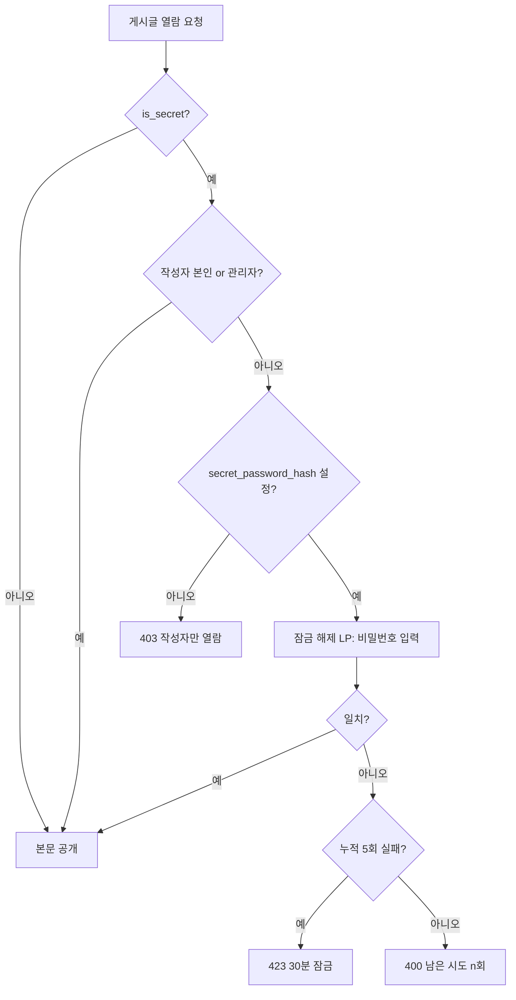
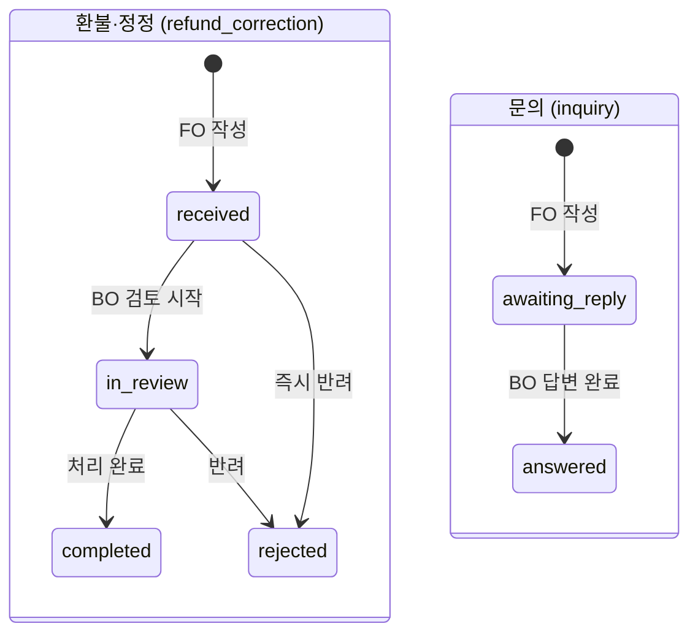

# 게시판(공지사항·환불·정보정정신청·문의게시판·FAQ) 상세 설계 (FO)

> 근거 기능정의서: `docs/기능정의서/FO/05_게시판_기능정의서.md` · 화면 ID 접두: `TPKM_FO_5_*`
> 표기 규약: `fo-00-common.md §0` 참조(API=실제 라우터 `/api/v1`, DB=`DB스키마_초안.md` 정본, 구현 모델 `models/board.py`·`models/content.py`).

---

## 1. 서비스 개요

- **목적**: 운영 공지(읽기), 환불·정보정정신청(자유게시판+비밀글+댓글/대댓글+워크플로), 문의게시판(일반/비밀+답글), FAQ(아코디언)를 제공한다.
- **범위**: 4개 하위 메뉴. 공지·FAQ는 공개 읽기, 환불·정정·문의는 로그인 필수 CRUD(현재 구현은 C·R + 댓글, 수정/삭제는 §5 참조).
- **주요 액터**: 비로그인(공지·FAQ 열람), 로그인 회원(환불·정정·문의 작성·열람·댓글), 관리자(BO 답변·상태·삭제).
- **관련 요구사항ID**: `TPKM_FO_REQ_004`, `006`, `011`, `015`, `017`, `018`, `002`
- **핵심 정책**:
  - 비밀글 본문은 **작성자 + 관리자만** 열람. 비밀번호 설정 시 타인은 비밀번호 입력(`unlock`)으로 열람 가능, **5회 실패 시 30분 잠금**.
  - 댓글/대댓글 지원(0526). 비밀글의 댓글/대댓글은 자동 비밀글(작성자·관리자만).
  - 알림은 **이메일만**(문자 제외, 0526). 글 작성 시 운영자 통지, 답글/상태 변경 시 작성자 통지.

### 1.1 페이지/섹션 목록

| 화면명 | 화면 ID | 타입 | HTML 파일 | 접근 권한 |
| --- | --- | --- | --- | --- |
| 게시판 · 공지사항 | `TPKM_FO_5_1_0_0_0_P` | Page | `notice.html` | 비로그인+로그인 |
| ─ 공지 목록 | `TPKM_FO_5_1_1_0_0_S` | Section | (notice 내) | 비로그인+로그인 |
| ─ 공지 상세 | `TPKM_FO_5_1_2_0_0_S` | Section | (notice 내) | 비로그인+로그인 |
| 게시판 · 환불·정보정정신청 | `TPKM_FO_5_2_0_0_0_P` | Page | `refund-correction.html` | 로그인 필수 |
| ─ 목록 | `TPKM_FO_5_2_1_0_0_S` | Section | (내부) | 로그인 필수 |
| ─ 작성 | `TPKM_FO_5_2_2_0_0_S` | Section | (내부) | 로그인 필수 |
| ─ 상세 + 답글 + 댓글 | `TPKM_FO_5_2_3_0_0_S` | Section | (내부) | 로그인 필수 |
| ─ 비밀글 잠금 해제 LP | `TPKM_FO_5_2_4_0_0_LP` | Layer Popup | (내부) | 로그인 필수 |
| 게시판 · 문의게시판 | `TPKM_FO_5_3_0_0_0_P` | Page | `qna.html` | 로그인 필수 |
| ─ 목록 | `TPKM_FO_5_3_1_0_0_S` | Section | (내부) | 로그인 필수 |
| ─ 작성 | `TPKM_FO_5_3_2_0_0_S` | Section | (내부) | 로그인 필수 |
| ─ 상세 + 답글 + 댓글 | `TPKM_FO_5_3_3_0_0_S` | Section | (내부) | 로그인 필수 |
| ─ 비밀글 잠금 해제 LP | `TPKM_FO_5_3_4_0_0_LP` | Layer Popup | (내부) | 로그인 필수 |
| 게시판 · FAQ | `TPKM_FO_5_4_0_0_0_P` | Page | `faq.html` | 비로그인+로그인 |

> `board_posts.board_type`: 환불·정정 = `refund_correction`, 문의 = `inquiry`. 공지는 `notices`, FAQ는 `faq_items`로 분리.

---

## 2. 페이지별 상세 설계

### 2.1 공지사항 — `TPKM_FO_5_1_0_0_0_P` (+ 목록 `5_1_1`, 상세 `5_1_2`)

- **개요**: 관리자 등록 공지 전용(읽기). 목록↔상세 SPA 토글. 카테고리 필터(중요/접수/시험/결과), 검색, 페이지네이션. 비로그인 열람 가능.

**액션 상세**

| 액션/트리거 | 입력 & 검증 | 처리(비즈니스 규칙) | 연동 API | 연동 DB | 결과/예외 |
| --- | --- | --- | --- | --- | --- |
| 목록 로드 | `category`, `q`, `page`, `page_size` | `is_published=true`만. 정렬 `is_pinned DESC, published_at DESC, id DESC`. 카테고리 별칭 흡수(important↔imp, apply↔registration). 검색은 **제목 ilike**. | `GET /api/v1/notices` | `notices` | 페이지네이션 메타 반환 |
| 상세 보기 | `notice_id` | 본문(`body_html`)·첨부·작성자·작성일. **조회수 증가**. | `GET /api/v1/notices/{id}` | `notices.view_count`(+`notice_view_logs` 정본) | 비공개/없음 → 404 |
| 이전/다음/목록 | — | 클라이언트 네비게이션. | (목록 재사용) | — | — |
| 첨부 다운로드 | `file_id` | 공지 첨부 다운로드. | `GET /api/v1/files/{id}` | `file_attachments`(owner_type=`notice`) | **권한 주의 §5** |

> 조회수: 정본/정의서는 "1회/세션" dedup이나 **구현은 매 호출 `view_count += 1`**(§5). 검색은 제목만(본문 전문검색 미지원).

### 2.2 환불·정보정정신청 — `TPKM_FO_5_2_0_0_0_P`

- **개요**: 자유게시판 형식 + 비밀글 + 댓글/대댓글 + 처리 워크플로. 응시료 환불 신청·회원 신원정보 정정 신청 용도. 로그인 필수.
- **워크플로**(`workflow_status`): `received`(접수) → `in_review`(처리중) → `completed`(완료) / `rejected`(반려).

#### 2.2.1 목록 — `TPKM_FO_5_2_1_0_0_S`

| 액션/트리거 | 입력 & 검증 | 처리(비즈니스 규칙) | 연동 API | 연동 DB | 결과/예외 |
| --- | --- | --- | --- | --- | --- |
| 목록 로드 | `board_type=refund_correction`, `page` | 전 사용자 글 목록(20건/page). 비밀글은 목록에 노출되나 본인 글이 아니면 **잠금**(제목/작성일만, 본문 비노출). 본인 글은 작성자명 "본인". | `GET /api/v1/board/posts?board_type=refund_correction` | `board_posts` | — |
| 유형/상태 필터 | 유형(환불/정정), 상태 칩 | 클라이언트 필터(서버는 board_type만). `post_type`(refund/correction), `workflow_status` 라벨. | (응답 필드) | `board_posts.post_type`, `workflow_status` | — |
| 비밀글 클릭 | post_id | 본인 → 바로 상세. 타인 → 잠금 해제 LP(`5_2_4`). | `GET /api/v1/board/posts/{id}` | `board_posts.is_secret` | locked 응답 |

#### 2.2.2 작성 — `TPKM_FO_5_2_2_0_0_S`

| 액션/트리거 | 입력 & 검증 | 처리(비즈니스 규칙) | 연동 API | 연동 DB | 결과/예외 |
| --- | --- | --- | --- | --- | --- |
| 첨부 업로드(선행) | 파일(jpg/png/pdf, ≤5MB) | MIME(magic byte)+확장자 이중 검증. pending 첨부로 저장(owner=본인). | `POST /api/v1/board/attachments` | `file_attachments`(owner_type=`board_attachment`) | 형식 오류 `INVALID_FILE_TYPE`, 용량 초과 `FILE_TOO_LARGE` |
| 글 제출 | `board_type=refund_correction`, `post_type`(환불/정정), `title`, `body`, `is_secret`, `secret_password?`, `attachment_file_ids[]` | 제목≤100·본문 필수. 비밀글이면 비밀번호 해시 저장(미입력 시 작성자·관리자만 열람, unlock 불가). 첨부는 본인 pending 첨부만 글에 귀속. `workflow_status=received`. | `POST /api/v1/board/posts` | `board_posts`, `file_attachments`(→`board_post`) | 성공 `{id, workflow_status, "접수되었습니다."}` |
| 작성 후 알림 | — | 운영자에게 신규 글 통지(이메일). 작성자 접수 통지도 발송. | (서버 `notify_board_post_created` → `email_outbox`) | `email_outbox`(`board_admin_new_post`/`board_refund_received`) | — |
| 약관 동의(정정) | 개인정보 처리 동의 체크 | 정정 신청은 신원 식별정보 처리 동의 필수(클라이언트 검증). | — | — | 미동의 시 제출 차단 |

> 정정 신청은 증빙(여권 사본 등) 첨부 권장. 0527부터 신원정보(성명/생년월일/성별/국적)는 내정보수정에서 직접 수정 가능(계정 06)하므로, 본 게시판은 **진행 중 접수 건 정정·환불** 등 운영자 처리가 필요한 케이스 중심.

#### 2.2.3 상세 + 답글 + 댓글/대댓글 — `TPKM_FO_5_2_3_0_0_S`

| 액션/트리거 | 입력 & 검증 | 처리(비즈니스 규칙) | 연동 API | 연동 DB | 결과/예외 |
| --- | --- | --- | --- | --- | --- |
| 상세 로드 | post_id | 본문·첨부·작성자(마스킹)·관리자 답글(`admin_reply`)·상태 칩. 비밀글이고 타인이면 본문 비노출(locked). | `GET /api/v1/board/posts/{id}` | `board_posts`, `file_attachments` | locked 시 §2.2.4 |
| 댓글 목록 | post_id | 트리(부모-replies). 잠긴 비밀글이면 **403**. | `GET /api/v1/board/posts/{id}/comments` | `board_comments`(`is_deleted=false`) | 403 FORBIDDEN |
| 댓글/대댓글 작성 | `body`, `parent_comment_id?` | 작성자·관리자 모두 가능. 잠긴 비밀글이면 403. | `POST /api/v1/board/posts/{id}/comments` | `board_comments`(author_user_id=본인) | 빈 본문 400 |
| 관리자 답글/상태 변경 | — | **BO에서 처리**(`admin_reply`, `workflow_status`). FO는 표시만. 변경 시 작성자에게 이메일 알림. | (BO `TPKM_BO_4_3`) | `board_posts.admin_reply/workflow_status` | 이메일(`board_reply`) |
| 본인 글 수정/삭제 | — | 정의서: 답변 전 가능. **현재 FO API 미구현(§5)**. | (없음) | — | (합의/미구현) |

> 비밀글 댓글 자동 비밀처리(0526): 모델 `board_comments.is_secret` 존재하나 **FO 댓글 생성 시 자동 설정 미구현**. 단, 비밀글은 post 레벨 잠금으로 타인 열람/댓글이 원천 차단되어 실질 보호됨(§5).

#### 2.2.4 비밀글 잠금 해제 LP — `TPKM_FO_5_2_4_0_0_LP`

| 액션/트리거 | 입력 & 검증 | 처리(비즈니스 규칙) | 연동 API | 연동 DB | 결과/예외 |
| --- | --- | --- | --- | --- | --- |
| 비밀번호 확인 | `password` | 본인/일반글은 잠금 없음(바로 반환). 비밀번호 미설정 비밀글은 작성자·관리자만(403). 일치 시 본문 반환·`secret_fail_count` 리셋. | `POST /api/v1/board/posts/{id}/unlock` | `board_posts.secret_password_hash` | 불일치 400(`남은 시도 n회`) |
| 5회 실패 잠금 | — | 5회 실패 시 30분 잠금(`secret_locked_until`). 잠금 중 시도 시 423. | (동일) | `board_posts.secret_fail_count/secret_locked_until` | 423 LOCKED |
| 관리자 | — | 관리자는 비밀번호 없이 BO에서 열람. | (BO) | — | — |

> 비밀번호 해시: bcrypt(서버 검증). 잠금 단위는 **게시글 단위 카운터**(구현). 정의서는 "IP+계정 단위" 명시 — 차이(§5).

### 2.3 문의게시판 — `TPKM_FO_5_3_0_0_0_P`

- **개요**: 회원→운영진 문의. 일반/비밀 구분. 로그인 필수. 환불·정정과 동일한 board API(`board_type=inquiry`).
- **워크플로**(`workflow_status`): `awaiting_reply`(답변대기) → `answered`(답변완료).

#### 2.3.1 목록 `5_3_1` / 작성 `5_3_2` / 상세 `5_3_3` / 잠금 LP `5_3_4`

| 화면 | 액션/트리거 | 처리(비즈니스 규칙) | 연동 API | 연동 DB |
| --- | --- | --- | --- | --- |
| 목록 `5_3_1` | 목록 로드 | `board_type=inquiry`. 탭(전체/일반/비밀)·카테고리(접수/시험/기타)·상태 칩은 클라이언트 필터. | `GET /api/v1/board/posts?board_type=inquiry` | `board_posts` |
| 작성 `5_3_2` | 글 제출 | 카테고리 필수, 공개범위(일반/비밀) 필수, 비밀 시 비밀번호. `workflow_status=awaiting_reply`. 운영자 통지. | `POST /api/v1/board/posts` | `board_posts`, `email_outbox` |
| 상세 `5_3_3` | 상세/답글/댓글 | 비밀글 본인·관리자만. 관리자 답변 완료 시 `answered` + 작성자 이메일(`inquiry_answered`). | `GET/POST /api/v1/board/posts/{id}`, `/comments` | `board_posts`, `board_comments` |
| 잠금 `5_3_4` | 비밀번호 확인 | 환불·정정 비밀글 잠금(`5_2_4`)과 동일 정책(5회/30분). | `POST /api/v1/board/posts/{id}/unlock` | `board_posts` |

> 문의 작성 시 알림은 **운영자 통지만**(FO/05). 작성자 접수 메일 발송 여부는 운영 정책(환불·정정은 작성자 접수 메일 포함).

### 2.4 FAQ — `TPKM_FO_5_4_0_0_0_P`

- **개요**: 분류 탭(접수/시험/결과/기타) + 검색 + 아코디언. 공개. 다국어(i18n + DB 다국어 컬럼).

| 액션/트리거 | 입력 & 검증 | 처리(비즈니스 규칙) | 연동 API | 연동 DB | 결과/예외 |
| --- | --- | --- | --- | --- | --- |
| FAQ 로드 | `lang`, `q` | 활성 FAQ `sort_order, id` 정렬. 언어별 본문(`question_{lang}`/`answer_{lang}`, 없으면 KO 폴백). 검색은 질문+답변 본문 매칭. 카테고리별 그룹(`groups`) 반환. | `GET /api/v1/faq` | `faq_items`(`is_active`) | — |
| 아코디언 토글 | — | 클라이언트 펼침. | — | — | — |

---

## 3. 상태 전이 / 핵심 비즈니스 규칙

### 3.1 비밀글 열람 권한 (flowchart)

### 3.2 게시판 워크플로 상태머신

> FO가 일으키는 전이는 **작성(received/awaiting_reply)**. 이후 상태는 BO. 상태 변경·답글 시 작성자에게 이메일 알림(0526, 이메일만).

### 3.3 권한·검증 요약

| 항목 | 규칙 |
| --- | --- |
| 공지/FAQ | 비로그인 열람. 작성/수정/삭제 = BO 전용. |
| 환불·정정/문의 | 로그인 필수. 작성 = 회원. 답글/상태/삭제 = 관리자. |
| 비밀글 본문 | 작성자 + 관리자만(비밀번호 또는 로그인 일치). |
| 첨부 | jpg/png/pdf, ≤5MB. magic byte + 확장자 이중 검증. (최대 개수는 클라이언트 제한) |
| XSS | 본문 sanitize-html 화이트리스트(서버). |
| 비밀번호 | bcrypt 단방향 해시, 서버 검증만. |

---

## 4. 타 서비스·BO 연동

| 영역 | 연계 화면/기능 | API/DB |
| --- | --- | --- |
| 공통(00) | 보호 메뉴 가드(환불·정정·문의) | `require_user` |
| 접수(04) | 취소 confirm → 환불·정정 진입 | `TPKM_FO_4_3_3` → `refund-correction.html` |
| 응시료 규정(03) | 환불 정책 본문 링크 | `TPKM_FO_3_3` |
| 콘텐츠(BO) | 공지·FAQ 등록·노출 | `notices`(`TPKM_BO_4_1`), `faq_items`(`TPKM_BO_4_2`) |
| 환불·정정 관리(BO) | 답변·상태·삭제 | `board_posts`(`TPKM_BO_4_3`) |
| 문의 관리(BO) | 답변·상태 | `board_posts`(`TPKM_BO_4_4`) |
| 처리 이력(BO) | 답변/삭제 시 자동 기록 | `admin_audit_logs`(`TPKM_BO_6_2`) |
| 이메일 | 작성·답글·상태·답변완료 통지 | `email_outbox`(`board_refund_received`/`board_reply`/`inquiry_answered`/`board_admin_new_post`) |

---

## 5. 운영 정책 합의 필요 항목 + 정본/구현 차이

| 구분 | 항목 | 상태 |
| --- | --- | --- |
| 정책 | 환불·정정/문의 처리 SLA(접수→검토→완료 표준 일수) | (합의 필요) |
| 정책 | 글 수정/삭제 가능 시점(작성 후 24h / 답변 전 등) | (합의 필요) |
| 정책 | 비밀글 비밀번호 분실 복구 절차 | (합의 필요) |
| 정책 | FAQ 다국어(KO/MY/EN) 입력·폴백 | (합의 필요) |
| 구현 차이 | **본인 글 수정/삭제 FO API 미구현**(정의서는 답변 전 가능) | 미구현 — `PATCH/DELETE /board/posts/{id}` 추가 필요 |
| 구현 차이 | 비밀글 댓글 **자동 비밀처리 미구현**(post 레벨 잠금으로 실질 보호) / 일반글 댓글 공개·비공개 옵션 미구현 | 구현 상이 |
| 구현 차이 | 비밀글 비밀번호 **선택**(미설정 시 작성자·관리자만, unlock 불가) — 정의서는 비밀번호 4자+ 필수 | 구현 상이 |
| 구현 차이 | 비밀글 잠금 카운터가 **게시글 단위**(정의서는 IP+계정 단위) | 구현 상이 |
| 구현 차이 | 공지 조회수 매 호출 증가(1회/세션 dedup·`notice_view_logs` 미사용) | 구현 상이 |
| 구현 차이 | 제목 ≤100·본문 길이 서버 검증 약함(정의서 제목 1~80·본문 1~5000) | 구현 점검 |
| 점검 필요 | **첨부 다운로드 권한**: `GET /files/{id}`는 user_photo/application_photo 본인·관리자만 허용 → notice/board 첨부는 비관리자에게 403 가능 | 구현 점검 필요(공개 공지 첨부 접근 보장 필요) |
| 정책 | 환불·정정 첨부 최대 5개 서버 강제(현재 클라이언트 제한) | (합의 필요) |
