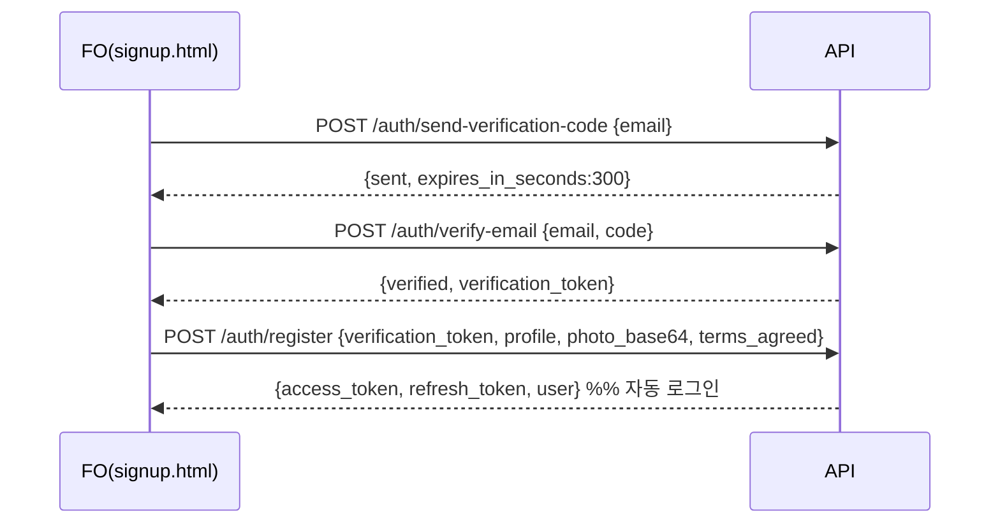
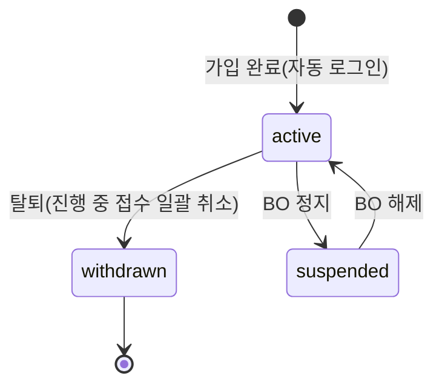
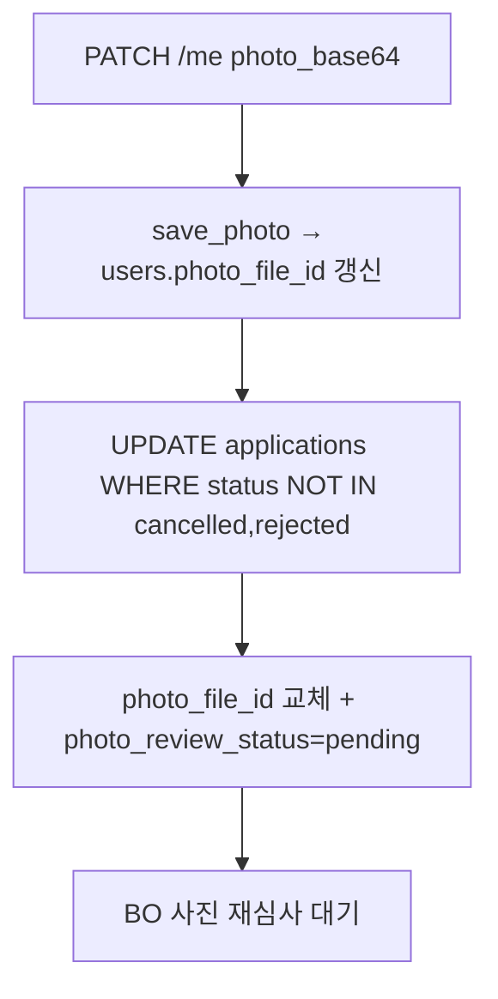
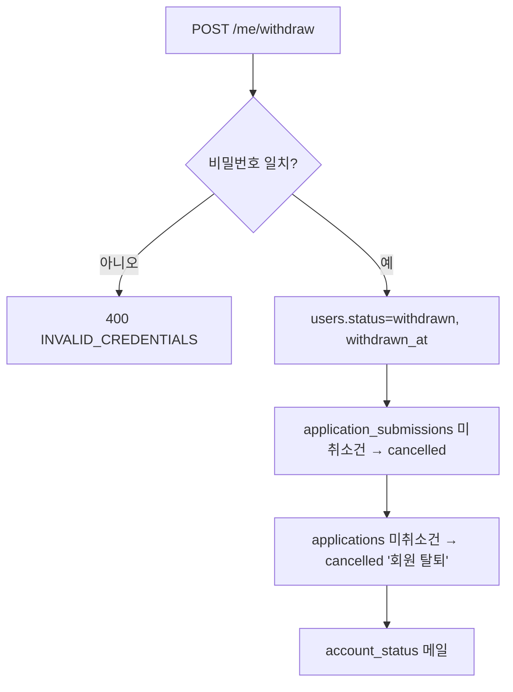

# 계정(회원가입·로그인·내정보) 상세 설계 (FO)

> 근거 기능정의서: `docs/기능정의서/FO/06_계정_회원가입·로그인·내정보_기능정의서.md` · 화면 ID 접두: `TPKM_FO_6_*`
> 표기 규약: `fo-00-common.md §0` 참조(API=실제 라우터 `/api/v1`, DB=`DB스키마_초안.md` 정본, 구현 `routers/auth.py`·`routers/me.py`).

---

## 1. 서비스 개요

- **목적**: 이메일 가입(증명사진 1회 등록 후 재사용)·로그인·아이디/비밀번호 찾기·내정보 수정·탈퇴를 제공한다. 인증된 이메일이 곧 로그인 아이디.
- **범위**: 로그인(+에러/아이디찾기/비번찾기) / 회원가입(3 STEP + 사진) / 마이페이지·내정보수정(+탈퇴). SNS 간편가입(구글)은 정의서 요구(0526)이나 **현재 구현 미가동**(§6).
- **주요 액터**: 비로그인(가입·로그인·찾기), 로그인 회원(내정보·탈퇴).
- **핵심 정책**:
  - 이메일 인증코드 **6자리/5분**, 비밀번호 재설정 코드 **6자리/30분**.
  - 비밀번호 **8자 이상 + 영문·숫자·특수 조합**(구현 강제). **6개월 주기 변경 유도**(180일).
  - 가입 사진은 시험 접수에서 그대로 사용(접수 시 추가 업로드 불가).
  - **회원등급제 없음**(0526).
  - 0527: 성명·생년월일·성별·국적 **내정보수정에서 직접 수정 가능**, 사진 변경 시 **진행 중 접수 건 즉시 반영 + 재심사**.
  - 탈퇴 시 **진행 중 접수 자동 취소**(0526).
  - 동시성: `users.rev` + `If-Match` 낙관적 잠금(409).
- **관련 요구사항ID**: `TPKM_FO_REQ_003`, `004`, `005`, `006`, `010`, `020`, `002`

### 1.1 페이지/컴포넌트 목록

| 화면명 | 화면 ID | 타입 | HTML 파일 | 접근 권한 |
| --- | --- | --- | --- | --- |
| 계정 · 로그인 | `TPKM_FO_6_1_0_0_0_P` | Page | `login.html` | 비로그인 |
| ─ 인증 실패 알림 | `TPKM_FO_6_1_1_0_0_C` | Component | (login 내) | 비로그인 |
| ─ 아이디(이메일) 찾기 LP | `TPKM_FO_6_1_2_0_0_LP` | Layer Popup | (login 내) | 비로그인 |
| ─ 비밀번호 찾기 LP | `TPKM_FO_6_1_3_0_0_LP` | Layer Popup | (login 내) → `password-reset.html` | 비로그인 |
| 계정 · 회원가입(3 STEP + 사진) | `TPKM_FO_6_2_0_0_0_P` | Page | `signup.html` | 비로그인 |
| ─ STEP1 이메일 인증(+구글) | `TPKM_FO_6_2_1_0_0_S` | Section | (signup 내) | 비로그인 |
| ─ STEP2 계정 설정(기본정보+비번+사진) | `TPKM_FO_6_2_2_0_0_S` | Section | (signup 내) | 비로그인 |
| ─ STEP3 약관 동의 | `TPKM_FO_6_2_3_0_0_S` | Section | (signup 내) | 비로그인 |
| ─ 가입 완료 모달 | `TPKM_FO_6_2_4_0_0_MP` | Modal | (signup 내) | 비로그인 |
| 계정 · 내정보 수정 | `TPKM_FO_6_3_0_0_0_P` | Page | `mypage-profile.html` | 로그인 필수 |

---

## 2. 페이지별 상세 설계

### 2.1 계정 · 로그인 — `TPKM_FO_6_1_0_0_0_P`

- **개요**: 이메일+비밀번호 로그인, 표시 토글, 로그인 상태 유지, 아이디/비밀번호 찾기 링크, 구글 간편 로그인 버튼(미가동), 회원가입 링크.
- **접근 권한**: 비로그인.

**액션 상세**

| 액션/트리거 | 입력 & 검증 | 처리(비즈니스 규칙) | 연동 API | 연동 DB | 결과/예외 |
| --- | --- | --- | --- | --- | --- |
| 로그인 | `email`, `password` | 이메일 정규화. 관리자→회원 순 조회(active). 비번 검증. 성공 시 access+refresh 발급 + 사용자 정보 반환. **로그인 상태 유지** 시 refresh 장기 보관. 비번 변경 180일 경과 시 변경 권고 메일(쿨다운 30일). | `POST /api/v1/auth/login` | `users`(`failed_login_count`,`login_locked_until`,`last_login_at`,`password_changed_at`) | 실패 401 `INVALID_CREDENTIALS` |
| 로그인 실패 잠금 | — | **5회 실패 시 30분 잠금**. 잠금 중 시도 423 `ACCOUNT_LOCKED`. | (동일) | `users.login_locked_until` | 잠금 메시지 |
| ?next 복귀 | `next` 파라미터 | 성공 시 `next`(동일 출처 상대경로)로 복귀, 없으면 홈. | (가드 연계) | — | open-redirect 검증 |
| 구글 간편 로그인 | — | `GOOGLE_CLIENT_ID` 설정 시 버튼·OAuth 가동. 미설정 시 `enabled:false`. | `GET /api/v1/auth/google/config`, `POST /auth/google` | `users.google_sub` | §6 |
| 회원가입/찾기 링크 | — | `signup.html` / 아이디·비번 찾기 LP. | — | — | — |

> 토큰: 스테이트리스 JWT(access) + refresh. 서버측 강제 무효화(블랙리스트/`user_sessions`)는 미적용(`fo-00 §5`).

#### 2.1.1 인증 실패 알림 — `TPKM_FO_6_1_1_0_0_C`

| 케이스 | 처리 |
| --- | --- |
| 미입력/형식 오류 | 인라인 에러(다국어). |
| 인증 실패 | "이메일 또는 비밀번호가 올바르지 않습니다."(401, 계정 존재 여부 비노출). |
| 계정 잠금 | "5회 실패로 30분 잠김"(423). |

#### 2.1.2 아이디(이메일) 찾기 LP — `TPKM_FO_6_1_2_0_0_LP`

| 액션/트리거 | 입력 & 검증 | 처리(비즈니스 규칙) | 연동 API | 연동 DB | 결과/예외 |
| --- | --- | --- | --- | --- | --- |
| 아이디 확인 | `name_ko`, `birth_date`, `phone`(전부 필수) | 3개 일치 active 회원의 **이메일 마스킹**(예: `h***@naver.com`) 목록 반환. | `POST /api/v1/auth/find-email` | `users`(name_ko/birth_date/phone) | 미일치 시 빈 목록 |
| 결과 표시(일반) | — | 마스킹 이메일 + [로그인하러 가기] + [비밀번호 찾기]. | — | — | — |
| 결과 표시(구글) | — | "구글 계정으로 가입" 배지 + [Google로 로그인하기], 비번찾기 미표시. **API는 provider 미반환 → FE 분기 위해 provider 노출 필요(§6)**. | (구글 미가동) | `users.signup_provider` | (합의/구현) |
| 오류 | — | 미입력 안내, 연속 실패 시 재시도 제한(운영 합의). | — | — | rate limit (합의 필요) |

#### 2.1.3 비밀번호 찾기 LP / 재설정 — `TPKM_FO_6_1_3_0_0_LP` (+ `password-reset.html`)

| 액션/트리거 | 입력 & 검증 | 처리(비즈니스 규칙) | 연동 API | 연동 DB | 결과/예외 |
| --- | --- | --- | --- | --- | --- |
| 인증코드 발송 | `email` | 미가입 → `{sent:false, registered:false}`. 구글/비번없음 → `{sent:false, registered:true, provider}`(구글 로그인 유도). 일반 → **6자리 코드, 30분** 이메일 발송. | `POST /api/v1/auth/forgot-password` | `password_reset_tokens`, `email_outbox`(`password_reset`) | dev 모드 `dev_code` |
| 코드 확인 | `email`, `code` | 일치·미만료 시 일회용 `reset_token` 발급(해시 보관). | `POST /api/v1/auth/verify-reset-code` | `password_reset_tokens` | 불일치/만료 400 `INVALID_CODE` |
| 새 비밀번호 저장 | `email`, `reset_token`, `password`, `password_confirm` | 비번 규칙(8+ 영문·숫자·특수) + 확인 일치. 저장 시 `password_changed_at` 갱신, 토큰 `used_at` 마킹(1회용). | `POST /api/v1/auth/reset-password` | `users.password_hash` | 토큰 무효 400 `INVALID_TOKEN` |

> 구글 간편가입 계정은 Google이 비밀번호 관리 → 재설정 불가(구글 로그인 유도). 새 비번 권장 강도(대/소/숫자/특수)는 정의서 표기, 구현은 8+ 영문·숫자·특수 필수.

### 2.2 계정 · 회원가입(3 STEP + 사진) — `TPKM_FO_6_2_0_0_0_P`

- **개요**: 이메일 인증(STEP1) → 기본정보+비번+사진(STEP2) → 약관(STEP3) → 완료. 인증 이메일 = 로그인 아이디. 가입 사진은 접수에서 재사용. 회원등급제 없음.
- **흐름(일반)**: 인증코드 발송/확인 → `verification_token` 획득 → STEP2/3 입력 → **단일 `POST /auth/register`로 일괄 생성**.

#### 2.2.1 STEP1 이메일 인증(+구글) — `TPKM_FO_6_2_1_0_0_S`

| 액션/트리거 | 입력 & 검증 | 처리(비즈니스 규칙) | 연동 API | 연동 DB | 결과/예외 |
| --- | --- | --- | --- | --- | --- |
| 인증코드 발송 | `email`, `preferred_lang` | 이메일 형식 검증. **이미 가입 시 409 `EMAIL_ALREADY_REGISTERED`**(중복 차단). 6자리 코드, **5분 TTL** 발송. | `POST /api/v1/auth/send-verification-code` | `email_verification_codes`, `email_outbox`(`signup_verify_code`) | dev `dev_code`, rate limit(권장) |
| 코드 확인 | `email`, `code` | 일치·미만료 시 `verification_token` 발급(이후 register에서 검증). 코드 행 삭제. | `POST /api/v1/auth/verify-email` | `email_verification_codes` | 400 `INVALID_CODE` |
| 타이머/재발송 | — | 5분 카운트다운, 만료 시 재발송 안내. | (send 재호출) | — | — |
| 구글 간편가입 | — | [구글로 계속하기] → ID token → JWT. `GOOGLE_CLIENT_ID` 설정 시 가동. | `GET /auth/google/config`, `POST /auth/google` | `users.signup_provider=google`, `google_sub` | §6 |
| 다음 활성화 | — | 이메일 인증 완료 전 [다음] 비활성. | — | — | — |

#### 2.2.2 STEP2 계정 설정(기본정보+비번+사진) — `TPKM_FO_6_2_2_0_0_S`

| 항목 | 입력 & 검증 |
| --- | --- |
| 이메일 | STEP1 인증값 고정(readonly, 수정 불가) |
| 한글/영문 성명 | 필수. 영문은 여권 표기 |
| 생년월일 | YYYYMMDD 정규화. **만 N세 미만 가입 불가**(구현 `AGE_RESTRICTED` 422 — 정의서 미명시, §6) |
| 성별 | `1`/`2` 코드 변환 |
| 국적 / 제1언어 / 연락처 | 필수 |
| 직업/응시동기/응시목적 | 코드 검증 — **직업 1~12 / 응시동기 1~11 / 응시목적 1~15**(연명부 코드) |
| 비밀번호(일반 가입) | **8자 이상 + 영문·숫자·특수 조합** + 확인 일치. 구글 가입은 비번 없음 |
| 증명사진 | jpg, **200KB~2MB**, 비율 3:4(35×45mm) 권장. base64 업로드 → 미리보기 |

| 액션/트리거 | 처리(비즈니스 규칙) | 연동 API | 연동 DB | 결과/예외 |
| --- | --- | --- | --- | --- |
| 입력 검증 | 클라이언트 1차 + 서버 register에서 최종 검증. | — | — | 인라인 에러(다국어) |
| (가입 제출은 STEP3 후 일괄) | `verification_token`+프로필+`photo_base64`+`terms_agreed[]`를 단일 호출. | `POST /api/v1/auth/register` | `users`, `file_attachments`(`user_photo`), `terms_consents` | §2.2.4 |

> 비밀번호 6개월 주기: 가입 시 `password_changed_at` 기록. 로그인 시 180일 경과면 변경 권고 메일. 강제 변경 팝업 여부는 (합의 필요).

#### 2.2.3 STEP3 약관 동의 — `TPKM_FO_6_2_3_0_0_S`

| 항목 | 처리 |
| --- | --- |
| 이용약관(필수)/개인정보 처리(필수)/마케팅 수신(선택) | 전체 동의 토글. 필수 미동의 시 진행 차단. |
| 동의 이력 | register 시 `terms_consents`에 종류·버전·동의여부·IP 저장. 마케팅 미전달 시 플래그 기준 1건 기록. |
| 약관 본문 | `GET /api/v1/terms` / `GET /api/v1/terms/{type}?lang=`로 게시중 약관 노출. |

#### 2.2.4 가입 완료 모달 — `TPKM_FO_6_2_4_0_0_MP`

| 액션/트리거 | 입력 & 검증 | 처리(비즈니스 규칙) | 연동 API | 연동 DB | 결과/예외 |
| --- | --- | --- | --- | --- | --- |
| 회원가입 제출 | `verification_token`, `email`, `password`+confirm, 프로필(성명/생년월일/성별/국적/제1언어/연락처/직업·동기·목적 코드), `photo_base64`, `marketing_opt_in`, `preferred_lang`, `terms_agreed[]` | 토큰=이메일 검증 → 비번 규칙 → 생년월일·연령 → 코드 검증 → 이메일 중복 재확인 → user 생성 → 사진 저장 → 동의 영속화 → **access+refresh 발급(자동 로그인)**. | `POST /api/v1/auth/register` | `users`, `file_attachments`, `terms_consents` | 중복 409, 검증 400/422 |
| 완료 후 이동 | — | 자동 로그인 → 홈 또는 `?next=` 복귀. | — | — | — |

#### 회원가입 시퀀스

### 2.3 계정 · 내정보 수정 — `TPKM_FO_6_3_0_0_0_P`

- **개요**: 회원 본인 수정 페이지(`mypage-profile.html`). 0527로 신원정보 직접 수정 허용 + 사진 변경 진행 중 접수 즉시 반영.
- **접근 권한**: 로그인 필수.
- **수정 가능 항목**: 연락처 / 이메일 / 비밀번호 / 사진 / 직업·응시동기·응시목적 / **성명(한글·영문)·생년월일·성별·국적(0527 직접 수정)**.

**액션 상세**

| 액션/트리거 | 입력 & 검증 | 처리(비즈니스 규칙) | 연동 API | 연동 DB | 결과/예외 |
| --- | --- | --- | --- | --- | --- |
| 프로필 로드 | — | `GET /me`로 현재값 + `rev`. | `GET /api/v1/me` | `users` | 401 시 가드 |
| 프로필 수정 | 변경 필드 + `rev`(또는 `If-Match`) | **낙관적 잠금**: `rev` 불일치 시 409 `CONFLICT`. 생년월일 정규화·성별 코드·코드 검증. 저장 후 `rev` 증가. | `PATCH /api/v1/me` | `users.*`, `rev` | 검증 400 |
| 사진 변경(0527) | `photo_base64` | 새 사진 저장 → `users.photo_file_id` 갱신 → **진행 중(취소·반려 제외) `applications`에 즉시 반영**(`photo_file_id` 교체 + `photo_review_status='pending'`로 BO 재심사). | `PATCH /api/v1/me`(photo 포함) | `users.photo_file_id`, `applications.photo_file_id/photo_review_status` | jpg 200KB~2MB |
| 비밀번호 변경 | `current_password`, `new_password`, `confirm` | 현재 비번 검증 → 새 비번 규칙(8+ 영문·숫자·특수)·확인 일치 → `password_hash` + `password_changed_at` 갱신. | `POST /api/v1/me/change-password` | `users.password_hash` | 400 `INVALID_CREDENTIALS`/`VALIDATION_ERROR` |
| 비번 6개월 배너 | `password_changed_at` | 마지막 변경 180일 경과 시 변경 권고 배너(FE 계산). | (`GET /me` 값) | `users.password_changed_at` | — |
| 이메일(로그인 ID) | — | **변경 불가**(가입 시 인증·확정). FO·BO 모두 수정 차단. | — | `users.email` | `400 EMAIL_NOT_EDITABLE`(BO 직접 변경 시) |
| 회원 탈퇴 | `password` | confirm("탈퇴 시 진행 중 접수 모두 취소") → 비번 검증 → `status=withdrawn`, `withdrawn_at`. **진행 중 submission·application 자동 취소**(cancel_reason="회원 탈퇴"). 계정 상태 메일. | `POST /api/v1/me/withdraw` | `users.status`, `application_submissions`, `applications` | 비번 오류 400 |

> 0527 검증: 성명 수정 후 BO 접수자 목록 즉시 반영, 생년월일·성별·국적 수정 후 접수 STEP2 readonly 주입값 갱신, 사진 변경 후 진행 중 접수 사진 즉시 변경 + 재심사 대기. (구현은 `applications` 직접 UPDATE로 충족; `profile_snapshot` 미보관이므로 과거 접수 표기는 현재 `users` 기준 — §6)

---

## 3. 상태 전이 / 핵심 비즈니스 규칙

### 3.1 가입 유형·계정 상태

> `users.status`: `active`/`suspended`/`withdrawn`. 탈퇴는 soft delete(`withdrawn_at`) + 30일 후 hard delete 정책(법정 보존 제외, 합의 필요). 정지·탈퇴 시 계정 상태 메일(`account_status`).

### 3.2 인증·코드·잠금 정책 요약

| 항목 | 값(구현) | 비고 |
| --- | --- | --- |
| 이메일 인증코드 | 6자리, 5분 | `email_verification_codes` |
| 비밀번호 재설정 코드 | 6자리, 30분, 1회용 | `password_reset_tokens` |
| 로그인 실패 잠금 | 5회 → 30분 | `users.failed_login_count/login_locked_until` |
| 비밀번호 규칙 | 8자+ 영문·숫자·특수(필수) | `is_valid_password` |
| 비밀번호 변경 유도 | 180일 경과 시 권고 메일(쿨다운 30일) | `password_expiry_reminder` |
| 낙관적 잠금 | `users.rev` + `If-Match`/body `rev` | 409 CONFLICT |

### 3.3 사진 변경 → 접수 연쇄(0527)

### 3.4 탈퇴 → 접수 연쇄(0526)

---

## 4. 타 서비스·BO 연동

| 영역 | 연계 화면/기능 | API/DB |
| --- | --- | --- |
| 공통(00) | 로그인/로그아웃/가드/`?next=`/언어(`preferred_lang`) | `/auth/login`,`/auth/logout`,`/auth/refresh`,`GET /me` |
| 접수(04) STEP2 | 회원정보 자동주입(readonly) | `GET /me` → `users` |
| 접수(04) STEP3 | 가입 사진 미리보기(업로드 불가) | `users.photo_file_id`, `GET /files/{id}` |
| 접수(04) | 사진 변경 시 진행 중 접수 반영, 탈퇴 시 접수 취소 | `applications` UPDATE |
| 환불·정정(05) | (운영자 처리 필요 시) 정정·환불 신청 | `board_posts(refund_correction)` |
| 약관 | 가입 동의·게시중 약관 | `terms`, `terms_consents`(`GET /terms`) |
| BO 회원 관리 | 정지·탈퇴·임시비번·정보수정 통지 | `users`(`TPKM_BO_5_1`) |
| BO 약관 관리 | 버전·동의 이력 | `terms_consents`(`TPKM_BO_5_2`) |
| Google OAuth | 가입·로그인(미가동) | `users.signup_provider/provider_uid` |
| 이메일 | 인증코드·재설정·비번 권고·계정 상태 | `email_outbox`(`signup_verify_code`/`password_reset`/`password_expiry_reminder`/`account_status`) |

---

## 5. 운영 정책 합의 필요 항목

| 구분 | 항목 | 상태 |
| --- | --- | --- |
| 정책 | 비밀번호 정책(길이/복잡도/주기) — 현재 8+ 영문·숫자·특수, 180일 권고 | 비고(구현 확정) |
| 정책 | 비번 6개월 경과 시 강제 변경 vs 안내(팝업) | (합의 필요) — 구현은 권고 메일 |
| 정책 | "로그인 상태 유지" 토큰 유효기간(제안 30일)·refresh rotation | (합의 필요) |
| 정책 | 약관 개정 시 강제 재동의·거부 시 이용 제한 | (합의 필요) |
| 정책 | 탈퇴 후 보존기간(제안 30일)·hard delete 범위 | (합의 필요) |
| 정책 | 아이디/비번 찾기 조회 횟수 제한·마스킹 노출 | (합의 필요) |
| 정책 | 복수 계정(일반+구글) 허용 여부·결과 화면 UX | (합의 필요) |

## 6. 정본/정의서 ↔ 구현 차이 (중요)

| 정의서/정본 | 구현 | 영향/조치 |
| --- | --- | --- |
| SNS 간편가입·로그인(구글, 0526) | `POST /auth/google` 구현 완료. `GOOGLE_CLIENT_ID` 미설정 시 `enabled:false` | **구현 완료** — Google Cloud 앱 등록·운영 env 설정 후 가동 |
| `POST /auth/signup`(REST 초안) | `POST /auth/register` | 경로 차이 |
| `/auth/email/verify/send`·`/confirm` | `/auth/send-verification-code`·`/auth/verify-email` | 경로 차이 |
| `PATCH /me/password` | `POST /me/change-password` | 경로/메서드 차이 |
| `POST /me/photo` 별도 업로드 | `PATCH /me`의 `photo_base64`(presign 흐름 아님) | 사진 교체 방식 차이 |
| 내정보수정 이메일 변경 가능(구 정의서) | **변경 불가 확정** — `PATCH /me`·BO 회원 수정 모두 `email` 차단 | 이메일 = 로그인 ID (합의 완료 2026-06-10) |
| `term_agreements`(정본 테이블) | `terms_consents`(`TermConsent` 모델) | 약관 동의 테이블 명칭 차이 |
| `GET /me` 응답 `password_change_due` | `password_changed_at` 반환(FE 계산) | 필드 차이 |
| (정의서 미명시) | 가입 시 **만 N세 미만 차단**(`AGE_RESTRICTED` 422) | 신규 제약 — 최소 연령 정책 (합의 필요) |
| 여권번호(`passport_no`) | **FO 미수집**(API 계약 없음, V001 레거시 nullable) | 정본과 일치(미수집 확정) |
