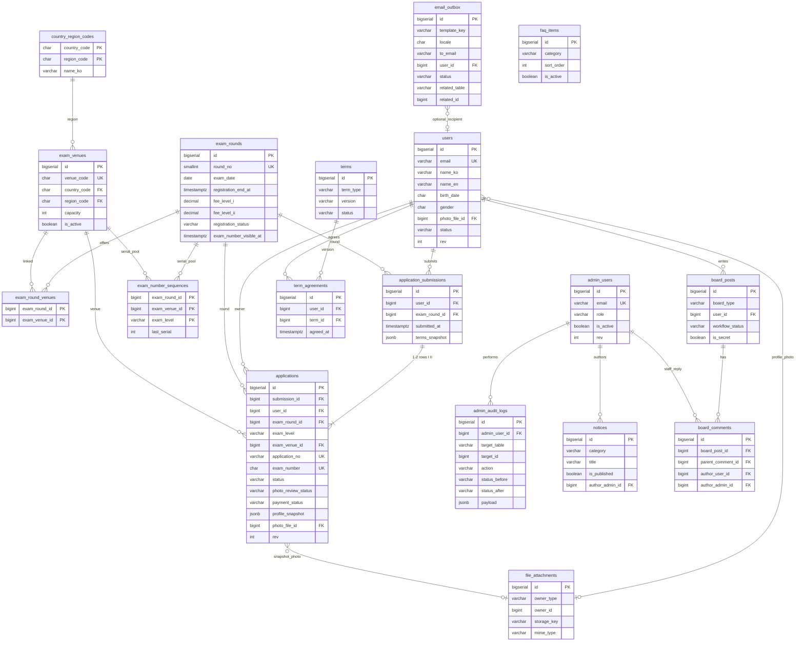
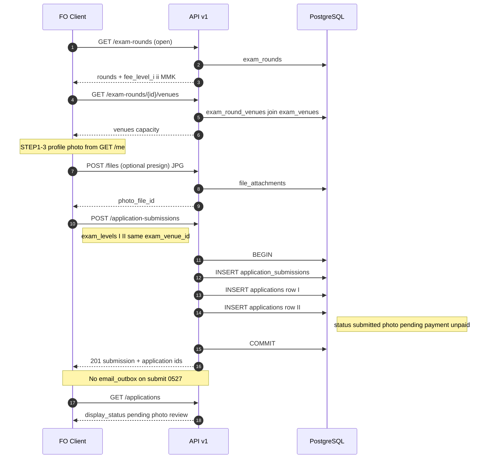
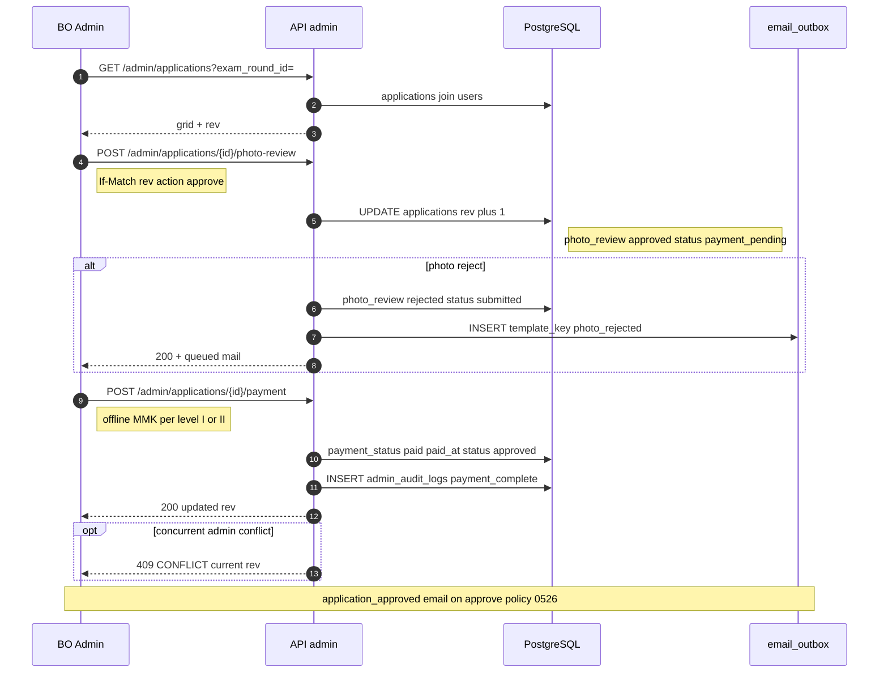
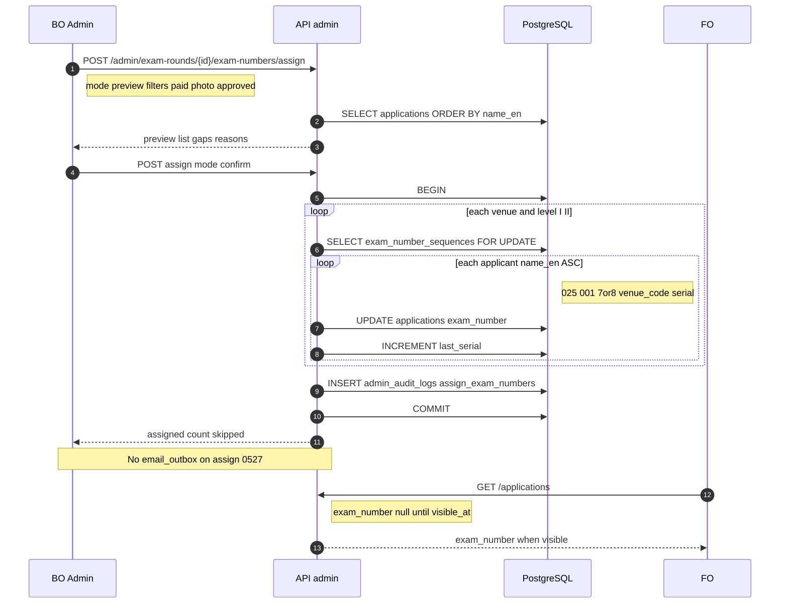
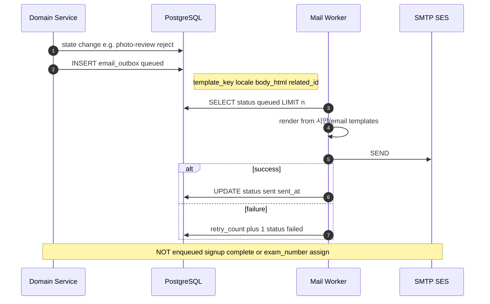

# TOPIK Myanmar — ERD 및 시퀀스 플로우 (v0.1)

> **목적**: V001 스키마·REST API·0527 정책을 한눈에 보는 **관계도(ERD)** 와 핵심 **시퀀스 다이어그램**. 백엔드·QA·온보딩용.  
> **근거**: `db/migrations/V001__initial_schema.sql`, `DB스키마_초안.md`, `REST_API_명세_초안.md`, `FO/04_TOPIK접수_기능정의서.md`, `BO/02_접수관리_기능정의서.md`  
> **UI**: C안 확정, 프로토타입 localStorage → 프로덕션 API (`REST_API_명세_초안.md` §6)

---

## A) ERD (핵심 엔티티)

`V001` 기준. 보조 테이블(`user_sessions`, `email_verification_codes` 등)은 ERD에서 생략.

### A.1 동시 접수(Ⅰ+Ⅱ) — 데이터 모델

| 규칙 | 구현 |
| --- | --- |
| 1회차 1그룹 | `application_submissions` `UNIQUE(user_id, exam_round_id)` |
| 급수별 행 | `exam_levels: ["I","II"]` → `applications` **2행**, 동일 `submission_id` |
| 동일 시험장 | 2행 모두 동일 `exam_venue_id` (수험번호 ④ `venue_code` 동일) |
| 수준 코드 | Ⅰ→`7`, Ⅱ→`8` (13자리 ③만 상이) |
| 응시료 | `exam_rounds.fee_level_i` / `fee_level_ii` (**MMK**), **오프라인 개별 수납** (급수별) |

### A.2 상태 축 (`applications`)

| 축 | 값 | FO 배지 연동 |
| --- | --- | --- |
| `status` | submitted → photo_review → payment_pending → approved → exam_number_assigned / rejected / cancelled | `GET /applications` `display_status` |
| `photo_review_status` | pending / approved / rejected | 사진심사중·반려 |
| `payment_status` | unpaid / paid / refunded | 수납대기·환불자(BO) |

---

## B) 시퀀스 다이어그램

### B.1 FO 접수 제출 (4단계 → submission + applications)

**언제 보나**: FO `register.html` STEP4 제출, API 연동 설계·통합 테스트, localStorage `topik_mm_reglist_v1` → 서버 이관 검증.

**정책**: 접수 완료 **이메일 없음**(0527). 초기 `payment_status=unpaid`(오프라인 MMK). 사진은 가입 시 `users.photo_file_id` 스냅샷.

| API | Method | Path |
| --- | --- | --- |
| 회차·응시료 | GET | `/exam-rounds`, `/exam-rounds/{id}` |
| 시험장 | GET | `/exam-rounds/{id}/venues` |
| 프로필·사진 | GET | `/me` |
| 파일 | POST | `/files`, `/files/presign` |
| **제출** | POST | `/application-submissions` |
| 목록 | GET | `/applications` |

---

### B.2 BO 수납·사진심사 (오프라인 MMK)

**언제 보나**: BO 접수자 그리드 처리, `applications.rev` 낙관적 잠금(409), 상태 전이 QA.

**정책**: 수납은 **오프라인 현장** 기록(`payment_memo`, `receipt_no`). Ⅰ·Ⅱ 동시 접수 시 **급수별 개별 수납**. 사진 반려 시 `photo_rejected` 메일만(접수 완료 메일 없음).

| API | Method | Path |
| --- | --- | --- |
| 목록 | GET | `/admin/applications` |
| 사진 심사 | POST | `/admin/applications/{id}/photo-review` |
| **오프라인 수납** | POST | `/admin/applications/{id}/payment` |
| 승인 | POST | `/admin/applications/{id}/approve` |
| 반려 | POST | `/admin/applications/{id}/reject` |
| 감사 | GET | `/admin/audit-logs` |

이메일: `photo_rejected`, `application_approved` → `REST_API_명세_초안.md` §4.

---

### B.3 BO 수험번호 일괄 부여 (13자리·알파벳 순)

**언제 보내**: 수납 마감 후 일괄 채번, `exam_number_sequences` + `FOR UPDATE`, 동시 접수 venue code 검증.

**정책**: `name_en` ASC, ⑤ serial 0001~; Ⅰ+Ⅱ **동일 ④ venue_code**; **수험번호 발급 이메일 없음**(0527); FO 노출은 `exam_rounds.exam_number_visible_at` 이후.

| API | Method | Path |
| --- | --- | --- |
| 미리보기·확정 | POST | `/admin/exam-rounds/{id}/exam-numbers/assign` |
| FO 조회 | GET | `/applications`, `/applications/{id}` |
| 회차 노출일 | PATCH | `/admin/exam-rounds/{id}` (`exam_number_visible_at`) |

채번 형식: `025` + `001` + `7|8` + `venue_code`(2) + `serial`(4) — `DB스키마_초안.md` §4.8.

---

### B.4 이메일 발송 (이벤트 → outbox → 워커)

**언제 보나**: SMTP 워커·템플릿 연동, 트리거 매트릭스 점검. **미발송**: 접수 완료·수험번호 부여.

| template_key | 트리거 (예) | API·도메인 |
| --- | --- | --- |
| `signup_verify_code` | 가입 인증 | `POST /auth/email/verify/send` |
| `password_reset` | 비밀번호 찾기 | `POST /auth/password/forgot` |
| `photo_rejected` | 사진 반려 | `POST .../photo-review` reject |
| `application_approved` | 승인 완료 | `POST .../approve` |
| `application_rejected` | 접수 반려 | `POST .../reject` |
| `board_refund_received` | 환불·정정 작성 | `POST /board/posts` |
| `board_admin_new_post` | 운영자 알림 | 동일 |
| `board_reply` | 답변·댓글 | `POST .../reply` |
| `inquiry_answered` | 문의 답변 | workflow answered |
| `notice_marketing` | 공지 publish | `PATCH /admin/notices` |
| `temp_password` | BO 임시 비밀번호 | `POST /admin/users/{id}/reset-password` |
| `account_status` | 정지·탈퇴 | `PATCH /admin/users/{id}` |
| `member_info_changed` | 회원정보 수정 | 동일 |
| `password_expiry_reminder` | 6개월 권고 | 배치 |

전체 14종: `시안/email/README.md`. 스키마: `DB스키마_초안.md` §4.17.

---

## C) 프로토타입 ↔ API 흐름 (C안)

| 프로토타입 키 | 본 문서 플로우 |
| --- | --- |
| `topik_mm_reglist_v1` | B.1 |
| `topik_mm_record_locks_v1` | B.2 (`rev` / 409) |
| BO 수험번호 모달 | B.3 |
| `topik_mm_mail_outbox_v1` | B.4 |

---

## D) 관련 문서

| 문서 | 경로 |
| --- | --- |
| DB 스키마 상세 | `DB스키마_초안.md` |
| DDL | `../../db/migrations/V001__initial_schema.sql` |
| REST API | `REST_API_명세_초안.md` |
| 마이그레이션·시드 | `마이그레이션_및_시드.md` |
| FO 접수 | `FO/04_TOPIK접수_기능정의서.md` |

---

## E) 변경 이력

| 버전 | 일자 | 내용 |
| --- | --- | --- |
| v0.1 | 2026-06-03 | ERD 전체 + 시퀀스 4종 — 백로그 #9 |
