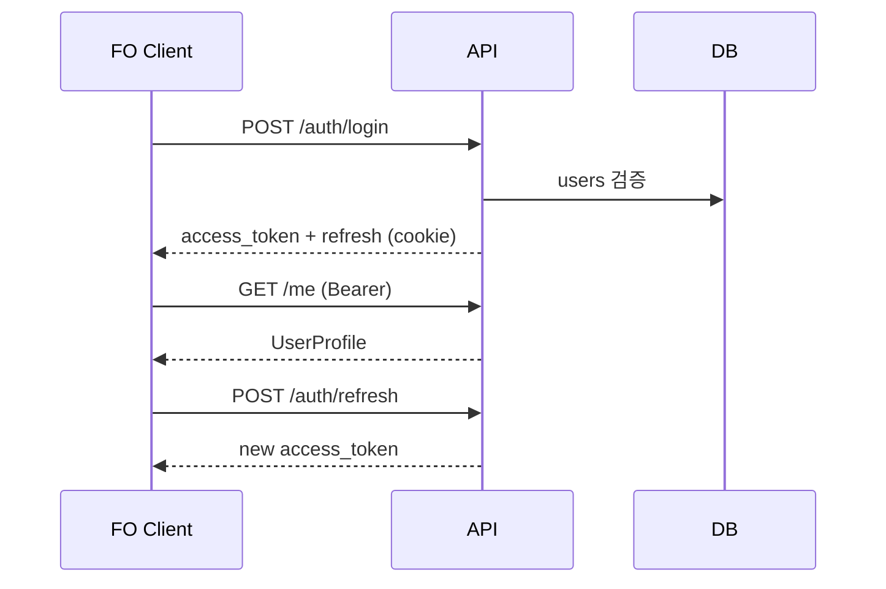

# TOPIK Myanmar — REST API 명세 초안 (v0.1)

> **목적**: 프로덕션 HTTP API 초안. 백엔드·프론트 연동 기준 문서.  
> **근거**: `기능정의서/DB스키마_초안.md`, FO/BO 기능정의서, `html/shared/api-client.js`  
> **상태**: v0.1 초안 — **실제 구현 정본은 `apps/api`** ([`docs/system_design/tech-spec.md`](../system_design/tech-spec.md) §4)  
> **갱신:** 2026-06-09 — FastAPI FO/BO API 대부분 구현 완료. 초안과 다른 경로·필드는 tech-spec §4.2 「초안 대비 차이」 참고.

### 구현 현황 (2026-06-09)

| 영역 | 구현 (`apps/api`) | 초안과 다른 점 |
| --- | --- | --- |
| Auth | `/auth/register`, `/auth/send-verification-code`, `/auth/google` | 초안 `/auth/signup`, `/auth/email/verify/*` |
| Admin login | 공용 `/auth/login` (portal=bo) | 초안 `/admin/auth/login` |
| 채번 | `POST .../assign-exam-numbers` (`dry_run`) | 초안 `.../exam-numbers/assign` (`mode:preview`) |
| Export | 동기 `roster.xlsx`, `photos.zip` | 초안 비동기 Job |
| Google OAuth | **구현** (`GOOGLE_CLIENT_ID` 설정 시) | 초안 redirect flow |
| Internal | `/internal/notifications/*` | **미구현** |

---

## 1. 공통 규약

### 1.1 Base URL·포맷

| 항목 | 값 |
| --- | --- |
| Base URL | `https://{host}/api/v1` |
| Content-Type | `application/json; charset=utf-8` |
| Accept | `application/json` |
| 다국어 | 요청 헤더 `Accept-Language: ko` \| `my` \| `en` (기본 `ko`) |
| FO 정적 | HTML/CSS/JS는 Nginx 등에서 별도 서빙 (본 API와 분리) |

### 1.2 인증 (권장: 이중 토큰 + 경로 분리)

| 구분 | 권장 방식 | 비고 |
| --- | --- | --- |
| **FO** | Access JWT (`Authorization: Bearer`) + Refresh Token | Refresh는 `httpOnly` 쿠키 또는 별도 POST `/auth/refresh` |
| **BO** | Admin Access JWT + Admin Refresh | **경로 prefix 분리**: `/api/v1/admin/*` — FO 토큰으로 접근 불가 |
| **Google OAuth** | `GET /auth/oauth/google` → redirect → `GET /auth/oauth/google/callback` | `id_token` 서버 검증, `users.provider_uid` 저장 |
| **이메일 인증** | `POST /auth/email/verify/send`, `POST /auth/email/verify/confirm` | 6자리, TTL 5분 — `email_verification_codes` |
| **비밀번호 재설정** | `POST /api/v1/auth/forgot-password`, `POST /api/v1/auth/verify-reset-code`, `POST /api/v1/auth/reset-password` | 6자리 인증코드 30분 → 검증 후 재설정 토큰 — `password_reset_tokens` |

**세션 대안**: 동일 스키마로 `user_sessions` 테이블 + `Set-Cookie` 세션 ID도 가능. 본 명세는 JWT 예시를 기본으로 서술.

#### FO 인증 흐름 (요약)



#### BO 인증·RBAC

| `admin_users.role` | API 접근 |
| --- | --- |
| `super` | 전체 `/admin/*` |
| `standard` | 접수·콘텐츠·회원 (시스템 계정 CRUD 제외 — 운영 매트릭스 확정 후) |
| `readonly` | GET만 |

권한 미충족: `403` + `FORBIDDEN`. FO 토큰으로 `/admin/*` 호출: `403`.

### 1.3 표준 에러 응답

HTTP 상태 + JSON 본문 (스택 트레이스·내부 SQL 미노출).

```json
{
  "error": {
    "code": "VALIDATION_ERROR",
    "message": "입력값을 확인해 주세요.",
    "details": [
      { "field": "email", "reason": "invalid_format" }
    ],
    "request_id": "01HZYX..."
  }
}
```

| HTTP | `error.code` (예) | 용도 |
| ---: | --- | --- |
| 400 | `VALIDATION_ERROR` | 형식·필수값 |
| 401 | `UNAUTHORIZED` | 미인증·만료 토큰 |
| 403 | `FORBIDDEN` | 권한·비밀글·타인 리소스 |
| 404 | `NOT_FOUND` | |
| 409 | `CONFLICT` | 낙관적 잠금·중복 접수·동시 채번 |
| 422 | `BUSINESS_RULE_VIOLATION` | 상태 전이 불가·수납 후 취소 등 |
| 429 | `RATE_LIMITED` | 로그인·인증코드·API |
| 500 | `INTERNAL_ERROR` | |

**409 CONFLICT (낙관적 잠금)** — BO 수납·승인·반려·프로필 수정:

```json
{
  "error": {
    "code": "CONFLICT",
    "message": "이미 다른 관리자가 처리했습니다.",
    "conflict": {
      "resource": "applications",
      "id": 12045,
      "current_rev": 4,
      "handled_by_admin_id": 2,
      "handled_at": "2026-07-26T10:02:00+06:30"
    }
  }
}
```

클라이언트는 최신 `rev`로 재조회 후 재시도.

### 1.4 페이지네이션

목록 API 공통 쿼리:

| 파라미터 | 타입 | 기본 | 설명 |
| --- | --- | --- | --- |
| `page` | int | 1 | 1-based |
| `page_size` | int | 20 | max 100 |
| `sort` | string | 리소스별 | 예: `-created_at`, `name_en` |

응답 래퍼:

```json
{
  "items": [],
  "pagination": {
    "page": 1,
    "page_size": 20,
    "total_items": 342,
    "total_pages": 18
  }
}
```

커서 방식(대량 BO 그리드)은 v0.2에서 `cursor`/`next_cursor` 추가 검토.

### 1.5 낙관적 잠금 (`rev`)

| 리소스 | DB 컬럼 | 요청 |
| --- | --- | --- |
| `users` (FO 프로필·BO 회원 수정) | `users.rev` | `If-Match: 3` 또는 body `"rev": 3` |
| `applications` (BO 처리) | `applications.rev` | 동일 |
| `exam_rounds`, `exam_venues` (BO) | `*.rev` | 동일 |

- GET 응답에 항상 `rev` 포함.
- PATCH/PUT/POST(상태 변경) 시 **필수**.
- 불일치 → **409** (`CONFLICT`).

### 1.6 파일 업로드

| 단계 | API | 설명 |
| --- | --- | --- |
| 1 | `POST /files/presign` 또는 `POST /files` | 메타 등록 + 업로드 URL |
| 2 | 클라이언트 → 스토리지 PUT | JPG, 200KB–2MB, magic byte 검증 |
| 3 | `PATCH /files/{id}/complete` | `file_attachments` 확정 |

다운로드(사진·첨부): `GET /files/{id}` → **302 signed URL** 또는 인증 프록시 스트림. 공개 URL 금지.

### 1.7 비동기 작업 (Job)

엑셀·ZIP 등 장시간 작업:

```json
{
  "job_id": "job_01HZ...",
  "status": "queued",
  "type": "roster_export",
  "created_at": "..."
}
```

`GET /admin/jobs/{job_id}` → `completed` 시 `download_url` (TTL 1h).

---

## 2. FO API (`/api/v1`)

> 인증 필요: 🔒 표시. 미표시 GET은 공개(공지·FAQ·회차 목록 등).

### 2.1 인증·회원 (`users`, `term_agreements`, 보조 테이블)

| Method | Path | Auth | DB 테이블 | 설명 |
| --- | --- | --- | --- | --- |
| POST | `/auth/signup` | — | `users`, `term_agreements`, `file_attachments` | 이메일 가입 완료(STEP2+3 일괄) |
| POST | `/auth/email/verify/send` | — | `email_verification_codes` | 6자리 발송, rate limit |
| POST | `/auth/email/verify/confirm` | — | `email_verification_codes` | 인증 완료 플래그 |
| POST | `/auth/login` | — | `users`, `user_sessions` | email+password |
| POST | `/auth/logout` | 🔒 | `user_sessions` | refresh 무효화 |
| POST | `/auth/refresh` | refresh | `user_sessions` | access 재발급 |
| GET | `/auth/oauth/google` | — | — | OAuth redirect |
| GET | `/auth/oauth/google/callback` | — | `users` | 가입/로그인, JWT 발급 |
| POST | `/api/v1/auth/forgot-password` | — | `password_reset_tokens`, `email_outbox` | 6자리 재설정 인증코드 발송 |
| POST | `/api/v1/auth/verify-reset-code` | code | `password_reset_tokens` | 인증코드 확인 후 재설정 토큰 발급 |
| POST | `/api/v1/auth/reset-password` | token | `users` | 새 비밀번호 저장 |
| POST | `/auth/find-email` | — | `users` | 아이디 찾기(마스킹 응답) |
| GET | `/me` | 🔒 | `users`, `file_attachments` | 프로필 + `rev` |
| PATCH | `/me` | 🔒 | `users`, `applications` | 연락처·이메일·신원정보·코드·`rev` 필수. 사진 변경 시 진행 중 `applications` 연동 |
| POST | `/me/photo` | 🔒 | `file_attachments`, `users.photo_file_id` | 증명사진 교체 → BO 재심사 트리거 |
| PATCH | `/me/password` | 🔒 | `users` | 비밀번호 변경 |
| POST | `/me/withdraw` | 🔒 | `users`, `applications` | 탈퇴·접수 취소 연쇄 |
| GET | `/terms` | — | `terms` | 가입용 최신 published |
| GET | `/terms/{type}/latest` | — | `terms` | `service`/`privacy`/`marketing` |

**`POST /auth/signup` 요청 예시**

```json
{
  "email": "user@example.com",
  "verification_token": "ev_xxx",
  "password": "********",
  "profile": {
    "name_ko": "홍길동",
    "name_en": "HONG GILDONG",
    "birth_date": "19900101",
    "gender": "1",
    "nationality": "Myanmar",
    "first_language": "Burmese",
    "phone": "+959...",
    "job_code": 3,
    "motive_code": 2,
    "purpose_code": 5,
    "preferred_lang": "ko"
  },
  "photo_file_id": 101,
  "agreements": [
    { "term_id": 1, "agreed": true },
    { "term_id": 2, "agreed": true },
    { "term_id": 3, "agreed": false }
  ]
}
```

**`GET /me` 응답 예시** — `password_hash` 미포함. **여권번호(`passport_no`) FO 미수집** — 요청·응답 모두 제외.

```json
{
  "id": 1001,
  "email": "user@example.com",
  "signup_provider": "email",
  "name_ko": "홍길동",
  "name_en": "HONG GILDONG",
  "birth_date": "19900101",
  "gender": "1",
  "photo_url": "/api/v1/files/101/content",
  "marketing_opt_in": false,
  "password_change_due": false,
  "rev": 2
}
```

### 2.2 회차·시험장 (읽기 전용)

| Method | Path | Auth | DB | 설명 |
| --- | --- | --- | --- | --- |
| GET | `/exam-rounds` | — | `exam_rounds` | FO STEP1 — `registration_status=open` 필터 |
| GET | `/exam-rounds/{id}` | — | `exam_rounds` | 상세·응시료 |
| GET | `/exam-rounds/{id}/venues` | 🔒 | `exam_round_venues`, `exam_venues` | 접수 가능 시험장·잔여 정원 |

### 2.3 접수 (`application_submissions`, `applications`)

| Method | Path | Auth | DB | 설명 |
| --- | --- | --- | --- | --- |
| GET | `/applications` | 🔒 | `applications`, `application_submissions`, `exam_rounds`, `exam_venues` | 마이페이지 목록(0527 카드 집계) |
| GET | `/applications/{id}` | 🔒 | `applications` | 본인만(IDOR 검증) |
| POST | `/application-submissions` | 🔒 | `application_submissions`, `applications` | **4단계 제출 일괄** — Ⅰ+Ⅱ 원자 처리 |
| POST | `/applications/{id}/cancel` | 🔒 | `applications` | 수납 전만 — `status=cancelled` |
| GET | `/applications/{id}/receipt` | 🔒 | `applications` | 접수 확인증 HTML/PDF 데이터 |

**`POST /application-submissions` 요청** (STEP1~4 서버 검증)

```json
{
  "exam_round_id": 98,
  "exam_levels": ["I", "II"],
  "exam_venue_id": 3,
  "terms_agreed": [1, 2],
  "photo_checklist_confirmed": true
}
```

**처리 규칙**

- `UNIQUE(user_id, exam_round_id)` on submission — 동일 회차 1그룹.
- `exam_levels` 2개 시 `applications` **2행**, 동일 `submission_id`·`exam_venue_id`.
- `profile_snapshot` = 제출 시점 `users` 스냅샷 JSON.
- 초기: `status=submitted`, `photo_review_status=pending`, `payment_status=unpaid`.
- 중복 급수 → **409** `DUPLICATE_APPLICATION`.
- FO 접수 완료 **이메일 없음** (0527).

**`GET /applications` 응답 (마이페이지)** — FO 배지 7종은 API에서 집계:

```json
{
  "items": [
    {
      "submission_id": 500,
      "exam_round": { "id": 107, "title": "제107회", "exam_date": "2026-10-18" },
      "venue": { "id": 3, "name_ko": "양곤..." },
      "levels": [
        {
          "application_id": 10001,
          "exam_level": "I",
          "application_no": "APP-98-I-xxx",
          "display_status": "payment_pending",
          "photo_review_status": "approved",
          "payment_status": "unpaid",
          "exam_number": null,
          "exam_number_visible": false,
          "can_cancel": true
        }
      ]
    }
  ],
  "pagination": { "page": 1, "page_size": 20, "total_items": 1, "total_pages": 1 }
}
```

`display_status` 매핑은 `DB스키마_초안.md` §3.1. `exam_number`는 `exam_rounds.exam_number_visible_at` 이후만 노출 (0527).

### 2.4 게시판·콘텐츠

| Method | Path | Auth | DB | 설명 |
| --- | --- | --- | --- | --- |
| GET | `/notices` | — | `notices` | 카테고리·검색·페이지 |
| GET | `/notices/{id}` | — | `notices`, `notice_view_logs` | 조회수 1회/세션 |
| GET | `/faq` | — | `faq_items` | `?category=` |
| GET | `/board/posts` | 🔒 | `board_posts` | `?board_type=refund_correction\|inquiry` |
| POST | `/board/posts` | 🔒 | `board_posts`, `file_attachments` | 비밀글 시 `secret_password` |
| GET | `/board/posts/{id}` | 🔒 | `board_posts` | 권한 검증·비밀글 |
| POST | `/board/posts/{id}/unlock` | 🔒 | `board_posts` | 비밀번호 검증 |
| PATCH | `/board/posts/{id}` | 🔒 | `board_posts` | 작성자·답변 전 |
| DELETE | `/board/posts/{id}` | 🔒 | `board_posts` | soft delete 정책 |
| GET | `/board/posts/{id}/comments` | 🔒 | `board_comments` | |
| POST | `/board/posts/{id}/comments` | 🔒 | `board_comments` | 대댓글 `parent_comment_id` |

환불·정정 작성 시 작성자 접수 확인 이메일 + 운영자 알림. 문의 작성은 **운영자 통지만** (FO/05).

---

## 3. BO API (`/api/v1/admin`)

> 모든 경로 **Admin JWT 필수**. FO Bearer 거부.

### 3.1 인증·대시보드

| Method | Path | DB | 설명 |
| --- | --- | --- | --- |
| POST | `/admin/auth/login` | `admin_users` | |
| POST | `/admin/auth/logout` | `user_sessions` (admin) | |
| POST | `/admin/auth/refresh` | — | |
| GET | `/admin/me` | `admin_users` | role 포함 |
| GET | `/admin/dashboard/summary` | `applications` 집계 | KPI 카드 |

### 3.2 회차·시험장 CRUD

| Method | Path | DB | 설명 |
| --- | --- | --- | --- |
| GET/POST | `/admin/exam-rounds` | `exam_rounds` | 목록·등록 |
| GET/PATCH/DELETE | `/admin/exam-rounds/{id}` | `exam_rounds` | `rev`·`exam_number_visible_at` (0527) |
| GET/POST | `/admin/exam-venues` | `exam_venues` | |
| GET/PATCH | `/admin/exam-venues/{id}` | `exam_venues` | |
| PUT | `/admin/exam-rounds/{id}/venues` | `exam_round_venues` | 회차–시험장 N:M |
| GET | `/admin/country-regions` | `country_region_codes` | 마스터 |

### 3.3 접수자 관리

| Method | Path | DB | 설명 |
| --- | --- | --- | --- |
| GET | `/admin/applications` | `applications`, `users` | 필터: `exam_round_id`, `status`, `venue_id`, `exam_level`, q |
| GET | `/admin/applications/{id}` | `applications`, `admin_audit_logs` | 상세·타임라인 |
| POST | `/admin/applications/{id}/photo-review` | `applications` | `approve` \| `reject` + code — `If-Match` |
| POST | `/admin/applications/{id}/payment` | `applications` | 수납 완료 — `payment_status=paid` |
| POST | `/admin/applications/{id}/payment/refund` | `applications` | 환불자 — 수험번호 유지 (0526) |
| POST | `/admin/applications/{id}/approve` | `applications` | 승인 완료 |
| POST | `/admin/applications/{id}/reject` | `applications` | `reject_code` |
| POST | `/admin/exam-rounds/{id}/exam-numbers/assign` | `applications`, `exam_number_sequences` | 일괄 채번 preview/confirm |
| POST | `/admin/exam-rounds/{id}/exports/roster` | Job | 연명부 xlsx → job |
| POST | `/admin/exam-rounds/{id}/exports/photo-zip` | Job | ZIP → job |

**`POST .../photo-review` 요청**

```json
{
  "rev": 3,
  "action": "reject",
  "photo_reject_code": "not_frontal",
  "photo_reject_note": ""
}
```

**`POST .../exam-numbers/assign`**

```json
{
  "mode": "preview",
  "exam_round_id": 98,
  "filters": { "payment_status": "paid", "photo_review_status": "approved" }
}
```

→ preview 응답에 채번 목록·누락 사유. `mode: "confirm"` 시 트랜잭션 커밋 + `admin_audit_logs`. **수험번호 발급 이메일 없음** (0527).

### 3.4 회원·약관

| Method | Path | DB | 설명 |
| --- | --- | --- | --- |
| GET | `/admin/users` | `users` | 검색·페이지 |
| GET/PATCH | `/admin/users/{id}` | `users` | 정지·탈퇴·수정 + `rev` |
| POST | `/admin/users/{id}/reset-password` | `users`, `email_outbox` | 임시 비밀번호 |
| GET/POST/PATCH | `/admin/terms` | `terms` | 버전·다국어 |
| GET | `/admin/users/{id}/term-agreements` | `term_agreements` | |

### 3.5 콘텐츠

| Method | Path | DB | 설명 |
| --- | --- | --- | --- |
| GET/POST/PATCH/DELETE | `/admin/notices` | `notices` | publish 시 마케팅 메일 큐 (0527) |
| GET/POST/PATCH/DELETE | `/admin/faq` | `faq_items` | |
| GET/PATCH | `/admin/board/posts` | `board_posts`, `board_comments` | 환불·문의 관리 |
| POST | `/admin/board/posts/{id}/reply` | `board_posts` | 공식 답변 |
| PATCH | `/admin/board/posts/{id}/workflow` | `board_posts` | 상태 변경 |

### 3.6 시스템·감사·Job

| Method | Path | DB | 설명 |
| --- | --- | --- | --- |
| GET/POST/PATCH | `/admin/admin-users` | `admin_users` | RBAC |
| GET | `/admin/audit-logs` | `admin_audit_logs` | 필터 `target_table`, `target_id` |
| GET | `/admin/jobs/{id}` | (job store) | export 다운로드 URL |

---

## 4. 이메일·내부 트리거

구현 방식 **택1** (v0.1 병행 기술):

| 방식 | 설명 |
| --- | --- |
| **A. 도메인 이벤트** | 상태 변경 서비스 → `email_outbox` INSERT → 워커 발송 |
| **B. 내부 API** | `POST /internal/notifications/enqueue` (API Key, FO/BO 미노출) |

| template_key | 트리거 | 체크리스트 |
| --- | --- | --- |
| `signup_verify_code` | 인증코드 발송 | 175 |
| `password_reset` | 비밀번호 찾기 | 176 |
| `application_approved` | BO 승인 | 177 |
| `application_rejected` | BO 반려 | 178 |
| `photo_rejected` | 사진 반려 | 179 |
| `board_refund_received` | 환불·정정 작성 | 180 |
| `board_reply` | 답변·댓글·상태 | 181 |
| `inquiry_answered` | 문의 답변 완료 | 182 |
| `notice_marketing` | 공지 신규 publish | 183 |
| `temp_password` | BO 회원 임시 비밀번호 | 184 |
| `temp_password_admin` | BO 관리자 임시 비밀번호 | 184 |
| `account_status` | 정지·탈퇴 (`meta.accountAction`) | 185 |
| `member_info_changed` | BO 회원정보 수정 통지 + diff | 185 |
| `password_expiry_reminder` | 비밀번호 6개월 변경 권고 | 186 |
| `board_admin_new_post` | 게시글 제출 시 운영자 알림 | 180 |
| — | **미발송**: FO 접수 완료, 수험번호 부여 | 187–188 |

HTML 템플릿: `시안/email/` (C안 에디토리얼). 목록: `시안/email/README.md`.

`email_outbox` 스키마: `DB스키마_초안.md` §4.17. 대량 발송(0527)은 큐·rate limit (191–194).

---

## 5. 엔드포인트 ↔ DB 테이블 매핑 (요약)

| API 그룹 | 주요 테이블 |
| --- | --- |
| Auth·Users | `users`, `user_sessions`, `email_verification_codes`, `password_reset_tokens`, `term_agreements`, `terms` |
| Exam master | `exam_rounds`, `exam_venues`, `exam_round_venues`, `country_region_codes` |
| Applications | `application_submissions`, `applications`, `exam_number_sequences`, `file_attachments` |
| Board | `board_posts`, `board_comments`, `file_attachments` |
| Content | `notices`, `faq_items`, `notice_view_logs` |
| Admin | `admin_users`, `admin_audit_logs` |
| Email | `email_outbox` |
| Files | `file_attachments` |

---

## 6. 프로토타입 localStorage ↔ API 대응

| 프로토타입 (A안/shared) | 현재 동작 | 프로덕션 API |
| --- | --- | --- |
| `tm_session` | FO 로그인 플래그 `"1"` | JWT + `/me` |
| `tm_profile_v1` / `TMProfile` | 프로필 JSON | `GET/PATCH /me` |
| `tm_signup_photo_v1` | 사진 data URL | `POST /me/photo`, `file_attachments` |
| `topik_mm_reglist_v1` | 접수 배열 JSON | `GET /applications`, `POST /application-submissions` |
| `topik_mm_content_v1` | 공지·FAQ | `GET /notices`, `GET /faq` |
| `topik_mm_boards_v1` (board-store) | 환불·문의 | `/board/posts` |
| `topik_mm_venues_v1` | 시험장 | `GET /exam-rounds/{id}/venues` |
| `topik_mm_admin_users_v1` | BO 계정 | `/admin/admin-users` |
| `tm_admin_session_v1` | BO 세션 | `/admin/auth/login` |
| `topik_mm_record_locks_v1` | 행 잠금 시뮬 | `applications.rev` + 409 |
| `topik_mm_audit_v3` | 처리 이력 | `admin_audit_logs` |
| `topik_mm_mail_outbox_v1` | 메일 시뮬 | `email_outbox` + 워커 |
| `topik_mm_perm_matrix_v2` | 권한 매트릭스 | `admin_users.role` + 미들웨어 |
| `tpkm_register_draft` (B안) | 임시 저장 | v0.2 `application_drafts` (정책 합의, 310 `[-]`) |

---

## 7. 보안 요약 (API 관점)

| 항목 | 요구 |
| --- | --- |
| **CSRF** | Cookie 세션 사용 시 `SameSite=Lax` + CSRF 토큰. JWT-only SPA는 Origin 검증 + CORS 화이트리스트 |
| **IDOR** | `/applications/{id}`, `/board/posts/{id}`, `/files/{id}` — `user_id` 서버 매칭 필수 |
| **Rate limit** | 로그인 5회/15분/IP, 인증코드 발송 3회/10분/이메일, `429` |
| **BO 격리** | `/admin/*` 별도 미들웨어·role 검사 (283) |
| **민감 필드** | 응답에서 `password_hash`, `secret_password_hash` 제외. **여권번호 미수집** — `passport_no` API 계약 없음 (275) |
| **OAuth** | Google `id_token` 서버 검증, nonce (282) |
| **감사** | 수험번호 부여·관리자 계정 변경 → `admin_audit_logs` (285) |

---

## 8. OpenAPI·후속 작업

| 항목 | 상태 |
| --- | --- |
| 본 문서 (마크다운) | v0.1 ✅ |
| `openapi/v1/openapi.yaml` | 미작성 — 본 명세 기반 생성 (217 완료의 다음 단계) |
| 인증 방식 최종 서명 | 운영·백엔드 팀 합의 (218) |
| WebSocket 실시간 동기 | v0.2 — 현재 폴링 `GET /applications` 권장 (309) |

---

## 9. 변경 이력

| 버전 | 일자 | 내용 |
| --- | --- | --- |
| v0.1 | 2026-06-02 | 초안 — 체크 217–218, DB스키마 정합, FO/BO 기능정의서·프로토타입 매핑 |

**참고**: `기능정의서/DB스키마_초안.md`, `기능정의서/FO/04_TOPIK접수_기능정의서.md`, `기능정의서/FO/06_계정_*.md`, `기능정의서/FO/05_게시판_*.md`, `기능정의서/BO/02_접수관리_*.md`, `html/shared/topik-bo-core.js`, `html/A안/js/profile-store.js`
