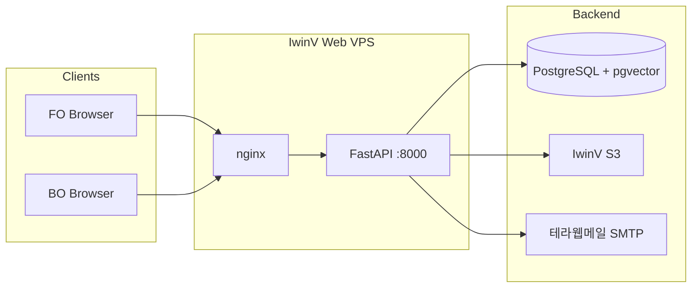

# 배포 아키텍처 (TOPIK Myanmar)

**작성일:** 2026-06-02 · **갱신:** 2026-06-09  
**상태:** **1단계 구현 완료** — IwinV VPS 2대 + FastAPI + FO/BO 정적 HTML + 테라웹메일 SMTP

## 1. 요약

| 계층 | 개발 | 운영 (프로덕션) |
|------|------|-----------------|
| FO | `html/C안/FO/` + `build.py` → `public/` | `https://www.topik-myanmar.com` |
| BO | `html/C안/BO(admin)/project/` + `build-bo.py` → `public-bo/` | `https://admin.topik-myanmar.com` |
| API | **FastAPI** `apps/api` — FO/BO REST 구현 완료 | systemd + nginx `/api/` |
| DB | PostgreSQL + pgvector | `115.68.227.1` — `db/migrations/V001`~`V008` |
| 신규 FO | `apps/web` (Vite+React) | 스캐폴드 — **미운영** |
| 파일 | local / IwinV S3 | `STORAGE_PROVIDER=s3` + Private 버킷 |
| 이메일 | `MAIL_PROVIDER=console` (dev) | IwinV 테라웹메일 **SMTP** + `email_outbox` 워커 |

**시안 확정:** FO·트랜잭션 메일 = C안 (`시안확정_C안.md`).

---

## 2. FO 정적 빌드 (`build.py`)

### 2.1 빌드

```text
html/C안/FO/     ──copy──►  public/
html/shared/     ──copy──►  public/shared/
```

- 스크립트: `python3 build.py`
- 출력: `public/` (nginx document root)
- `TOPIK_API_BASE` 미설정 시 meta 미주입 → nginx 동일 origin `/api`

### 2.2 주요 URL (배포 후)

| IA | 파일 |
|----|------|
| 메인 | `index.html` |
| 회원가입 | `signup.html` |
| 시험 접수 | `register.html` |
| 접수 확인 | `mypage.html` |
| 수험표 안내 | `ticket.html` |
| 로그인 | `login.html` |

---

## 3. 논리 구성



### 3.1 API 호스팅 (운영 확정)

| 계층 | 운영 | 비고 |
|------|------|------|
| FO 정적 | nginx → `build.py` → `public/` (단기) 또는 `apps/web/dist/` (중기) | `https://www.topik-myanmar.com` |
| API | uvicorn `:8000` + nginx `/api/` | FastAPI, JWT |
| DB | `115.68.227.1:5432` (Web IP만 허용) | `topik_myanmar` |
| 파일 | IwinV 오브젝트 스토리지 (`kr.object.iwinv.kr`) | Private + API 프록시 |
| 메일 | IwinV 테라웹메일 SMTP | `noreply@topik-myanmar.com` |

상세: [`IWINV_SETUP.md`](../IWINV_SETUP.md), [`DEPLOY.md`](../DEPLOY.md), [`DEV_SPEC.md`](../DEV_SPEC.md).

---

## 4. 환경: dev / prod (스테이징 없음)

스펙상 **staging 미사용**. dev가 QA·고객 시연 역할을 겸함.

| 항목 | dev | prod |
|------|-----|------|
| FO | `localhost:8080` / 로컬 HTTP 서버 | `www.topik-myanmar.com` |
| API | `localhost:8000` 또는 IwinV Web VPS | nginx `/api/` 프록시 |
| DB | 로컬 PostgreSQL 또는 DB VPS 원격 | `topik_myanmar` (DB VPS) |
| SMTP | `console` (로그만) | IwinV 테라웹메일 SMTP |
| OAuth | Google OAuth 클라이언트 (localhost origin 추가) | `www.topik-myanmar.com` |
| Storage | local 또는 dev prefix | IwinV S3 prod 버킷 |
| Secret | `apps/api/.env` (커밋 금지) | Web VPS `.env` |

---

## 5. CI/CD 제안

### 5.1 FO·BO

1. `main` push → `python3 build.py` / `build-bo.py` 산출물 검증
2. Web VPS에 `git pull` → 빌드 → nginx reload

### 5.2 API

1. `main` → Web VPS `git pull` → `pip install` → `systemctl restart myanmar-api`
2. prod 배포 전 DB backup → migration 적용 → `/health/db` 확인

### 5.3 prod 배포 전·후

- dev E2E: 가입 → 접수 → BO 처리
- prod 스모크: [`DEPLOY.md`](../DEPLOY.md) §6
- 배포 이력·Git 태그

---

## 6. Feature Freeze (접수 기간)

- **접수 시작 D-3 ~ 접수 종료:** prod FO/API **기능 배포 동결**
- 허용: 긴급 버그·보안 패치, DB 핫픽스(승인制)
- 금지: 신규 화면·스키마 변경·대규모 리팩터
- 점검 시: 503 정적 페이지 또는 nginx maintenance

---

## 7. 보안·네트워크

- **CORS:** prod API는 prod FO/BO origin만 (`CORS_ORIGINS`)
- **Rate limit:** API 명세 §7
- **dev 노출:** robots.txt `Disallow: /`, IP 제한 또는 Basic Auth
- **prod DB:** 개발자 로컬에서 prod DB 직접 접속 최소화

---

## 8. 관련 문서

| 문서 | 경로 |
|------|------|
| 시안 확정 | `시안확정_C안.md` |
| 정책 합의 | `정책_합의_워크시트.md` |
| DNS IT 요청 | `../../고객사_DNS_요청_템플릿.md` |
| **배포 체크리스트** | `../../DEPLOY.md` |
| **IwinV 운영** | `../../IWINV_SETUP.md` |
| 마이그레이션·시드 | `마이그레이션_및_시드.md`, `../../db/README.md` |
| 백엔드 스택 | `백엔드_스택_결정.md` |
| 빌드 | 루트 `build.py`, `build-bo.py` |
