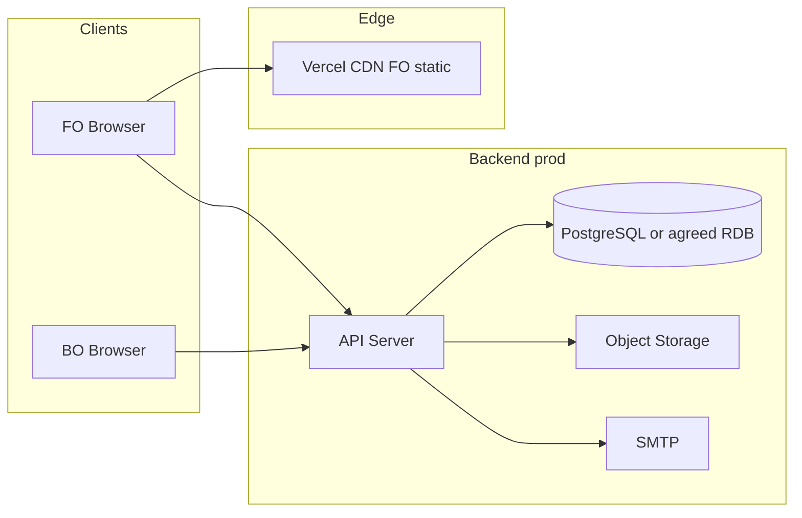

# 배포 아키텍처 (TOPIK Myanmar)

**작성일:** 2026-06-02  
**상태:** 초안 — API 호스팅·SMTP 등 운영 프로비저닝 전 (백엔드 스택 권장안: `백엔드_스택_결정.md`)

## 1. 요약

| 계층 | 현재 (프로토타입) | 목표 (프로덕션) |
|------|-------------------|-----------------|
| FO | Vercel 정적 호스팅 — `build.py` → `public/` | 동일 (C안 FO HTML/CSS/JS) + REST API 연동 |
| BO | `html/C안/BO(admin)/` 로컬·별도 호스팅 (미배포) | 관리자 전용 도메인/경로, API + 세션/JWT |
| API | 없음 (localStorage 목업) | REST `/api/v1/*` — `REST_API_명세_초안.md` |
| DB | 없음 | PostgreSQL — `DB스키마_초안.md`, `db/migrations/` (Flyway v0.1) |
| 파일 | 브라우저·목업 | 객체 스토리지 (증명사진·게시판 첨부) |
| 이메일 | `topik-mail.js` outbox mock | SMTP 워커 + `email_outbox` |

**시안 확정:** FO·트랜잭션 메일 = C안 (`시안확정_C안.md`). A/B안 HTML은 저장소에 유지하되 **배포 산출물에는 포함하지 않음**.

---

## 2. 현재: Vercel 정적 FO

### 2.1 빌드

```text
html/C안/FO/     ──copy──►  public/          (루트 = 사이트 루트)
html/shared/     ──copy──►  public/shared/   (공통 JS, canonical)
```

- 스크립트: `python3 build.py` (루트 `vercel.json`의 `buildCommand`)
- 출력: `outputDirectory: public`
- 제외: `html/C안/FO/.vercel`, `html/C안/FO/vercel.json` (프로젝트 메타만)
- 경로: FO HTML의 `../../shared/` → 빌드 시 `shared/`로 치환 (`roster-codes.js` 등)

### 2.2 주요 URL (배포 후)

| IA | 파일 |
|----|------|
| 메인 | `index.html` |
| 회원가입 | `signup.html` |
| 시험 접수 | `register.html` |
| 접수 확인 | `mypage.html` |
| 수험표 안내 | `ticket.html` |
| 로그인 | `login.html` |

### 2.3 Vercel 역할

- 글로벌 CDN, HTTPS(자동 인증서), HTTP→HTTPS 리다이렉트
- 커스텀 도메인 DNS (운영 합의 후 `topik-myanmar.*` 등 연결)
- **API·DB는 Vercel에 두지 않음** — 별도 서버/매니지드 서비스

---

## 3. 목표: API + DB + 스토리지

### 3.1 논리 구성



### 3.2 API 호스팅 (권장안)

**권장:** FO Vercel + API **Railway**(또는 Fly.io/Render) + Managed PostgreSQL — 상세는 `백엔드_스택_결정.md` §2.

| 옵션 | FO 정적 | API | 비고 |
|------|---------|-----|------|
| **B (권장)** | Vercel | Railway / Render / Fly.io + Fastify | 소규모 팀·빠른 dev/prod |
| A | Vercel | AWS/GCP VM + Nginx + Node | 전통 3-tier·SRE 자체 |
| C | Vercel | ECS / Cloud Run | SLA·VPC 요구 시 |

- **웹 서버(197):** FO는 Vercel CDN; API는 PaaS TLS 종료 또는 Nginx/LB
- **앱 서버(198):** **Node.js 20 + Fastify 4** (`백엔드_스택_결정.md`)
- **DB(199):** API 전용 네트워크, 퍼블릭 포트 비노출
- **파일(200):** S3 호환 버킷 등 — dev/prod 버킷 분리

참고: `REST_API_명세_초안.md`, `DB스키마_초안.md`, `html/shared/README.md` § localStorage→API

---

## 4. 환경: dev / prod (스테이징 없음)

스펙상 **staging 미사용**. dev가 QA·고객 시연·보안 스캔(DAST) 역할을 겸함.

| 항목 | dev | prod |
|------|-----|------|
| FO | Vercel preview 또는 dev 도메인 | Vercel production |
| API | dev API URL | prod API URL |
| DB | `topik_mm_dev` (별도 인스턴스 권장) | `topik_mm_prod` |
| SMTP | Mailtrap / Mailhog / 화이트리스트 | 실 SMTP |
| OAuth | Google OAuth 클라이언트 #1 | 클라이언트 #2 (리다이렉트 URI 분리) |
| Storage | dev 버킷/경로 | prod 버킷/경로 |
| Secret | `.env.dev` | `.env.prod` — **Git 커밋 금지** |

### 4.1 환경변수 카테고리 (`.env` — 예시 키)

```bash
# 공통
APP_ENV=development|production
SECRET_KEY=
API_BASE_URL=

# DB
DATABASE_URL=

# SMTP
SMTP_HOST=
SMTP_PORT=
SMTP_USER=
SMTP_PASSWORD=
SMTP_FROM=

# OAuth (Google 등)
OAUTH_GOOGLE_CLIENT_ID=
OAUTH_GOOGLE_CLIENT_SECRET=
OAUTH_REDIRECT_URI=

# Object storage
STORAGE_ENDPOINT=
STORAGE_BUCKET=
STORAGE_ACCESS_KEY=
STORAGE_SECRET_KEY=
STORAGE_PUBLIC_BASE_URL=

# CORS (API)
CORS_ALLOWED_ORIGINS=
```

---

## 5. CI/CD 제안

### 5.1 FO (Vercel)

1. `main` / `develop` push → GitHub Actions: `python3 build.py` + 산출물 검증(필수 HTML 존재)
2. Vercel Git 연동: 동일 `buildCommand`, Production = `main`, Preview = PR

### 5.2 API (별도 파이프라인)

1. `develop` → dev API 자동 배포 (마이그레이션 → 헬스체크)
2. `main` → prod **수동 승인** 배포 (2인 확인, 백업 후 마이그레이션)

### 5.3 prod 배포 전·후

- dev E2E: 가입 → 접수 → BO 처리 (`체크리스트 242`)
- prod 스모크: 홈·로그인·접수 5분 이내 (`243`)
- 배포 이력·Git 태그 (`244`–`245`)

---

## 6. Feature Freeze (접수 기간)

- **접수 시작 D-3 ~ 접수 종료:** prod FO/API **기능 배포 동결** (`체크리스트 248`)
- 허용: 긴급 버그·보안 패치, DB 핫픽스(승인制)
- 금지: 신규 화면·스키마 변경·대규모 리팩터
- 점검 시: 503 정적 페이지 (`445`) — FO를 Vercel에서 교체하거나 API 점검 모드

---

## 7. 보안·네트워크 (참고)

- **CORS(213, 232):** prod API는 prod FO/BO origin만
- **Rate limit(216):** API 명세 §7
- **dev 노출(224–225):** robots.txt `Disallow: /`, IP 제한 또는 Basic Auth
- **prod DB(234):** 개발자 로컬에서 prod DB 직접 접속 차단

---

## 8. 체크리스트 매핑

본 문서로 **부분 완료 `[p]`** 처리한 항목 (운영 합의·실구축은 별도):

| NO | 항목 |
|----|------|
| 196–200 | 서버·DB·스토리지 분리 방향 문서화 |
| 201–203 | Vercel FO: 도메인·SSL·HTTPS 리다이렉트 |
| 204 | dev/prod 2환경 (staging 없음) |
| 205, 206, 226 | env·CI/CD 방침 |
| 233 | dev/prod DB 분리 원칙 |
| 248 | Feature Freeze 정책 |
| 158–161 | Flyway 마이그레이션·dev 시드·트랜잭션 방침 초안 (`마이그레이션_및_시드.md`) |
| 158, 196–198, 217 | 백엔드 스택 권장안 (`백엔드_스택_결정.md`) |

미완료 `[ ]` 유지: 실제 서버 프로비저닝, 모니터링(208–210), 방화벽·SSH(211–212), 용량 산정(220–221), dev/prod 배포 절차 실행(239–245) 등.

---

## 9. 관련 문서

| 문서 | 경로 |
|------|------|
| 시안 확정 | `시안확정_C안.md` |
| **정책 합의** | `정책_합의_워크시트.md` (오픈 전 고객사·운영 확정, §2.0 DNS·도메인) |
| **DNS IT 요청** | `../../고객사_DNS_요청_템플릿.md` (운영 호스팅·메일 기준; Vercel/Railway/Resend는 부록 dev/UAT) |
| REST API | `REST_API_명세_초안.md` |
| DB 스키마 | `DB스키마_초안.md` |
| **마이그레이션·시드** | `마이그레이션_및_시드.md`, `../../db/README.md` |
| **백엔드 스택** | `백엔드_스택_결정.md` |
| 공통 JS | `html/shared/README.md` |
| 빌드 | 루트 `build.py`, `vercel.json` |
