# BO 사용 가이드 (백오피스)

> **목적:** TOPIK Myanmar 관리자 화면 이용 방법을 안내합니다.
> **대상:** 시험 운영·접수 처리·콘텐츠 관리를 담당하는 관리자
> **작성 기준:** 2026-06-12

### 최근 업데이트 (2026-06-12)

- **수험번호 일괄 부여:** 접수자 목록 상태 **승인완료**인 건만 부여 대상(접수완료·수납대기 등 제외). 버튼은 **최고관리자(super)** 만 사용 가능.
- **수험번호 추가 부여:** 노출 시점이 지난 뒤에도 **아직 수험번호가 없는 승인완료 건**은 추가 부여 가능. 시험장 정보가 없으면 오류 안내.
- **게시판 알림:** 신규 접수 시 작성자·(선택 동의) 관리자 이메일. **관리자 계정 등록/수정**에서 **게시글 신규 접수 이메일 수신** 체크로 관리자별 수신 여부 설정. 문의 게시판 라벨 **「문의 게시판」** 통일.
- **BO 배지:** 환불·정정·문의 메뉴 숫자가 주기적으로 자동 갱신.

상세: [`RELEASE_NOTES_2026-06-12.md`](../RELEASE_NOTES_2026-06-12.md)

### 최근 업데이트 (2026-06-11)

- 응시자 FO: 비밀번호·OTP·증명사진(2MB)·필수 약관 검증 강화 — 접수 데이터 품질에 영향
- 응시자 FO: **KO/MY/EN** UI·API 오류 메시지 i18n 완료 — 응시자가 영어·미얀마어로 오류를 확인 가능
- **편의지원(장애인)**: FO 접수 UI **없음** — BO 채번(`TC-APPLY-BO-020`)만 사용. `accommodation_requested`는 API 기본 `false`
- 접수 동시 수정: `If-Match`·409 안내 유지
- 상세: [`RELEASE_NOTES_2026-06-12.md`](../RELEASE_NOTES_2026-06-12.md) · [`RELEASE_NOTES_2026-06-11.md`](../RELEASE_NOTES_2026-06-11.md)

처음 관리 화면을 사용하시는 분도 **이 문서만 따라가면** 접수 심사 → 수납 → 승인 → 수험번호 부여, 공지·FAQ 등록, 약관 관리까지 업무를 수행할 수 있도록 각 화면을 설명합니다. 화면마다 **무엇을 하는 곳인지**, **어떤 순서로 누르면 되는지**, **주의할 점**을 함께 적어 두었습니다.

### 이 가이드 읽는 방법

- **회차를 먼저 선택하세요.** 상단 **회차 선택**에서 작업할 회차를 고른 뒤 접수자·대시보드 등을 이용합니다. 회차가 다르면 숫자와 목록 내용이 달라집니다.
- **권한에 따라 버튼이 다릅니다.** 최고관리자·일반관리자·조회관리자마다 사용할 수 있는 기능이 다릅니다. 버튼이 비활성(회색)이면 권한 또는 접수 상태 때문일 수 있으니, 아래 「관리자 권한」과 각 화면의 주의사항을 참고해 주세요.
- **처리 순서를 지켜 주세요.** 사진 승인 → 오프라인 수납 → 승인 → 수험번호 부여 순서가 기본입니다. 순서를 건너뛰면 버튼이 비활성이거나 오류 안내가 표시됩니다.

### 접수 처리 한눈에 보기 (표준 절차)

응시자가 온라인 접수를 마친 뒤, 관리자가 진행하는 일반적인 흐름입니다.

1. **사진 심사** — 증명사진 규격·본인 여부 확인 → 승인 또는 반려(반려 시 응시자에게 사유 전달)
2. **오프라인 수납** — 사진 승인 후, 현장 수납 확인 → **오프라인 수납** 처리
3. **승인** — **사진 승인·수납이 모두 완료된** 건만 **승인** (미충족 시 버튼 비활성·승인 불가 안내)
4. **수험번호 부여** — 목록 상태 **승인완료**인 건만 일괄 부여 (**최고관리자**)
5. **노출 시점 설정** — 응시자 마이페이지에 수험번호가 보이기 시작하는 일시 지정

> **TIP:** 하루 업무를 시작할 때 **대시보드**에서 수납 대기·사진 심사 대기 건수를 확인한 뒤, **접수자 목록**에서 상태 필터로 해당 건부터 처리하면 효율적입니다.

---

## 목차

1. [관리자 로그인](#1-관리자-로그인)
2. [관리자 기본 화면](#2-관리자-기본-화면)
3. [대시보드](#3-대시보드)
4. [접수자 목록](#4-접수자-목록)
5. [회차 관리](#5-회차-관리)
6. [시험장 관리](#6-시험장-관리)
7. [공지사항](#7-공지사항)
8. [FAQ](#8-faq)
9. [환불·정보정정](#9-환불정보정정)
10. [문의 게시판](#10-문의-게시판)
11. [회원 관리](#11-회원-관리)
12. [약관 관리](#12-약관-관리)
13. [관리자 계정](#13-관리자-계정)
14. [관리자 권한](#14-관리자-권한)
15. [처리 이력](#15-처리-이력)
16. [관리자 접근 로그](#16-관리자-접근-로그)
17. [회원 접근 로그](#17-회원-접근-로그)
18. [권한 변경 이력](#18-권한-변경-이력)

부록: [공통 운영 안내](#부록-공통-운영-안내)

---

## 1. 관리자 로그인

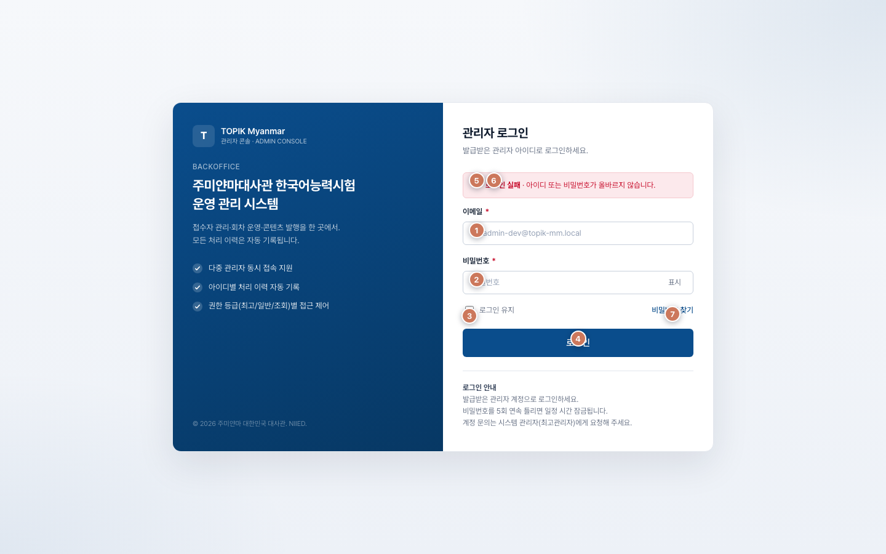

관리자 전용 로그인 화면입니다. **관리자 계정**으로만 로그인할 수 있으며, 응시자용 회원 계정(일반 가입·Google 가입)으로는 이 화면에 들어갈 수 없습니다. 계정은 **최고관리자**가 발급합니다.

### 진행 순서

1. 관리자에게 받은 **이메일**과 **초기 비밀번호**를 입력합니다.
2. 필요하면 **로그인 유지**를 체크합니다. 체크 시 브라우저를 닫아도 최대 **14일**까지 로그인이 유지됩니다(공용 PC에서는 체크하지 않는 것을 권장합니다).
3. **로그인**을 누르면 관리 화면으로 이동합니다.
4. **첫 로그인**이거나 비밀번호 변경이 필요하면, 다른 메뉴를 쓰기 전에 새 비밀번호를 설정해야 합니다.

| 번호 | 요소 | 설명 |
| --- | --- | --- |
| 1 | **이메일** | 관리자 이메일(로그인 ID). 비어 있으면 「입력 누락」 안내가 표시됩니다. |
| 2 | **비밀번호** | 비밀번호 입력란입니다. 눈 모양 아이콘으로 **표시/숨기기**를 전환할 수 있습니다. |
| 3 | **로그인 유지** | 체크하면 브라우저를 닫아도 로그인이 유지됩니다(최대 **14일**). 미체크 시 탭을 닫으면 다시 로그인해야 합니다. |
| 4 | **로그인 버튼** | 이메일·비밀번호를 입력한 뒤 **로그인** → 관리 화면으로 이동합니다. |
| 5 | **오류 안내** | 로그인 실패 시 원인별 메시지가 표시됩니다. 이메일·비밀번호 불일치, 5회 연속 실패 시 30분 잠금, 관리자 계정이 아님, 서버 연결 실패 등. |
| 6 | **변경 완료 안내** | 비밀번호를 변경한 뒤 다시 로그인할 때 「비밀번호 변경 완료 · 새 비밀번호로 다시 로그인」 안내가 보입니다. |
| 7 | **비밀번호 찾기** | 비밀번호를 잊었을 때는 **최고관리자**에게 초기화를 요청합니다. 응시자용 「비밀번호 찾기」와는 별도입니다. |

> **TIP:** 로그인이 5회 연속 실패하면 30분간 잠깁니다. 비밀번호를 확실히 모를 때는 잠금되기 전에 최고관리자에게 초기화를 요청하세요.  
> 이미 로그인된 상태에서 이 주소로 들어오면 바로 관리 화면으로 이동합니다.

---

## 2. 관리자 기본 화면

로그인 후 보이는 **관리 화면의 뼈대**입니다. 왼쪽 메뉴에서 업무 화면으로 이동하고, 상단에서 **회차**와 **로그인 사용자** 정보를 확인합니다.

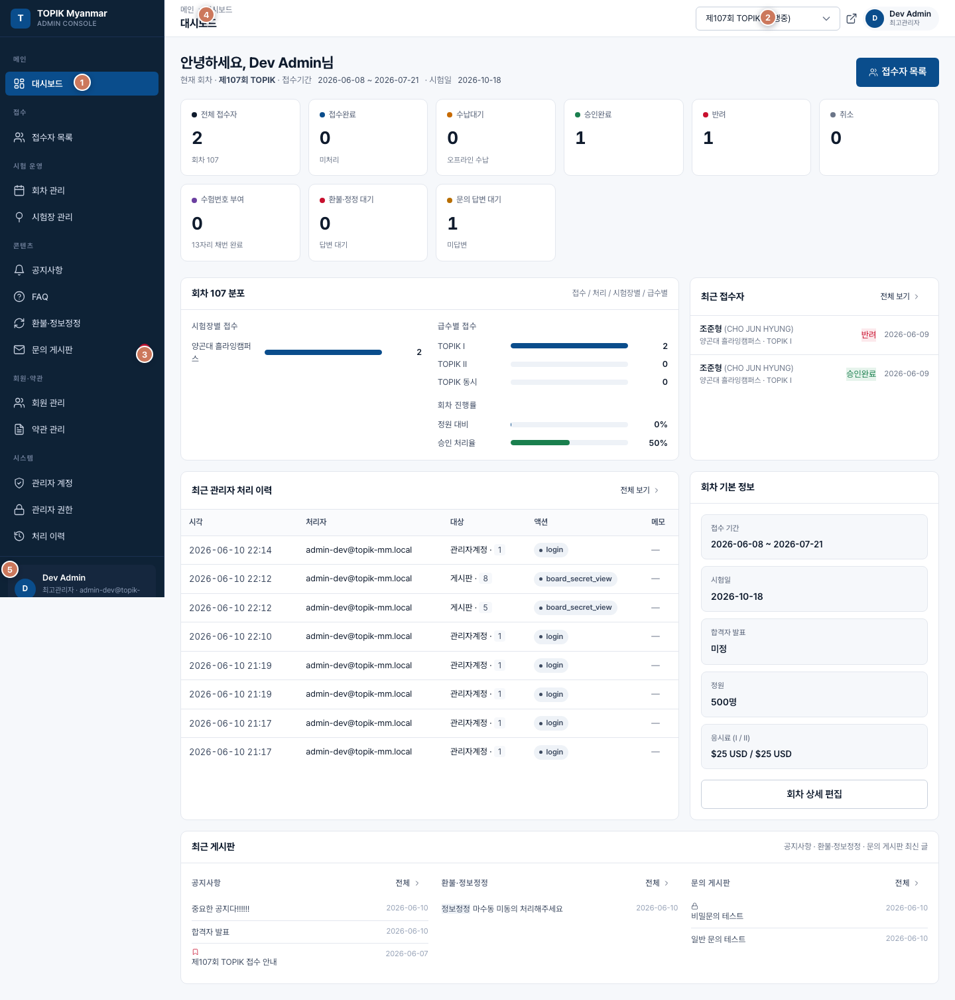

### 이 화면에서 할 수 있는 일

- **왼쪽 메뉴** — 대시보드, 접수자, 회차·시험장, 공지·FAQ, 환불·문의, 회원·약관, 관리자·권한·이력·접근 로그 등 16개 메뉴 이동
- **회차 선택** — 지금 처리할 시험 회차 선택(접수·대시보드 숫자가 이 회차 기준)
- **응시자 사이트** — 응시자가 보는 화면을 새 창에서 확인(공지·접수 화면 점검용)
- **로그아웃** — 업무 종료 시 반드시 로그아웃(특히 공용 PC)

| 번호 | 요소 | 설명 |
| --- | --- | --- |
| 1 | **왼쪽 메뉴** | 메인·접수·시험 운영·콘텐츠·회원·약관·시스템 그룹으로 나뉜 16개 메뉴입니다. 일부 메뉴 옆 **숫자 배지**가 표시됩니다. |
| 2 | **회차 선택** | 상단에서 작업할 회차를 선택합니다. 옵션에 **진행중 / 예정 / 종료** 상태가 함께 표시됩니다. |
| 3 | **알림 숫자(배지)** | 메뉴마다 집계 기준이 다릅니다. **접수자 목록** = 선택 회차의 **미수납** 건수(취소·반려·환불자 제외). **환불·정보정정** = 접수·검토중 신청. **문의 게시판** = 답변 대기. 0건이면 배지가 보이지 않습니다. |
| 4 | **상단 바** | 현재 위치·화면 제목·회차 선택·**응시자 사이트 새 창** 링크·로그인 사용자(이름·등급)가 표시됩니다. |
| 5 | **사용자/로그아웃** | 이름·역할(최고/일반/조회)이 표시됩니다. **로그아웃** → 확인 후 로그인 화면으로 이동합니다. |

데이터를 불러오는 동안 상단에 진행 안내가 잠시 표시됩니다. 오류가 나면 빨간 안내 띠가 나타나니, 메시지를 확인한 뒤 다시 시도하거나 네트워크 상태를 점검해 주세요.

**첫 로그인·비밀번호 변경이 필요한 경우**, 다른 메뉴를 사용하기 전에 새 비밀번호(8자 이상, 영문·숫자·특수문자 포함, 현재 비밀번호와 달라야 함)를 설정해야 합니다.

> **TIP:** 접수 업무 전에 상단 **회차 선택**이 올바른지 꼭 확인하세요. 다른 회차를 선택한 채 수납·승인을 하면 혼선이 생길 수 있습니다.

---

## 3. 대시보드

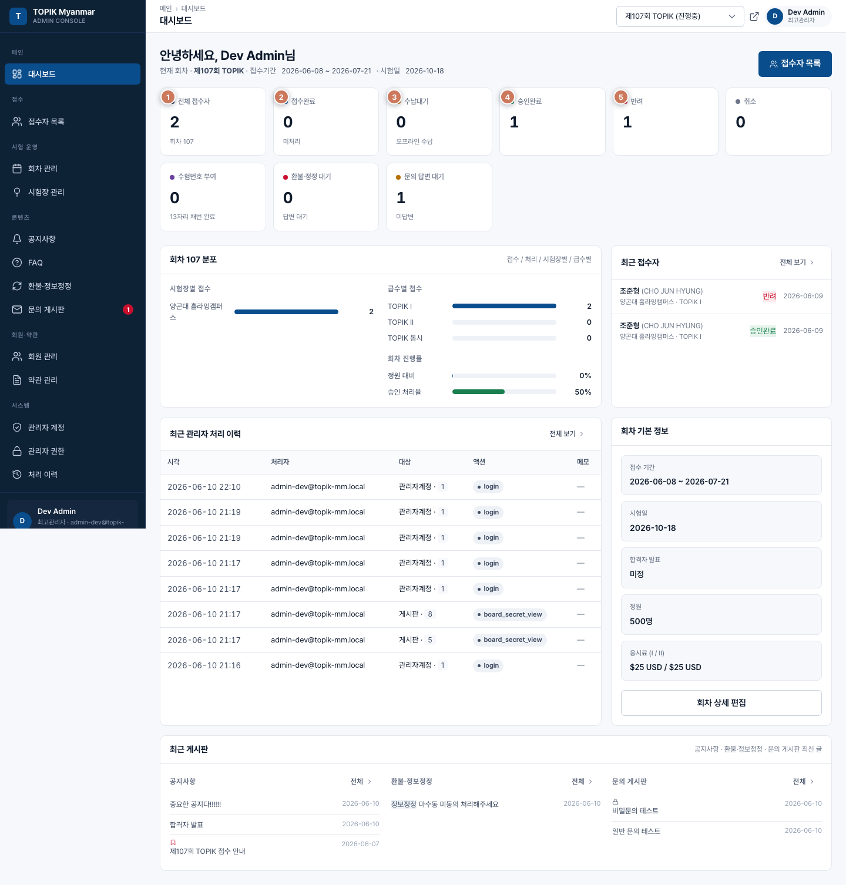

**선택한 회차**의 접수 현황을 숫자로 한눈에 보여 주는 화면입니다. 회차를 바꾸면 모든 KPI가 다시 계산됩니다. 아침 업무 시작 시 「오늘 처리할 건이 얼마나 있는지」 파악하는 데 유용합니다.

### KPI 읽는 방법

| 번호 | KPI 카드 | 의미 (선택한 회차 기준) | 활용 팁 |
| --- | --- | --- | --- |
| 1 | **전체 접수자** | 현재 회차 접수 건수(취소 포함 전체) | 회차 규모·접수 추이 파악 |
| 2 | **접수완료** | 온라인 접수는 끝났으나 사진·수납·승인 처리가 남은 건 | 사진 심사·수납 대기 포함 |
| 3 | **수납대기** | 사진 승인 후 **오프라인 수납 전** 건 | 현장 수납 확인 후 **오프라인 수납** 처리 |
| 4 | **승인완료** | 승인 처리 완료(또는 수험번호 부여 완료) 건 | 최종 확정·수험번호 부여 대상 확인 |
| 5 | **반려** | 접수 또는 사진 반려 건 | 재접수 대기·사유 확인 필요 |

> **TIP:** 「수납대기」 숫자가 많으면 **접수자 목록** → 상태 **수납대기** 필터로 들어가 순차 처리하세요. 「접수완료」가 많으면 사진 심사가 밀린 상태일 수 있습니다.

---

## 4. 접수자 목록

접수자 심사·수납·승인·수험번호 부여의 **핵심 업무 화면**입니다. 하루 대부분의 시간을 이 화면에서 보내게 됩니다.

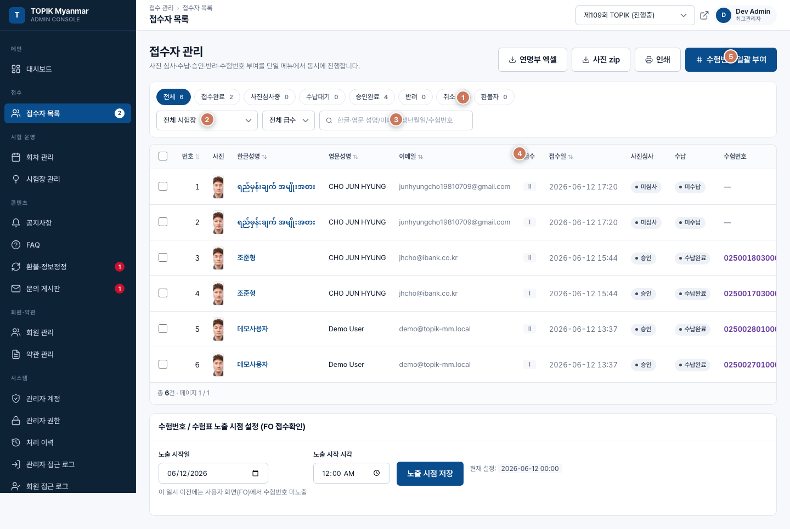

### 4-1. 목록 화면 (스크린샷 번호)

스크린샷 **● 번호**는 **1~5**이며, 급수 필터는 **2번(시험장·급수)** 에 포함됩니다.

| 번호 | 요소 | 설명 |
| --- | --- | --- |
| 1 | **상태 필터** | 전체 / 접수완료 / 사진심사중 / 수납대기 / 승인완료 / 반려 / 취소 / 환불. 각 칩에 **건수**가 표시되어, 어디부터 처리할지 판단하기 쉽습니다. |
| 2 | **시험장·급수** | 시험장(활성 시험장만)과 급수(Ⅰ / Ⅱ / 동시)로 목록을 좁힙니다. 현장·급수별로 묶어 처리할 때 사용합니다. |
| 3 | **검색** | 한글·영문 이름, 이메일, 생년월일, 수험번호 **일부만 입력**해도 검색됩니다. 응시자가 전화·이메일로 문의할 때 빠르게 찾을 수 있습니다. |
| 4 | **접수자 표** | 체크박스, 이름, 사진, 사진심사·수납·상태, 수험번호, **상세보기** 버튼. 한 페이지에 12행씩 표시됩니다. **상세보기**로 한 건씩 자세히 처리할 수 있습니다. |
| 5 | **수험번호 일괄 부여** | 현재 회차에서 상태 **승인완료**·**수험번호 미부여** 건에 **13자리 수험번호**를 일괄 채번합니다. 클릭 시 **미리보기·확정 모달**이 열립니다([4-4](#4-4-수험번호-일괄-부여) 참고). **최고관리자(super)** 만 활성·실행 가능. 일반·조회 관리자는 비활성(회색). |

우측 상단 **연명부 엑셀**·**사진 zip**·**인쇄**는 [4-5](#4-5-노출-시점보내기주의사항)에서 설명합니다.

**목록 자동 갱신:** FO에서 새 접수가 들어오면 **대시보드·접수자 목록** 화면에서 **약 20초마다**, 또는 **다른 탭에서 BO로 돌아올 때(창 포커스)** 목록이 자동으로 다시 불러와집니다. 상단 **회차 선택**이 FO 접수 회차와 같아야 해당 건이 보입니다. 전체 새로고침 없이도 대부분 반영되지만, 즉시 확인이 필요하면 **F5**로 수동 새로고침할 수 있습니다.

### 4-2. 일괄 처리

여러 건을 한꺼번에 처리할 때 사용합니다. 표 왼쪽 **체크박스**로 1건 이상 선택하면 화면 **하단에 고정 바**가 나타납니다.

| 버튼 | 대상·조건 | 결과 | 참고 |
| --- | --- | --- | --- |
| 사진 일괄 승인 | 선택 건 중 **아직 사진 승인 안 된** 건 | 처리 건수 안내 | 규격 OK인 사진만 선택해 주세요 |
| 오프라인 수납 | **수납 권한** 보유, 사진 승인 완료 건 | 수납 확인 창 열림 | 현장 수납·영수증 확인 후 처리 |
| 승인 | **승인 권한** 보유 | 승인 확인 창 | **사진 미심사** 또는 **미수납** 건이 포함되면 **승인 불가** |
| 반려 | **반려 권한** 보유 | 반려 확인 창 | **반려 사유 필수**, 응시자에게 안내 발송 |
| 수납 취소(환불) | **수납 완료** 건만 | 수납 취소 확인 창 | 환불 업무와 연계 |

> **TIP:** 처음에는 **상세보기**로 1건씩 처리해 보고, 익숙해지면 같은 상태·같은 시험장 건을 묶어 일괄 처리하세요.

### 4-3. 상세·처리 확인 창

**상세보기**·**일괄 처리**·**수험번호 일괄 부여** 등으로 열리는 **우측 슬라이드 패널(LP)** 또는 **가운데 확인 모달**입니다. 별도 「사진 심사」 메뉴는 없으며, 사진 심사는 **접수자 상세** 패널 안에서 처리합니다.

#### 접수자 상세 (사진 심사 포함)

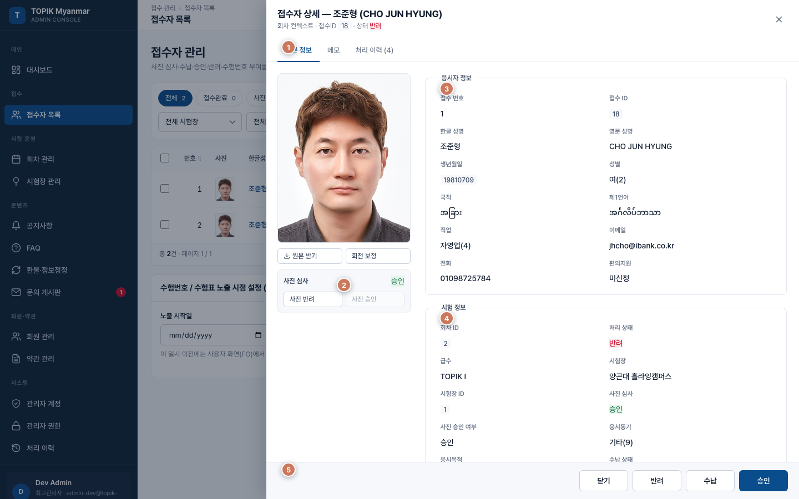

| 번호 | 요소 | 설명 |
| --- | --- | --- |
| 1 | **탭** | **기본 정보** / **메모** / **처리 이력 (N)**. 메모는 담당자끼리 공유하는 용도입니다. **처리 이력** 탭의 숫자(N)는 **이 접수 건**에 대한 관리자 처리 건수만 표시합니다(전체 처리 이력 메뉴와 별개). |
| 2 | **사진 심사** | 왼쪽 **증명사진** 확대·회전·원본 받기 + **사진 승인/반려**. 반려 시 사유 선택(기타는 상세 입력). 별도 사진 심사 창 없이 여기서 처리합니다. |
| 3 | **응시자 정보** | 이름·연락처·이메일·가입 정보·접수 시 입력한 직업·동기 등. |
| 4 | **시험 정보** | 회차·급수·시험장·현재 상태·접수번호·수험번호·수납 상태 등. |
| 5 | **하단 버튼** | **반려·수납·수납취소·승인** — 권한과 접수 **상태**에 따라 활성/비활성. **승인**은 **사진 승인 + 수납 완료** 후에만 누를 수 있습니다. 회색이면 이전 단계(사진·수납)가 남았거나 권한이 없는 경우입니다. |

**상세 창 갱신:** 같은 상세 창을 연 채로 **사진 승인·수납·승인**을 처리하면, 창을 닫지 않아도 **상태·수납·사진 심사 결과·처리 이력**이 곧바로 갱신됩니다.

#### 오프라인 수납

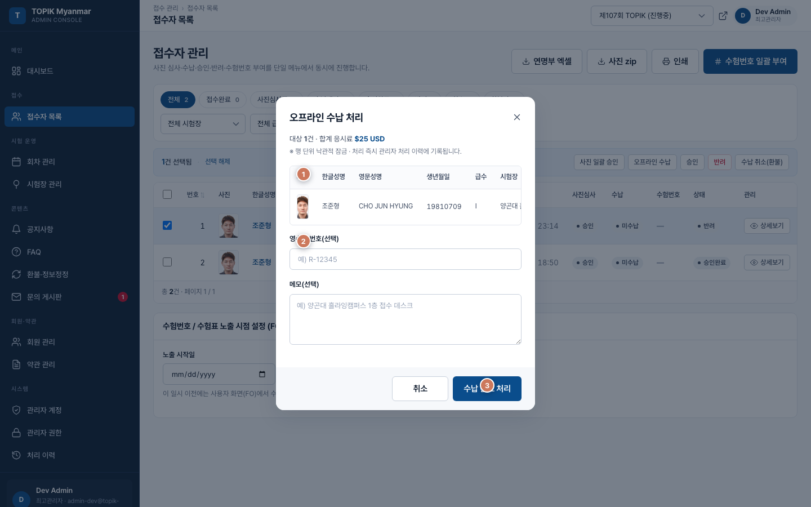

| 번호 | 요소 | 설명 |
| --- | --- | --- |
| 1 | **대상 목록** | 선택한 접수자와 **합계 응시료**가 표시됩니다. Ⅰ·Ⅱ 동시 접수 시 급수별로 각각 수납해야 합니다. |
| 2 | **영수증·메모** | 현장에서 받은 **영수증 번호**·메모(선택)를 입력합니다. 나중에 감사·환불 확인에 도움이 됩니다. |
| 3 | **수납 완료** | 내용 확인 후 **수납 완료** → 해당 건이 수납 완료 상태로 바뀝니다. |

#### 승인 확인

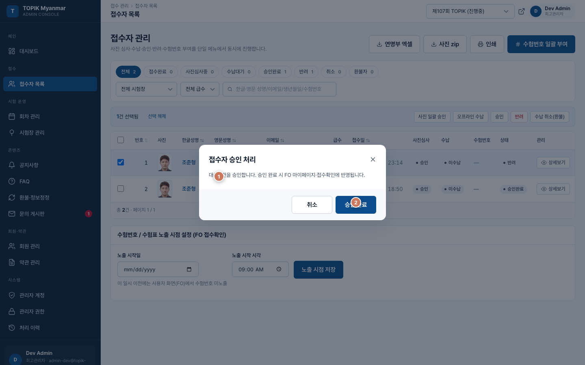

| 번호 | 요소 | 설명 |
| --- | --- | --- |
| 1 | **승인 대상 안내** | 승인할 건수와 주의사항. **사진 미심사** 또는 **미수납** 건이 포함되면 승인할 수 없으며, 해당 응시자 목록이 안내에 표시됩니다. |
| 2 | **승인 실행** | **사진 승인·수납이 모두 완료된** 건만 **승인 완료** 가능 → 응시자에게 승인 안내 이메일이 발송될 수 있습니다. |

#### 반려 확인

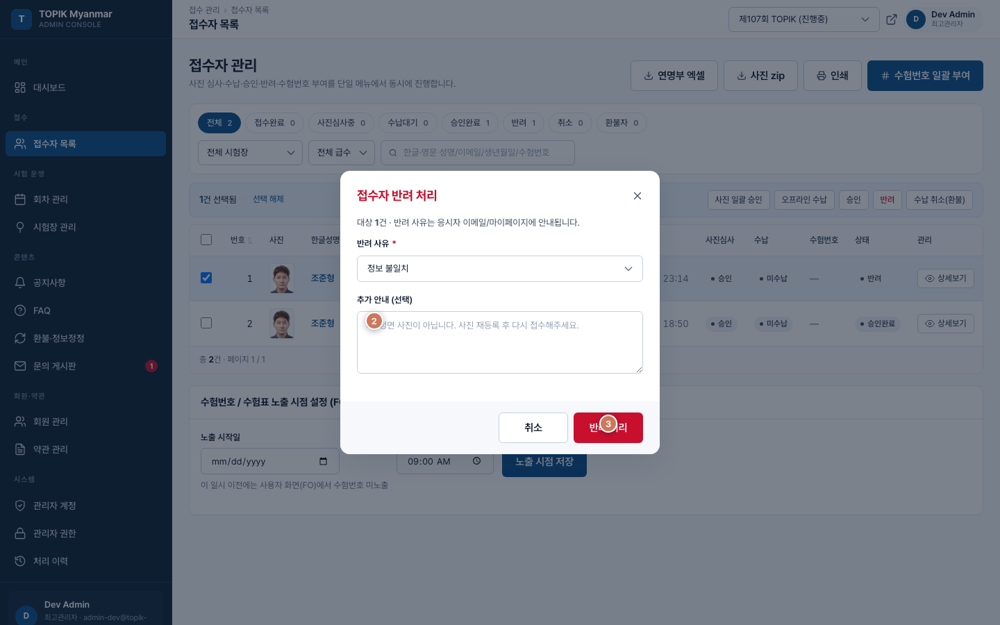

| 번호 | 요소 | 설명 |
| --- | --- | --- |
| 1 | **반려 사유** | 목록에서 선택(기타는 상세 입력). 응시자가 마이페이지에서 볼 수 있으니 **명확하게** 작성하세요. |
| 2 | **추가 안내** | 응시자에게 전달될 보충 설명(재접수 방법 등). |
| 3 | **반려 실행** | 확인 후 반려 처리 + 응시자 안내. |

### 4-4. 수험번호 일괄 부여

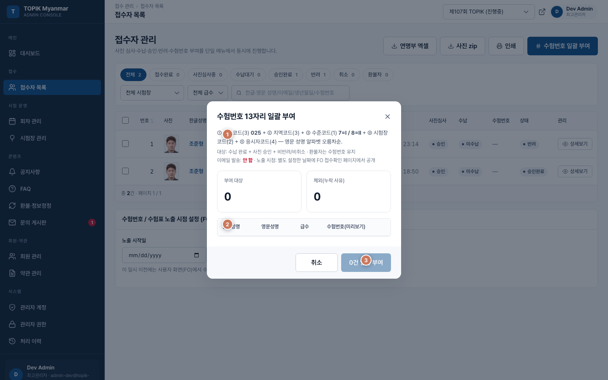

| 번호 | 요소 | 설명 |
| --- | --- | --- |
| 1 | **부여 요약** | 부여 대상 건수와 조건 안내. 조건 미충족 건은 목록에서 제외됩니다. |
| 2 | **미리보기 표** | 실제 부여될 **13자리 수험번호**를 미리 보여 줍니다. 저장 전 번호·순서를 꼭 확인하세요. |
| 3 | **부여 확정** | 확인 후 실제 부여. **최고관리자만** 실행할 수 있습니다. |

**13자리 구성:** 국가(025) + 지역(3) + 수준(Ⅰ=7, Ⅱ=8) + 시험장(2) + 응시자(4).  
예: `0250017010001` → 미얀마(025) · 양곤(001) · TOPIK Ⅰ(7) · 시험장 01 · 0001번 응시자

**부여 대상:** 접수자 목록 상태 **승인완료** + 아직 수험번호 없음  
(내부 조건: `status=approved`, 사진 승인·수납 완료 포함. **접수완료·수납대기**만 된 건은 미리보기 **0건**.)  
**권한:** **최고관리자(super)** 만 버튼 활성·API 실행 가능. 일반관리자는 비활성.  
**정렬:** 시험장·급수별, 영문 이름 가나다/알파벳 순  
**노출:** 「노출 시점」 일시 **이전**에는 응시자 **접수 확인(마이페이지)** 화면에 수험번호가 **표시되지 않습니다**. 노출일 이후에 **늦게 승인된 건**도 부여는 가능하며, 노출 시점이 이미 지났으면 FO에 바로 표시될 수 있습니다.

### 4-5. 노출 시점·내보내기·주의사항

- **노출 시점:** 목록 아래 카드에서 **날짜·시각(MMT)** 설정 → **노출 시점 저장**. 공지한 시각 이후 응시자가 마이페이지에서 수험번호를 볼 수 있습니다. 시험 직전에 한꺼번에 공개할 때 사용합니다.
- **연명부 엑셀:** 현재 필터 결과 또는 회차 전체. **지역·시험장·급수별** 파일로 나뉩니다. 이름·생년월일·성별·국적·언어·직업·동기·목적·수험번호 등 10개 항목.
- **사진 ZIP:** `지역/시험장/급수/수험번호.jpg` 폴더 구조. 사진이 없는 건은 **누락 리포트**에 기록됩니다.
- **동시 작업:** 다른 관리자가 먼저 처리한 건은 「다른 관리자가 먼저 수정했습니다」 안내 후 화면이 갱신됩니다. **최신 목록**을 확인한 뒤 다시 시도하세요.
- **사진 승인 전 수납 불가.** **수납·사진 승인 전 승인 불가**(상세·일괄·승인 확인 창 모두 동일). 응시자가 **접수 취소**한 건은 처리 버튼이 비활성입니다.
- **접수자 상세 · 처리 이력:** 해당 **접수 ID**에 대한 승인·반려·수납·사진 심사 등만 타임라인으로 표시합니다. 이력이 없으면 **처리 이력 (0)** 으로 보이며, 왼쪽 메뉴 **처리 이력**(전체 감사 로그)과 혼동하지 마세요.
- **접수자 목록 배지:** 왼쪽 메뉴 숫자는 **현재 회차의 미수납** 건수입니다. 접수완료·사진심사중 등 다른 상태는 배지에 포함되지 않습니다.
- **조회 전용** 계정은 처리·내보내기 버튼이 모두 비활성입니다. **일반관리자**는 수험번호 부여·연명부·사진 ZIP 내보내기를 할 수 없습니다.

---

## 5. 회차 관리

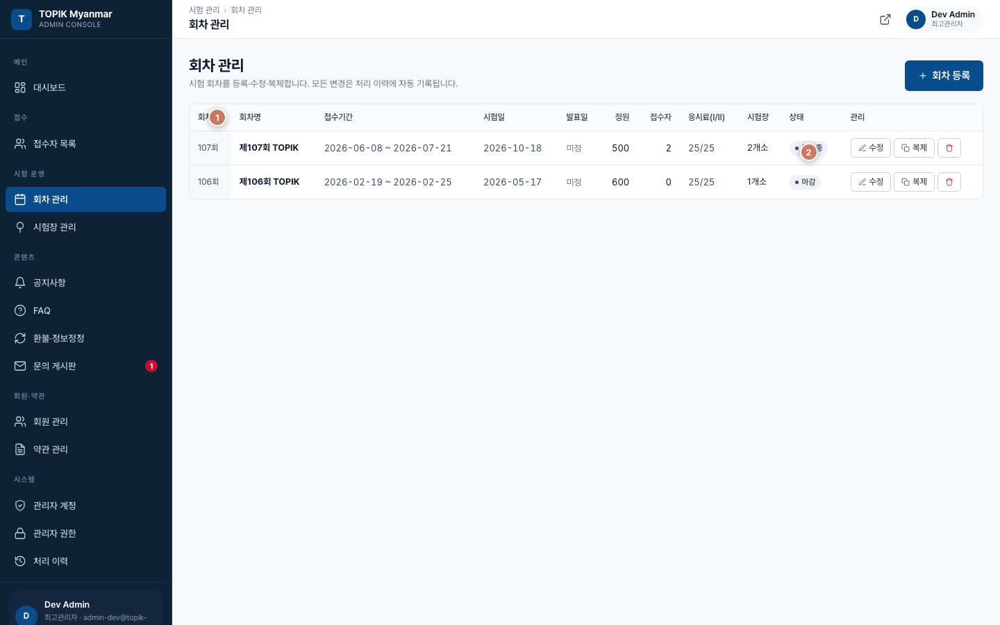

시험 **회차**(제N회)를 등록·수정·폐지하는 화면입니다. 접수 기간·시험일·응시료·배정 시험장을 여기서 설정합니다.

| 번호 | 요소 | 설명 |
| --- | --- | --- |
| 1 | **회차 목록** | 회차번호·회차명·접수기간·시험일·합격 발표일·정원·접수자 수·응시료·시험장 수·상태·관리 버튼. |
| 2 | **상태 표시** | **예정·접수중·마감·폐지** — 접수 시작·마감 **일시(MMT) 기준으로 자동** 전환됩니다(수동으로 「접수중」 버튼을 누르는 방식이 아님). |

**시간대:** FO·BO 화면에 표시되는 **접수기간·D-Day·공지 노출·처리 시각** 등 운영 일시는 모두 **미얀마 현지시각(MMT, UTC+6:30)** 기준입니다. 접수기간은 달력에서 고른 날짜를 **MMT 자정/말일**(시작 00:00, 마감 23:59)로 저장합니다.

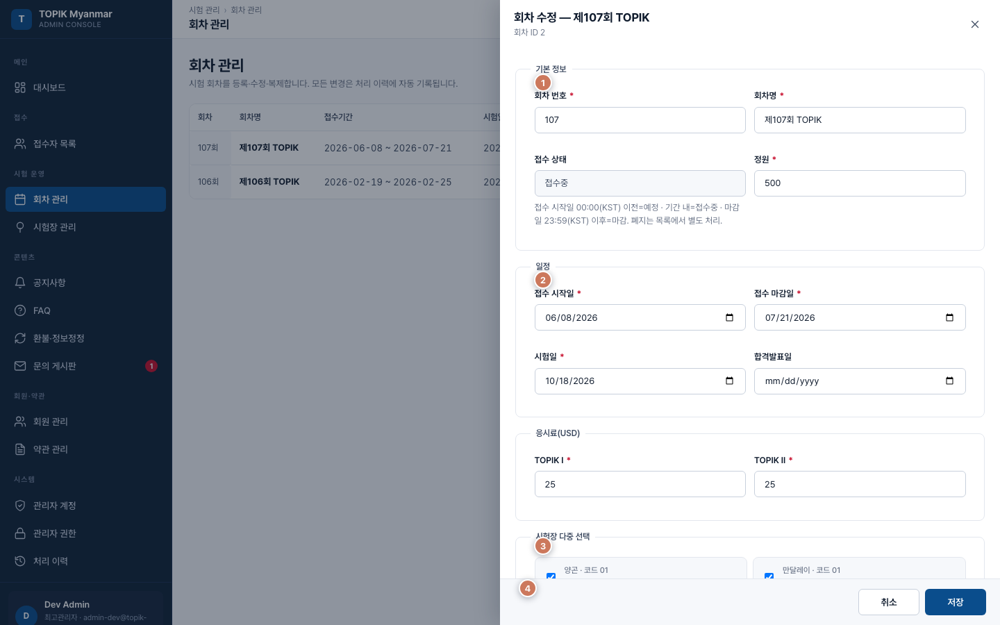

| 번호 | 요소 | 설명 |
| --- | --- | --- |
| 1 | **기본 정보** | 회차번호·회차명·정원 등. 회차명은 응시자 화면에도 표시됩니다. |
| 2 | **일정** | 접수 시작·마감·시험일·합격 발표일. **접수시작 ≤ 접수마감 ≤ 시험일** 순서를 지켜야 **등록/저장**이 가능합니다. 마감일을 시작일보다 앞으로 두면 공지사항과 같이 **「접수 마감일은 접수 시작일 이후여야 합니다」** 토스트가 표시되고 날짜가 반영되지 않습니다. |
| 3 | **응시료·시험장** | TOPIK Ⅰ·Ⅱ USD 금액, 이 회차에 열릴 **시험장** 다중 선택. |
| 4 | **저장/취소** | 필수 항목·일정 검증을 통과하면 **등록/저장** 버튼이 활성화됩니다. 저장 성공 시 목록이 **자동으로 갱신**됩니다. |

**접수 상태 자동 규칙:** 접수 시작일 **00:00(MMT)** 이전=예정 · 기간 내=접수중 · 마감일 **23:59(MMT)** 이후=마감. 폐지는 목록에서 별도 처리.

**저장 전 확인:** 회차명·일정 필수, 응시료 > 0, **활성 시험장** 1개 이상 선택.  
**폐지:** 확인 후 회차가 비공개됩니다(기존 접수자 데이터는 유지). **복제** 기능으로 이전 회차 설정을 다음 회차에 복사할 수 있어, 매회 비슷한 설정을 다시 입력하는 수고를 줄일 수 있습니다.

> **TIP:** 접수 시작 전에 **시험장 관리**에서 활성 시험장·정원을 먼저 맞춰 두고, 회차 등록 시 시험장을 배정하세요.

---

## 6. 시험장 관리

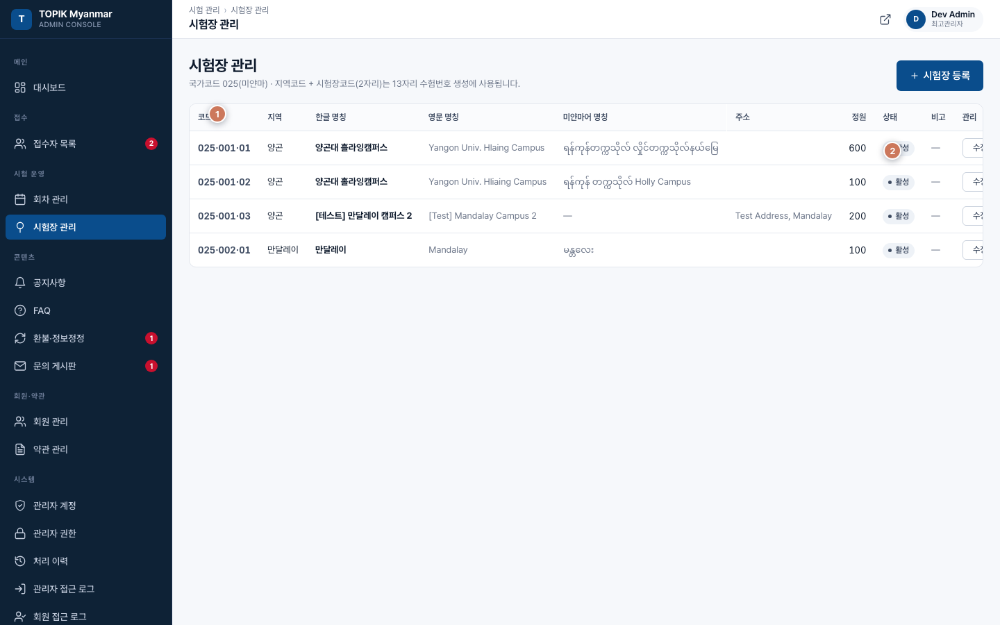

시험 **장소**(도시·건물)와 **정원**, **시험장 코드**를 관리합니다. 시험장 코드는 **수험번호 13자리**에 들어가므로, 등록 후 임의 변경은 피하세요.

| 번호 | 요소 | 설명 |
| --- | --- | --- |
| 1 | **시험장 목록** | 코드·지역·한/영/미얀마어 명칭·주소·정원·상태·비고. |
| 2 | **활성/비활성** | **비활성** 시험장은 회차 배정·접수자 필터 목록에서 **제외**됩니다. 폐쇄·미사용 장소는 비활성 처리하세요. |

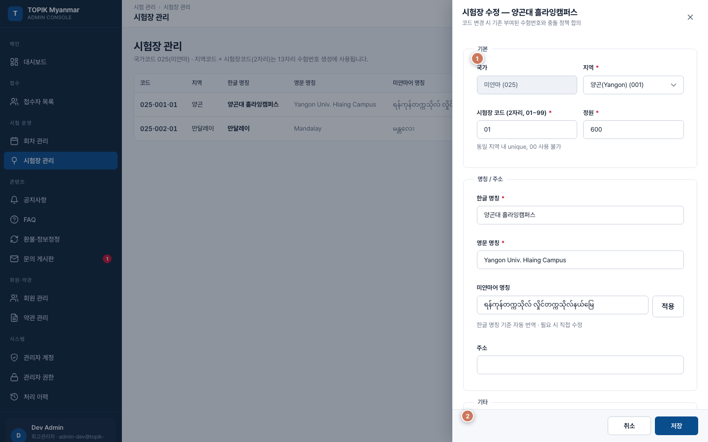

| 번호 | 요소 | 설명 |
| --- | --- | --- |
| 1 | **입력 항목** | 지역·시험장 코드(2자리)·정원·한/영/미얀마어 명칭·주소·비고. |
| 2 | **저장/취소** | 한글·영문 명칭·정원 > 0 필수. **같은 지역 안에서 코드 중복** 불가. 저장·활성 전환 후 **목록이 자동 갱신**됩니다(페이지 새로고침 불필요). |

**비고란:** 좌석 배치도 URL, 현장 책임자, 연락처 등 운영에 필요한 메모를 자유롭게 적어 두면 현장 운영 시 도움이 됩니다.

---

## 7. 공지사항

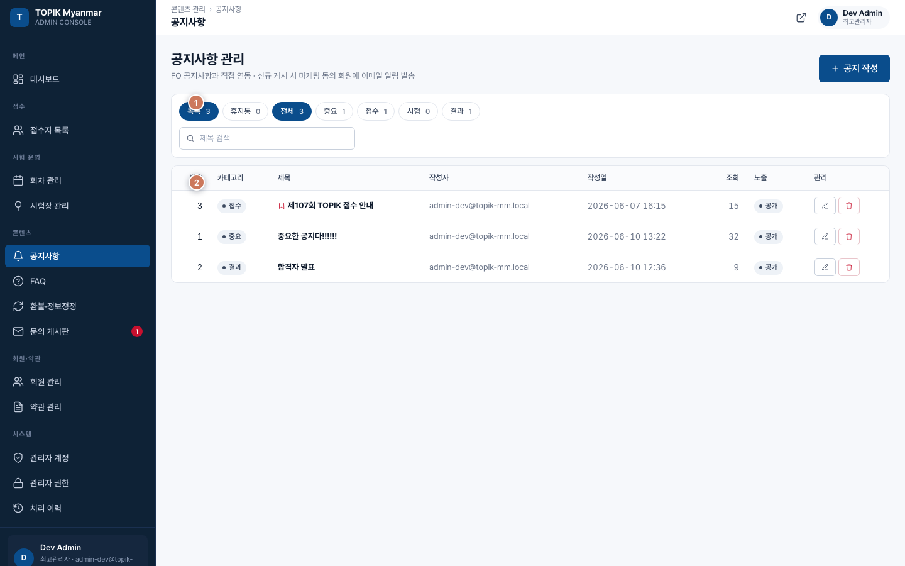

응시자 **공지사항** 게시판 글을 작성·수정·삭제합니다. 접수 일정·시험 유의사항·결과 안내 등 중요 공지는 **상단 고정**과 **중요** 카테고리를 활용하세요.

| 번호 | 요소 | 설명 |
| --- | --- | --- |
| 1 | **탭·카테고리** | 목록 / 휴지통 + 중요·접수·시험·결과 필터 + 검색. |
| 2 | **공지 목록** | **상단 고정** 글이 먼저, 그다음 작성일 최신순. |

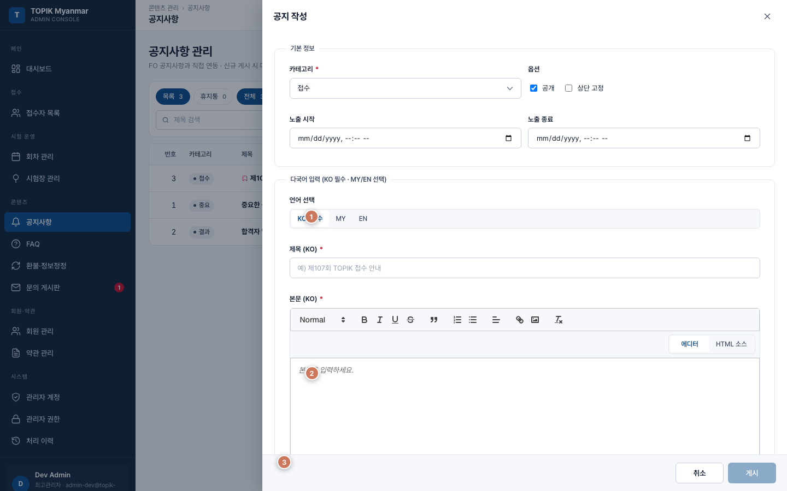

| 번호 | 요소 | 설명 |
| --- | --- | --- |
| 1 | **언어 탭** | KO / MY / EN — 제목·본문을 **언어별로** 입력. **한국어는 필수**, 미얀마어·영어는 선택(미입력 시 해당 언어 사용자에게 한국어가 보일 수 있음). |
| 2 | **본문 편집** | 글꼴·목록·링크·이미지 등 리치 텍스트 + **첨부 파일**. |
| 3 | **저장/게시** | 공개 여부·상단 고정·**노출 기간(MMT)** 설정 후 저장. |

**노출 시작/종료:** `datetime-local` 입력값은 **MMT(UTC+6:30)** 로 저장됩니다. 종료는 시작 이후여야 합니다.

**첨부:** 최대 5개, 파일당 10MB.  
**마케팅 발송:** **새로 공개**하는 공지를 등록하면, 마케팅 수신에 동의한 회원에게 **제목 + 링크** 이메일이 발송됩니다(본문 전체가 아님).  
**삭제:** 휴지통에 30일 보관 후 영구 삭제. 그 전에는 **복구** 가능.

> **TIP:** 다국어 공지는 **한국어 초안**을 먼저 작성한 뒤 MY·EN 탭으로 옮기면 실수를 줄일 수 있습니다.

---

## 8. FAQ

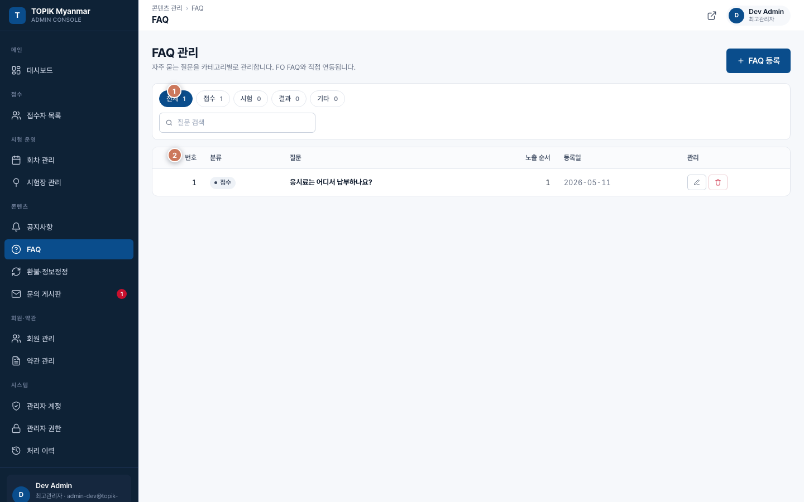

응시자 **자주 묻는 질문**을 등록·수정합니다. 문의 게시판 부담을 줄이려면 접수·수납·수험표 등 반복 질문을 FAQ에 먼저 올려 두세요.

| 번호 | 요소 | 설명 |
| --- | --- | --- |
| 1 | **카테고리·검색** | 접수 / 시험 / 결과 / 기타 + 질문 키워드 검색. |
| 2 | **FAQ 목록** | 카테고리·**노출 순서**(작을수록 위) 기준 정렬. |

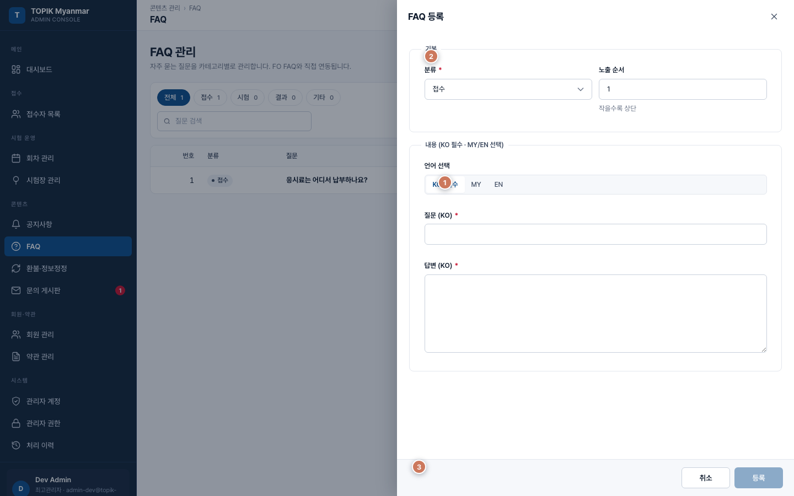

| 번호 | 요소 | 설명 |
| --- | --- | --- |
| 1 | **언어 탭** | KO/MY/EN 질문(120자)·답변(3000자). **한국어 필수**. |
| 2 | **분류·순서** | 카테고리·노출 순서. 자주 묻는 항목은 순서 번호를 작게(예: 1, 2, 3). |
| 3 | **저장/삭제** | 저장 또는 **삭제**(확인 후). 삭제한 FAQ는 BO 목록·FO FAQ에서 **더 이상 보이지 않으며**, 페이지를 새로고침해도 복구되지 않습니다(비활성 처리). |

---

## 9. 환불·정보정정

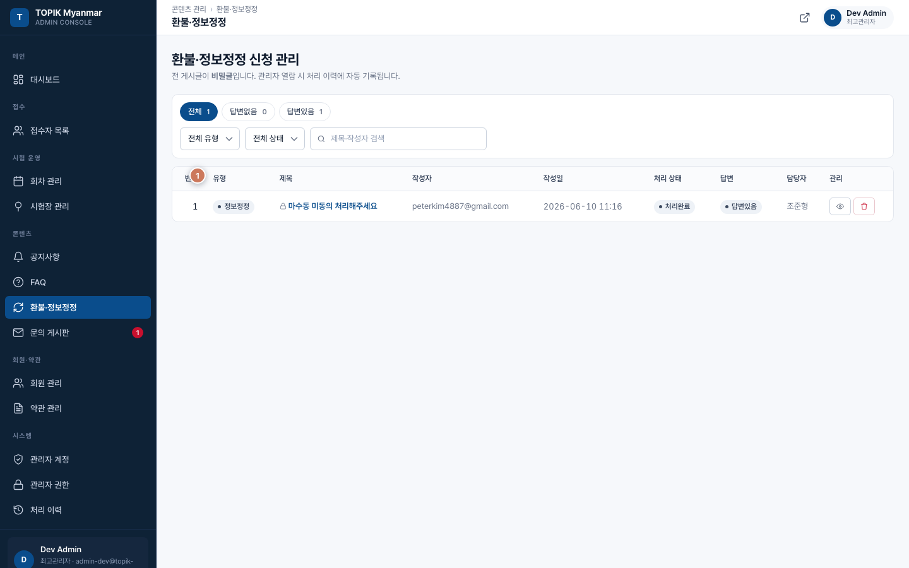

응시자가 **환불·정보정정** 게시판에 올린 신청을 처리합니다. **모든 글이 비밀글**이며, 관리자가 상세를 열면 **열람 이력**이 자동 기록됩니다(감사·분쟁 대비).

| 번호 | 요소 | 설명 |
| --- | --- | --- |
| 1 | **신청 목록** | 유형(환불/정보정정)·상태·검색 필터. 제목을 클릭하면 **상세 슬라이드 패널**이 열립니다. |

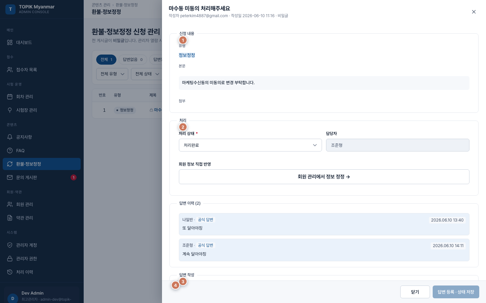

| 번호 | 요소 | 설명 |
| --- | --- | --- |
| 1 | **신청 내용** | 유형·본문·첨부(영수증·신분증 사본 등). |
| 2 | **처리 상태** | 접수 / 검토중 / 처리완료 / 반려 + 담당자. 상태를 단계별로 바꿔 응시자가 진행 상황을 알 수 있게 합니다. |
| 3 | **답변·댓글** | 공식 답변 이력(누적) + 댓글·대댓글. |
| 4 | **답변 등록·저장** | 상태 변경 + 답변 작성 → **답변 등록·상태 저장**. **답변 없이 상태만** 바꿀 수 없습니다. |

**환불 유형:** 환불 금액·방법 입력란이 추가로 표시됩니다. [응시료 규정](FO_사용가이드.md)의 환불률 표와 맞춰 처리하세요.  
**정보정정:** **회원 관리** 화면으로 바로가기 링크가 있어, 승인 후 회원 정보를 수정할 수 있습니다.

> **TIP:** 「검토중」으로 바꾼 뒤 내부 확인이 끝나면 「처리완료」+ 답변으로 마무리하면 응시자 혼란이 줄어듭니다.

---

## 10. 문의 게시판

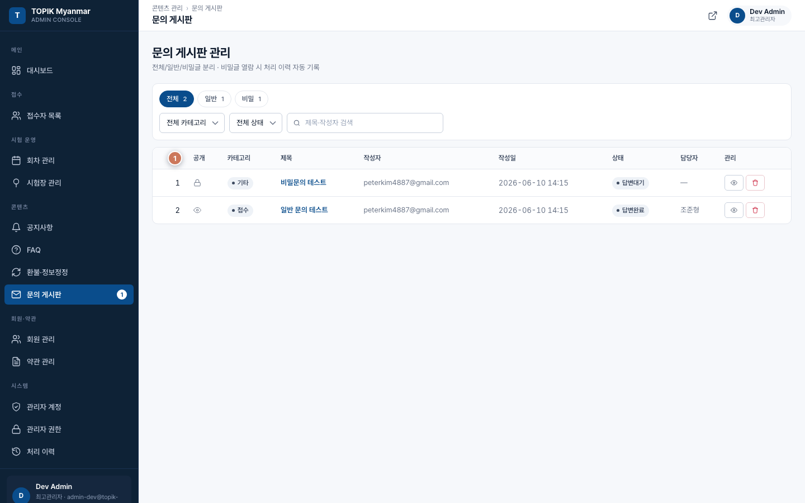

응시자 **1:1 문의**를 확인·답변합니다. 비밀글은 작성자와 관리자만 본문을 볼 수 있습니다.

| 번호 | 요소 | 설명 |
| --- | --- | --- |
| 1 | **문의 목록** | 전체 / 일반 / 비밀 탭 + 카테고리·상태·검색. 제목을 클릭하면 **상세 슬라이드 패널**이 열립니다. 메뉴 진입·**다른 창에서 BO로 돌아올 때** 목록이 자동으로 다시 불러와져, FO 신규 문의가 **전체 새로고침 없이** 반영됩니다. |

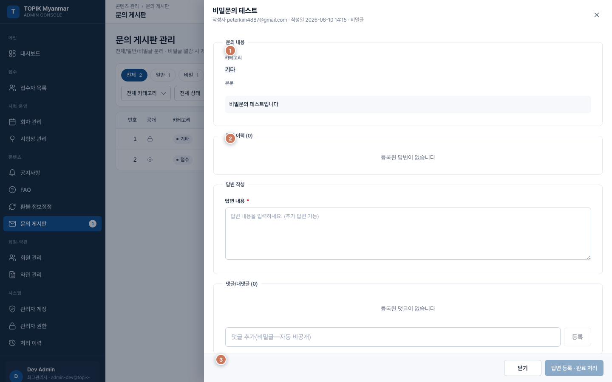

| 번호 | 요소 | 설명 |
| --- | --- | --- |
| 1 | **문의 내용** | 제목·본문·첨부·비밀글 여부. |
| 2 | **답변·댓글** | 공식 답변 이력 + 댓글. 일반글 댓글은 공개 여부 선택, **비밀글** 댓글은 자동 비공개. |
| 3 | **답변 등록·완료** | **답변 등록·완료 처리** → 상태를 **답변완료**로 바꿀 수 있습니다. |

> **TIP:** FAQ에 이미 있는 내용이면 답변에 FAQ 링크를 안내하고, 필요 시 FAQ 문구를 보강하세요.

---

## 11. 회원 관리

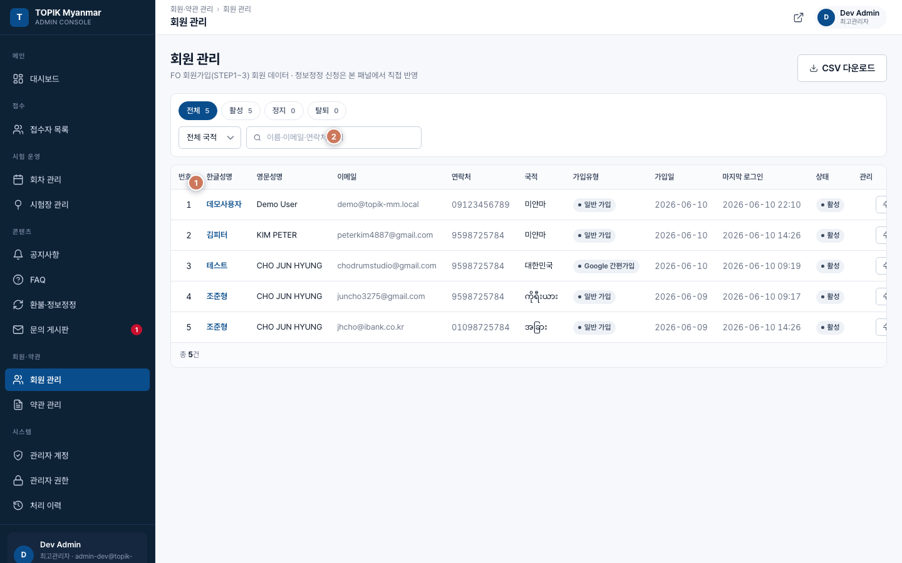

**가입 회원** 조회·정지·탈퇴·비밀번호 초기화. 접수자 목록과 달리 **회원 계정** 단위로 관리합니다.

| 번호 | 요소 | 설명 |
| --- | --- | --- |
| 1 | **회원 목록** | 상태·국적·검색 필터. 이름·이메일·가입유형(이메일/Google)·상태·**관리** 버튼. |
| 2 | **검색** | 이름·이메일·연락처로 검색. |

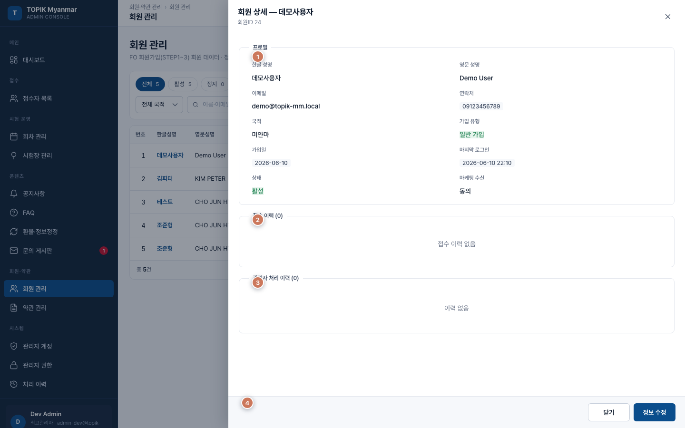

| 번호 | 요소 | 설명 |
| --- | --- | --- |
| 1 | **프로필** | 가입 정보·연락처·마케팅 수신 동의 등. |
| 2 | **접수 이력** | 이 회원의 **모든 접수** 건 목록. |
| 3 | **처리 이력** | 이 회원과 관련된 관리자 처리 타임라인. |
| 4 | **관리 버튼** | 정보 수정·**정지**·해제·**탈퇴**·비밀번호 초기화. |

**정지:** 사유 필수. 정지 시 **로그인 중인 세션**이 무효화됩니다.  
**탈퇴:** 「진행 중 접수가 모두 취소됩니다」 경고 후 처리. **복구 불가**.  
**비밀번호 초기화:** 임시 비밀번호를 **한 번만** 화면에 표시하고 이메일로도 보냅니다. **Google 가입** 회원은 이 기능을 사용할 수 없습니다(Google에서 비밀번호 관리).

---

## 12. 약관 관리

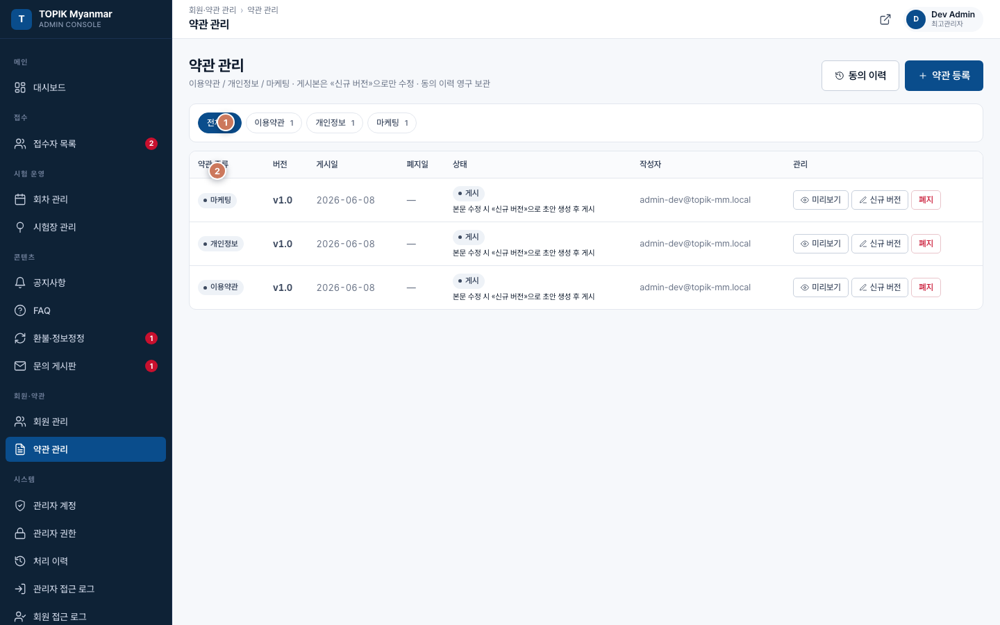

**이용약관·개인정보처리방침·마케팅 수신** 약관의 버전을 관리합니다. 게시 시 응시자·회원 가입·동의 화면에 반영됩니다.

| 번호 | 요소 | 설명 |
| --- | --- | --- |
| 1 | **약관 종류·목록** | 이용약관 / 개인정보 / 마케팅. 버전·게시일·상태(초안 / 게시 / 폐지). |
| 2 | **버전 목록** | 게시일 최신순. **게시 중** 버전이 현재 유효본입니다. |

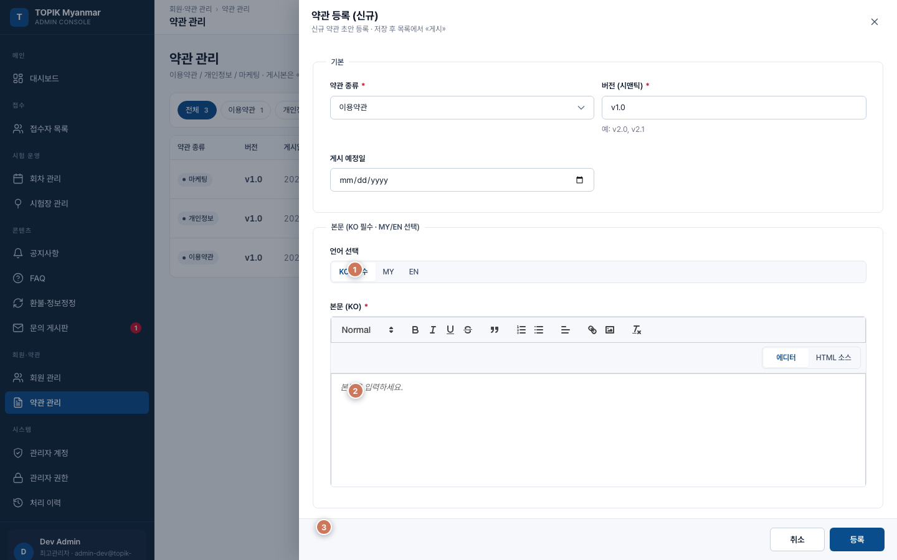

| 번호 | 요소 | 설명 |
| --- | --- | --- |
| 1 | **언어 탭** | KO/MY/EN 본문. **한국어 필수**. |
| 2 | **본문 편집** | 약관 전문 입력. |
| 3 | **저장/게시/폐지** | **초안 저장** → 검토 후 **게시**(최고관리자). 같은 종류의 기존 게시본은 **자동 폐지**. 이미 **게시된** 버전은 내용 수정 대신 **신규 버전**을 만들어야 합니다. |

**동의 이력:** 회원·약관별 **동의 시각** 조회 및 CSV 내보내기(감사·분쟁 대비 자료).

---

## 13. 관리자 계정

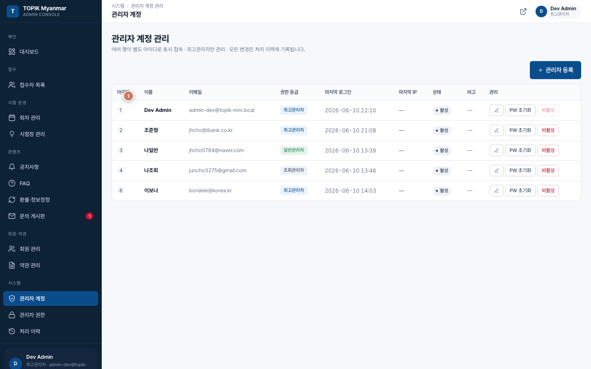

**관리자 계정** 등록·수정·비활성화. **최고관리자만** 이 메뉴를 사용할 수 있습니다.

| 번호 | 요소 | 설명 |
| --- | --- | --- |
| 1 | **관리자 목록** | 아이디·이름·이메일·권한 등급·마지막 로그인·상태·관리. |

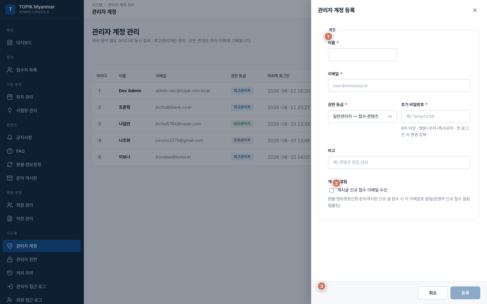

| 번호 | 요소 | 설명 |
| --- | --- | --- |
| 1 | **입력 항목** | 이름·이메일·권한 등급(최고/일반/조회)·초기 비밀번호(신규 등록 시)·비고. |
| 2 | **게시글 신규 접수 이메일 수신** | **환불·정보정정신청·문의게시판**에 신규 글이 접수되면 이 계정 **이메일**로 운영자 알림을 받을지 선택합니다. 체크 후 **저장**해야 반영됩니다. |
| 3 | **저장/취소** | **등록** 또는 **저장** 후 해당 관리자는 **첫 로그인 시 비밀번호 변경**이 강제됩니다(신규·비밀번호 초기화 시). |

**비밀번호 초기화:** 임시 비밀번호 발급(약 5초간 화면 표시) + 이메일 발송.  
**본인 계정은 비활성화할 수 없습니다.**

> **TIP:** 현장 담당자에게는 **일반관리자**, 통계·감사만 필요한 분에게는 **조회관리자**를 부여하는 것을 권장합니다.

---

## 14. 관리자 권한

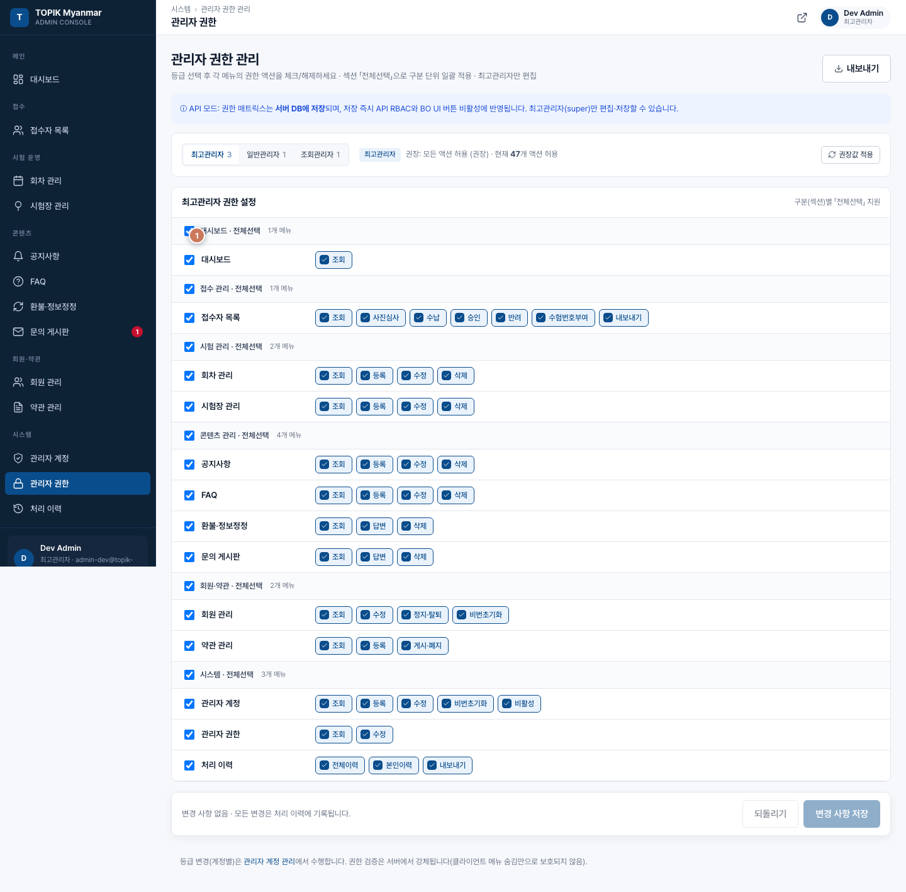

메뉴별 **조회·등록·수정·삭제·사진심사·수납·승인·반려·수험번호·내보내기** 권한을 **표로 참고**할 수 있습니다. 실제 화면에서 버튼이 보이는지는 **로그인한 계정 등급**이 기준입니다.

| 번호 | 요소 | 설명 |
| --- | --- | --- |
| 1 | **권한 표** | 메뉴(행) × 권한 종류(열). O/X 또는 등급별 표시. **교육·점검용** 참고 자료입니다. |

### 역할별 요약

| 메뉴 | 최고관리자 | 일반관리자 | 조회 |
| --- | --- | --- | --- |
| 접수자 | 전체(수험번호·내보내기 포함) | 사진·수납·승인·반려 | 조회만 |
| 회차·시험장 | 전체 | 조회 | 조회 |
| 공지·FAQ | 전체 | 등록·수정·삭제 | 조회 |
| 환불·문의 | 전체 | 조회·답변 | 조회 |
| 회원·약관 | 전체 | 조회 | 조회 |
| 관리자·권한 | 전체 | 메뉴 없음 | 메뉴 없음 |
| 처리 이력 | 전체 | 본인 처리만 | 본인 처리만 |
| 접근 로그·권한 이력 | 전체 | 메뉴 없음 | 메뉴 없음 |

권한 표는 **CSV 내보내기**로 저장할 수 있습니다.

---

## 15. 처리 이력

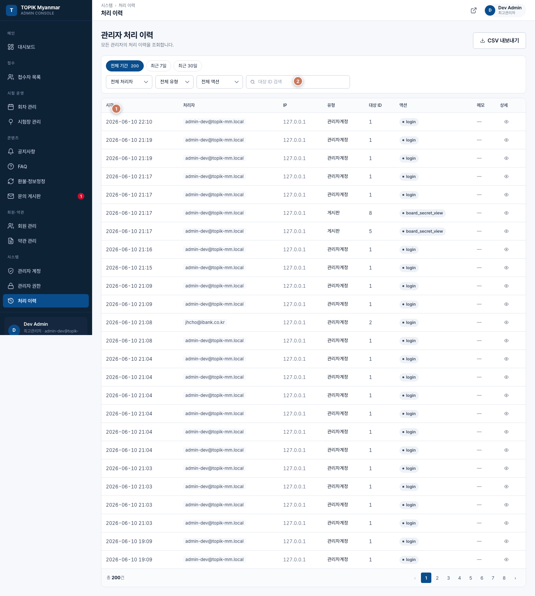

관리자가 한 **승인·반려·수납·수정** 등의 기록을 조회합니다. 분쟁·감사 시 「누가·언제·무엇을」 했는지 확인하는 화면입니다.

| 번호 | 요소 | 설명 |
| --- | --- | --- |
| 1 | **이력 목록** | 기간·처리자·유형·액션 필터. 시각·처리자·대상·내용 요약. |
| 2 | **검색** | 대상 ID·키워드 등으로 검색. |

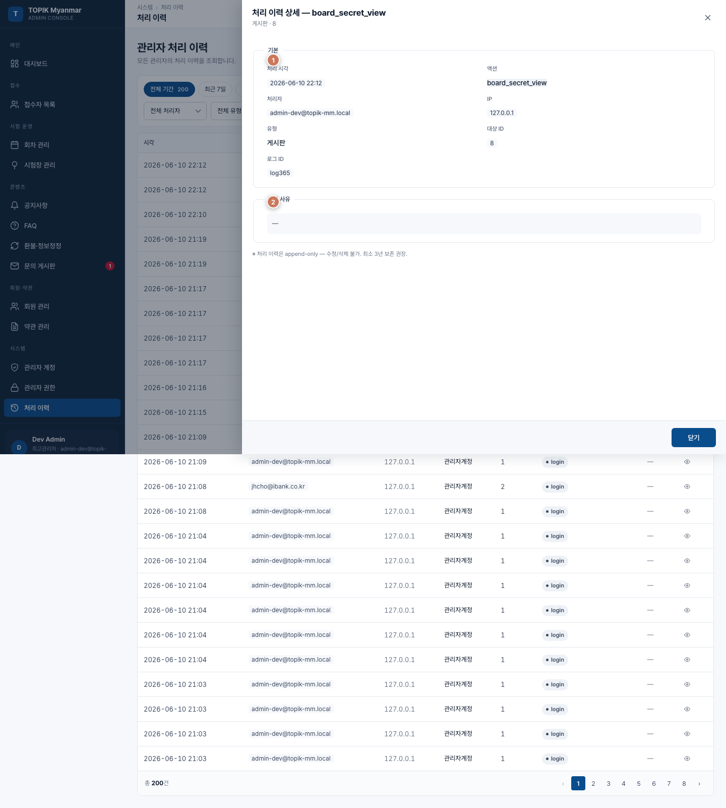

| 번호 | 요소 | 설명 |
| --- | --- | --- |
| 1 | **처리 정보** | 처리 시각·담당자·유형·대상(접수자·회원 등). |
| 2 | **변경 내용** | 변경 전/후 값, 관련 화면으로 이동하는 링크(있는 경우). |

**조회 범위:** 최고관리자 = **전체** 이력, 일반/조회 = **본인이 처리한** 이력만.  
**접수자 상세와의 차이:** 이 메뉴는 시스템 **전체** 처리 이력입니다. **접수자 목록 → 상세보기 → 처리 이력** 탭은 **해당 접수 건 한 건**에 대한 이력만 보여 줍니다.  
**CSV 내보내기:** 최고관리자만. 필터 적용 결과를 파일로 저장.  
**보관:** 이력은 **수정·삭제 불가**. 최소 **3년** 보관을 권장합니다.

---

## 16. 관리자 접근 로그

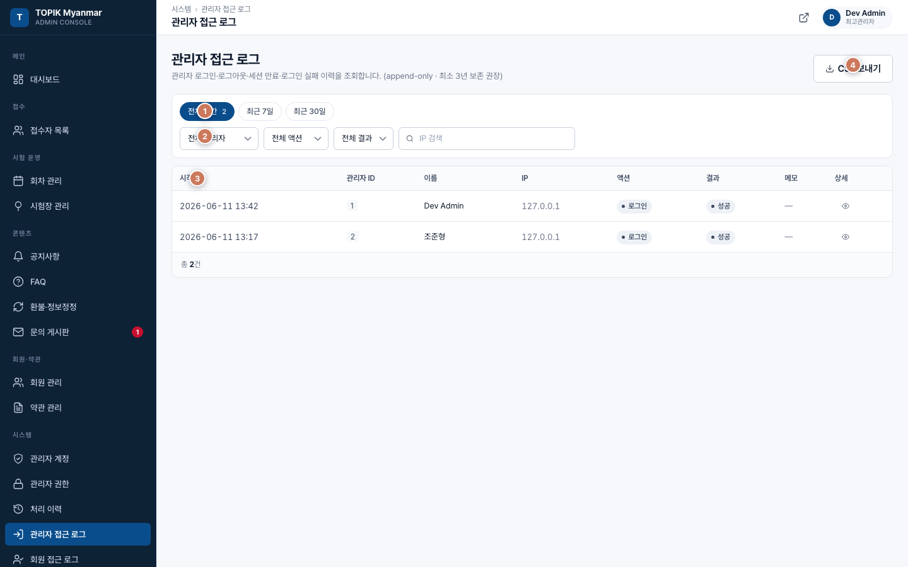

**시스템** 그룹 메뉴입니다. 관리자 계정의 **로그인·로그아웃·세션 만료·로그인 실패** 이력을 조회합니다. **최고관리자만** 접근할 수 있습니다.

| 번호 | 요소 | 설명 |
| --- | --- | --- |
| 1 | **기간 필터** | **전체 기간** / **최근 7일** / **최근 30일** 칩. 전체 기간 칩에 전체 건수가 배지로 표시됩니다. |
| 2 | **상세 필터** | **관리자**(드롭다운)·**액션**(로그인/로그아웃/세션만료/로그인실패)·**결과**(성공/실패)·**IP 검색**으로 목록을 좁힙니다. |
| 3 | **이력 목록** | 시각·관리자 ID·이름·IP·액션·결과·메모·**상세**(눈 아이콘) 열. 한 페이지 25행, 하단 페이지 이동. |
| 4 | **CSV보내기** | 현재 필터가 적용된 결과를 CSV 파일로 저장합니다. 보내기 자체도 처리 이력에 기록됩니다. |

| 액션 | 의미 |
| --- | --- |
| 로그인 | 관리자 로그인 성공 |
| 로그아웃 | 관리자 로그아웃 |
| 세션만료 | 토큰 만료·재로그인 필요 |
| 로그인실패 | 비밀번호 오류·잠금 등 실패 |

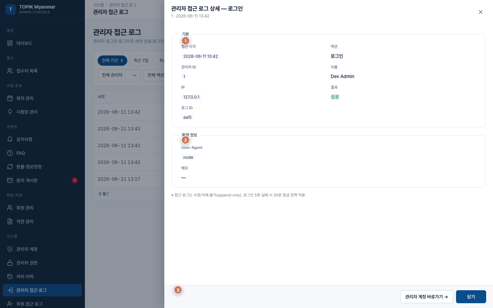

| 번호 | 요소 | 설명 |
| --- | --- | --- |
| 1 | **기본 정보** | 접근 시각·액션·관리자 ID·이름·IP·결과·로그 ID. |
| 2 | **환경 정보** | **User-Agent**(브라우저·OS)·**메모**(실패 사유·세션 만료 안내 등). |
| 3 | **하단 버튼** | **관리자 계정 바로가기** → 해당 관리자 계정 화면. **닫기**로 패널을 닫습니다. |

> **TIP:** 로그인 5회 연속 실패 시 30분 잠금 정책이 적용됩니다. 잠금 의심 건은 **결과=실패** + **액션=로그인실패**로 필터하세요.  
> 이력은 **append-only**(수정·삭제 불가). 최소 **3년** 보관을 권장합니다.

---

## 17. 회원 접근 로그

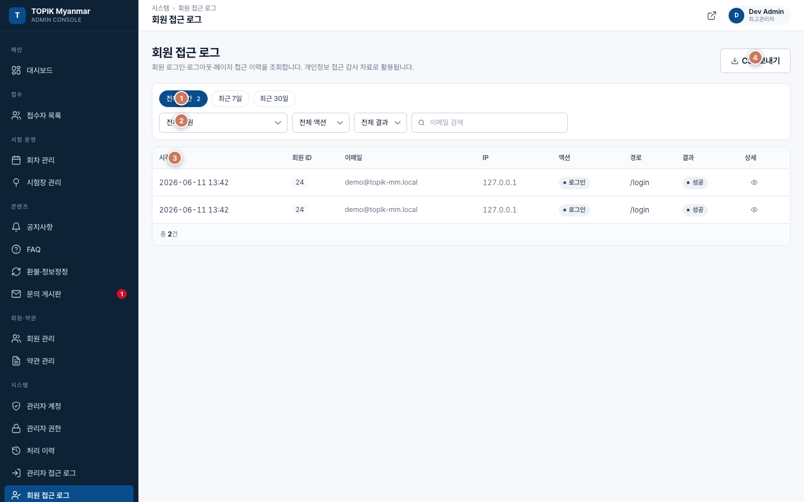

**시스템** 그룹 메뉴입니다. 응시자(회원)의 **로그인·로그아웃·페이지 접근·로그인 실패** 이력을 조회합니다. 개인정보 접근 감사 자료로 활용합니다. **최고관리자만** 접근할 수 있습니다.

| 번호 | 요소 | 설명 |
| --- | --- | --- |
| 1 | **기간 필터** | **전체 기간** / **최근 7일** / **최근 30일** 칩. 전체 기간 칩에 전체 건수가 배지로 표시됩니다. |
| 2 | **상세 필터** | **회원**(드롭다운)·**액션**(로그인/로그아웃/페이지접근/로그인실패)·**결과**(성공/실패)·**이메일 검색**으로 목록을 좁힙니다. |
| 3 | **이력 목록** | 시각·회원 ID·이메일·IP·액션·**경로**(페이지 URL)·결과·**상세** 열. 페이지접근 건은 어떤 화면에 들어갔는지 경로로 확인합니다. |
| 4 | **CSV보내기** | 현재 필터 결과를 CSV로 저장합니다. 감사·분쟁 대비 자료로 활용하세요. |

| 액션 | 의미 |
| --- | --- |
| 로그인 | 회원 로그인 성공 |
| 로그아웃 | 회원 로그아웃 |
| 페이지접근 | 인증 후 주요 페이지 진입 기록 |
| 로그인실패 | 비밀번호 오류 등 |

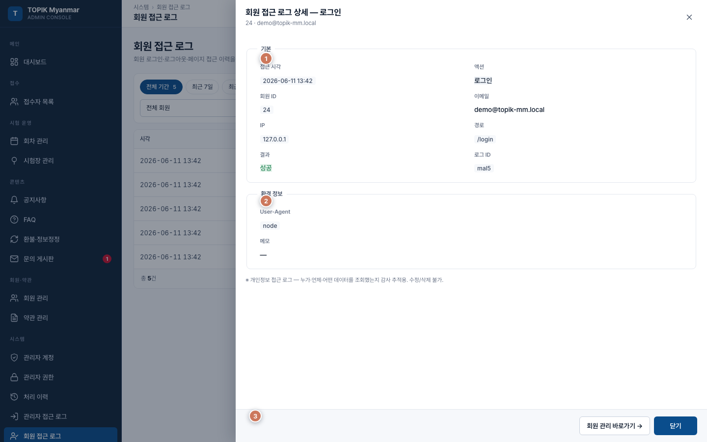

| 번호 | 요소 | 설명 |
| --- | --- | --- |
| 1 | **기본 정보** | 접근 시각·액션·회원 ID·이메일·IP·**경로**·결과·로그 ID. |
| 2 | **환경 정보** | **User-Agent**·**메모**. |
| 3 | **하단 버튼** | **회원 관리 바로가기** → 해당 회원 상세. **닫기**로 패널을 닫습니다. |

> **TIP:** 「처리 이력」은 관리자가 한 **업무 처리**(승인·수납 등)이고, 이 메뉴는 **회원의 접속·인증** 기록입니다. 용도가 다릅니다.

---

## 18. 권한 변경 이력

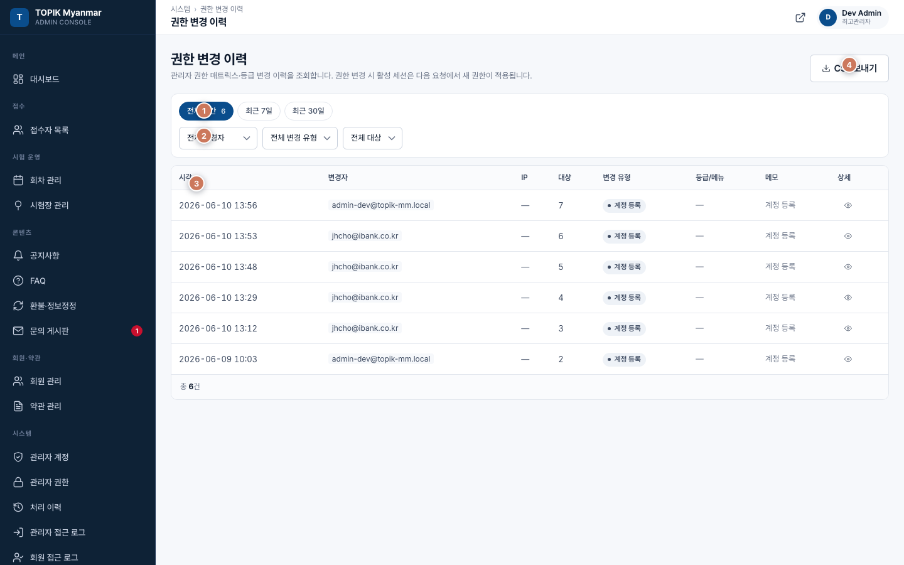

**시스템** 그룹 메뉴입니다. 관리자 **권한 매트릭스·등급** 변경 내역을 조회합니다. 권한 관련 처리 이력만 모아 보여 줍니다. **최고관리자만** 접근할 수 있습니다.

| 번호 | 요소 | 설명 |
| --- | --- | --- |
| 1 | **기간 필터** | **전체 기간** / **최근 7일** / **최근 30일** 칩. |
| 2 | **상세 필터** | **변경자**(최고관리자 목록)·**변경 유형**(메뉴 권한 변경/등급 변경/액션 추가·제거)·**대상**(관리자 ID 또는 권한매트릭스). |
| 3 | **이력 목록** | 시각·변경자·IP·대상·변경 유형·등급/메뉴·메모·**상세** 열. |
| 4 | **CSV보내기** | 필터 결과를 CSV로 저장합니다. |

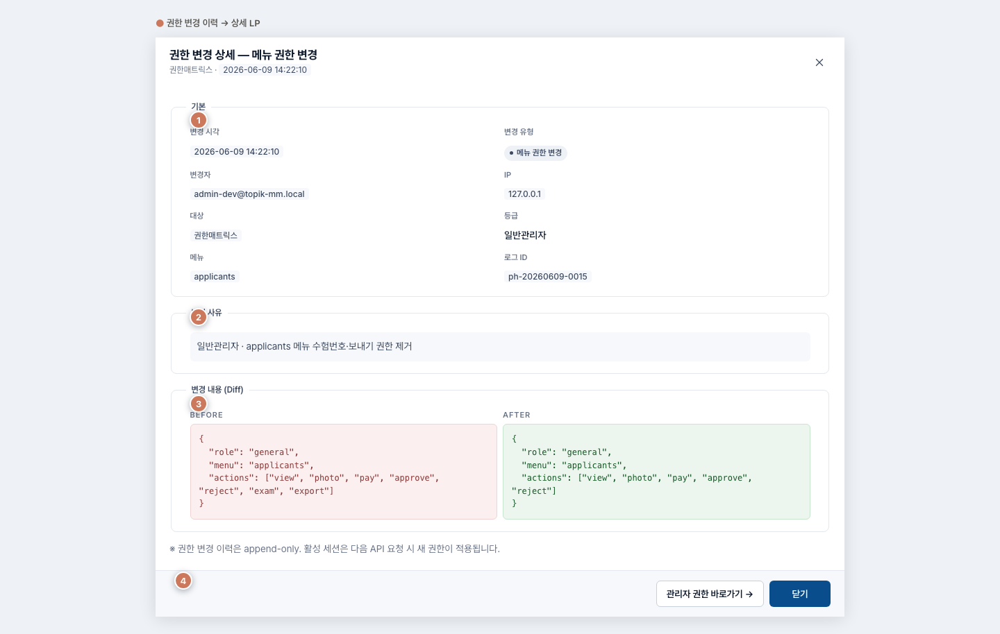

| 번호 | 요소 | 설명 |
| --- | --- | --- |
| 1 | **기본 정보** | 변경 시각·변경 유형·변경자·IP·대상·등급·메뉴·로그 ID. |
| 2 | **변경 사유** | 권한 변경 시 입력한 메모·사유. |
| 3 | **변경 내용 (Diff)** | **Before** / **After** JSON 비교. 메뉴별 권한·등급이 어떻게 바뀌었는지 확인합니다. |
| 4 | **하단 버튼** | **관리자 권한 바로가기** → 권한 표 화면. **닫기**로 패널을 닫습니다. |

> **TIP:** 권한을 변경한 직후에는 **활성 세션**에 바로 반영되지 않을 수 있습니다. 해당 관리자는 **다음 API 요청**부터 새 권한이 적용됩니다.

---

## 부록: 공통 운영 안내

### A. 관리자 등급 (3종)

| 등급 | 주요 권한 | 이런 분에게 |
| --- | --- | --- |
| **최고관리자** | 전 기능 + 수험번호 부여 + 관리자 계정 + 약관 게시·폐지 + 전체 이력·내보내기 | 운영 책임자·IT 담당 |
| **일반관리자** | 접수 처리 + 공지·FAQ·환불·문의 + 본인 이력 | 현장 접수·수납 담당 |
| **조회관리자** | 모든 화면 조회만(변경 버튼 비활성) | 통계·감사·보조 |

### B. 동시 작업

여러 관리자가 **같은 접수 건**을 동시에 열 수 있습니다. 다른 사람이 먼저 **수납·승인·반려**를 완료하면 **「다른 관리자가 먼저 수정했습니다. 최신 데이터로 새로고침합니다.」** 안내가 뜨고 목록이 갱신됩니다. **갱신된 상태**를 확인한 뒤, 필요하면 다시 처리하세요. 같은 건을 두 번 수납하는 일은 없도록 설계되어 있습니다.

### C. 이메일 알림

승인·반려·사진 반려·마케팅 공지 등 주요 처리 시 응시자·회원에게 **이메일**이 발송될 수 있습니다. 반려·사유 안내 문구는 응시자가 받는 내용과 동일하게 신중히 작성하세요.

### D. 내보내기 요약

| 내보내기 | 위치 | 내용 | 권한 |
| --- | --- | --- | --- |
| 연명부 엑셀 | 접수자 | 10항목, 지역·시험장·급수별 파일 | 최고 |
| 사진 ZIP | 접수자 | 폴더 구조 + 누락 리포트 | 최고 |
| 회원 CSV | 회원 | 가입·상태·마케팅 수신 등 | 최고 |
| 동의 이력 CSV | 약관 | 동의 시각·회원·약관·버전 | 최고 |
| 처리 이력 CSV | 처리 이력 | 필터 결과 전체 | 최고 |
| 권한 표 CSV | 권한 | 메뉴·액션·등급별 O/X | 최고 |
| 관리자 접근 로그 CSV | 관리자 접근 로그 | 필터 결과 | 최고 |
| 회원 접근 로그 CSV | 회원 접근 로그 | 필터 결과 | 최고 |
| 권한 변경 이력 CSV | 권한 변경 이력 | 필터 결과 | 최고 |

### E. 자주 하는 실수와 대처

| 상황 | 원인 | 대처 |
| --- | --- | --- |
| 수납 버튼이 비활성 | 사진 미승인 | 먼저 **사진 승인** |
| 승인 버튼이 비활성 | 수납 미완료 또는 사진 미승인 | **사진 승인 → 수납 → 승인** 순서 확인 |
| 상세 「처리 이력 (N)」 숫자가 이상함 | 전체 이력 메뉴와 혼동 | 상세 탭은 **해당 접수 건**만 집계. N=0이면 이력 없음 |
| 접수자 메뉴 배지가 기대와 다름 | 미수납만 집계 | 취소·반려·환불·이미 수납 완료 건은 배지 제외 |
| 「다른 관리자가 먼저 수정」 | 동시 처리 | 목록 갱신 후 상태 재확인 |
| 수험번호가 응시자에게 안 보임 | 노출 시점 전 | **노출 시점** 일시 확인 |
| 수험번호 일괄 부여 0건 | 승인 전·이미 부여됨 | **승인** 처리 후 상태 **승인완료**인지 확인 |
| 수험번호 부여 버튼 비활성 | super 아님 | **최고관리자** 계정으로 로그인 |
| 수험번호 부여 오류(시험장) | `exam_venue_id` 불일치 | **시험장 관리** 데이터·접수 시험장 확인 |
| 조회 계정으로 처리 불가 | 권한 부족 | 최고관리자에게 등급 변경 요청 |

---
