# FO 사용 가이드

> **목적:** TOPIK Myanmar 웹사이트(응시자용) 이용 방법을 안내합니다.
> **대상:** 처음 사이트를 이용하는 일반 사용자
> **작성 기준:** 2026-06-12 (정책·검증·i18n·게시판·수험표 갱신 반영)

### 최근 업데이트 (2026-06-12)

- **수험표 출력:** 수험번호가 공개된 접수 카드의 **「TOPIK 본부에서 수험표 출력」** 버튼은 본부 **수험표 출력 전용 페이지**(`https://www.topik.go.kr/TWMYPG/TWMYPG0030-001.do`)로 이동. **「TOPIK 본부 홈페이지로 이동」** 은 `https://www.topik.go.kr` 유지.
- **환불·정보정정:** 글쓰기 화면 진입 시 **개인정보 동의 체크 해제** 상태. **작성·수정** 모두 비밀번호(4자 이상)·약관 동의 필수.
- **문의게시판:** **비밀글 수정** 시에도 비밀글 비밀번호(4자 이상) 재입력 필수.
- **게시판:** 글 접수 시 작성자에게 **접수 확인 이메일** 발송.

상세: [`RELEASE_NOTES_2026-06-12.md`](../RELEASE_NOTES_2026-06-12.md)

### 최근 업데이트 (2026-06-11)

- **비밀번호:** 8자 이상 + 영문·숫자·특수문자 **각 1자 필수** (가입·재설정·내정보 변경). **현재 비밀번호와 같은 새 비밀번호는 변경 불가.**
- **회원가입 OTP:** 이메일 형식 검증, **6회 연속 오류 시 코드 폐기** → 인증코드 **재발송** 필요.
- **생년월일·연락처:** 숫자만 입력 (가입·아이디 찾기·내정보).
- **시험 접수:** 증명사진 **미등록 시 제출 불가**, 필수 약관 서버 검증.
- **증명사진:** FO·서버 **2MB 이하**.
- **로그인:** 비밀번호 6개월 미변경 시 **변경 안내 팝업** (나중에 / 변경하기).
- **다국어(i18n):** KO/MY/EN 전환 시 **메뉴·버튼·안내 문구**와 **로그인·가입·접수 오류 메시지**가 선택한 언어로 표시됩니다. API 오류도 동일 언어로 안내됩니다.
- **편의지원(장애인) 접수:** 응시자 화면 **미제공** (추후 요청 시 재구현 예정).

TOPIK Myanmar 사이트에서 **회원가입 → 시험 접수 → 사진 심사·응시료 납부 → 접수 확인 → 수험표 출력**까지, 응시자가 직접 해야 할 일을 단계별로 설명합니다. 화면마다 **어디를 누르면 되는지**, **미리 준비할 것**, **막혔을 때 확인할 점**을 함께 적어 두었습니다.

---

## 목차

1. [공통 레이아웃](#1-공통-레이아웃-gnb--푸터--모바일)
2. [메인 홈](#2-메인-홈)
3. [TOPIK 안내 · 시험 개요](#3-topik-안내--시험-개요)
4. [TOPIK 안내 · 시험 소개](#4-topik-안내--시험-소개)
5. [TOPIK 안내 · 문항 구성](#5-topik-안내--문항-구성)
6. [TOPIK 안내 · 평가 기준](#6-topik-안내--평가-기준)
7. [TOPIK 규정 · 유의 사항](#7-topik-규정--유의-사항)
8. [TOPIK 규정 · 답안 작성 요령](#8-topik-규정--답안-작성-요령)
9. [TOPIK 규정 · 응시료 규정](#9-topik-규정--응시료-규정)
10. [TOPIK 규정 · 신분증 규정](#10-topik-규정--신분증-규정)
11. [TOPIK 접수 · 접수 방법](#11-topik-접수--접수-방법)
12. [TOPIK 접수 · 시험 접수 (4단계)](#12-topik-접수--시험-접수-4단계)
13. [TOPIK 접수 · 접수 확인](#13-topik-접수--접수-확인)
14. [TOPIK 접수 · 수험표 출력](#14-topik-접수--수험표-출력)
15. [게시판 · 공지사항](#15-게시판--공지사항)
16. [게시판 · FAQ](#16-게시판--faq)
17. [게시판 · 문의게시판](#17-게시판--문의게시판)
18. [게시판 · 환불·정보정정](#18-게시판--환불정보정정)
19. [계정 · 로그인](#19-계정--로그인)
20. [계정 · 회원가입 (3단계)](#20-계정--회원가입-3단계)
21. [계정 · 비밀번호 재설정](#21-계정--비밀번호-재설정)
22. [계정 · 내정보 수정](#22-계정--내정보-수정)
23. [약관 · 이용약관](#23-약관--이용약관)
24. [약관 · 개인정보처리방침](#24-약관--개인정보처리방침)
25. [약관 · 마케팅 수신](#25-약관--마케팅-수신)
26. [에러 · 404](#26-에러--404)

## 이 가이드 사용법

- **필수 표기:** 입력 필드 표에서 ● = 반드시 입력, ○ = 선택 입력입니다.
- **로그인이 필요한 메뉴:** 시험 접수, 접수 확인, 환불·정정, 문의게시판은 **로그인 후** 이용할 수 있습니다. 로그인하지 않은 상태에서 해당 메뉴를 누르면 로그인 화면으로 이동하며, 로그인을 마치면 **원래 가려던 페이지**로 자동 이동합니다.
- **언어 변경:** 화면 오른쪽 상단의 **KO / MY / EN** 버튼을 누르면 한국어, 미얀마어, 영어로 전환됩니다. 선택한 언어는 다음 방문 때도 유지됩니다. **메뉴·버튼·입력 안내·오류 메시지**(로그인 실패, OTP 오류, 접수 검증 등)도 함께 바뀝니다. 공지·FAQ·약관은 언어별로 내용이 다를 수 있으니, 편한 언어로 바꿔 읽어 보세요.

### 처음 이용하시는 분 — 추천 순서

1. [메인 홈](#2-메인-홈)에서 **현재 회차·접수 마감** 확인
2. [접수 방법](#11-topik-접수--접수-방법)과 [응시료 규정](#9-topik-규정--응시료-규정) 읽기
3. [회원가입](#20-계정--회원가입-3단계) → [로그인](#19-계정--로그인) → [시험 접수](#12-topik-접수--시험-접수-4단계)
4. 접수 후 [접수 확인(마이페이지)](#13-topik-접수--접수-확인)에서 **사진 심사·수납·수험번호** 진행 상황 확인
5. 문제가 있으면 [FAQ](#16-게시판--faq) → [문의게시판](#17-게시판--문의게시판) 또는 [환불·정보정정](#18-게시판--환불정보정정)

> **TIP:** 증명사진(JPG/PNG, 3:4, 200KB~2MB, 최근 6개월)과 **오프라인 수납용 현금·접수번호**를 미리 준비해 두면 접수가 훨씬 수월합니다. 이 사이트에서는 **온라인 카드 결제가 되지 않습니다.**

---

## 1. 공통 레이아웃 (GNB · 푸터 · 모바일)

모든 페이지는 **같은 상단 메뉴(GNB)**, **하단 푸터**, **모바일 하단 탭바**를 사용합니다. 어느 화면에서든 메뉴 구성과 로그인 상태가 동일하게 보이므로, 한 번 익혀 두면 다른 페이지에서도 길을 잃지 않습니다.

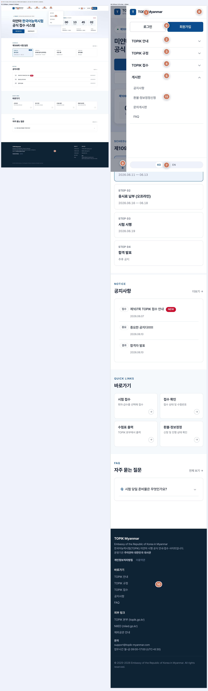

### 사용 흐름 (시나리오)

1. 페이지를 열면 상단 메뉴·하단 푸터·모바일 탭바가 자동으로 표시됩니다.
2. 로그인한 상태라면 오른쪽에 **내 이름**과 **로그아웃** 버튼이 보이고, 로그인하지 않았다면 **로그인**·**회원가입** 버튼이 보입니다. 이름을 클릭하면 **마이페이지(접수 확인)** 로 이동합니다.
3. 시험 접수·접수 확인·환불·정정·문의처럼 로그인이 필요한 메뉴를 누르면 먼저 로그인 화면으로 이동합니다. 로그인 후 **원래 가려던 메뉴**로 자동 이동합니다.
4. **모바일**에서는 화면 아래 **4개 탭**(홈·접수·게시판·마이)으로 주요 메뉴에 빠르게 갈 수 있습니다. 더 많은 메뉴는 우측 **햄버거(≡)** 를 눌러 주세요.

### 요소별 상세

| 번호 | 요소 | 무엇 / 동작 / 결과 |
| --- | --- | --- |
| 1 | 로고 | TOPIK Myanmar 로고. 클릭하면 **홈**으로 이동합니다. |
| 2 | TOPIK 안내 | 마우스를 올리거나 탭하면 시험 개요·소개·문항 구성·평가 기준 메뉴가 펼쳐집니다. 시험이 처음이면 여기서 **시험 구조**를 먼저 읽어 보세요. |
| 3 | TOPIK 규정 메뉴 | 드롭다운: 유의 사항·답안 작성 요령·응시료 규정·신분증 규정. **시험 당일** 전에 유의 사항·신분증 규정을 꼭 확인하세요. |
| 4 | TOPIK 접수 메뉴 | 드롭다운: 접수 방법·**시험 접수(로그인)**·**접수 확인(로그인)**·수험표 출력. |
| 5 | 게시판 메뉴 | 드롭다운: 공지사항·**환불·정보정정신청(로그인)**·**문의게시판(로그인)**·FAQ. |
| 6 | 로그인·회원가입 | 로그인 전: **로그인**·**회원가입** 버튼. 로그인 후: 내 이름(클릭 시 마이페이지) + **로그아웃**. |
| 7 | 언어 전환 (KO/MY/EN) | 버튼을 누르면 **바로** 해당 언어로 화면이 바뀝니다. 정적 문구·동적 상태(로딩·오류)·서버 안내가 **같은 언어**로 표시됩니다. 새로고침 없이 적용됩니다. |
| 8 | 햄버거 메뉴 (모바일) | 우측 슬라이드 메뉴. 4대 메뉴 아코디언 + 로그인/마이 + 언어 전환. **ESC·배경 클릭·닫기(✕)** 로 닫힘, 열린 동안 본문 스크롤 잠금. |
| 9 | 하단 탭바 (모바일) | 홈·접수·게시판·마이 4탭. 현재 페이지에 맞춰 활성 탭 표시(예: 마이페이지·로그인은 "마이"). |
| 10 | 푸터 | 운영기관 안내, 바로가기, TOPIK·NIIED 등 외부 링크, **개인정보처리방침**(볼드 강조), 이용약관·마케팅 링크, 문의 이메일, 업무시간(**월–금 09:00–17:00, 미얀마 시간**). |
| 11 | 로그인 필요 페이지 | 시험 접수·접수 확인·환불·정정·문의는 로그인 후 이용합니다. |

> **TIP:** PC에서는 상단 메뉴, 스마트폰에서는 **하단 탭**과 **햄버거 메뉴**를 함께 쓰면 편합니다. 접수·마이페이지는 모바일 **「마이」** 탭에서도 바로 갈 수 있습니다.

---

## 2. 메인 홈

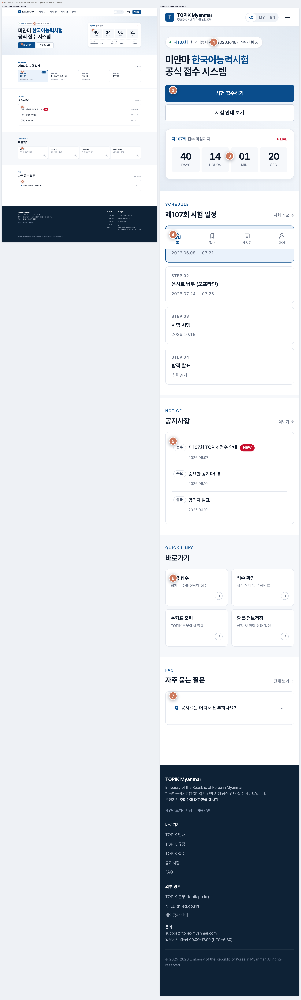

**사이트 첫 화면**입니다. 지금 **몇 회차**가 접수 중인지, **마감까지 얼마나 남았는지**, **시험·합격 발표 일정**, **최신 공지**, **자주 묻는 질문**을 한곳에서 확인할 수 있습니다. 접수 전에 여기서 **일정과 마감**을 꼭 확인하세요.

### 요소별 상세

- **1) 회차 배지** — 현재/다음 회차와 시험일을 표시합니다. 상태에 따라 모양이 바뀝니다: 접수 전 = "제N회 …(시험일)", 접수 중 = "… 접수 진행 중"(초록 점 깜빡임), 마감 = "접수 마감"(회색). **접수 중인 회차**가 우선 표시되고, 없으면 가장 가까운 **예정** 회차가 표시됩니다.
- **2) 주요 버튼** — **시험 접수하기**(로그인 필요), **시험 안내 보기**. PC는 가로, 모바일은 세로로 배치됩니다. 아직 가입하지 않았다면 **회원가입** 후 접수하세요.
- **3) D-Day 카운트다운** — **접수 마감 시각까지** 남은 일·시·분·초를 1초마다 갱신합니다. 0이 되면 "접수가 마감되었습니다 + 다음 회차 일정 보기" 안내로 자동 전환됩니다. 마감 직전에는 서버 부하로 지연될 수 있으니 **여유 있게** 접수하는 것을 권장합니다.
- **4) 일정 타임라인** — 4단계 카드: 원서 접수 → 응시료 납부(오프라인) → 시험 시행 → 합격 발표(추후 공지). 현재 진행 중 단계는 **진행중**, 지난 단계는 **종료** 배지로 표시됩니다.
- **5) 공지 미리보기** — 최신 공지 최대 5건. 각 행 = 카테고리 배지 + 제목(고정글은 NEW) + 날짜. 행을 클릭하면 공지 상세로 이동합니다. **중요·접수** 공지는 반드시 읽어 보세요.
- **6) 바로가기 카드** — 시험 접수 / 접수 확인 / 수험표 출력 / 환불·정보정정. 자주 쓰는 메뉴로 빠르게 이동합니다.
- **7) FAQ 아코디언** — FAQ 상위 3건 요약. 질문 클릭 시 답변 펼침. 더 보려면 [FAQ 메뉴](#16-게시판--faq)로 이동하세요.

> **TIP:** 홈의 D-Day는 **접수 마감** 기준입니다. 시험 당일까지 남은 시간과는 다릅니다. 접수 후에는 [접수 확인(마이페이지)](#13-topik-접수--접수-확인)에서 **사진 심사·수납** 진행 상황을 확인하세요.

---

## 3. TOPIK 안내 · 시험 개요

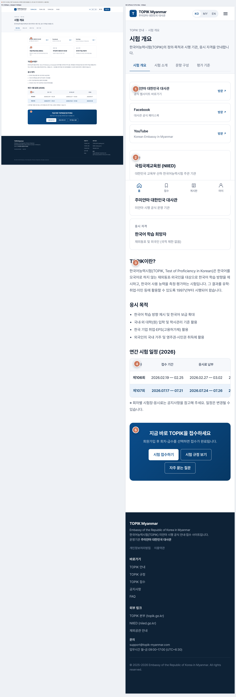

TOPIK 시험의 **전체 그림**을 소개하는 페이지입니다. 시험이 무엇인지, 누가 볼 수 있는지, 미얀마에서 **언제** 시험이 열리는지 확인할 수 있습니다. 처음 TOPIK을 준비하시는 분은 이 페이지와 [시험 소개](#4-topik-안내--시험-소개)를 함께 읽어 보세요.

| 번호 | 요소 | 무엇 / 동작 |
| --- | --- | --- |
| 1 | 외부 링크 3종 | 주미얀마 대한민국 대사관·Facebook·YouTube (새 탭). 공식 소식·안내 영상을 볼 수 있습니다. |
| 2 | 핵심 요약 카드 | **주관**(국립국제교육원 NIIED) / **시행 기관**(주미얀마 대한민국 대사관) / **응시 자격**(국적 제한 없음). |
| 3 | 본문 | "TOPIK이란?"(1997년~ 시행 목적), 응시 목적 4가지(유학·취업·이민·자격 확인 등). |
| 4 | 연간 시험 일정 표 | 등록된 시험 회차 일정이 표로 표시됩니다. **현재 접수 중**인 회차는 표에서 강조 표시됩니다. 시각은 **미얀마(UTC+6:30)** 기준입니다. |
| 5 | CTA 블록 | **시험 접수하기** / **시험 규정 보기** / **자주 묻는 질문**. 접수 전 규정·FAQ를 먼저 보면 실수를 줄일 수 있습니다. |

> **TIP:** 일정 표의 날짜는 **변경될 수** 있습니다. 최종 일정은 **공지사항**과 홈 화면 회차 정보를 함께 확인하세요.

---

## 4. TOPIK 안내 · 시험 소개

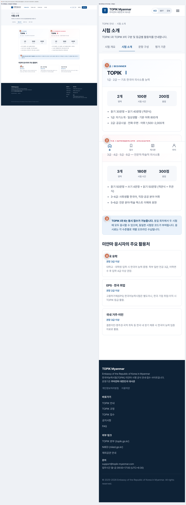

**TOPIK Ⅰ과 Ⅱ의 차이**, **등급별 활용처**를 카드로 설명하는 안내 페이지입니다. "어느 급수를 접수해야 할까?" 고민될 때 참고하세요. Ⅰ·Ⅱ **동시 접수**도 가능합니다(응시료는 급수별로 각각 납부).

| 번호 | 요소 | 내용 |
| --- | --- | --- |
| 1 | TOPIK Ⅰ 카드 | **초급**(1·2급) · 2개 영역 · 100분 · 200점. 듣기 30 + 읽기 40(객관식). 급수별 어휘 안내. 한국어 기초~초급 학습자·EPS 등에 적합. |
| 2 | TOPIK Ⅱ 카드 | **중·고급**(3~6급) · 3개 영역 · 180분 · 300점. 듣기 50 + 쓰기 4 + 읽기 50(객관식+주관식). 유학·전문직 등에 많이 사용. |
| 3 | 동시 접수 안내 콜아웃 | Ⅰ·Ⅱ **동시 접수 가능**, **동일 시험장** 코드, 응시료는 **수준별 개별** 오프라인 수납. 같은 날 두 시험을 보려면 접수 시 둘 다 선택하세요. |
| 4 | 활용처 카드 3종 | 한국 유학(권장 **3급+**) / EPS·취업(권장 **2급+**) / 거주·이민(권장 **3급+**). 목적에 맞는 급수를 선택하는 참고 자료입니다. |

> **TIP:** 목표 기관(대학·고용주)에서 요구하는 **급수**를 먼저 확인한 뒤 접수하세요. 급수를 잘못 선택해도 접수 기간 중 **수납 전**까지는 마이페이지에서 취소할 수 있습니다.

---

## 5. TOPIK 안내 · 문항 구성

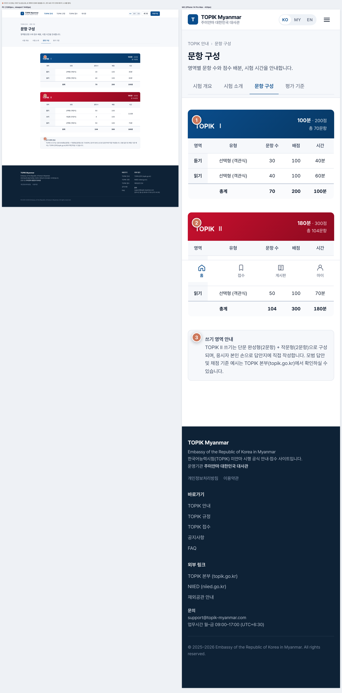

시험 **영역별 문항 수·배점·시간**을 정리한 표 페이지입니다. 시험 당일 **시간 배분**을 계획할 때 참고하세요. TOPIK Ⅱ는 **쓰기(주관식)** 가 포함되어 Ⅰ보다 시간·난이도가 높습니다.

| 시험 | 영역 (유형) | 문항 | 배점 | 시간 |
| --- | --- | --- | --- | --- |
| **TOPIK Ⅰ** | 듣기 (객관식) | 30 | 100 | 40분 |
| | 읽기 (객관식) | 40 | 100 | 60분 |
| | **총계** | **70** | **200** | **100분** |
| **TOPIK Ⅱ** | 듣기 (객관식) | 50 | 100 | 110분(듣기+쓰기) |
| | 쓰기 (주관식) | 4 | 100 | |
| | 읽기 (객관식) | 50 | 100 | 70분 |
| | **총계** | **104** | **300** | **180분** |

### 요소별 상세

| 번호 | 블록 | 핵심 내용 |
| --- | --- | --- |
| 1 | TOPIK Ⅰ 문항 표 | 듣기 30문항(40분)·읽기 40문항(60분), 총 70문항·200점·100분. 헤더에 급수·총 문항·총점·시간 요약. |
| 2 | TOPIK Ⅱ 문항 표 | 듣기 50·쓰기 4·읽기 50문항, 총 104문항·300점·180분(듣기+쓰기 110분, 읽기 70분). |
| 3 | 쓰기 안내 콜아웃 | TOPIK Ⅱ 쓰기 = 단문 완성형 2 + 작문형 2, 응시자 **본인 손**으로 답안지에 직접 작성. 연필·볼펜 사용 불가. 모범 답안·채점 기준은 [topik.go.kr](https://topik.go.kr)에서 확인. |

> **TIP:** Ⅱ급 응시 시 **쓰기 연습**을 미리 해 두세요. OMR(객관식)만 연습하면 쓰기 시간이 부족할 수 있습니다.

---

## 6. TOPIK 안내 · 평가 기준

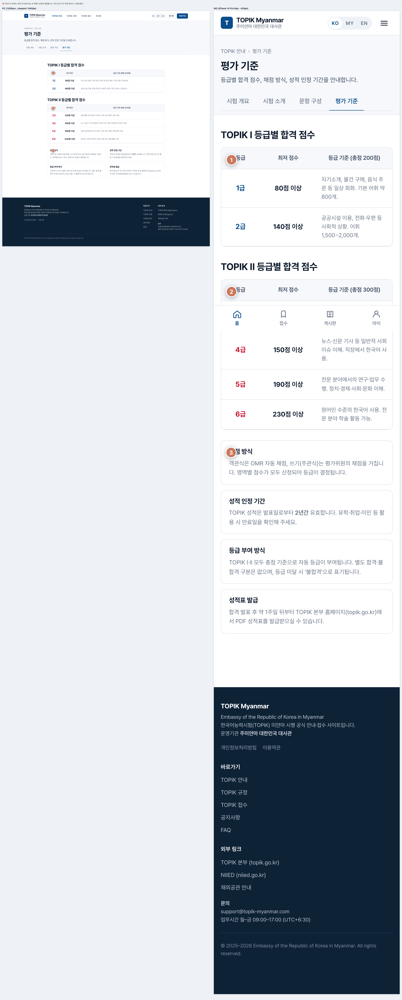

**등급별 합격 점수**와 채점·성적 인정 방식을 안내하는 페이지입니다. "몇 점 이상이면 몇 급?"을 확인할 수 있습니다. 실제 합격 여부는 **총점**이 해당 급수 **최저 점수** 이상일 때 해당 급수가 부여됩니다(영역별 최저 점수는 별도 규정이 없을 수 있음 — 최종 기준은 공식 안내 참고).

| 시험 | 등급 | 최저 점수 |
| --- | --- | --- |
| TOPIK Ⅰ (200점) | 1급 / 2급 | 80점 이상 / 140점 이상 |
| TOPIK Ⅱ (300점) | 3급 / 4급 / 5급 / 6급 | 120 / 150 / 190 / 230점 이상 |

### 요소별 상세

| 번호 | 블록 | 핵심 내용 |
| --- | --- | --- |
| 1 | TOPIK Ⅰ 등급표 | 1급(80점+)·2급(140점+) 합격 기준. 등급별 최저 점수·설명·점수 막대 시각화. |
| 2 | TOPIK Ⅱ 등급표 | 3~6급(120/150/190/230점+) 합격 기준. Ⅰ과 동일 형식, 색상만 Ⅱ(적색) 테마. |
| 3 | 추가 정보 카드 4종 | **채점 방식**(OMR 자동·쓰기 평가위원) · **성적 인정 기간(2년)** · **등급 부여**(총점 기준·미달 시 불합격) · **성적표 발급**([topik.go.kr](https://topik.go.kr) PDF). 성적표는 본부 사이트에서 직접 출력·다운로드합니다. |

> **TIP:** 성적은 **2년간** 인정됩니다. 유학·비자 일정에 맞춰 시험 시기를 계획하세요.

---

## 7. TOPIK 규정 · 유의 사항

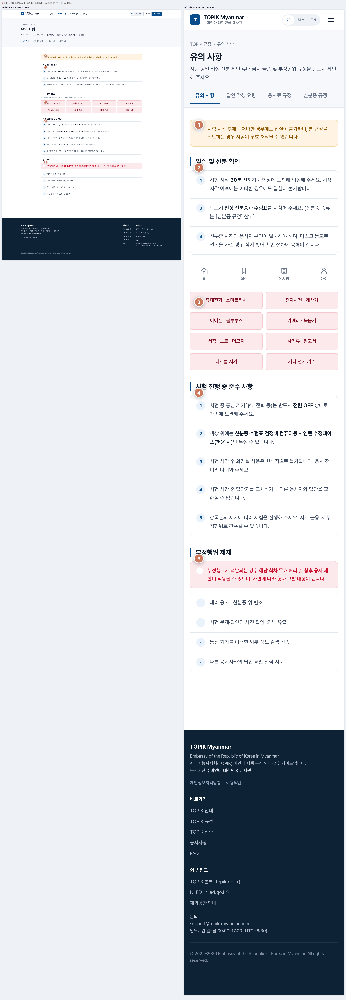

**시험 당일** 지켜야 할 규정을 정리한 페이지입니다. 입실 시간·금지 물품·부정행위 제재 등을 **시험 전날** 꼭 읽어 보세요. 규정 위반 시 **해당 회차 무효** 또는 향후 응시 제한이 될 수 있습니다.

| 번호 | 블록 | 핵심 내용 |
| --- | --- | --- |
| 1 | 상단 경고 | 시험 시작 후 입실 불가, 규정 위반 시 무효 처리 가능. |
| 2 | 입실 및 신분 확인 | 시작 **30분 전** 도착, 인정 신분증+수험표 지참, 사진·본인 일치 확인(마스크 잠시 벗기). |
| 3 | 휴대 금지 물품 | 휴대전화·스마트워치, 전자사전·계산기, 이어폰·블루투스, 카메라·녹음기, 서적·노트·메모지, 사전류·참고서, 디지털 시계, 기타 전자기기. |
| 4 | 진행 중 준수 사항 | 통신기기 전원 OFF·가방 보관, 책상 위 허용물(신분증·수험표·검정 사인펜·수정테이프), 화장실 사용 불가 원칙, 답안 교체·교환 금지, 감독관 지시 준수. |
| 5 | 부정행위 제재 | 회차 무효·향후 응시 제한·형사 고발 가능. (대리응시·신분증 위변조·문제/답안 촬영 유출·외부 정보 검색·답안 교환) |

> **TIP:** 시험장에는 **휴대전화·스마트워치**를 가져가지 마세요. 입실 전 전원 OFF 후 지정 장소에 보관해야 합니다. [신분증 규정](#10-topik-규정--신분증-규정)과 [수험표](#14-topik-접수--수험표-출력)도 함께 준비하세요.

---

## 8. TOPIK 규정 · 답안 작성 요령

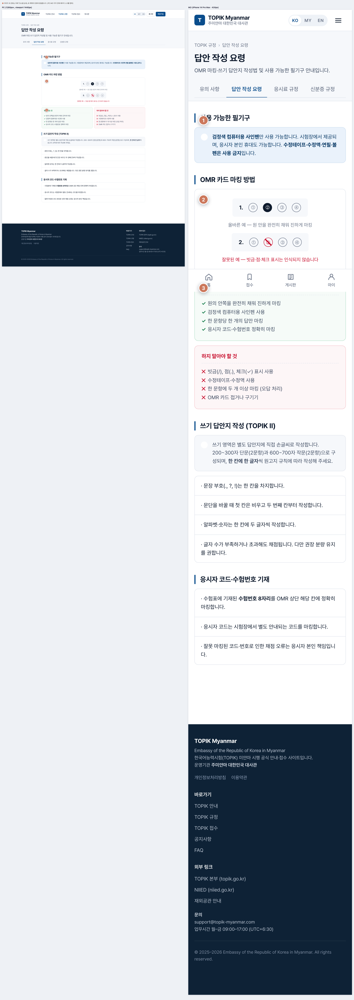

**OMR(객관식) 마킹**과 **쓰기 답안** 작성법, **사용 가능한 필기구**를 안내합니다. 시험 전에 OMR 연습을 해 두면 당일 실수를 줄일 수 있습니다.

| 번호 | 블록 | 핵심 내용 |
| --- | --- | --- |
| 1 | 사용 가능한 필기구 | **검정색 컴퓨터용 사인펜만** 사용(시험장 제공·본인 휴대 가능). 수정테이프·수정액·연필·볼펜 금지. |
| 2 | OMR 카드 마킹 | 올바른 예(원 안을 완전히 진하게) vs 잘못된 예(빗금·점·반칸) 일러스트로 비교. |
| 3 | 해야 할 것 / 하지 말 것 | Do/Don't 2열 표로 정답 마킹·**수정 테이프**로 OMR 정정·답안지 훼손 금지 등 안내. 답을 바꿀 때는 기존 마킹을 지우지 말고 **수정테이프**로 덮은 뒤 다시 마킹하세요. |

> **TIP:** 시험장에서 **검정 컴퓨터용 사인펜**과 **수정테이프**를 제공하지만, 본인 것을 가져가도 됩니다. 연필·볼펜·수정액은 **사용할 수 없습니다.**

---

## 9. TOPIK 규정 · 응시료 규정

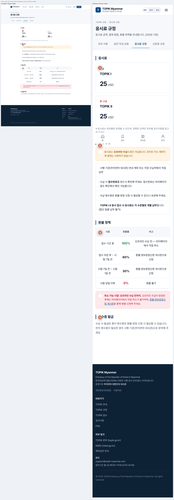

**응시료 금액·납부 방법·환불률**을 안내하는 페이지입니다(2026 기준). 이 사이트에서는 **온라인 결제가 되지 않으므로**, 접수 후 **지정 수납처에서 직접** 납부해야 합니다. Ⅰ·Ⅱ 동시 접수 시 **급수마다 각각** 납부합니다.

- **1) 응시료:** TOPIK Ⅰ = **$25 USD**, TOPIK Ⅱ = **$25 USD**. (회차별로 변경될 수 있음 — **접수 화면·공지**에 표시된 금액이 최종 기준입니다.)
- **2) 결제 방법:** **오프라인 수납만** (온라인 카드·계좌이체 미지원). 지정 계좌/수납처에서 직접 납부, 수납 시 **접수번호**를 꼭 확인·기록, **영수증 보관**, Ⅰ·Ⅱ 동시 접수 시 **수준별 개별 납부**.
- **3) 환불 정책 표:**

| 시점 | 환불률 | 비고 |
| --- | --- | --- |
| 접수 기간 중 | 100% | 오프라인 수납 전 — 마이페이지에서 직접 취소 |
| 접수 마감 후 ~ 시험 7일 전 | 60% | 환불·정보정정신청 게시판으로 신청 |
| 시험 7일 전 ~ 1일 전 | 30% | 환불·정보정정신청 게시판으로 신청 |
| 시험 당일 이후 | 0% | 환불 불가 |

- **4) 영수증 발급:** 종이 영수증은 환불·정정 신청 시 필요할 수 있음. 전자 영수증은 시행 기관 문의.

> **중요:** **오프라인 수납 전까지**는 마이페이지에서 **직접 접수 취소**(100% 환불 해당)가 가능합니다. **수납 후**에는 마이페이지 취소가 막히므로, 환불이 필요하면 [환불·정보정정신청 게시판](#18-게시판--환불정보정정)으로 신청하세요. 환불률은 아래 표와 [공지](#15-게시판--공지사항)를 함께 확인하세요.

---

## 10. TOPIK 규정 · 신분증 규정

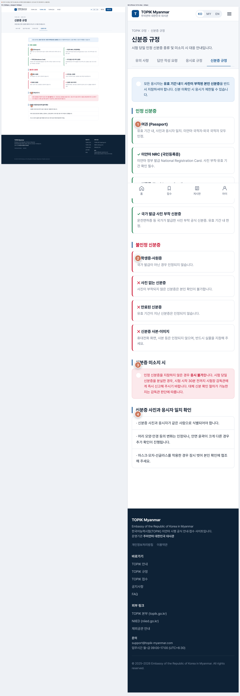

시험 당일 **반드시 지참**해야 하는 **신분증** 종류와, **인정되지 않는** 증명, **분실 시** 대응 방법을 안내합니다. 신분증 없이는 **응시할 수 없습니다.** 수험표와 함께 준비하세요.

| 번호 | 블록 | 핵심 내용 |
| --- | --- | --- |
| 1 | 인정 신분증 | 여권·미얀마 NRC·미얀마 발급 거주증·국가 발급 사진 부착 신분증(운전면허증 등). **유효기간 내 + 사진 부착 + 본인 일치** 필수. |
| 2 | 불인정 신분증 | 학생증·사원증 / 사진 없는 신분증 / 만료된 신분증 / 사본·휴대폰 화면 이미지. |
| 3 | 신분증 미소지 시 | 인정 신분증 없으면 **응시 불가**. 당일 분실 시 시작 30분 전까지 감독관에 즉시 신고, 대체 확인 가능 여부는 감독관 판단. |
| 4 | 사진 일치 확인 | 신분증 사진과 응시자 **동일인** 식별 필요. 머리·안경 변화는 인정, 안면 윤곽이 크게 다르면 추가 확인. 마스크·모자·선글라스는 확인 시 **잠시 벗기**. |

> **TIP:** 접수·가입 시 올린 **증명사진**과 당일 본모습이 너무 다르면 사진 심사·당일 확인에서 지연될 수 있습니다. [내정보 수정](#22-계정--내정보-수정)에서 최근 사진으로 미리 바꿔 두세요.

---

## 11. TOPIK 접수 · 접수 방법

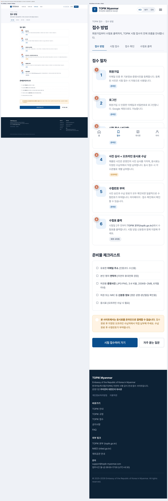

**회원가입부터 수험표 출력까지** 전체 흐름을 6단계로 설명하는 안내 페이지입니다. 처음 접수하시는 분은 이 페이지를 **처음부터 끝까지** 한 번 읽은 뒤 [시험 접수](#12-topik-접수--시험-접수-4단계)로 이동하세요.

| 번호 | 단계 | 채널 | 내용 |
| --- | --- | --- | --- |
| 1 | 회원가입 | 온라인 | 이메일 인증 + 기본정보·증명사진 등록 (사진은 접수 시 자동 사용). |
| 2 | 로그인 | 온라인 | 이메일+비밀번호 또는 Google 계정. |
| 3 | 시험 접수 (4단계) | 온라인 | 회차·급수 → 회원정보 확인 → 사진 규격 확인 → 최종 제출. Ⅰ·Ⅱ 동시 가능. |
| 4 | 사진 심사 + 응시료 수납 | 오프라인 | 운영진 사진 심사 + 지정 수납처 직접 납부 (동시 접수 시 수준별 개별). |
| 5 | 수험번호 부여 | 온라인 | 사진 승인 + 수납 완료 확인 시 일괄 부여 → 마이페이지에서 확인. |
| 6 | 수험표 출력 | 외부 | 시험 2주 전부터 **topik.go.kr**에서 출력, 당일 신분증과 지참. |

- **준비물 체크리스트:** 유효 **이메일** / 본인 **연락처**(미얀마 휴대전화 권장) / **여권용 증명사진**(JPG·PNG, 3:4, 200KB~2MB, 6개월 이내) / **신분증** 정보(여권·NRC) / **응시료**(오프라인, USD 현금 등 — 수납처 안내는 공지 참고).
- **경고 콜아웃:** 본 사이트는 **응시료 온라인 결제 불가** → 온라인 접수 완료 후 **오프라인 수납** → 운영진 확인 → **수험번호 부여** 순서입니다.

> **TIP:** 4단계(사진 심사 + 수납)는 **운영진·수납처**에서 진행됩니다. 접수 직후 마이페이지에 **「사진 심사 대기」「수납 대기」** 가 보이면 정상입니다. 조급해 문의하기 전에 [접수 확인](#13-topik-접수--접수-확인)에서 진행 칸을 확인하세요.

---

## 12. TOPIK 접수 · 시험 접수 (4단계)

**로그인 필수** — 이용 전 로그인해 주세요.

4단계로 나뉜 **온라인 시험 접수** 화면입니다. 상단 단계 표시에서 **완료한 단계를 클릭**하거나 **다음·이전** 버튼으로 이동합니다. **저장 후 나가기**로 중간 저장(30일)도 가능합니다.

### 사용 흐름 (시나리오)

1. **STEP1 회차·급수** — **접수 중**인 회차만 선택 → **시험장** → **TOPIK Ⅰ/Ⅱ**(복수 가능) → **다음**.
2. **STEP2 회원정보 확인** — 가입 정보 **읽기 전용**. 수정은 [내정보 수정](#22-계정--내정보-수정)에서 **접수 전에**.
3. **STEP3 사진 규격 확인** — 증명사진 + **5개 체크 전부**해야 **다음** 활성. 사진 교체는 이 단계에서 불가.
4. **STEP4 최종 확인** — 요약 + **약관 동의** → **접수하기** → **접수확인**으로 마이페이지.
- **저장 후 나가기** — 임시저장. 다음 접속 시 이어쓰기 여부를 묻습니다.

### STEP별 핵심 동작

| 단계 | 주요 동작 |
| --- | --- |
| 1 | 회차 선택 → 시험장 선택 → TOPIK Ⅰ·Ⅱ 급수(복수) 선택 → **다음** |
| 2 | 가입 정보 읽기 전용 표시(수정 불가, 내정보 수정 링크 제공) |
| 3 | 증명사진 미리보기 + 5항목 규격 체크 전부 선택 시 **다음** 활성 |
| 4 | 접수 요약 확인 + 약관 동의 → **접수하기** (증명사진 없으면 제출 불가) |

### 요소별 상세

- **1) 단계 표시** — ①회차·급수 ②회원정보 확인 ③사진 규격 확인 ④최종 확인. 완료 단계 클릭 시 해당 단계로 이동(모바일은 활성 탭을 화면 중앙으로 스크롤).
- **2) 저장 후 나가기** — 입력 중인 내용을 임시 저장하고 마이페이지로 나갈 수 있습니다. 저장된 내용은 **30일간** 보관되며, 다음에 접수 화면에 들어오면 이어서 작성할지 묻습니다.
- **3) 회차 목록** — 접수 중·예정 회차만 카드로 노출. 카드에 제N회/제목, 상태 배지(접수 중/접수 마감/예정), 시험일, 접수 기간. **접수 중이 아닌 회차는 선택 불가**. 한 번에 하나만 선택.
- **4) 시험장** — 시험장 목록 드롭다운. 시험장이 1개면 자동 선택. **재접수**이거나 **같은 회차에 진행 중 급수**가 있으면 기존 시험장으로 고정(변경 불가 + 안내 문구).
- **5) 급수 선택** — TOPIK Ⅰ·Ⅱ 복수 선택. 이미 진행 중인 급수는 선택 불가 + 사유 안내(사진 심사중/수납 대기/접수 진행중). **재접수**에서는 반려·취소된 급수만 다시 선택 가능.
- **6) 응시료 표시** — 선택 회차·급수별 응시료. Ⅰ·Ⅱ 동시 선택 시 최종 확인 단계 합계에 반영.
- **7) 회원정보 (STEP2)** — 한글·영문 성명, 생년월일, 성별, 국적, 제1언어, 연락처, 이메일, 직업·응시동기·응시목적. 이 화면에서는 수정 불가 → **내정보 수정** 이용.
- **8) 사진 미리보기 (STEP3)** — 가입 시 등록한 증명사진 표시. **이 단계에서 교체 불가** → 내정보 수정에서 변경.
- **9) 규격 체크리스트 (STEP3)** — 5항목: 여권용 정면 컬러(JPG)·흰색 배경 / 최근 6개월 이내 / 흑백·흐릿 아님 / 모자·선글라스·이어폰·앞머리로 얼굴 안 가림 / 정면·본인. **전부 체크해야** **다음** 활성.
- **10) 최종 요약 (STEP4)** — 회차·시험일, 선택 급수(2개면 "동시 접수"), 시험장, 응시자 정보, 응시료 합계. 응시료·환불 안내 함께 표시.
- **11) 약관 동의** — **[필수]** 체크. 미체크 시 제출 불가(알림).
- **12) 제출** — **접수하기** → 완료 안내 → **접수확인** 누르면 마이페이지 이동.

### 자주 보는 안내 메시지

| 상황 | 동작 / 메시지 |
| --- | --- |
| 급수 미선택 | "응시 급수를 1개 이상 선택해 주세요." |
| 사진 체크리스트 미완료 | STEP3에서 **다음** 비활성 |
| 접수 불가 회차 | "접수 가능한 회차가 아닙니다." |
| 동일 회차·급수 중복 | "이미 …접수 진행 중입니다." |
| 잠긴 시험장 위반 | "다른 급수가 진행 중일 때는 기존 시험장으로만 접수할 수 있습니다." |
| 잘못된 시험장 | "선택한 시험장을 사용할 수 없습니다." |
| 로그인 만료 | "로그인이 만료되었습니다." → 로그인 화면으로 이동 |

### 재접수 진입

마이페이지에서 **재접수** 클릭 시 접수 화면으로 이동합니다. 재접수 모드는 임시저장 복원을 건너뛰고, **반려·취소된 급수만** 다시 선택해 제출합니다.

> **TIP:** STEP3 체크리스트 5개를 **한 번에** 체크하지 않으면 **다음** 버튼이 회색으로 비활성입니다. 사진 규격을 다시 확인한 뒤 모두 체크해 주세요.

---

## 13. TOPIK 접수 · 접수 확인

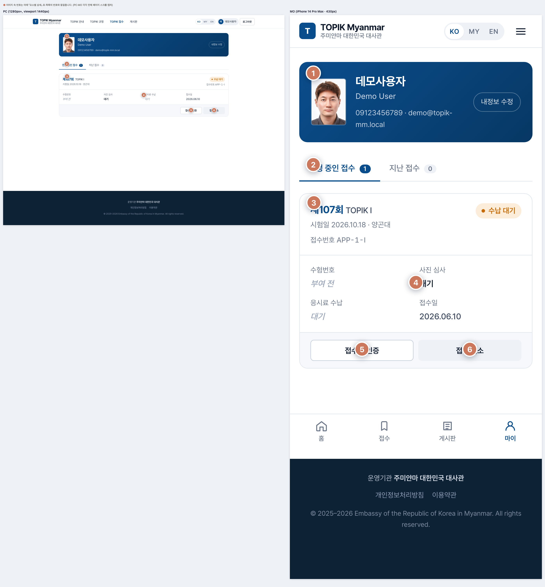

**로그인 필수.**

**마이페이지(접수 확인)** 는 접수 후 **가장 자주** 방문하게 되는 화면입니다. **내 프로필**과 **회차·급수별 접수 카드**를 한곳에서 볼 수 있으며, **사진 심사·응시료 수납·수험번호** 진행 상황을 **4칸 진행 현황**으로 확인합니다. 스크린샷은 **PC + MO** 전체 페이지를 나란히 보여 주며, **● 번호**는 아래 표와 같습니다.

동일 회차에 TOPIK Ⅰ·Ⅱ를 함께 접수한 경우(예: 제107회) **급수별 카드가 각각** 표시됩니다. Ⅰ·Ⅱ는 **사진 심사·수납·수험번호**도 **급수별로** 따로 진행됩니다.

### 사용 흐름 (시나리오)

1. 로그인 후 **접수 확인**(또는 상단 **내 이름** 클릭)에 들어오면 상단 **프로필 카드**와 **진행 중인 접수 / 지난 접수** 탭이 표시됩니다.
2. **진행 중인 접수** 탭에서 회차·급수·**상태 배지**·4칸 진행 현황(수험번호·사진 심사·응시료 수납·접수일)을 확인합니다. **주황색**으로 강조된 칸이 **지금 해야 할 다음 단계**입니다(예: 수납 대기).
3. **접수 확인증**을 누르면 인쇄용 확인증 창이 열립니다. 수납 전·미반려 건은 **접수 취소**도 이용할 수 있습니다.
4. **사진 반려** 시 **사유보기**로 이유 확인 → [내정보 수정](#22-계정--내정보-수정)에서 사진 교체 → **사진 재등록** 또는 자동 재심사 대기.

### 화면 구성 (스크린샷 예시)

| 번호 | 요소 | 스크린샷에서 보이는 내용 / 동작 |
| --- | --- | --- |
| 1 | **프로필 카드** | 증명사진, 한글·영문 이름, 연락처·이메일. 우측 **내정보 수정** 링크. |
| 2 | **탭** | **진행 중인 접수** / **지난 접수** — 탭 옆 숫자는 해당 목록 건수. 취소·완료 건은 지난 접수로 이동. |
| 3 | **접수 카드 (급수별)** | 예: **제107회 TOPIK Ⅰ** · 배지 **접수 완료** · 시험일·시험장·접수번호. Ⅱ급은 별도 카드. |
| 4 | **4칸 진행 현황** | **수험번호** 부여 전 · **사진 심사** 대기 · **응시료 수납** 대기(주황 강조) · **접수일**. |
| 5 | **접수 확인증** | 카드 하단 버튼 → 인쇄용 확인증(회차·접수번호·급수·응시료·접수일·응시자 등). |
| 6 | **접수 취소** | 수납 전·미반려 건만 노출. 확인 후 해당 급수 접수 취소. |

### 상태 배지 의미

| 배지 | 의미 |
| --- | --- |
| 접수 완료 | 제출됨, 사진 심사 대기 |
| 사진 심사중 | 운영진 사진 심사 진행 |
| 수납 대기 | 사진 승인 후 응시료 미납 |
| 수납 완료 | 납부 완료, 수험번호 부여 대기 |
| 수험번호 부여 | 수험번호 부여(공개일 전까지 숨김 가능) |
| 사진 반려 | 사진 재등록 필요 |
| 반려 | 접수 반려 → 재접수 필요 |
| 접수 취소 | 취소됨(지난 접수 탭) |

### 기타 요소 (카드·안내 창)

- **반려 사유** — 사진/접수 반려 카드의 **사유보기** → 반려 사유 확인.
- **재접수** — 반려 건에 표시 → 접수 화면으로 이동해 다시 접수.

### 액션 노출 규칙

| 상태 | 노출 버튼 |
| --- | --- |
| 접수 완료·사진 심사중·수납 대기 | 접수 확인증 · 접수 취소 |
| 수납 완료 | 접수 확인증 |
| 수험번호 부여 | 접수 확인증 · 수험표 출력 |
| 사진 반려 | 사진 재등록 · 사유보기 |
| 반려 | 재접수 · 사유보기 |

- **취소 불가:** 이미 취소되었거나 **수납이 완료된** 접수는 마이페이지에서 직접 취소할 수 없습니다. 환불이 필요하면 [환불·정보정정신청 게시판](#18-게시판--환불정보정정)을 이용하세요(환불률은 [응시료 규정](#9-topik-규정--응시료-규정) 참고).
- 한 회차에 여러 급수가 있을 때 **급수 단위 취소**가 가능하며, 모든 급수가 취소되면 접수 건 전체가 취소 처리됩니다.
- **수험번호**는 운영진이 부여한 뒤, **공개 일시** 이전에는 마이페이지에 **「부여 전」** 또는 숨김으로 보일 수 있습니다. 공개 후에도 안 보이면 [문의게시판](#17-게시판--문의게시판)으로 연락하세요.

> **TIP:** 접수 후 **매일 한 번** 마이페이지를 확인하면 사진 반려·수납 안내를 놓치지 않습니다. 수납은 **지정 수납처**에서 **접수번호**를 알려 주며 납부합니다.

---

## 14. TOPIK 접수 · 수험표 출력

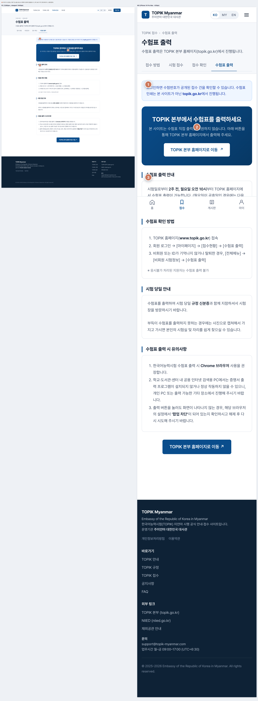

로그인 없이도 **안내 내용**은 볼 수 있습니다. **본인 수험번호** 확인·출력 안내는 **로그인 후** 가능합니다.

**수험표(입장권)** 는 이 사이트가 아니라 **topik.go.kr**(TOPIK 본부 공식 사이트)에서 출력합니다. 아래 순서를 따라 주세요.

### 출력까지의 흐름

1. [접수 확인(마이페이지)](#13-topik-접수--접수-확인)에서 **수험번호 부여**·**공개** 여부 확인
2. 수험번호가 표시된 카드의 **TOPIK 본부에서 수험표 출력** 버튼 클릭 → 본부 **수험표 출력 페이지**로 이동
3. 본부 사이트 안내에 따라 수험표 출력(보통 **시험 2주 전**부터)
4. 시험 당일 **수험표 + 신분증** 지참

### 요소별 상세

- **1) 상태 영역** — 로그인·접수 상태에 따라 안내가 바뀝니다:
  - 비로그인: "로그인하면 수험번호 공개 여부를 확인" 안내(로그인 링크).
  - 수험번호 공개됨: 회차별 카드 + 급수별 수험번호 + **TOPIK 본부에서 수험표 출력** 버튼(→ `https://www.topik.go.kr/TWMYPG/TWMYPG0030-001.do`).
  - 부여됐으나 공개 전: "아직 공개일 전" 경고.
  - 대상 없음/진행 중만 있음: 안내 + 접수/확인 링크.
- **2) TOPIK 본부 홈페이지로 이동** — `https://www.topik.go.kr` (수험표 카드 버튼과 **별도**).
- **3) 안내 블록 4종** — 출력 시점(시험 **2주 전 월요일 10시~**), 확인 방법(로그인→마이페이지→접수현황→수험표), 시험 당일(**수험표+신분증**), 출력 유의사항(**Chrome** 권장·**팝업 차단 해제**).

> **TIP:** 수험표가 출력되지 않으면 브라우저 **팝업 차단**을 해제하고 다시 시도하세요. 수험번호가 아직 **공개 전**이면 본부 사이트에서도 조회되지 않을 수 있습니다.

---

## 15. 게시판 · 공지사항

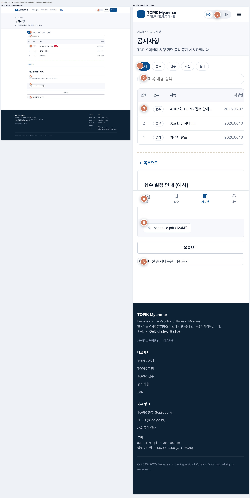

운영 기관의 **공식 공지**를 확인하는 게시판입니다. 접수 일정 변경·수납처·시험장 안내 등 **중요·접수** 분류 공지는 접수 전후에 꼭 확인하세요. 한 페이지에서 **목록**과 **상세**를 전환하며 읽을 수 있고, 공지 링크를 공유하면 해당 글 상세로 바로 열립니다.

### 화면 구성

| 화면 | 설명 |
| --- | --- |
| 목록 | 카테고리 필터 + 검색 + 공지 목록(번호·분류·제목·작성일) |
| 상세 | 제목·작성 정보·본문·첨부·이전글/다음글 |

### 요소별 상세

- **1) 카테고리 칩** — 전체 / 중요 / 접수 / 시험 / 결과. 카테고리를 누르면 해당 분류만 표시됩니다.
- **2) 검색** — **제목**을 기준으로 검색합니다. 결과 없으면 "검색 조건에 맞는 공지가 없습니다." 표시.
- **3) 목록** — 고정 공지는 번호 대신 NEW 배지. 행 클릭 → 상세. 게시 기간·공개 상태에 맞는 공지만 표시.
- **4) 상세 본문** — 관리자가 작성한 내용. 외부 링크는 새 탭. 조회 시 조회수 증가. (스크린샷에서는 목록 **아래**에 상세 영역이 함께 펼쳐져 있습니다.)
- **5) 첨부** — 파일명·크기, 다운로드.
- **6) 이전글/다음글** — 목록과 같은 순서 기준. 클릭 시 해당 글 상세.
- **7) 언어 전환** — KO/MY/EN 변경 시 목록·상세를 해당 언어로 다시 불러옵니다. 번역이 없는 공지는 한국어가 표시될 수 있습니다.

> **TIP:** 홈 화면 **공지 미리보기**에서 최신 5건만 볼 수 있습니다. 지난 공지는 이 메뉴 **목록·검색**으로 찾으세요.

---

## 16. 게시판 · FAQ

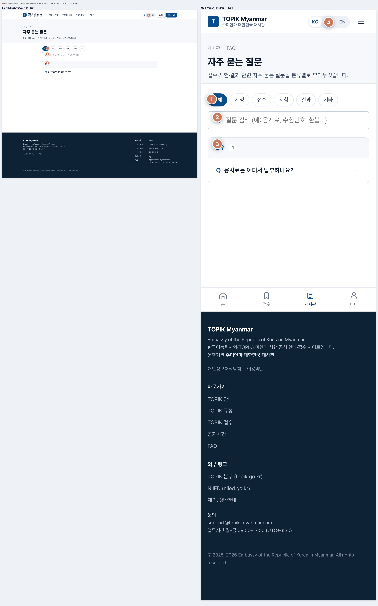

**자주 묻는 질문**을 카테고리별로 모아 둔 페이지입니다. 접수·수납·수험표·사진 등 **반복 질문**은 문의 전에 여기서 먼저 검색해 보세요. 질문을 클릭하면 답변이 **아코디언**으로 펼쳐집니다.

| 번호 | 요소 | 동작 |
| --- | --- | --- |
| 1 | 카테고리 칩 | 전체 / 계정 / 접수 / 시험 / 결과 / 기타. 카테고리를 누르면 해당 분류만 표시됩니다. |
| 2 | 검색 | 질문과 답변에서 검색합니다. 일치 항목은 자동으로 펼쳐집니다. |
| 3 | 아코디언 그룹 | 카테고리별 그룹 헤더(건수 배지) + 질문 클릭 시 답변 펼침. |
| 4 | 언어 전환 | KO/MY/EN 변경 시 해당 언어로 다시 불러옵니다. |

> **TIP:** 검색창에 **「수납」「사진」「수험번호」** 등 키워드를 입력하면 관련 질문이 자동으로 펼쳐집니다.

---

## 17. 게시판 · 문의게시판

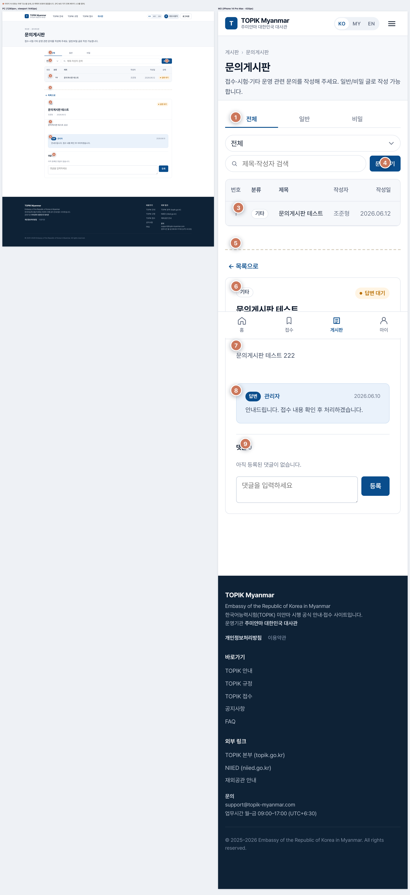

**로그인 필수.**

응시자가 운영진에게 **1:1로 질문**하는 게시판입니다. FAQ에서 답을 찾지 못했을 때 이용하세요. 한 페이지에서 **목록**, **글쓰기**, **상세 보기**를 전환합니다. **관리자 답변**이 등록되면 상태가 **답변 완료** 등으로 바뀝니다.

### 사용 흐름 (비밀글 문의 시나리오)

1. **문의하기** → 작성 화면. 카테고리·공개 범위 선택. **비밀**을 고르면 비밀번호 입력칸(4자 이상).
2. 제목(100자 이내)·내용(10자 이상)·첨부(jpg/png/pdf, 5MB 이하, 최대 3개) 입력 후 **제출**.
3. 목록에서 내 비밀글은 자물쇠 아이콘. **본인**이면 본문 열람. **타인** 비밀글 클릭 시 "작성자·관리자만 열람" 안내.

### 입력 필드 (작성 화면)

| 필드 | 필수 | 형식·제약 | 예시 |
| --- | --- | --- | --- |
| 카테고리 | ● | 접수 / 시험 / 기타 | 접수 |
| 공개 범위 | ● | 일반(누구나) / 비밀(작성자·관리자만) | 비밀 |
| 비밀글 비밀번호 | 비밀 선택 시 ● | 4자 이상 | 1234 |
| 제목 | ● | 1~100자 | 응시료 수납 문의 |
| 내용 | ● | 10자 이상 | … |
| 첨부 | ○ | jpg/png/pdf, 5MB 이하, 최대 3개 | receipt.jpg |

### 게시글 상태

| 상태 | 표시 |
| --- | --- |
| 접수 | 접수 |
| 처리중 | 처리중 |
| 답변 대기 | 답변 대기 |
| 답변 완료 | 답변 완료 |
| 완료 | 완료 |
| 반려 | 반려 |

### 요소별 상세

| 번호 | 요소 | 설명 |
| --- | --- | --- |
| 1 | **탭** | 전체 / 일반 / 비밀. 공개 범위별 목록 필터. |
| 2 | **카테고리·검색** | 카테고리(접수·시험·기타) + 제목·작성자 검색. |
| 3 | **목록** | 번호·분류·제목·작성자·작성일·상태. 행 클릭 시 **상세**로 전환. 작성자는 "본인", 관리자 답변은 "관리자" 표기. |
| 4 | **문의하기** | **작성 화면**으로 이동. 위 입력 표 참조. 첨부는 **선택 즉시 업로드**. |
| 5 | **페이지** | 목록 페이지 이동(20건/페이지). |
| 6 | **상세 헤더** | 분류·상태·제목·작성자·작성일·비밀글 표시. |
| 7 | **본문·첨부** | 문의 내용·첨부 다운로드. |
| 8 | **관리자 답변** | 공식 답변 이력(최신순). |
| 9 | **댓글** | 댓글 목록·작성·답글. 로그인 사용자만 작성. |

**기타:** 관리자 답변 **전**에만 **수정**·**삭제** 가능(수정 시 비밀글 비밀번호 4자 이상 재입력). 타인 **비밀글** 클릭 시 "작성자·관리자만 열람" 안내.

### 검증·에러

| 상황 | 메시지 |
| --- | --- |
| 제목 길이 | "제목을 100자 이내로 입력해 주세요." |
| 내용 길이 | "내용을 10자 이상 입력해 주세요." |
| 비밀글 비번 | "비밀글 비밀번호를 4자 이상 입력해 주세요." |
| 수정 시 비밀번호 미입력 | 위와 동일(비밀글 수정·저장 시에도 적용) |
| 첨부 형식/크기 | "jpg, png, pdf 형식만…" / "파일 크기는 5MB 이하…" |
| 첨부 개수 | "첨부파일은 최대 3개까지 가능합니다." |
| 비로그인 | 로그인 화면으로 이동 |

> **TIP:** 개인정보(여권번호 전체·계좌번호 등)는 **비밀글**로 작성하는 것을 권장합니다. 관리자 **답변 후**에는 본인 글도 **수정·삭제**할 수 없습니다 — 제출 전 내용을 꼼꼼히 확인하세요.

---

## 18. 게시판 · 환불·정보정정

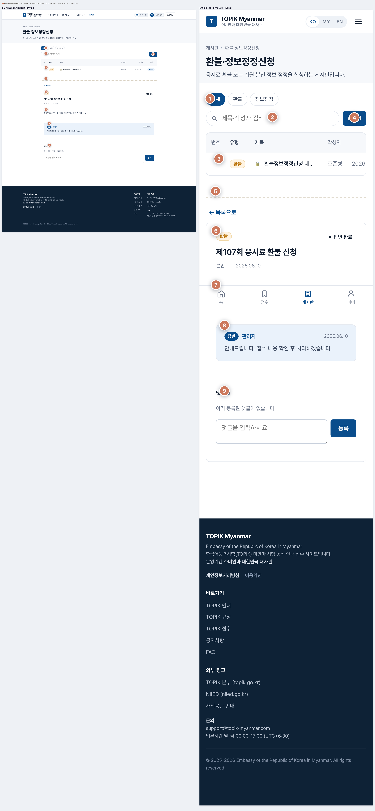

**로그인 필수.**

**환불** 또는 **회원·접수 정보 정정**을 신청하는 **전용 게시판**입니다. [문의게시판](#17-게시판--문의게시판)과 비슷하지만, **모든 글이 비밀글**로 등록되며 **유형(환불/정보정정)** 을 반드시 선택합니다. 환불률·기한은 [응시료 규정](#9-topik-규정--응시료-규정)을 참고하세요.

### 사용 흐름 (시나리오)

1. **글쓰기** → 유형(환불/정보정정) → 제목·내용 → 비밀번호(4자 이상) → 첨부(영수증·신분증 사본 등) → **개인정보 처리 동의** → **제출**. (글쓰기 화면에 들어올 때마다 **약관 체크는 해제**된 상태입니다.)
2. **수정** 시에도 비밀번호·**개인정보 처리 동의**를 다시 입력·체크해야 저장됩니다.
3. 모든 글은 비밀글 → **작성자 본인과 관리자**만 본문 열람. 타인 글 클릭 시 안내만 표시.

### 입력 필드 (작성 화면)

| 필드 | 필수 | 형식·제약 | 예시 |
| --- | --- | --- | --- |
| 유형 | ● | 환불 / 정보정정 | 환불 |
| 제목 | ● | 1~100자 | 제107회 응시료 환불 |
| 내용 | ● | 10자 이상 (사유·접수번호·회차 등) | … |
| 비밀번호 | ● | 4자 이상 (모든 글 비밀) | 1234 |
| 첨부 | ○ | jpg/png/pdf, 5MB 이하, 최대 5개 | receipt.pdf |
| 개인정보 동의 | ● | 미체크 시 제출 불가 | ✔ |

### 요소별 상세

| 번호 | 요소 | 설명 |
| --- | --- | --- |
| 1 | **유형 칩** | 전체 / 환불 / 정보정정. 유형별 목록 필터. |
| 2 | **검색** | 제목·작성자 검색. |
| 3 | **목록** | 번호·유형·제목·작성자·작성일·상태. 행 클릭 시 **상세**로 전환. |
| 4 | **글쓰기** | **작성 화면**으로 이동. 위 표 참조. 모든 글은 **비밀글**로 등록. |
| 5 | **페이지** | 목록 페이지 이동. |
| 6 | **상세 헤더** | 유형·상태·제목·작성자·작성일. |
| 7 | **본문·첨부** | 신청 내용·첨부(영수증·신분증 등). |
| 8 | **관리자 답변** | 공식 답변 이력. |
| 9 | **댓글** | 댓글 목록·작성·답글. |

**기타:** 수정·삭제는 **관리자 답변 전**까지 가능.

### 검증·에러 (작성·수정 공통)

| 상황 | 메시지 |
| --- | --- |
| 비밀번호 미입력·4자 미만 | "비밀글 비밀번호를 4자 이상 입력해 주세요." |
| 약관 미체크 | "개인정보 처리에 동의해 주세요." |

> **TIP:** 환불 신청 시 **접수번호·회차·급수·영수증 사본**을 내용·첨부에 포함하면 처리가 빨라집니다. **개인정보 처리 동의**는 작성·수정 모두 필수입니다.

---

## 19. 계정 · 로그인

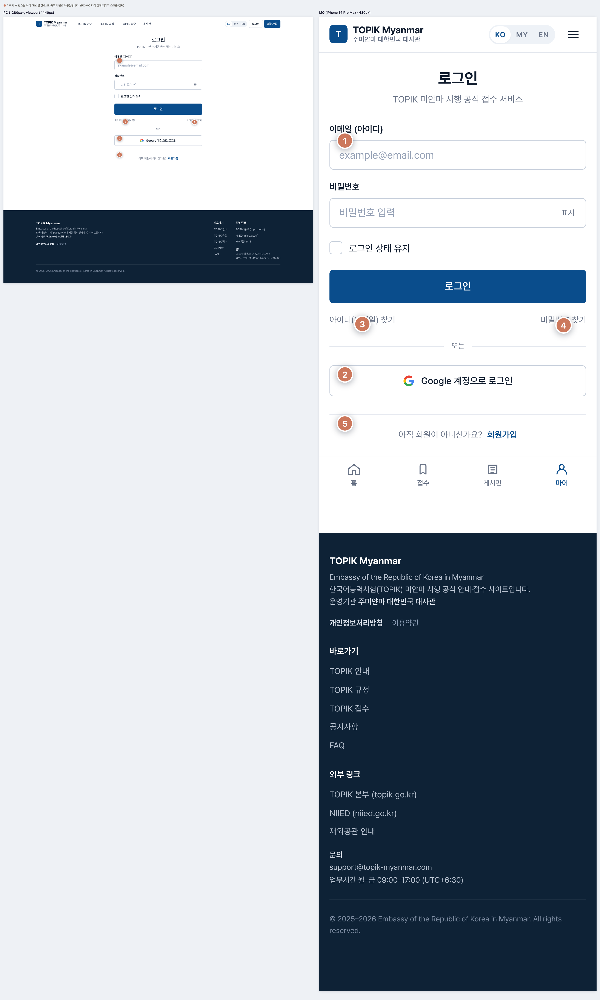

**이메일+비밀번호** 또는 **Google 계정**으로 로그인합니다. 시험 접수·마이페이지·문의 등 대부분의 기능은 로그인 후 이용합니다.

### 사용 흐름 (시나리오)

1. 이메일+비밀번호 입력 → **로그인**. **로그인 상태 유지** 체크 시 브라우저를 닫아도 로그인 유지.
2. 성공 시, 로그인 전에 가려던 페이지가 있으면 그곳으로, 없으면 홈으로 이동.
3. 비밀번호를 6개월 이상 변경하지 않았다면 변경 권유 안내(나중에 / 변경).

### 입력 필드

| 필드 | 필수 | 형식·제약 |
| --- | --- | --- |
| 이메일 | ● | 이메일 형식(= 로그인 아이디) |
| 비밀번호 | ● | **표시/숨김** 토글 제공 |
| 로그인 상태 유지 | ○ | 체크 시 브라우저를 닫아도 로그인 유지 |

### 안내 창

| 기능 | 설명 |
| --- | --- |
| 아이디(이메일) 찾기 | 이름·생년월일·연락처 입력 → 가입 이메일 일부 안내. |
| 비밀번호 찾기 | 이메일로 인증코드 → 비밀번호 재설정 화면. |
| 비밀번호 변경 권고 | 6개월 이상 미변경 시 표시. **변경** → 내정보 수정. |

### 요소별 상세

- **1) 로그인 폼** — 이메일·비밀번호 입력 후 **로그인**.
- **2) Google 로그인** — Google 계정으로 로그인. 프로필 미완성 시 회원가입으로 이어질 수 있음.
- **3) 아이디 찾기** — 이름·생년월일·연락처 **모두 일치** 시 이메일 일부 안내.
- **4) 비밀번호 찾기** — 이메일 → 인증코드. Google 계정이면 Google 로그인 안내, 미가입이면 "가입된 계정이 없습니다."
- **5) 비밀번호 변경 권고** — 이메일 계정, 6개월 이상 미변경 시 **안내 창(모달)** 으로 표시됩니다.
- **6) 회원가입 링크** — 회원가입 화면으로 이동.

### 로그인 실패 시 안내

선택한 언어(KO/MY/EN)에 맞춰 아래와 같은 안내가 표시됩니다.

| 상황 | 안내 메시지 (한국어 예시) |
| --- | --- |
| 이메일·비밀번호 불일치 | "이메일 또는 비밀번호가 일치하지 않습니다." |
| 계정 잠금 | "로그인 실패가 누적되어 계정이 잠겼습니다." (5회 실패 시 30분) |
| 일시적 오류 | "서버를 일시적으로 사용할 수 없습니다." |
| 연결 오류 | "서버에 연결할 수 없습니다." — 잠시 후 다시 시도 |

> **TIP:** 비밀번호를 **5번** 틀리면 **30분간** 로그인이 잠깁니다. [비밀번호 찾기](#21-계정--비밀번호-재설정)로 재설정하거나, 잠금 해제까지 기다려 주세요. Google 가입 회원은 **Google 로그인** 버튼을 사용하세요. **MY·EN**으로 전환한 뒤 로그인을 시도하면 오류 문구도 해당 언어로 표시되는지 확인해 보세요.

---

## 20. 계정 · 회원가입 (3단계)

**처음 이용**하시는 분은 3단계 회원가입을 완료해야 시험 접수가 가능합니다. **증명사진**은 가입 시 한 번 등록하면 접수·심사에 계속 사용되므로, [사진 규정](#10-topik-규정--신분증-규정)과 [접수 STEP3](#12-topik-접수--시험-접수-4단계) 기준에 맞는 사진을 준비해 주세요.

### 사용 흐름 (가입 시나리오)

1. **STEP1 이메일 인증** — 이메일 → **인증코드 발송** → 6자리 코드 입력(5분 유효) → **확인**. 또는 Google(이메일 인증 생략). 완료 후 **다음**.
2. **STEP2 기본정보 + 증명사진** — 이름·생년월일·연락처 등 + 증명사진 업로드.
3. **STEP3 약관 동의** — 필수 약관 → **가입 완료** → 완료 안내 → 로그인.

### 단계별 화면

| 단계 | 주요 동작 |
| --- | --- |
| 1 | 이메일 입력 → 인증코드 발송·입력·확인, 또는 Google → **다음** |
| 2 | 프로필 입력 + 증명사진 → **다음** |
| 3 | 약관 동의 → **가입 완료** |

### 입력 필드 (STEP2)

| 필드 | 필수 | 형식·제약 | 예시 |
| --- | --- | --- | --- |
| 이메일(아이디) | ● | STEP1에서 인증된 값, 변경 불가 | a@b.com |
| 한글 성명 | ● | 100자 이내 | 홍길동 |
| 영문 성명 | ● | 여권 표기, 입력 시 자동 대문자 | HONG GILDONG |
| 생년월일 | ● | YYYYMMDD 8자리, **만 14세 이상** | 19960101 |
| 성별 | ● | 남 / 여 | 남 |
| 국적 | ● | 미얀마 / 대한민국 / 기타 | 미얀마 |
| 제1언어 | ● | 미얀마어 / 한국어 / 영어 / 기타 | 미얀마어 |
| 연락처 | ● | 국가번호 포함 권장 | +95 9… |
| 직업 / 응시동기 / 응시목적 | ● | 목록에서 선택 | 학생 |
| 비밀번호 / 확인 | ● | 8자 이상 + 영문·숫자·특수문자 (Google 가입 시 숨김) | — |
| 증명사진 | ● | JPG/PNG, 2MB 이하 (규격 안내 제공) | photo.jpg |

### 안내 창

| 기능 | 설명 |
| --- | --- |
| 약관 보기 | **보기** → 약관 전문 확인 |
| 가입 완료 | 로그인 또는 시험 접수로 이동 |
| 증명사진 규격 | 7개 규칙 안내 |

### 스크린샷 번호 (● 표시)

스크린샷에는 3단계 화면이 **한 장에 펼쳐져** 있으며, **● 1~9** 번호가 아래 표와 같습니다.

| 번호 | 요소 | 설명 |
| --- | --- | --- |
| 1 | **단계 표시** | ① 이메일 인증 → ② 기본정보 → ③ 약관 동의. 현재 단계가 강조 표시됩니다. |
| 2 | **이메일 + 인증코드 발송** | 이메일 입력 후 **인증코드 발송**. 6자리 코드가 이메일로 전송되며 **5분** 유효합니다. |
| 3 | **인증코드 + 타이머** | 코드 입력란과 남은 시간. **확인** → "이메일 인증 완료" 안내. |
| 4 | **Google 가입** | Google 계정으로 계속하기. 이메일 인증·비밀번호 입력이 **생략**됩니다. |
| 5 | **프로필 입력 (STEP2)** | 한글·영문 성명, 생년월일, 성별, 국적, 연락처, 직업·동기·목적 등 위 **입력 표** 항목 전체. |
| 6 | **비밀번호 강도** | 8자 이상·영문·숫자·특수문자 충족도 → 약함~매우 강함. Google 가입 시 이 영역은 숨겨집니다. |
| 7 | **증명사진** | 파일 선택·미리보기. JPG/PNG 2MB 이하. **규격 안내** 버튼으로 7가지 규칙 확인. |
| 8 | **약관 동의** | 서비스·개인정보 **필수**, 마케팅 **선택**. **전체 동의** 토글. **보기**로 약관 전문 확인. |
| 9 | **가입 완료** | **가입 완료** 버튼 → 완료 안내 → 로그인 또는 시험 접수로 이동. |

### 자주 보는 안내 메시지

| 상황 | 메시지 |
| --- | --- |
| 비밀번호 규칙 | "비밀번호는 8자 이상, 영문·숫자·특수문자를 포함해야 합니다." |
| 비밀번호 불일치 | "비밀번호 확인이 일치하지 않습니다." |
| 만 14세 미만 | 생년월일 필드 오류 — 가입 불가 |
| 이미 가입된 이메일 | "이미 가입된 이메일입니다." |
| 탈퇴 30일 이내 재가입 | "탈퇴 후 30일간 동일 이메일로 재가입 불가" |
| 정지 계정 | "사용이 제한된 계정입니다." |
| 인증코드 오류/만료 | "인증코드가 올바르지 않습니다." (남은 시도 횟수 표시) |
| OTP 6회 실패 | "인증코드 확인에 6회 실패했습니다. 인증코드를 다시 발송해 주세요." |
| 이메일 형식 | "올바른 이메일 형식을 입력해 주세요." |

> **TIP:** 인증코드는 **5분** 유효합니다. 메일이 안 오면 **스팸함**을 확인하고 **재발송**하세요. Google 가입은 이메일 인증·비밀번호 입력이 **생략**됩니다.

---

## 21. 계정 · 비밀번호 재설정

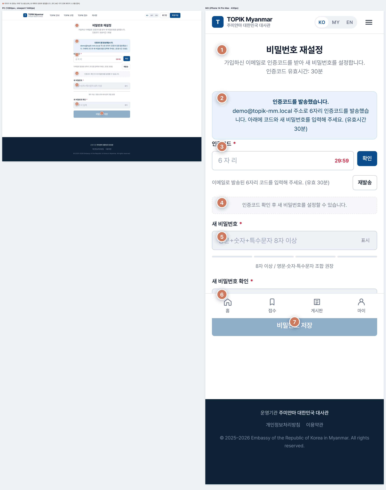

로그인 화면 **비밀번호 찾기**에서 이메일로 인증코드를 받은 뒤 이 페이지로 진입합니다. 스크린샷은 **PC + MO** 나란히, **인증코드 발송 직후** 정상 화면입니다. **● 번호**는 아래 표와 같습니다.

**주소를 직접 입력**해서 들어오면 **잘못된 접근입니다** 안내만 보이고 **로그인 페이지로** 이동합니다. 반드시 로그인 화면에서 **비밀번호 찾기 → 인증코드 발송** 순서로 시작하세요.

### 사용 흐름 (시나리오)

1. 로그인 → **비밀번호 찾기** → 이메일 → **인증코드 발송** → 이 페이지.
2. 발송 안내 확인 → **6자리 인증코드** → **확인** → 새 비밀번호 입력란 활성화.
3. **새 비밀번호**·**확인** → **비밀번호 저장** → 성공 안내 → 로그인.

### 화면 구성 (정상 재설정 화면)

| 번호 | 요소 | 동작 |
| --- | --- | --- |
| 1 | **제목·안내** | **비밀번호 재설정** — 이메일 인증코드로 새 비밀번호 설정. **유효 30분**. |
| 2 | **발송 안내** | "인증코드를 발송했습니다." + 대상 이메일 + 코드·새 비밀번호 입력 안내. |
| 3 | **인증코드** | 6자리 입력 + **타이머**(30:00부터) + **확인**. 하단 **재발송**. |
| 4 | **잠금 안내** | 인증 전: "인증코드 확인 후 새 비밀번호를 설정할 수 있습니다." — 새 비밀번호·저장 버튼 비활성. |
| 5 | **새 비밀번호** | 인증 후 활성. **표시/숨김**, 강도 표시, 8자 이상·영문·숫자·특수문자 안내. |
| 6 | **새 비밀번호 확인** | 동일 값 재입력. |
| 7 | **비밀번호 저장** | 검증 통과 시 활성 → 저장 후 성공 안내. |

### 잘못된 접근

| 요소 | 내용 |
| --- | --- |
| 안내 | **잘못된 접근입니다** — 로그인에서 이메일 입력 후 **[인증코드 발송]** 으로 다시 시작. |
| 버튼 | **로그인 페이지로** |

### 입력 필드

| 필드 | 필수 | 형식·제약 |
| --- | --- | --- |
| 인증코드 | ● | 6자리, **유효 30분** |
| 새 비밀번호 | ● | 8자 이상 + 영문·숫자·특수문자 (인증 전 비활성) |
| 새 비밀번호 확인 | ● | 위와 동일 값 |

### 검증·에러

| 상황 | 메시지 |
| --- | --- |
| 코드 오류/만료 | "인증코드가 올바르지 않거나 만료되었습니다." |
| 재설정 실패 | "비밀번호를 변경할 수 없습니다. 다시 시도해 주세요." |
| 비번 규칙 | "영문·숫자·특수문자를 각각 포함하여 8자 이상…" |
| 현재와 동일 비번 | "새 비밀번호는 현재 비밀번호와 달라야 합니다." |
| OTP 6회 실패 | "인증코드를 다시 발송해 주세요." |
| URL 직접 접속 | "잘못된 접근입니다" 안내 |

> **TIP:** 인증코드·재설정 링크 모두 **30분** 유효입니다. 시간이 지나면 로그인 화면에서 **비밀번호 찾기**를 **처음부터** 다시 진행하세요.

---

## 22. 계정 · 내정보 수정

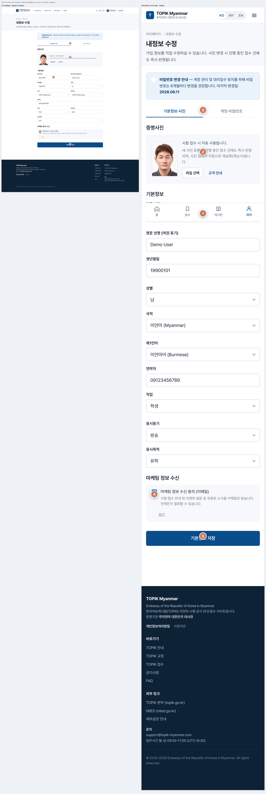

**로그인 필수.**

**이름·연락처·증명사진·비밀번호** 등을 수정하는 화면입니다. 마이페이지 프로필 카드의 **내정보 수정** 링크로도 들어올 수 있습니다. **사진을 바꾸면** 진행 중인 접수의 **사진 심사가 처음부터** 다시 진행됩니다 — 시험 직전에는 신중하게 변경하세요.

탭 2개: **기본정보·사진** / **계정·비밀번호**. (Google 계정은 비밀번호 탭 숨김 + Google 안내)

### 사용 흐름 (시나리오)

1. **기본정보·사진** — 수정 후 **기본정보 저장**. 사진 변경 시 **진행 중 접수에 즉시 반영**, 사진 심사 **자동 재실행**.
2. **계정·비밀번호** — 현재/새 비밀번호 저장 → 보안상 **재로그인** 안내. 하단 **회원 탈퇴**.

### 입력 필드 (기본정보)

| 필드 | 필수 | 형식·제약 |
| --- | --- | --- |
| 한글/영문 성명 | ● | 영문은 여권 표기 |
| 생년월일 | ● | YYYYMMDD, 만 14세 이상 |
| 성별/국적/제1언어 | ● | 목록 선택 |
| 연락처 | ● | — |
| 직업/응시동기/응시목적 | ● | 목록 선택 |
| **마케팅 정보 수신(이메일)** | ○ | 체크박스 on/off, **기본정보 저장** 시 반영 |
| 증명사진 | ○ | JPG/PNG 2MB 이하, 변경 시 진행 중 접수 재심사 |

### 비밀번호 변경 필드

| 필드 | 필수 | 형식·제약 |
| --- | --- | --- |
| 현재 비밀번호 | ● | 일치해야 함 |
| 새 비밀번호 / 확인 | ● | 8자 이상 + 영문·숫자·특수문자 각 1자, **현재 비밀번호와 달라야 함** |

### 요소별 상세

- **1) 프로필 폼** — **기본정보 저장** → 반영, 상단 메뉴 이름도 변경.
- **2) 사진 교체** — 미리보기, 저장 시 진행 중 접수 사진 심사 **대기**로 재설정. 사진만 실패 시 "기본정보는 저장됐지만 사진 업로드 실패" 안내.
- **3) 비밀번호 변경** — 이메일 가입 계정만. Google 가입은 Google에서 관리. 변경 후 재로그인.
- **4) 회원 탈퇴** — 이메일 계정: **비밀번호** 확인. Google 계정: **Google 본인 확인**. 탈퇴 시 **진행 중 접수 전부 취소**, 동일 이메일 **30일 재가입 제한**.
- **5) Google 안내** — Google 가입 계정에만 표시(비밀번호는 Google에서 관리).
- **6) 마지막 변경일** — 비밀번호 마지막 변경일(6개월마다 변경 권장 안내).
- **7) 마케팅 수신 동의** — 기본정보 탭 하단 **마케팅 정보 수신 동의(이메일)** 체크박스. 가입 시 선택 여부가 기본값으로 표시되며, **기본정보 저장**으로 변경·철회 가능. **보기** 버튼은 회원가입 마지막 단계와 같이 **화면 위 레이어 팝업**으로 약관 전문을 불러옵니다(새 창 아님).

### 검증·에러

| 상황 | 메시지 |
| --- | --- |
| 현재 비번 불일치 | "현재 비밀번호가 올바르지 않습니다." |
| Google 비번 변경 시도 | "Google 계정은 비밀번호 변경을 사용할 수 없습니다." |
| 만 14세 미만 생일 | "만 14세 이상만 가입할 수 있습니다." |
| Google 인증 만료 | "Google 인증이 만료되었습니다. 다시 시도해 주세요." |

> **TIP:** **회원 탈퇴** 시 **진행 중인 모든 접수가 취소**되며, 같은 이메일로 **30일간 재가입**할 수 없습니다. 탈퇴 전 [접수 확인](#13-topik-접수--접수-확인)에서 진행 중 접수가 없는지 확인하세요.

---

## 23. 약관 · 이용약관

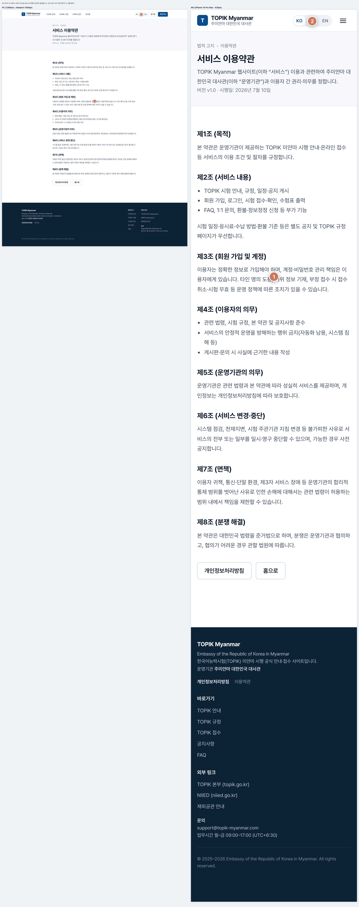

TOPIK Myanmar **서비스 이용약관** 전문입니다. 회원가입 시 **필수 동의** 항목이며, 하단에 **버전·시행일**이 표시됩니다. 약관이 개정되면 공지 후 새 버전이 적용될 수 있습니다 — 중요 변경은 **공지사항**도 함께 확인하세요.

| 번호 | 요소 | 동작 |
| --- | --- | --- |
| 1 | 약관 본문 | 이용약관 전문과 버전·시행일. 스크롤하여 전체를 읽을 수 있습니다. |
| 2 | 언어 전환 | KO/MY/EN 변경 시 해당 언어 약관을 다시 불러옵니다. |

---

## 24. 약관 · 개인정보처리방침

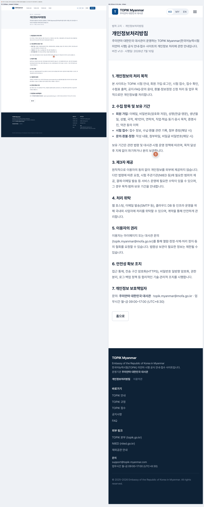

**개인정보 수집·이용·보관·파기** 등에 관한 처리방침 전문입니다. 회원가입 시 **필수 동의** 합니다. 이용약관과 같이 KO / MY / EN을 지원하며, 푸터·가입 화면 **「보기」** 링크로도 열립니다.

| 번호 | 요소 | 동작 |
| --- | --- | --- |
| 1 | 개인정보 본문 | 개인정보처리방침 전문. 문의처·보호책임자 등이 포함될 수 있습니다. |

---

## 25. 약관 · 마케팅 수신

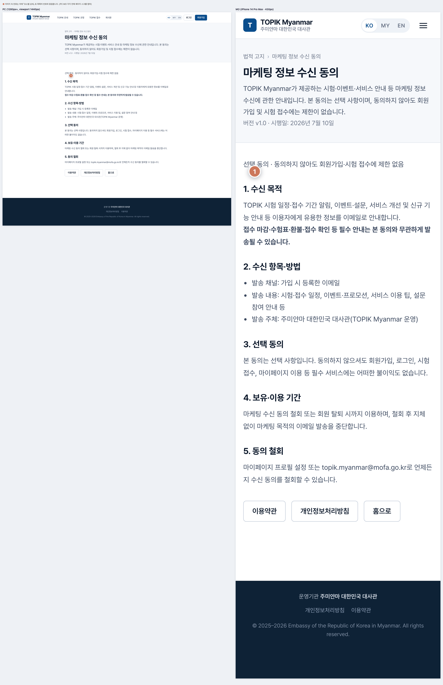

**마케팅 정보 수신 동의** 약관 전문입니다. 회원가입 시 **선택** 항목이며, 동의하지 않아도 시험 접수·필수 서비스 이용에는 영향이 없습니다. 동의한 경우 **공지·시험 안내** 이메일을 받을 수 있습니다. [내정보 수정](#22-계정--내정보-수정) **기본정보** 탭에서 체크박스로 수신 여부를 바꿀 수 있으며, **보기**는 가입 화면과 같이 **레이어 팝업**으로 약관을 확인합니다. 이 독립 페이지(푸터 링크)는 약관 전문을 스크롤하여 읽는 용도입니다.

| 번호 | 요소 | 동작 |
| --- | --- | --- |
| 1 | 마케팅 약관 | 마케팅 정보 수신 동의 관련 약관 전문. |

---

## 26. 에러 · 404

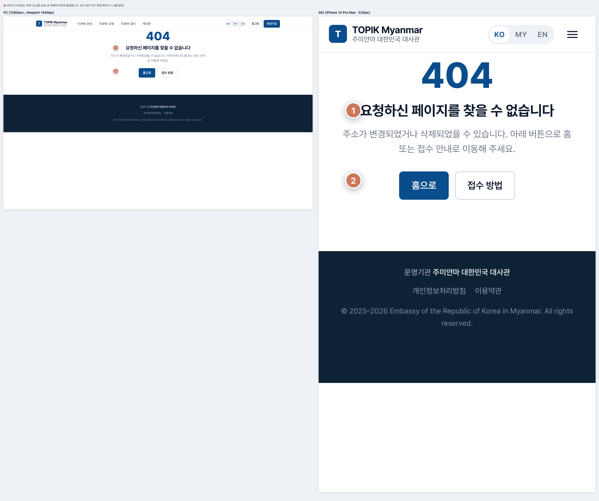

**존재하지 않거나 삭제된 주소**로 접속했을 때 보이는 안내 화면입니다. 북마크·공유 링크가 오래되었거나 주소를 잘못 입력한 경우에 나타납니다. **상단 메뉴·푸터**는 다른 페이지와 같아서, 메뉴로 원하는 화면으로 이동할 수 있습니다.

| 번호 | 요소 | 동작 |
| --- | --- | --- |
| 1 | 안내 문구 | "요청하신 페이지를 찾을 수 없습니다" + 짧은 설명. |
| 2 | 이동 버튼 | **홈으로** — 메인 홈 이동 / **접수 방법** — [접수 방법](#11-topik-접수--접수-방법) 안내. |

> **TIP:** 로그인·접수 중 갑자기 404가 나오면 **주소창 URL**이 잘렸는지 확인하고, **홈**에서 다시 메뉴를 이용하세요.

---

## 부록: 자주 묻는 상황과 대처

| 상황 | 확인할 곳 | 대처 |
| --- | --- | --- |
| 접수 **다음** 버튼이 비활성 | [시험 접수 STEP3](#12-topik-접수--시험-접수-4단계) | 사진 규격 **5개 체크** 모두 선택 |
| 접수 후 아무 일도 안 일어나는 것 같음 | [접수 확인](#13-topik-접수--접수-확인) | **사진 심사 대기** → 운영진 처리 대기, **수납 대기** → 수납처 방문 |
| 사진 **반려** | 마이페이지 **사유보기** | [내정보 수정](#22-계정--내정보-수정)에서 사진 교체 |
| **수납** 후에도 수납 대기 | 마이페이지 | 수납처·접수번호 확인, [문의게시판](#17-게시판--문의게시판) |
| **수험번호** 안 보임 | 마이페이지·[수험표](#14-topik-접수--수험표-출력) | **공개 일시** 전일 수 있음, 공지 확인 |
| **환불** 필요 | [응시료 규정](#9-topik-규정--응시료-규정) | [환불·정보정정](#18-게시판--환불정보정정) 신청 |
| **로그인** 안 됨 | [로그인](#19-계정--로그인) | 비번 확인·5회 잠금·Google 가입 여부 |
| **비밀번호** 분실 | [비밀번호 재설정](#21-계정--비밀번호-재설정) | 로그인 화면 **비밀번호 찾기**부터 |

**문의:** 푸터 업무시간(월–금 09:00–17:00, 미얀마 시간) 내 [문의게시판](#17-게시판--문의게시판) 또는 공지에 안내된 이메일을 이용하세요. FAQ에서 먼저 검색하면 더 빠릅니다.

---
